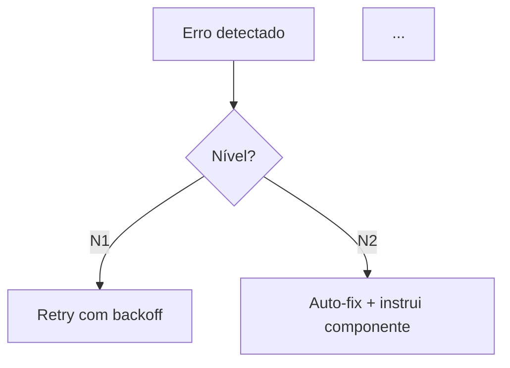

# 📦 MÓDULO 04 — Playbooks Operacionais
> **Cole após o MAESTRO (00-MAESTRO.md) na mesma sessão.**
> **Output esperado:** `04-operational-playbooks.md`
> **Tamanho esperado:** 500–700 linhas
> **Dependência:** Gerar após 01, 02 e 03

---

## OBJETIVO DESTE DOCUMENTO

Gerar o documento `04-operational-playbooks.md` do projeto.

Este documento responde: *"O que fazer quando algo dá errado — e como operar o sistema em produção com segurança."*
Audiência: SRE, DevOps, desenvolvedor de plantão às 3h da manhã.

---

## ESTRUTURA OBRIGATÓRIA

### Seção 1 — Checklist de Boot
- Script/comando de pré-flight obrigatório
- Lista de verificações que o pré-flight realiza (com ✅ para cada item)
- Sequência de inicialização dos componentes em ordem

### Seção 2 — Classificação de Erros e Estratégias de Recuperação

Tabela de níveis de erro (N1 a N5+):
| Nível | Tipo | Exemplos Concretos | Ação Automática | Timeout | Máx Tentativas |
|---|---|---|---|---|---|

Diagrama Mermaid `flowchart TD` de decisão de Self-Healing:


### Seção 3 — Matriz de Troubleshooting

Para cada categoria de problema:

```
#### [N.N] Problemas de [Categoria]

| Sintoma | Causa Provável | Diagnóstico | Solução |
|---|---|---|---|
| [sintoma observável] | [causa técnica] | [comando ou verificação] | [ação corretiva] |
```

Categorias mínimas:
- Problemas de inicialização/boot
- Problemas de comunicação (rede, SSE, WebSocket)
- Problemas de persistência (banco, filesystem)
- Problemas de integração externa (APIs, LLMs, serviços)
- Problemas de recursos (memória, CPU, disk)
- Problemas de configuração

### Seção 4 — Playbooks de Incidentes (INC-NNN)

Para cada cenário de incidente relevante:

```markdown
### INC-NNN: [Título do Incidente]

**Severidade:** 🔴 P0 / 🟠 P1 / 🟡 P2
**Sintoma:** [o que o usuário/monitor observa]
**Causa Raiz:** [por que acontece tecnicamente]

**Diagnóstico:**
```bash
# Comandos para confirmar o incidente
[comando 1]
[comando 2]
```

**Resolução Passo a Passo:**
1. [passo 1 com comando exato]
2. [passo 2]
...

**Prevenção:**
- [o que configurar para evitar recorrência]

**Tempo Esperado de Resolução:** [X minutos]
```

Incidentes obrigatórios (adapte ao projeto):
- INC-001: Processo principal travado/não responsivo
- INC-002: Rate limit / quota de API externa esgotada
- INC-003: Banco de dados corrompido ou locked
- INC-004: Filesystem / storage com problema
- INC-005: Configuração inválida impedindo boot
- INC-006: Rollback com conflito
- INC-007: Reinício inesperado / perda de estado em memória
- INC-008: Buffer overflow / memory leak detectado
- INC-009: Componente de detecção de anomalia em fallback

### Seção 5 — Garbage Collection e Limpeza

#### 5.1 O Que o GC Remove
Tabela com recursos efêmeros e política de limpeza:
| Recurso | Condição de Limpeza | Periodicidade | Risco se Não Limpar |
|---|---|---|---|

#### 5.2 Runbook de GC
- Comando para GC manual (emergência)
- Verificação pré-GC obrigatória (o que nunca pode ser removido)
- Verificação pós-GC

#### 5.3 Determinismo de Recursos
- Como o sistema garante que recursos são criados e destruídos de forma rastreável
- Leases, locks, TTLs utilizados

### Seção 6 — Protocolo de Graceful Shutdown

Tabela de estágios (do primeiro ao último):
| Estágio | Componente | Ação | Motivo | Timeout |
|---|---|---|---|---|

Blueprint completo do shutdown em código:
```typescript
// graceful-shutdown.[ts/py/go] — [NOME DO PROJETO]
// Estágio N é o ponto de consistência final — NUNCA pular
[código completo ou pseudocódigo detalhado]
```

### Seção 7 — Monitoramento e Alertas

| Métrica | Coleta | Threshold de Alerta | Ação Recomendada |
|---|---|---|---|

### Seção 8 — Onboarding de Novo Desenvolvedor

Plano de 7 dias para que um dev júnior consiga operar o sistema:

| Dia | Foco | Entregável |
|---|---|---|
| 1 | Ambiente + boot | Sistema rodando localmente |
| 2 | Fluxo principal | Conseguir executar o happy path |
| 3 | Playbooks | Saber diagnosticar INC-001 a INC-004 |
| 4 | Código | Ler e entender 03-technical-spec |
| 5 | Contribuição | Primeiro PR simples |
| 6 | Segurança | Ler 05-governance, entender gates |
| 7 | Ownership | Fazer on-call shadowing |

---

## REGRAS ESPECÍFICAS DESTE DOCUMENTO

1. **Todo incidente deve ter comando de diagnóstico** — sem exceção
2. **Tempos de resolução devem ser realistas** — baseados no tipo de operação
3. **Nenhum passo pode ser ambíguo** — "verifique o banco" é proibido; "execute `sqlite3 db.sqlite 'PRAGMA integrity_check;'`" é correto
4. **Graceful Shutdown é obrigatório** — mesmo que o projeto seja simples, deve haver ordem de encerramento documentada
5. **GC deve ter guarda contra remoção indevida** — sempre documentar o que NUNCA pode ser removido

---

**GERE O DOCUMENTO `04-operational-playbooks.md` AGORA.**
