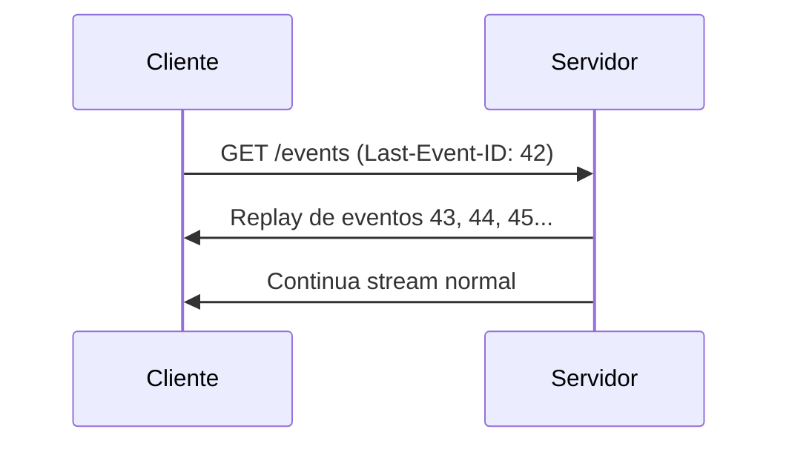

# 📦 MÓDULO 06 — API e Extensibilidade
> **Cole após o MAESTRO (00-MAESTRO.md) na mesma sessão.**
> **Output esperado:** `06-api-and-extensibility.md`
> **Tamanho esperado:** 400–600 linhas
> **Aplicabilidade:** Gerar somente se o projeto tiver API, SSE, WebSocket ou plugin system
> **Dependência:** Gerar após 01, 02 e 03

---

## OBJETIVO DESTE DOCUMENTO

Gerar o documento `06-api-and-extensibility.md` do projeto.

Este documento responde: *"Como sistemas externos consomem este sistema, como estender suas capacidades e quais contratos de API são estáveis."*

---

## ESTRUTURA OBRIGATÓRIA

### Seção 1 — Protocolo de Comunicação Principal

#### 1.1 [Protocolo A — ex: SSE / REST / gRPC]

**Endpoint base:** `[método] [rota]`
**Content-Type:** `[tipo]`
**Reconexão/retry:** [estratégia]

Padrão obrigatório de conexão:
```typescript
// Conexão segura com cleanup determinístico
// Previne memory leak ao desconectar
function handleConnection(req: Request, res: Response): void {
  // Headers obrigatórios
  // AbortController acoplado ao sinal de desconexão
  // Heartbeat para prevenir timeout de proxies
  // Cleanup automático no disconnect
}
```

**Catálogo de Eventos/Mensagens:**

Para cada evento/mensagem:
```
#### [NOME_DO_EVENTO]
**Direção:** [servidor → cliente / cliente → servidor / bidirecional]
**Canal:** [SSE / WebSocket / REST]
**Quando emitido:** [condição de disparo]

**Payload:**
```json
{
  "type": "[NOME_DO_EVENTO]",
  "seq_id": "[número sequencial para ordering]",
  "epoch_id": "[fencing token]",
  "payload": {
    "[campo]": "[tipo — descrição]"
  }
}
```

**O que o receptor deve fazer:** [ação obrigatória]
**Garantia de entrega:** [at-most-once / at-least-once / exactly-once]
```

#### 1.2 [Protocolo B — ex: WebSocket / GraphQL Subscriptions]

Mesma estrutura do 1.1, adaptada ao protocolo.

**Comandos do cliente:**
Para cada comando que o cliente envia:
```
#### [NOME_DO_COMANDO]
**Payload:**
```typescript
interface [NomeDoComando] {
  [campo]: [tipo]; // [descrição]
}
```
**Efeito no servidor:** [o que acontece]
**Resposta:** [o que o cliente recebe de volta]
**Idempotência:** [sim / não — como garantir]
```

### Seção 2 — Protocolo de Ordering e Re-sincronização

Se o sistema usa sequencing (seq_id, Last-Event-ID, etc.):

```typescript
// ClientReorderBuffer — garante processamento em ordem
// mesmo com eventos chegando out-of-order
class ReorderBuffer {
  private buffer: Map<number, Event> = new Map();
  private nextExpected: number = 0;

  add(event: Event): void {
    // Armazena e processa em ordem
  }

  flush(): Event[] {
    // Retorna eventos prontos para processamento
  }
}
```

Diagrama de sequência de reconexão com Last-Event-ID:


### Seção 3 — Sistema de Plugins / Agentes / Extensões

Se o projeto permite extensão declarativa (AGENTS.md, plugins, hooks):

#### 3.1 Formato Declarativo
```yaml
# [arquivo de configuração de extensão — ex: AGENTS.md, plugins.yaml]
[exemplo real de extensão funcional mínima]
```

#### 3.2 Campos Obrigatórios e Opcionais
| Campo | Tipo | Obrigatório | Descrição |
|---|---|---|---|

#### 3.3 Tutorial: Criar uma Extensão em 5 Passos
1. [passo 1 com exemplo]
2. [passo 2]
...

#### 3.4 Validação e Hot-Reload
```typescript
// Como o sistema valida e recarrega extensões em runtime
// sem reiniciar o processo principal
```

#### 3.5 Integridade de Extensões
```typescript
// Hash SHA-256 de extensões core
// Detecção de alteração maliciosa
// Audit trail de mudanças
```

### Seção 4 — REST API (se aplicável)

Para cada endpoint:
| Método | Rota | Autenticação | Payload | Resposta | Erros |
|---|---|---|---|---|---|

Exemplos com curl para cada endpoint crítico:
```bash
# [Descrição da operação]
curl -X [METHOD] http://localhost:[PORT]/[rota] \
  -H "Content-Type: application/json" \
  -d '{"campo": "valor"}'
# Resposta esperada:
# {"resultado": "..."}
```

### Seção 5 — Contrato de Comando de Steering / Override (se aplicável)

Se o sistema permite que operadores injetem comandos em runtime:

```typescript
// Contrato de efeito completo — documentar TODOS os efeitos colaterais
interface SteeringCommand {
  type: 'STEER' | 'ABORT' | 'OVERRIDE';
  target: string;      // componente alvo
  payload: unknown;    // dados do comando
  epochId: number;     // fencing — rejeitar se epoch divergiu
}

// Efeitos garantidos:
// 1. [efeito 1]
// 2. [efeito 2]
// Efeitos NÃO garantidos (edge cases):
// 1. [edge case 1]
```

### Seção 6 — Extensibilidade de Integrações Externas

Se o sistema suporta múltiplos provedores (LLMs, storage, auth):

```typescript
// Interface comum IProvider
interface ILLMProvider {
  generate(prompt: string, options: GenerateOptions): Promise<string>;
  estimateCost(tokens: number): number;
  healthCheck(): Promise<boolean>;
}

// Trocar provedor sem alterar lógica dos componentes
// 1. Implementar ILLMProvider
// 2. Registrar no RuntimeContainer
// 3. Atualizar variável de ambiente PROVIDER=novo_provedor
```

Tabela de provedores suportados:
| Provedor | Status | Variável de Ativação | Documentação |
|---|---|---|---|

---

## REGRAS ESPECÍFICAS DESTE DOCUMENTO

1. **Todo evento deve ter exemplo de payload JSON real** — não esquecer `seq_id` e `epoch_id` se o sistema usar ordering
2. **Memory leak é o inimigo** — todo padrão de conexão deve mostrar o cleanup explícito
3. **Idempotência deve ser explícita** — para cada comando: "é idempotente? como garantir?"
4. **Tutorial de extensão deve funcionar de verdade** — testar mentalmente antes de escrever
5. **Se não há API pública**, esta seção documenta apenas a API interna entre componentes — não pular

---

**GERE O DOCUMENTO `06-api-and-extensibility.md` AGORA.**
