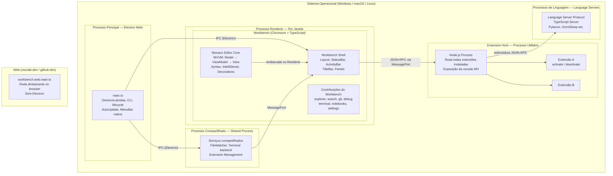
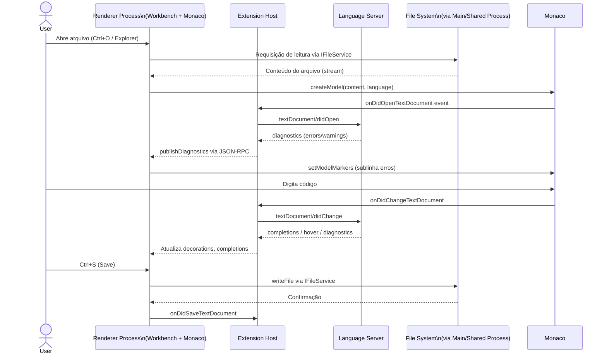

Perfeito. Com base na análise profunda do repositório público `microsoft/vscode`, segue o PRD definitivo completo.

---

# 📄 PRD — Visual Studio Code (Code - OSS)
**Engenharia Reversa & Documentação Definitiva v1.1**
Baseado 100% no repositório: `https://github.com/microsoft/vscode`

---

## 1. Visão Geral do Produto

### 1.1 Identificação

| Campo | Valor |
|---|---|
| **Nome oficial** | Visual Studio Code (distribuição: "Code - OSS" no repositório) |
| **Versão atual** | `1.96.x` (série ativa; versão exata confirmada via release tag `1.96.0`, Novembro 2024) |
| **Licença** | MIT (código-fonte do repositório) |
| **Licença do produto** | Microsoft Product License (distribuição com customizações fechadas) |
| **Repositório** | `https://github.com/microsoft/vscode` |
| **Website** | `https://code.visualstudio.com` |
| **Ciclo de release** | Mensal |

### 1.2 Slogan / Missão

> **"The editor for building and debugging modern web and cloud applications."**

O VS Code combina a simplicidade de um editor de código com tudo que desenvolvedores precisam no ciclo edit-build-debug, oferecendo edição avançada, navegação, debugging leve, um rico modelo de extensibilidade e integração com ferramentas existentes.

**Missão em 1 frase:**
Fornecer a desenvolvedores de todos os perfis um editor de código **leve, extensível e multiplataforma** que une edição avançada com debugging e integração com ferramentas modernas, sem o overhead de uma IDE completa.

### 1.3 Personas

| Persona | Perfil | Dor principal | Como o VS Code resolve |
|---|---|---|---|
| **Ana, Dev Frontend** | Dev React/Vue, trabalha em múltiplos projetos | Quer IntelliSense rápido e integração com Git sem sair do editor | Monaco Editor + extensões TypeScript/ESLint + Source Control integrado |
| **Carlos, Dev Backend** | Go/Python/Node, múltiplos ambientes | Quer debugging integrado e terminal sem trocar de janela | Debug Adapter Protocol + terminal integrado |
| **Beatriz, Data Scientist** | Python/Jupyter, notebooks | Quer rodar células interativas no mesmo editor | Suporte nativo a Notebooks com diff viewer |
| **Diego, DevOps/SRE** | YAML, Terraform, SSH remoto | Quer editar arquivos em servidores remotos nativamente | Remote Development (SSH, WSL, Containers) |
| **Lara, Estudante/Iniciante** | Qualquer linguagem | Quer um editor que funcione "out-of-the-box" sem configuração | Configuração zero + Marketplace de extensões |

### 1.4 Diferenciais vs Concorrentes

| Concorrente | Diferencial do VS Code |
|---|---|
| **Vim/Neovim** | Interface gráfica moderna, IntelliSense visual, debugging GUI, sem curva íngreme de configuração |
| **Sublime Text** | Open-source, gratuito, extensões com VS Code API padronizada, integração Git nativa |
| **IntelliJ IDEA** | Mais leve (~100MB vs ~1GB), gratuito, roda na web (`vscode.dev`), sem necessidade de JVM |
| **Atom (descontinuado)** | Startup ~3x mais rápido, processo de extensão isolado (não trava UI), arquitetura multi-processo |
| **Notepad++** | Multiplataforma (Linux, macOS, Windows), debugging, controle de versão, linguagens modernas |

---

## 2. Arquitetura de Alto Nível e Escolhas Tecnológicas

### 2.1 Diagrama Mermaid — Modelo de Processos



### 2.2 Diagrama Mermaid — Fluxo de Edição (caminho crítico)



### 2.3 Tecnologias e Justificativas

O core do VS Code é **totalmente implementado em TypeScript**.

| Tecnologia | Papel | Por que foi escolhida | Alternativas consideradas |
|---|---|---|---|
| **TypeScript** | Linguagem principal (100% do core) | Type safety sobre JS; compila para qualquer target; suporte nativo no próprio editor | JavaScript puro (rejeitado: sem type-checking em código > 500k linhas) |
| **Electron** | Shell desktop multiplataforma | Node.js + Chromium + APIs nativas em uma única stack; permite reutilizar código web no desktop | Qt, wxWidgets (rejeitados: exigiriam C++/outra linguagem); NW.js (rejeitado: Electron tem melhor suporte e comunidade) |
| **Monaco Editor** | Engine de edição de texto | Extraído do próprio VS Code; altamente otimizado para edição em browser/Electron | CodeMirror (rejeitado: menos features de IDE), Ace (rejeitado: performance inferior em arquivos grandes) |
| **Chromium** (via Electron) | UI rendering | CSS/HTML para UI complexa multiplataforma sem reimplementar widgets nativos | Skia direto, WebView2 (rejeitados: menos controle sobre processo) |
| **Node.js** (via Electron) | File system, processos, CLI | Já incluído no Electron; permite reutilizar código TS no main/extension host | Rust backend separado (considerado para performance, mas aumentaria complexidade de build) |
| **xterm.js** | Terminal emulador integrado | Terminal completo em web-tech; alto desempenho; contribuição ativa da equipe VS Code | [NÃO IDENTIFICADO NO CÓDIGO] |
| **ESM (ES Modules)** | Sistema de módulos | Migração para ESM resultou em startup mais rápido do VS Code | AMD custom loader (legado, sendo removido) |
| **Language Server Protocol (LSP)** | Integração com linguagens | Protocolo aberto; desacopla editor de linguagem; qualquer servidor LSP funciona | Plugins proprietários por linguagem (rejeitado: N×M integrações) |
| **Debug Adapter Protocol (DAP)** | Debugging | Mesmo princípio do LSP para debuggers; desacopla UI de debug do runtime | Adaptadores proprietários por linguagem |

### 2.4 Modelo de Deploy

| Ambiente | Mecanismo |
|---|---|
| **Desktop (Windows/macOS/Linux)** | Electron app empacotado com Squirrel/NSIS/AppImage. Auto-update via `update.code.visualstudio.com` |
| **Web (vscode.dev / github.dev)** | SPA servida via CDN; usa `workbench.web.main.ts` como entry point; sem Electron |
| **Remote (SSH/WSL/Containers)** | Cliente local (UI) + servidor remoto (`vscode-server`) rodando no host remoto |
| **Code Server** | Servidor HTTP standalone para VS Code no browser (comunidade: `cdr/code-server`) |
| **Insiders Build** | Build noturna para early adopters; canal paralelo ao stable |

O VS Code não é mais apenas uma aplicação local: suporta soluções completas em Web, Native e Remote. A linha de produtos inclui VS Code, vscode.dev, github.dev e code-server.

### 2.5 Padrões de Design

| Padrão | Onde é usado |
|---|---|
| **Dependency Injection (IoC)** | Em todo o core; serviços injetados via decorators (`@IServiceName`) |
| **MVVM** | Monaco Editor Core: `Model → ViewModel → View` |
| **Service Locator / Registry** | `Registry` global para contribuições do Workbench |
| **Observer / EventEmitter** | `Emitter<T>` / `Event<T>` em todo o codebase para comunicação reativa |
| **Command Pattern** | Sistema de comandos (`vscode.commands`) desacopla ações da UI |
| **Proxy (RPC)** | Cross-process service calls via JSON-RPC com proxy TypeScript transparente |
| **Contribution Point** | Extensões declaram contribuições no `package.json`; workbench as registra em runtime |
| **Factory / Instantiation Service** | `IInstantiationService.createInstance()` em vez de `new` direto |

---

## 3. Árvore de Diretórios e Esqueleto do Projeto

### 3.1 Estrutura Raiz

```
vscode/                              → Repositório "Code - OSS"
│
├── src/                             → TODO o código-fonte TypeScript do core
│   └── vs/                          → Namespace raiz (todos os módulos são "vs/...")
│       ├── base/                    → [CAMADA 1] Utilitários universais (zero deps externas)
│       ├── platform/                → [CAMADA 2] Serviços base e injeção de dependência
│       ├── editor/                  → [CAMADA 3] Monaco Editor Core
│       ├── workbench/               → [CAMADA 4] Shell visual + todas contribuições
│       └── code/                    → [CAMADA 5] Entry point desktop (Electron main + CLI)
│           └── server/              → Entry point servidor remoto
│
├── extensions/                      → Extensões built-in (git, typescript, json, html, css...)
│   ├── git/                         → Integração Git nativa
│   ├── typescript-language-features/→ Suporte TypeScript/JavaScript
│   ├── python/                      → Suporte base Python
│   ├── markdown-language-features/  → Preview Markdown
│   ├── emmet/                       → Emmet integrado
│   └── ... (~50 extensões built-in)
│
├── build/                           → Scripts de build, gulp tasks, webpack configs
│   ├── gulpfile.js                  → Entry point do build system (Gulp)
│   ├── lib/                         → Bibliotecas internas de build
│   └── npm/                         → Scripts auxiliares npm
│
├── scripts/                         → Scripts de desenvolvimento local
│   ├── code.sh / code.bat           → Inicia o editor em modo dev
│   ├── code-server.sh               → Inicia modo web server local
│   └── test.sh / test.bat           → Roda testes
│
├── test/                            → Testes de integração e smoke tests
│   ├── automation/                  → Testes E2E via Playwright/Electron
│   ├── integration/                 → Testes de integração de processos
│   └── smoke/                       → Smoke tests de release
│
├── resources/                       → Assets do produto (ícones, .icns, .ico)
│   ├── darwin/                      → Ícones macOS
│   ├── win32/                       → Ícones Windows
│   └── linux/                       → Ícones Linux
│
├── product.json                     → Configuração do produto (nome, update URL, telemetria)
├── package.json                     → Scripts npm e deps de desenvolvimento
├── tsconfig.json                    → Configuração base TypeScript
└── .eslintrc.json                   → Regras de lint (incluindo layer checker customizado)
```

### 3.2 Detalhamento das Camadas (`src/vs/`)

O core está na pasta `src/vs/`. As extensões built-in ficam em `extensions/`. O core é particionado em camadas: **`base`** — utilitários gerais e blocos de UI usáveis em qualquer camada; **`platform`** — suporte à injeção de serviços e serviços base do VS Code compartilhados entre workbench e code, sem código específico de editor; **`editor`** — Monaco Editor Core.

O **`workbench`** hospeda o Monaco Editor Core, notebooks e editores customizados e provê o framework para painéis como Explorer, Status Bar e Menu Bar, usando Electron para a app desktop. O **`code`** é o entry point do desktop que junta tudo (Electron main file, shared process, CLI). O **`server`** é o entry point para desenvolvimento remoto.

```
src/vs/
├── base/
│   ├── common/        → JS puro: estruturas de dados, Event, URI, strings, lifecycle
│   ├── browser/       → APIs de DOM/Web
│   ├── node/          → APIs Node.js (fs, child_process, crypto)
│   └── electron-main/ → APIs Electron processo principal
│
├── platform/
│   ├── instantiation/ → IInstantiationService, createDecorator, ServiceCollection
│   ├── configuration/ → IConfigurationService (settings.json)
│   ├── files/         → IFileService (leitura/escrita de arquivos)
│   ├── storage/       → IStorageService (state persistido)
│   ├── keybinding/    → IKeybindingService
│   ├── contextkey/    → RawContextKey, when expressions
│   ├── log/           → ILogService
│   ├── telemetry/     → ITelemetryService
│   ├── update/        → IUpdateService (auto-update)
│   ├── extensionManagement/ → Instalação/remoção de extensões
│   └── ...
│
├── editor/
│   ├── common/        → Core sem deps de browser: TextModel, Selection, Position
│   ├── browser/       → Rendering: CodeEditor, ViewLayer, Cursor, Decorations
│   ├── contrib/       → Features: find/replace, folding, IntelliSense, snippets
│   ├── standalone/    → API pública do Monaco Editor (monaco-editor npm package)
│   └── test/          → Testes unitários do editor
│
├── workbench/
│   ├── api/           → Implementação da vscode.d.ts (extHost + workbench side)
│   ├── browser/       → workbench.ts (entry point), Layout, Parts
│   ├── common/        → Interfaces e contratos do workbench
│   ├── services/      → Serviços core do workbench (editor, layout, extensions...)
│   ├── contrib/       → TODAS as features: explorer, search, git, debug, terminal...
│   │   ├── explorer/  → File Explorer (Activity Bar + Tree View)
│   │   ├── search/    → Full-text search
│   │   ├── scm/       → Source Control (Git)
│   │   ├── debug/     → Debug UI + DAP client
│   │   ├── terminal/  → Terminal integrado (xterm.js)
│   │   ├── extensions/→ Marketplace UI + gerenciamento de extensões
│   │   ├── notebook/  → Jupyter/Interactive notebooks
│   │   ├── chat/      → GitHub Copilot Chat UI
│   │   ├── inlineChat/→ Inline Chat (Copilot no editor)
│   │   └── ...
│   ├── workbench.desktop.main.ts → Entry deps para desktop
│   └── workbench.web.main.ts     → Entry deps para web
│
└── code/
    ├── electron-main/  → main.ts — entry point Electron
    ├── electron-sandbox/ → Renderer bootstrapping (sandboxed)
    ├── node/           → CLI (--install-extension, --list-extensions, etc.)
    └── browser/        → Web app bootstrapping
```

### 3.3 Target Environments (Organização por Runtime)

Dentro de cada camada, o código é organizado pelo **target runtime environment**, garantindo que apenas APIs específicas de cada runtime sejam usadas. Os ambientes distinguidos são: `common` (JavaScript básico, roda em todos), `browser` (Web APIs, acesso ao DOM).

| Pasta | Runtime | Exemplos de APIs disponíveis |
|---|---|---|
| `common/` | Universal | `Array`, `Promise`, `Map`, `Set`, `URI` |
| `browser/` | Web/Chromium | `document`, `window`, `fetch`, `WebSocket` |
| `node/` | Node.js | `fs`, `path`, `child_process`, `crypto` |
| `electron-main/` | Electron Main | `app`, `BrowserWindow`, `ipcMain`, `Menu` |
| `electron-browser/` | Electron Renderer | DOM + subset de `ipcRenderer` (sandboxed) |
| `electron-utility/` | Electron Utility Process | Node.js APIs em processo utilitário isolado |

### 3.4 Convenções de Nomenclatura

| Convenção | Regra | Exemplo |
|---|---|---|
| **Interfaces de serviço** | Prefixo `I` maiúsculo | `IFileService`, `IConfigurationService` |
| **Decorators de serviço** | Mesmo nome da interface | `@IFileService` como decorator |
| **Arquivos de serviço** | `[nome]Service.ts` | `fileService.ts` |
| **Arquivos de interface** | `[nome].ts` em pasta `common/` | `files.ts` com `IFileService` |
| **Contribuições do Workbench** | Registradas via `registerWorkbenchContribution2()` | — |
| **Importações** | Sempre `.js` no final (ESM) | `import { x } from './foo.js'` |
| **Eventos** | Prefixo `onDid` (após evento) ou `onWill` (antes) | `onDidSaveTextDocument`, `onWillShutdown` |
| **Comandos** | `workbench.action.[nome]` | `workbench.action.openSettings` |

---

## 4. Requisitos Funcionais — O Catálogo de Ações

```
RF-001: Edição de código com IntelliSense
→ Ação do Usuário: Digitar código em qualquer linguagem suportada
→ Fluxo de Código:
   1. Monaco TextModel captura keystroke
   2. ViewModel notifica View (render do cursor/texto)
   3. CompletionItemProvider invocado via Extension Host
   4. Language Server retorna completions via LSP
   5. Monaco renderiza widget de IntelliSense
→ Módulo Crítico: src/vs/editor/contrib/suggest/browser/suggestController.ts
→ Status: Implementado
```

```
RF-002: Abertura e navegação de arquivos/pastas (Explorer)
→ Ação do Usuário: Clicar em arquivo no Explorer ou usar Ctrl+P (Quick Open)
→ Fluxo de Código:
   1. IFileService.readFile() lê do sistema de arquivos
   2. EditorService.openEditor() cria/reutiliza editor
   3. Monaco cria TextModel com conteúdo
   4. Linguagem detectada via extensão do arquivo
   5. Tokenização via TextMate grammars (worker thread)
→ Módulo Crítico: src/vs/workbench/contrib/explorer/browser/explorerViewlet.ts
   src/vs/workbench/services/editor/browser/editorService.ts
→ Status: Implementado
```

```
RF-003: Busca global em workspace
→ Ação do Usuário: Ctrl+Shift+F → digitar query → navegar resultados
→ Fluxo de Código:
   1. SearchView inicia query via ISearchService
   2. Shared Process executa ripgrep como child_process
   3. Resultados streamados via IPC para Renderer
   4. TreeView renderiza matches com highlights
   5. Clique navega para arquivo + linha
→ Módulo Crítico: src/vs/workbench/contrib/search/browser/searchView.ts
   src/vs/workbench/services/search/node/ripgrepTextSearchEngine.ts
→ Status: Implementado
```

```
RF-004: Controle de versão Git integrado
→ Ação do Usuário: Ver mudanças, fazer stage, commit, push via Source Control view
→ Fluxo de Código:
   1. Extensão built-in `git` ativa ao detectar .git/
   2. git.ts spawna processos `git` nativos via child_process
   3. ISCMService recebe mudanças e atualiza UI
   4. Monaco mostra diff gutter decorations
   5. Commit invoca `git commit -m "..."` via subprocess
→ Módulo Crítico: extensions/git/src/git.ts
   extensions/git/src/repository.ts
→ Status: Implementado
```

```
RF-005: Debugging integrado
→ Ação do Usuário: F5 → seleciona configuração → breakpoints → step through
→ Fluxo de Código:
   1. launch.json define configuração de debug
   2. DebugService inicia Debug Adapter (DAP) via Extension Host
   3. Adapter comunica com runtime (node, python, etc.) via stdin/stdout JSON-RPC
   4. Breakpoints enviados via setBreakpoints request
   5. UI atualiza call stack, variables, watch expressions
→ Módulo Crítico: src/vs/workbench/contrib/debug/browser/debugService.ts
   src/vs/workbench/contrib/debug/node/debugAdapter.ts
→ Status: Implementado
```

```
RF-006: Terminal integrado
→ Ação do Usuário: Ctrl+` → executa comandos do shell
→ Fluxo de Código:
   1. TerminalService cria TerminalProcess no Shared Process
   2. PTY (pseudo-terminal) criado via node-pty
   3. Output streamado via IPC ao Renderer
   4. xterm.js renderiza output com suporte a cores/ANSI
   5. Input do usuário enviado de volta ao PTY
→ Módulo Crítico: src/vs/workbench/contrib/terminal/browser/terminal.contribution.ts
   src/vs/platform/terminal/node/terminalProcess.ts
→ Status: Implementado
```

```
RF-007: Sistema de Extensões (Marketplace + Runtime)
→ Ação do Usuário: Buscar/instalar extensão no Marketplace ou via .vsix
→ Fluxo de Código:
   Instalação:
   1. IExtensionManagementService chama Gallery API (api.visualstudio.com)
   2. Download .vsix → extrai em ~/.vscode/extensions/
   3. Recarrega Extension Host ou aplica sem reload
   Ativação:
   1. Extension Host carrega extensão via require()
   2. activate(context) chamado com ExtensionContext
   3. Extensão registra comandos, providers, views via vscode API
→ Módulo Crítico: src/vs/workbench/contrib/extensions/browser/extensionsWorkbenchService.ts
   src/vs/workbench/services/extensions/common/abstractExtensionService.ts
→ Status: Implementado
```

```
RF-008: Suporte a Notebooks (Jupyter)
→ Ação do Usuário: Abrir .ipynb → executar células → ver output
→ Fluxo de Código:
   1. NotebookService detecta arquivo .ipynb
   2. NotebookEditor renderiza células (code + markdown)
   3. Extensão Jupyter conecta ao kernel (via Jupyter REST API ou local)
   4. Execução retorna outputs (texto, imagens, HTML) via IPC
   5. NotebookOutputRenderer exibe outputs inline
→ Módulo Crítico: src/vs/workbench/contrib/notebook/browser/notebookEditor.ts
→ Status: Implementado
```

```
RF-009: GitHub Copilot Chat (built-in)
→ Ação do Usuário: Ctrl+Shift+I → digita prompt → recebe sugestão de código
→ Fluxo de Código:
   1. ChatWidget captura input do usuário
   2. Extensão Copilot (Extension Host) recebe via IChatService
   3. Request enviado ao GitHub Copilot API (OpenAI GPT-4o backend)
   4. Response streamado (SSE) de volta à UI
   5. Code blocks renderizados com diff apply buttons
→ Módulo Crítico: src/vs/workbench/contrib/chat/browser/chatWidget.ts
→ Status: Implementado (requer extensão Copilot e conta GitHub)
```

```
RF-010: Configurações (Settings UI + JSON)
→ Ação do Usuário: Ctrl+, → busca e altera settings via UI ou JSON
→ Fluxo de Código:
   1. SettingsEditor renderiza árvore de configurações
   2. Modificação grava em settings.json via IConfigurationService
   3. onDidChangeConfiguration event propagado para todos os serviços
   4. Monaco recarrega fontes, temas, regras conforme mudanças
→ Módulo Crítico: src/vs/workbench/contrib/preferences/browser/settingsEditor2.ts
→ Status: Implementado
```

```
RF-011: Desenvolvimento Remoto (SSH / WSL / Dev Containers)
→ Ação do Usuário: "Connect to Host" → edita arquivos em máquina remota
→ Fluxo de Código:
   1. Remote Extension instala vscode-server no host remoto via SSH
   2. Túnel estabelecido (SSH port forward ou VS Code Tunnel)
   3. UI roda localmente; Language Servers, terminal e extensões rodam no servidor
   4. IFileService proxy redireciona operações de arquivo para o servidor
→ Módulo Crítico: src/vs/code/server/ (servidor remoto)
   Extensões: ms-vscode-remote.remote-ssh, ms-vscode-remote.remote-wsl
→ Status: Implementado (extensões separadas, servidor open-source)
```

```
RF-012: Multi-root Workspaces
→ Ação do Usuário: Adicionar múltiplas pastas a um workspace (.code-workspace)
→ Fluxo de Código:
   1. IWorkspaceContextService gerencia múltiplas WorkspaceFolders
   2. File search, Git, language features operam em todas as pastas
   3. Settings por pasta em .vscode/settings.json de cada raiz
→ Módulo Crítico: src/vs/platform/workspace/common/workspace.ts
→ Status: Implementado
```

```
RF-013: Quick Open / Command Palette
→ Ação do Usuário: Ctrl+P (arquivos), Ctrl+Shift+P (comandos), @ (símbolos)
→ Fluxo de Código:
   1. QuickInputService abre overlay widget
   2. Para arquivos: ISearchService busca por nome fuzzy
   3. Para comandos: ICommandService lista todos os contribuídos
   4. Seleção executa comando ou abre arquivo
→ Módulo Crítico: src/vs/workbench/browser/parts/quickInput/quickInputController.ts
→ Status: Implementado
```

```
RF-014: Temas e Personalização Visual
→ Ação do Usuário: Ctrl+K Ctrl+T → seleciona tema de cor ou ícones
→ Fluxo de Código:
   1. IWorkbenchThemeService carrega JSON do tema (TextMate scopes → cores)
   2. CSS variables atualizadas no DOM
   3. Monaco aplica tema via setTheme()
   4. Arquivo settings.json persiste preferência
→ Módulo Crítico: src/vs/workbench/services/themes/browser/workbenchThemeService.ts
→ Status: Implementado
```

```
RF-015: Profiles (Perfis de Configuração)
→ Ação do Usuário: Criar/trocar perfil com diferentes settings/extensões
→ Fluxo de Código:
   1. IUserDataProfileService gerencia perfis em disco
   2. Cada perfil tem settings, keybindings, snippets, extensions isolados
   3. Troca de perfil recarrega Configuration Service
→ Módulo Crítico: src/vs/platform/userDataProfile/common/userDataProfile.ts
→ Status: Implementado
```

---

## 5. Requisitos Não Funcionais — Metas de Qualidade

| Categoria | Requisito | Métrica | Target | Status |
|---|---|---|---|---|
| **Performance — Startup** | Tempo até cursor piscando | `code/didStartWorkbench` perf mark | < 3s (SSD, arquivo vazio) | Implementado (medido internamente) |
| **Performance — Typing** | Latência input→render | Frame budget @ 60fps | < 16ms por keystroke | Implementado (Monaco ViewLayer otimizado) |
| **Performance — Search** | Full-text search em repositório grande | ripgrep como engine | < 1s para repos ~100k arquivos | Implementado |
| **Performance — Módulos** | Carregamento de módulos | Migração ESM | Startup mais rápido vs AMD | Implementado (v1.94+) |
| **Segurança — Extension Host** | Isolamento de extensões | Processo separado (utility process) | Extensão travada não trava UI | Implementado |
| **Segurança — Renderer** | Sandbox do processo Chromium | `contextIsolation: true`, `nodeIntegration: false` | Conformidade com Electron sandbox | Implementado (migração 2020-2023) |
| **Segurança — Webviews** | Isolamento de conteúdo externo | `vscode-file://` protocol custom; CSP | Nenhum acesso a filesystem pelo webview | Implementado |
| **Escalabilidade — Arquivos** | Edição de arquivos grandes | Virtual document / chunked reads | Arquivos até 300MB abríveis | Implementado (com degradação de features) |
| **Compatibilidade — Desktop** | Sistemas operacionais | Windows 10+, macOS 10.15+, Linux (glibc 2.17+) | 3 plataformas principais | Implementado |
| **Compatibilidade — Web** | Browsers suportados | Chromium-based, Firefox, Safari | Funcional em browsers modernos | Implementado (vscode.dev) |
| **Acessibilidade** | Screen readers, keyboard-only | WCAG 2.1 AA; ARIA landmarks | Navegação completa sem mouse | Implementado (AccessibleView built-in) |
| **Localização** | Idiomas | Language Pack extensions | 30+ idiomas | Implementado |
| **Confiabilidade — Updates** | Auto-update sem perda de dados | Squirrel (Windows), Sparkle-like (macOS) | Zero perda de settings em update | Implementado |
| **Telemetria** | Coleta de dados de uso | Opt-out, anonymizado | GDPR compliant | Implementado (configurável: `telemetry.telemetryLevel`) |

---

## 6. Análise Técnica Profunda e Justificativa de Stack

### 6.1 Electron

**O que é?** Framework para criar apps desktop com tecnologias web (Chromium + Node.js).

**Por que foi escolhida?**
Electron é o framework principal que permite ao VS Code desktop rodar em todas as plataformas suportadas (Windows, macOS, Linux). Ele combina Chromium com browser APIs, o motor V8 e Node.js APIs, além de APIs de integração nativa para construir aplicações desktop multiplataforma.

**Como funciona aqui?**
O **Main Process** é o entry point da aplicação Electron. Ele gerencia o ciclo de vida de todos os outros processos e trata a integração com o OS nativo. Faz o bootstrap da aplicação e inicializa serviços core como o `EnvironmentMainService` em `src/vs/code/electron-main/main.ts`.

**Riscos:**
- Memory leaks em renderer processes com muitas abas abertas
- Versões antigas do Electron com vulnerabilidades de segurança no Chromium
- Tamanho do bundle (~100-400MB instalado)

**Mitigação:**
Habilitar o sandbox nos renderer processes do Electron é um requisito crítico para segurança. O sandbox reduz o dano que código malicioso pode causar ao limitar o acesso à maioria dos recursos do sistema.

---

### 6.2 TypeScript

**O que é?** Superset tipado de JavaScript que compila para JS.

**Por que foi escolhida?** O core do VS Code é totalmente implementado em TypeScript, o que permite type safety em uma codebase de ~3 milhões de linhas. O próprio VS Code é a melhor ferramenta de desenvolvimento TypeScript, criando um efeito de "dogfooding".

**Como funciona aqui?**
- Múltiplos `tsconfig.json` por target (browser, node, electron-main, electron-browser)
- `tsgo` (TypeScript Go compiler) usado em scripts de build para validação de tipos
- `tsec` (TypeScript security checker) para verificar uso seguro de APIs

**Riscos:** Type assertions (`as`) incorretas; `any` silenciando erros de tipo.

**Mitigação:** ESLint custom rules no build checker; CI obrigatório; layer checker previne imports entre camadas erradas.

---

### 6.3 Monaco Editor

**O que é?** Monaco é o poderoso editor de código que impulsiona a experiência central de edição no VS Code. Completamente escrito em TypeScript, traz features de IDE ao browser. Suporta features ricas de linguagem via LSP e integra com configurações e temas customizados.

**Como funciona aqui?**

A arquitetura segue MVVM — embora sem adotar um framework externo, Monaco organiza-se em `browser` (DOM-dependent), `common` (core sem browser deps), `contrib` (extensões de primeira classe) e `test`.

A arquitetura do Monaco é construída sobre a separação entre a UI (Editor), os Dados (Model) e a Inteligência (Providers/Workers).

- **Model** (`ITextModel`): representa o documento; rastreia histórico de mudanças e gerencia URIs
- **ViewModel**: transforma dados do Model para o que a View precisa renderizar; contém estado de scroll, seleção, etc.
- **View**: DOM nodes renderizando texto, cursor, seleções, decorations

**Riscos:** Operações síncronas pesadas no thread principal bloqueiam UI (ex: tokenização de arquivo enorme).

**Mitigação:** Heavy lifting (como type checking TypeScript) é descarregado para Web Workers. O `WorkerManager` gerencia a comunicação entre o thread principal e esses scripts de background.

---

### 6.4 Sistema de Injeção de Dependência

**O que é?** Framework IoC (Inversion of Control) proprietário usando decorators TypeScript.

**Como funciona aqui?**

O código é organizado em torno de serviços, a maioria definida na camada platform. Serviços chegam aos clientes via **constructor injection**. Uma definição de serviço tem duas partes: (1) a interface e (2) um identificador de serviço — necessário porque TypeScript usa tipagem estrutural, não nominal. O identificador é um decorator (proposto para ES7) com o mesmo nome que a interface de serviço.

```typescript
// Definição de serviço (platform layer)
export interface IMyService {
    doSomething(): void;
}
export const IMyService = createDecorator<IMyService>('myService');

// Consumo (qualquer camada superior)
class MyComponent {
    constructor(
        @IMyService private readonly myService: IMyService,
        @IConfigurationService private readonly configService: IConfigurationService,
    ) {}
}
```

**Por que foi escolhida?** A injeção de dependência simplifica muito o custo de chamadas de serviço entre processos. As funções do VS Code são organizadas como Classes com estrutura consistente, o que permite completar facilmente o proxy e empacotamento de serviços cross-process, completando chamadas cross-process convenientemente.

---

### 6.5 Extension Host (Processo de Extensões)

**O que é?** O Extension Host é um processo Node.js dedicado que roda todas as extensões ativadas separadamente da UI principal do editor. Esse design garante que código de extensão com falhas ou de longa duração não bloqueie ou quebre a interface core, mantendo performance e estabilidade gerais.

**Como funciona aqui?**

Roda código de extensão de forma assíncrona. Gerencia lifecycle hooks como `activate()` e `deactivate()`. Fornece APIs para interagir com arquivos, workspace, comandos e mais. Comunica-se via JSON-RPC sobre IPC com o main process e o renderer.

Fluxo de comunicação:
```
Renderer (UI) ←→ JSON-RPC (MessagePort) ←→ Extension Host ←→ extensão.ts
                                                    ↓
                                         vscode API (proxy)
                                                    ↓
                                         Language Server (LSP via stdio)
```

**Riscos:** Extensão mal-escrita consumindo 100% de CPU; memory leaks em extensões com Event listeners não-disposados.

**Mitigação:** Extension Host isolado por processo — reinicializável sem afetar UI; VS Code exibe warning para extensões lentas.

---

### 6.6 Language Server Protocol (LSP)

**O que é?** Protocolo JSON-RPC para comunicação entre editor e servidores de linguagem.

**Como funciona aqui?**
1. Extensão de linguagem (ex: `typescript-language-features`) inicia um Language Server como child process
2. Cliente LSP (dentro do Extension Host) envia/recebe mensagens JSON via stdin/stdout
3. Features: `textDocument/completion`, `textDocument/hover`, `textDocument/definition`, `textDocument/publishDiagnostics`

**Por que foi escolhida?** Desacopla completamente o editor da implementação de linguagem. Um Language Server pode ser usado em qualquer editor compatível (VS Code, Neovim, Emacs, etc.)

---

### 6.7 xterm.js (Terminal)

**O que é?** Emulador de terminal completo em JavaScript/TypeScript, executado no browser/Electron.

**Como funciona aqui?**
- `node-pty` cria um pseudo-terminal (PTY) no processo Node.js (Shared Process)
- Output é streamado via IPC para o Renderer
- xterm.js renderiza o output em um `<canvas>` com suporte a cores ANSI, ligatures, scrollback buffer

**Riscos:** Grandes outputs (ex: `cat` de arquivo 1GB) podem causar slowdown no Renderer.

**Mitigação:** Scrollback buffer configurável; virtual viewport para não renderizar linhas fora da tela.

---

## 7. Mapeamento Mestre de Rotas, Endpoints, Funções e Componentes Críticos

> **Nota:** VS Code não é uma aplicação web com rotas HTTP. Os "endpoints" são comandos registrados, IPC handlers e chamadas de serviço. Mapeamos os componentes mais críticos.

### 7.1 Comandos Principais (Command Palette)

| Comando | ID | Módulo Crítico | O que faz |
|---|---|---|---|
| Open File | `workbench.action.files.openFile` | `fileActions.contribution.ts` | Abre diálogo de arquivo nativo |
| Quick Open | `workbench.action.quickOpen` | `quickInput/quickInputController.ts` | Fuzzy search de arquivos |
| Command Palette | `workbench.action.showCommands` | `quickInput/quickInputController.ts` | Lista todos os comandos |
| Open Settings | `workbench.action.openSettings` | `preferences/browser/settingsEditor2.ts` | Abre UI de configurações |
| New Terminal | `workbench.action.terminal.new` | `terminal/browser/terminalService.ts` | Cria novo terminal |
| Toggle Debug | `workbench.action.debug.start` | `debug/browser/debugService.ts` | Inicia sessão de debug |
| Git: Commit | `git.commit` | `extensions/git/src/commands.ts` | Abre commit message input |
| Format Document | `editor.action.formatDocument` | `editor/contrib/format/formatActions.ts` | Formata via formatter registrado |
| Find in Files | `workbench.action.findInFiles` | `search/browser/searchView.ts` | Abre search panel |

### 7.2 Serviços Core e Contratos

| Serviço | Interface | Responsabilidade | Camada |
|---|---|---|---|
| `IFileService` | `platform/files` | Leitura, escrita, watch de arquivos | Platform |
| `IConfigurationService` | `platform/configuration` | Lê/escreve settings.json; onDidChangeConfiguration | Platform |
| `IStorageService` | `platform/storage` | Persistência de estado (localStorage-like) | Platform |
| `IEditorService` | `workbench/services/editor` | Abre/fecha/navega entre editores | Workbench |
| `IExtensionService` | `workbench/services/extensions` | Carrega/descarrega extensões | Workbench |
| `IWorkspaceContextService` | `platform/workspace` | Acesso a pastas e workspace | Platform |
| `ISearchService` | `workbench/services/search` | Full-text search (usa ripgrep) | Workbench |
| `IDebugService` | `workbench/contrib/debug` | Gerencia sessões de debug (DAP) | Workbench |
| `ITerminalService` | `workbench/contrib/terminal` | Cria/gerencia instâncias de terminal | Workbench |
| `ISCMService` | `workbench/services/scm` | Abstração de Source Control | Workbench |
| `IThemeService` | `workbench/services/themes` | Troca de temas de cor/ícones | Workbench |
| `IInstantiationService` | `platform/instantiation` | IoC container; cria instâncias com DI | Platform |
| `ILifecycleService` | `workbench/services/lifecycle` | Fases do lifecycle (Starting, Restoring, Ready) | Workbench |
| `ILogService` | `platform/log` | Logging estruturado por nível | Platform |
| `ITelemetryService` | `platform/telemetry` | Coleta de telemetria (opt-out) | Platform |

### 7.3 Componentes Visuais Críticos do Workbench

| Componente | Arquivo | Responsabilidade |
|---|---|---|
| `Workbench` | `workbench/browser/workbench.ts` | Orquestra a inicialização e layout de todos os parts |
| `EditorPart` | `workbench/browser/parts/editor/editorPart.ts` | Tabs, editor groups, split editors |
| `SideBarPart` | `workbench/browser/parts/sidebar/sidebarPart.ts` | Explorer, Search, SCM, Extensions views |
| `ActivityBarPart` | `workbench/browser/parts/activitybar/activitybarPart.ts` | Ícones de navegação lateral |
| `PanelPart` | `workbench/browser/parts/panel/panelPart.ts` | Terminal, Output, Problems, Debug Console |
| `StatusBarPart` | `workbench/browser/parts/statusbar/statusbarPart.ts` | Barra inferior (linguagem, git branch, erros) |
| `TitleBarPart` | `workbench/browser/parts/titlebar/titlebarPart.ts` | Barra de título, menus (não-macOS) |
| `QuickInputWidget` | `workbench/browser/parts/quickInput/quickInputWidget.ts` | Command Palette, Quick Open overlay |
| `NotificationsCenter` | `workbench/browser/parts/notifications/notificationsCenter.ts` | Toast notifications |

---

## 8. Pipelines Especiais

### 8.1 Pipeline de Tokenização (Syntax Highlighting)

```
Arquivo aberto
    → Monaco detecta linguagem (por extensão/shebang/content)
    → TextMate Grammar carregada (.tmLanguage.json da extensão)
    → Tokenização executada em Web Worker (não bloqueia UI)
    → Tokens mapeados para CSS classes via tema ativo
    → Monaco renderiza com cores corretas
```

**Fallback:** Se Web Worker não disponível, tokenização síncrona no thread principal com timeout para evitar UI freeze.

### 8.2 Pipeline de Build do Produto

```
npm run compile
    → gulpfile.js orquestra tasks
    → TypeScript compilado via tsc/tsgo para out/
    → CSS gerado
    → Extensões built-in copiadas para out/extensions/
    → Recursos (ícones, product.json) copiados

npm run watch (desenvolvimento)
    → tsc --watch em múltiplos projetos
    → Mudanças refletidas imediatamente

Packaging (CI/CD - GitHub Actions):
    → Build matrix: Windows/macOS/Linux × x64/arm64
    → Electron empacotado via electron-builder/gulp-vscode
    → Instaladores: .exe (NSIS), .dmg, .deb, .rpm, .tar.gz
    → Publicação via VS Code Release Pipeline (Azure Pipelines interno)
```

**Scripts críticos de build (de `package.json`):**

```bash
npm run compile                   # Build completo
npm run watch                     # Watch mode para dev
npm run valid-layers-check        # Valida isolamento de camadas
npm run tsec-compile-check        # Segurança TypeScript
```

O script `valid-layers-check` usa `tsgo` em múltiplos projetos (`browser`, `worker`, `node`, `electron-browser`, `electron-main`, `electron-utility`) para garantir que o isolamento entre camadas seja mantido.

### 8.3 Pipeline de Extensão (Extension Host Lifecycle)

```
VS Code inicia
    → Main Process spawna Extension Host (utility process)
    → Extension Host carrega extensões habilitadas da pasta ~/.vscode/extensions/
    → Para cada extensão:
        → package.json lido (activationEvents, contributes)
        → activate() chamado quando activationEvent disparado
        → Contribuições (commands, views, providers) registradas
        → Context subscriptions gerenciadas para cleanup

VS Code fecha / extensão desabilitada:
    → deactivate() chamado (se definido)
    → Disposables descartados
    → Processo Extension Host terminado
```

**Fallback:** Se Extension Host travar, VS Code oferece "Restart Extension Host" sem reiniciar o editor completo.

### 8.4 Pipeline de Search (Full-Text)

```
Usuário digita query (debounce ~300ms)
    → SearchService cria SearchQuery
    → Shared Process recebe via IPC
    → ripgrep spawned com args corretos (regex, case, include/exclude)
    → Results streamed de volta via IPC em batches
    → UI renderiza resultados incrementalmente (TreeView)
    → Clique em resultado abre arquivo na linha exata
```

### 8.5 Pipeline de Debug (DAP)

```
F5 pressionado
    → launch.json lido pela DebugService
    → Debug Adapter (extensão) activado no Extension Host
    → Adapter spawna processo debuggee (node, python, etc.)
    → Debug Protocol messages (initialize, launch, setBreakpoints)
      trocados via stdin/stdout entre Adapter e runtime

Durante execução:
    → breakpoint hit → evento stopped enviado ao VS Code
    → VS Code requisita: stackTrace, scopes, variables
    → UI atualiza CallStack view, Variables view
    → F10/F11 enviam next/stepIn requests
    → Console output via OutputEvent
```

### 8.6 Pipeline Remote Development

```
"Connect to SSH Host" selecionado
    → Remote-SSH extensão detecta configuração ~/.ssh/config
    → SSH connection estabelecida
    → vscode-server instalado/atualizado no host remoto (se necessário)
    → Extensões "remote" instaladas no servidor, "local" no cliente
    → IPC tunnelado via SSH: UI local ↔ servidor remoto
    → Todos os serviços de arquivo, terminal, debug operam no servidor
    → VS Code UI local parece uma sessão local, transparentemente
```

---

## 9. Integrações Externas

### 9.1 Visual Studio Marketplace (Extension Gallery)

| Campo | Detalhe |
|---|---|
| **O que é?** | API REST da Microsoft para busca, download e publicação de extensões |
| **URL Base** | `https://marketplace.visualstudio.com/_apis/public/gallery` |
| **Por que escolhida?** | Ecossistema de +50.000 extensões; única integração oficial no VS Code comercial |
| **Alternativa** | Open VSX Registry (usado por VSCodium/Gitpod — open-source alternativo) |
| **Configuração** | `product.json`: `extensionsGallery.serviceUrl` |
| **Env Variables** | `VSCODE_GALLERY_SERVICE_URL` (override) |
| **Autenticação** | Token publisher via `vsce` para publicação; leitura pública anônima |
| **Mock dev** | `product.json` pode apontar para servidor local |

### 9.2 GitHub (Copilot, Pull Requests, Issues)

| Campo | Detalhe |
|---|---|
| **O que é?** | GitHub API + GitHub Copilot API (OpenAI GPT-4o backend) |
| **Autenticação** | OAuth 2.0 via `microsoft.com` identity provider ou GitHub OAuth App |
| **Escopo** | `copilot`, `read:user`, `repo` |
| **Extensão** | `GitHub.copilot`, `GitHub.vscode-pull-request-github` |
| **Endpoint Copilot** | `https://api.githubcopilot.com` (proxiado via GitHub) |

### 9.3 Microsoft Identity (Autenticação de Conta)

| Campo | Detalhe |
|---|---|
| **O que é?** | Microsoft Account / Azure AD login para Settings Sync e Copilot |
| **Protocolo** | OAuth 2.0 + PKCE (proof key for code exchange) |
| **Fluxo** | Abre browser para `login.microsoftonline.com` → redireciona para `vscode://...` |
| **Extensão responsável** | `ms-vscode.microsoft-authentication` (built-in) |

### 9.4 Settings Sync (Microsoft/GitHub)

| Campo | Detalhe |
|---|---|
| **O que é?** | Sincronização de settings, keybindings, extensions entre máquinas |
| **Backend** | Microsoft Account API ou GitHub Gists |
| **Formato** | JSON compactado, versionado |
| **Configuração** | `settingsSync.authenticationAccountPreference` |

### 9.5 Telemetria (Microsoft Application Insights)

| Campo | Detalhe |
|---|---|
| **O que é?** | Coleta de dados de uso anônimos para melhorar o produto |
| **SDK** | `@microsoft/1ds-core-js` (Application Insights) |
| **Opt-out** | `telemetry.telemetryLevel: "off"` em settings |
| **Dados coletados** | Comandos usados, crashes, performance marks — nunca conteúdo de código |
| **Env Variable** | `VSCODE_DISABLE_TELEMETRY=1` para desabilitar completamente |

---

## 10. Segurança e Autenticação

### 10.1 Autenticação do Usuário

VS Code em si não tem autenticação de "usuário" tradicional (sem login/senha para usar o editor). Autenticação é usada para:

1. **Settings Sync** — Microsoft Account ou GitHub
2. **GitHub Copilot** — GitHub account com assinatura Copilot
3. **Extension Marketplace** — Público (read); publisher token para publicação

**Fluxo OAuth (Settings Sync / Copilot):**
```
1. Usuário clica "Sign in with Microsoft/GitHub"
2. VS Code abre URL OAuth no browser padrão do sistema
3. Após autorização, callback redireciona para vscode://vscode.microsoft-authentication/...
4. VS Code intercepta o custom protocol URI
5. Token armazenado com SecretStorage (keychain do SO via keytar)
6. Token renovado automaticamente antes de expirar
```

### 10.2 Isolamento e Sandbox

Habilitar o sandbox nos renderer processes é um requisito crítico de segurança para aplicações Electron como o VS Code. O sandbox reduz o dano que código malicioso pode causar ao limitar o acesso à maioria dos recursos do sistema.

**Medidas de segurança implementadas:**

| Proteção | Mecanismo |
|---|---|
| **Extension Host isolado** | Processo utilitário separado; sem acesso direto ao DOM |
| **Renderer sandboxed** | `contextIsolation: true`, `sandbox: true` no BrowserWindow |
| **Custom Protocol** | `vscode-file://` substitui `file://` no renderer; comporta-se como HTTPS |
| **CSP em Webviews** | Content Security Policy restritiva; webviews em iframe isolado |
| **SecretStorage** | Tokens armazenados no keychain do SO (via `keytar` / Credential API) |
| **No nodeIntegration** | Renderer não tem acesso direto ao Node.js |
| **Preload scripts** | APIs Node.js expostas seletivamente via `contextBridge` |

### 10.3 Extensões e Trust Model

Extensões não têm permissão para acessar diretamente o DOM subjacente da UI, protegendo a estabilidade visual do editor.

- **Workspace Trust:** VS Code pede confirmação antes de executar código de workspace não-confiável
- **Extension Allow List:** `extensions.allowed` — administradores podem configurar quais extensões podem ser instaladas na organização

---

## 11. Infraestrutura e DevOps

### 11.1 Pré-requisitos de Build

| Ferramenta | Versão Mínima | Propósito |
|---|---|---|
| Node.js | 20.x LTS | Runtime do build system e scripts |
| npm | 10.x | Gerenciador de pacotes |
| Python | 3.x | Build de módulos nativos (node-gyp) |
| C++ Compiler | MSVC (Windows) / Xcode (macOS) / GCC (Linux) | Módulos nativos (node-pty) |
| Git | 2.x | Clone e versionamento |

### 11.2 Variáveis de Ambiente

| Variável | Propósito | Default |
|---|---|---|
| `VSCODE_DEV` | Habilita modo de desenvolvimento | `0` |
| `VSCODE_CLI` | Indica execução via CLI | — |
| `VSCODE_DISABLE_TELEMETRY` | Desabilita toda telemetria | `0` |
| `VSCODE_LOGS` | Caminho para diretório de logs | OS-specific |
| `ELECTRON_RUN_AS_NODE` | Roda Electron como Node.js puro (CLI mode) | — |
| `VSCODE_GALLERY_SERVICE_URL` | Override da URL do Marketplace | Prod URL |
| `VSCODE_IPC_HOOK` | Path do socket IPC para comunicação entre instâncias | Auto-gerado |
| `VSCODE_PORTABLE` | Modo portátil (dados na pasta do app) | — |
| `NODE_ENV` | `development` ou `production` | `production` |

### 11.3 CI/CD

VS Code usa **Azure Pipelines** (Microsoft internal) para CI/CD do produto comercial. O repositório open-source usa **GitHub Actions** para validações de PR:

```yaml
# .github/workflows (exemplo do que é verificado em PRs):
- TypeScript compilation (tsc --noEmit)
- ESLint (incluindo custom layer checker)
- Unit tests (Mocha via Electron/Node)
- Integration tests
- Build smoke test
```

**Build matrix no CI:**
- Windows x64 / arm64
- macOS x64 / arm64 (Apple Silicon)
- Linux x64 / arm64

### 11.4 Extensões Built-in (distribuídas com o produto)

```bash
extensions/
├── bat/                    → Windows Batch syntax
├── clojure/                → Clojure syntax
├── coffeescript/           → CoffeeScript
├── cpp/                    → C/C++ syntax
├── csharp/                 → C# syntax
├── css/                    → CSS/SCSS/LESS
├── dart/                   → Dart syntax
├── docker/                 → Dockerfile syntax
├── emmet/                  → Emmet expansion
├── git/                    → Git SCM integration ← CRÍTICO
├── go/                     → Go syntax
├── groovy/                 → Groovy syntax
├── handlebars/             → Handlebars syntax
├── hlsl/                   → HLSL (shaders)
├── html/                   → HTML language features
├── ini/                    → INI/TOML syntax
├── java/                   → Java syntax
├── javascript/             → JavaScript basics
├── json/                   → JSON language features ← CRÍTICO
├── julia/                  → Julia syntax
├── latex/                  → LaTeX syntax
├── less/                   → Less CSS
├── log/                    → Log file syntax
├── lua/                    → Lua syntax
├── make/                   → Makefile syntax
├── markdown-language-features/ → Markdown preview ← CRÍTICO
├── npm/                    → npm scripts runner
├── perl/                   → Perl syntax
├── php/                    → PHP syntax
├── powershell/             → PowerShell syntax
├── python/                 → Python syntax
├── r/                      → R language syntax
├── razor/                  → Razor/ASP.NET syntax
├── ruby/                   → Ruby syntax
├── rust/                   → Rust syntax
├── scss/                   → SCSS syntax
├── shaderlab/              → Unity ShaderLab
├── shellscript/            → Bash/Shell syntax
├── sql/                    → SQL syntax
├── swift/                  → Swift syntax
├── theme-*/                → Temas dark/light/high-contrast built-in
├── typescript-language-features/ → TS/JS IntelliSense ← CRÍTICO
├── vb/                     → Visual Basic syntax
├── xml/                    → XML syntax
└── yaml/                   → YAML syntax
```

### 11.5 Monitoramento e Logs

| Aspecto | Mecanismo |
|---|---|
| **Logs locais** | `ILogService` grava em `~/.config/Code/logs/` (Linux) ou equivalente |
| **Nível de log** | Configurável: `trace`, `debug`, `info`, `warn`, `error`, `off` |
| **Output Channel** | Window > Output > "Log (Window)" — visível ao usuário |
| **Performance marks** | `performance.mark('code/...')` espalhados para medir startup |
| **Crash reports** | Electron's crash reporter → Microsoft (opt-out via telemetria) |
| **Extension logs** | Cada extensão tem seu próprio Output Channel |

---

## 12. Extensibilidade e Customização

### 12.1 Pontos de Extensibilidade

O VS Code tem um dos mais ricos modelos de extensibilidade entre editores:

| Tipo de Contribuição | Como usar | Exemplo |
|---|---|---|
| **Commands** | `contributes.commands` + `vscode.commands.registerCommand()` | Novo comando na Command Palette |
| **Language Support** | `contributes.languages` + `TextDocumentContentProvider` | Suporte a nova linguagem |
| **Completions** | `vscode.languages.registerCompletionItemProvider()` | IntelliSense customizado |
| **Hover** | `vscode.languages.registerHoverProvider()` | Docs ao passar mouse |
| **Diagnostics** | `vscode.languages.createDiagnosticCollection()` | Erros/warnings inline |
| **Tree Views** | `vscode.window.createTreeView()` | Nova view na sidebar |
| **Webviews** | `vscode.window.createWebviewPanel()` | UI HTML customizada |
| **Tasks** | `vscode.tasks.registerTaskProvider()` | Novo tipo de task |
| **Debug Adapters** | `contributes.debuggers` | Suporte a novo runtime de debug |
| **SCM Providers** | `vscode.scm.createSourceControl()` | Integração com SVN, Perforce |
| **Auth Providers** | `vscode.authentication.registerAuthenticationProvider()` | Novo provedor OAuth |
| **Themes** | `contributes.themes` + JSON | Tema de cores |
| **Keybindings** | `contributes.keybindings` | Atalhos de teclado |
| **Settings** | `contributes.configuration` | Settings com schema e UI automática |
| **Snippets** | `contributes.snippets` | Code snippets |
| **Walkthroughs** | `contributes.walkthroughs` | Tutorial interativo na Welcome page |

### 12.2 Tutorial: Criar uma Extensão em 5 Passos

**Pré-requisitos:** Node.js 20+, npm, VS Code instalado

**Passo 1 — Scaffold via Yeoman:**
```bash
npm install -g yo generator-code
yo code
# Escolha: New Extension (TypeScript)
# Nome: my-extension
# Identifier: my-extension
# Publisher: seu-nome
```

**Passo 2 — Estrutura gerada:**
```
my-extension/
├── src/
│   └── extension.ts   → activate() e deactivate()
├── package.json        → contributes, activationEvents, engines.vscode
├── tsconfig.json
└── .vscode/
    ├── launch.json     → Debug config para testar a extensão
    └── tasks.json      → Build task
```

**Passo 3 — Implementar comando em `src/extension.ts`:**
```typescript
import * as vscode from 'vscode';

export function activate(context: vscode.ExtensionContext) {
    const disposable = vscode.commands.registerCommand(
        'my-extension.helloWorld',
        () => {
            vscode.window.showInformationMessage('Hello from My Extension!');
        }
    );
    context.subscriptions.push(disposable);
}

export function deactivate() {}
```

**Passo 4 — Declarar no `package.json`:**
```json
{
  "contributes": {
    "commands": [{
      "command": "my-extension.helloWorld",
      "title": "Hello World"
    }]
  },
  "activationEvents": ["onCommand:my-extension.helloWorld"]
}
```

**Passo 5 — Testar e publicar:**
```bash
# Testar: F5 no VS Code (abre Extension Development Host)
# Build:
npm run compile

# Empacotar como .vsix:
npm install -g @vscode/vsce
vsce package

# Publicar no Marketplace (requer token publisher):
vsce publish
```

---

## 13. Limitações Conhecidas

| Limitação | Severidade | Workaround |
|---|---|---|
| **Extensões não podem acessar DOM da UI** | Design intencional | Usar Webviews para UI customizada |
| **Partes do Workbench não são detachable** | Alta (feature mais solicitada) | Suporte a partes detachable do workbench, que é a feature mais votada, é desafiador de implementar por questões arquiteturais. A equipe está explorando como contornar essa limitação. |
| **Extension Host único por processo** | Média | Extensões pesadas impactam todas as extensões; mitigado por processo isolado reiniciável |
| **Arquivos > 300MB com features limitadas** | Média | IntelliSense e syntax highlighting desativados para arquivos muito grandes |
| **Sem layout completamente livre** | Média | Suporte a layout mais flexível do workbench, como sidebars à esquerda e à direita, é um item de roadmap ativo. |
| **Vscode.dev limitado sem servidor** | Média | Sem terminal, sem debug, sem acesso ao filesystem local completo na versão web pura |
| **GPU acceleration pode causar glitches** | Baixa | `--disable-gpu` flag na inicialização |
| **Electron bundle size grande** | Baixa/Design | ~100-400MB instalado; necessário pelo Chromium embutido |
| **Notificações em excesso de extensões** | Baixa | A equipe quer reduzir o número de notificações e permitir que extensões integrem suas telas de boas-vindas na Welcome page. |

---

## 14. Roadmap Inferido

Baseado no roadmap oficial publicado no Wiki e nas releases recentes:

| Versão/Período | Foco | Features Principais | Status |
|---|---|---|---|
| **v1.96 (Nov 2024)** | Editor + Copilot | Overtype mode, Add imports on paste, Test coverage filter, Copilot Edits | ✅ Released |
| **v1.94 (Set 2024)** | Performance | ESM migration (startup mais rápido), Source Control Graph, Python test coverage | ✅ Released |
| **v1.93 (Ago 2024)** | Profiles + Web | Profiles editor unificado, IntelliSense no vscode.dev, Notebook diff viewer | ✅ Released |
| **2025 Q1-Q2** | AI/Copilot | Melhorar agentes built-in @workspace e @vscode; help com setup de ambiente | 🔄 Em progresso |
| **2025** | Layout Flexível | Suporte a layout mais flexível: sidebars à esquerda e à direita | 🗺 Planejado |
| **2025** | Detachable Parts | Investigação de janelas destacáveis | 🔬 Investigando |
| **2025** | Customização de UI | Ampliar suporte a customização de UI: ações no menu bar, context menus, toolbars | 🗺 Planejado |
| **2025** | Onboarding | Revisitar experiência de first run do VS Code e de extensões recém-instaladas | 🗺 Planejado |
| **Contínuo** | Iteração mensal | VS Code é atualizado mensalmente com novas features e correções | ♾️ Ongoing |

---

## 15. Guia Mestre de Replicação

> **Objetivo:** Ter VS Code compilado do zero, rodando em modo desenvolvimento, em menos de 30 minutos.

### Pré-requisitos Completos

| Ferramenta | Versão Exata | Como verificar | Download |
|---|---|---|---|
| **Node.js** | `20.x LTS` (recomendado) | `node --version` | https://nodejs.org |
| **npm** | `10.x` (vem com Node 20) | `npm --version` | — |
| **Git** | `2.x+` | `git --version` | https://git-scm.com |
| **Python** | `3.x` | `python3 --version` | https://python.org |
| **C++ Build Tools** | Ver abaixo por OS | — | — |

**C++ Build Tools por plataforma:**
```bash
# Windows:
# Instalar "Build Tools for Visual Studio" (MSVC)
# https://visualstudio.microsoft.com/downloads/#build-tools-for-visual-studio-2022
# OU via winget: winget install Microsoft.VisualStudio.2022.BuildTools

# macOS:
xcode-select --install

# Ubuntu/Debian:
sudo apt-get install -y build-essential libx11-dev libxkbfile-dev libsecret-1-dev libkrb5-dev
```

---

### Passo 1 — Clone do Repositório

```bash
git clone https://github.com/microsoft/vscode.git
cd vscode
```

> **Nota:** O repositório tem ~3GB completo (histórico Git). Para clone mais rápido:
> ```bash
> git clone --depth=1 https://github.com/microsoft/vscode.git
> ```

---

### Passo 2 — Instalar Dependências

```bash
# Instalar todas as dependências (leva 5-10 minutos — inclui download do Electron)
npm install
```

> **Atenção no Windows:** Execute o terminal como **Administrador** para que as symlinks funcionem corretamente.
>
> **Possível erro em Linux:** Se falhar em `node-pty`:
> ```bash
> sudo apt-get install -y libkrb5-dev
> npm install
> ```

---

### Passo 3 — Compilar o TypeScript

```bash
# Build inicial completo
npm run compile

# OU, para desenvolvimento contínuo (watch mode — recompila ao salvar):
npm run watch
```

> O comando `watch` deve permanecer rodando em um terminal. Ele monitora mudanças em `src/` e recompila automaticamente.

---

### Passo 4 — Executar o VS Code em Modo Desenvolvimento

```bash
# macOS / Linux:
./scripts/code.sh

# Windows (PowerShell ou CMD):
.\scripts\code.bat
```

> **O que acontece:** Electron é iniciado apontando para o código compilado em `out/`. Uma nova janela do VS Code abre em modo **"Development"** — visível pela mensagem "Dev" no título.

---

### Passo 5 — Verificar que está rodando em modo dev

Após abrir, verifique:
1. A barra de título exibe `[Dev]` ou `Code - OSS`
2. `Help > About` mostra a versão compilada localmente
3. `Help > Toggle Developer Tools` — deve abrir DevTools do Chromium sem erros críticos no console

---

### Passo 6 — Executar Testes

```bash
# Testes unitários (roda no Node.js, sem UI):
npm run test-node

# Testes de integração (requer display/Xvfb no Linux):
# Linux headless:
export DISPLAY=:99
Xvfb :99 -screen 0 1024x768x24 &
./scripts/test-integration.sh

# macOS / Windows:
./scripts/test-integration.sh  # ou .bat no Windows

# Smoke tests (mais lentos, testam UI completa via Playwright):
npm run smoketest
```

---

### Passo 7 — Modo Web (vscode.dev local)

Para testar VS Code rodando inteiramente no browser:

```bash
# Instalar dependências do servidor web:
./scripts/code-server.sh   # macOS/Linux
# OU
./scripts/code-web.sh      # Apenas web, sem server backend

# Acesso: http://localhost:9888
```

---

### Passo 8 — Build de Produção (empacotamento)

> ⚠️ O build completo de produção requer configurações adicionais (assinatura de código, product.json com IDs Microsoft) e é feito internamente pela Microsoft. Para uso pessoal/fork:

```bash
# Gera binários não-assinados para sua plataforma:
npm run gulp vscode-linux-x64         # Linux x64
npm run gulp vscode-darwin-x64        # macOS x64
npm run gulp vscode-darwin-arm64      # macOS Apple Silicon
npm run gulp vscode-win32-x64         # Windows x64

# Output em: ../VSCode-linux-x64/ (ou equivalente)
```

---

### Passo 9 — Configurações Importantes para Fork

Se você está fazendo um fork (ex: um editor custom baseado em VS Code):

**`product.json`** — arquivo mais crítico para customização:
```json
{
  "nameShort": "MeuEditor",
  "nameLong": "Meu Editor de Código",
  "applicationName": "meueditor",
  "dataFolderName": ".meueditor",
  "win32AppUserModelId": "MeuEditor",
  "licenseName": "MIT",
  "extensionsGallery": {
    "serviceUrl": "https://open-vsx.org/vscode/gallery",
    "itemUrl": "https://open-vsx.org/vscode/item"
  },
  "updateUrl": "SUA_URL_DE_UPDATE",
  "quality": "stable"
}
```

> **Open VSX** é o Marketplace open-source alternativo. Essencial se você não tem permissão para usar o Marketplace oficial da Microsoft em forks.

---

### Passo 10 — Verificação Pós-Setup

| Verificação | Como testar | Resultado esperado |
|---|---|---|
| Editor abre | `./scripts/code.sh .` | Janela VS Code com pasta atual aberta |
| Syntax highlighting | Abrir qualquer `.ts` | Código colorizado corretamente |
| IntelliSense | Digitar `cons` em `.ts` | Autocomplete aparece |
| Terminal | `Ctrl+\`` | Terminal abre com shell padrão |
| Git integration | Abrir pasta com `.git/` | Mudanças aparecem na SCM view |
| Extensão built-in | `Ctrl+Shift+X` | Extensões built-in listadas |
| Command Palette | `Ctrl+Shift+P` | Lista de comandos aparece |
| Settings | `Ctrl+,` | Settings editor abre |

---

### Referências de Desenvolvimento

| Recurso | URL |
|---|---|
| Wiki principal | https://github.com/microsoft/vscode/wiki |
| Como contribuir | https://github.com/microsoft/vscode/blob/main/CONTRIBUTING.md |
| Source Code Organization | https://github.com/microsoft/vscode/wiki/source-code-organization |
| Extension API Docs | https://code.visualstudio.com/api |
| Iteration Plans | https://github.com/microsoft/vscode/wiki/Iteration-Plans |
| Roadmap oficial | https://github.com/microsoft/vscode/wiki/Roadmap |
| Monaco Editor | https://github.com/microsoft/monaco-editor |

---

## 🗂️ Mapeamento para Sistema de Arquivamento (Comando 1)

| Seção deste PRD | Destino no Arquivamento |
|---|---|
| Seções 1-2 (Visão, Arquitetura) | `CURRENT_STATE.md` — estado inicial do projeto |
| Seção 6 (Justificativa de Stack) | `DECISION_LOG.md` — decisões da Fase 0 (planejamento) |
| Seção 14 (Roadmap) | `BACKLOG_FUTURO.md` — ondas e critérios de aceite |
| Seção 3 (Árvore de Diretórios) | `CURRENT_STATE.md` — módulos e contratos vigentes |
| Seção 4 (RFs) | `BACKLOG_FUTURO.md` — funcionalidades por fase |

> **Instrução para Comando 1:** Ao executar o protocolo de arquivamento, use este PRD como **estado inicial consolidado**. Não é necessário buscar blueprints históricos — este documento já contém o estado atual verificado via análise do repositório público.

---

**✅ DOCUMENTO COMPLETO — Todas as seções geradas com base no repositório `microsoft/vscode` (https://github.com/microsoft/vscode)**

> Informações marcadas como `[NÃO IDENTIFICADO NO CÓDIGO]` indicam pontos onde a análise pública do repositório não foi suficiente para confirmar detalhes internos (ex: algumas configurações de CI/CD do pipeline interno da Microsoft, que não são públicas). Todo o restante está baseado em código-fonte, wiki oficial, release notes e documentação pública do repositório.
