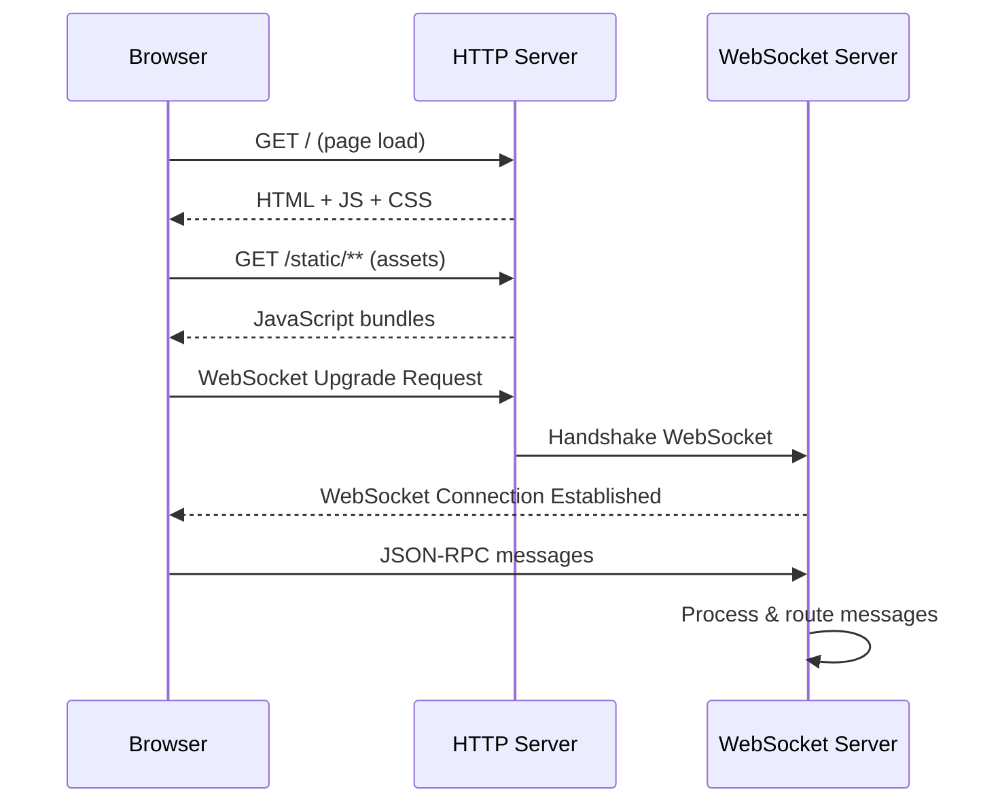
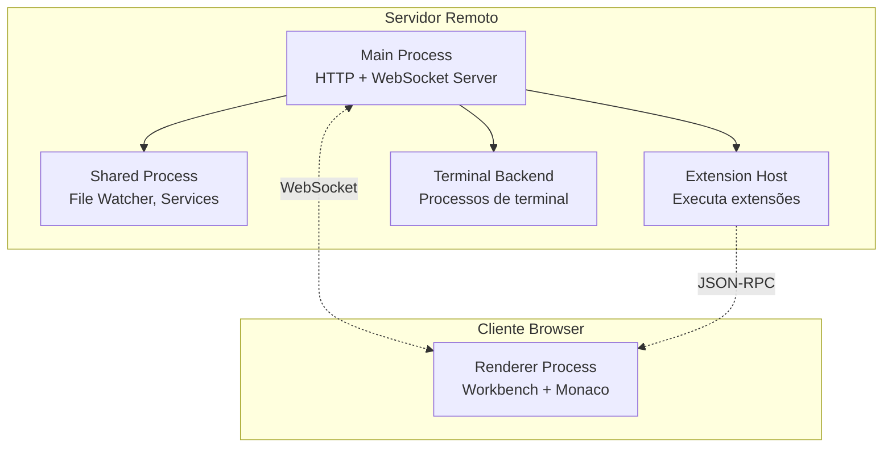
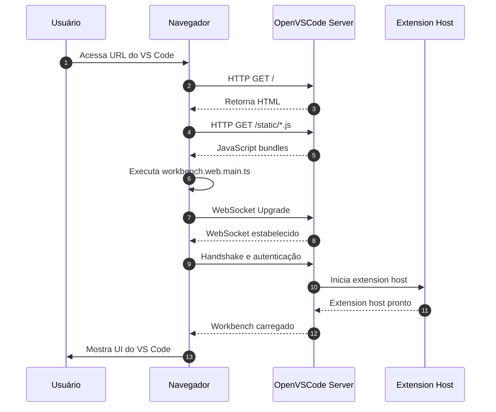
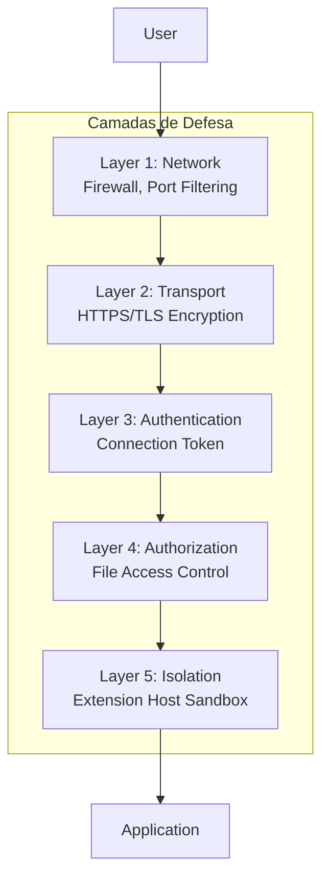
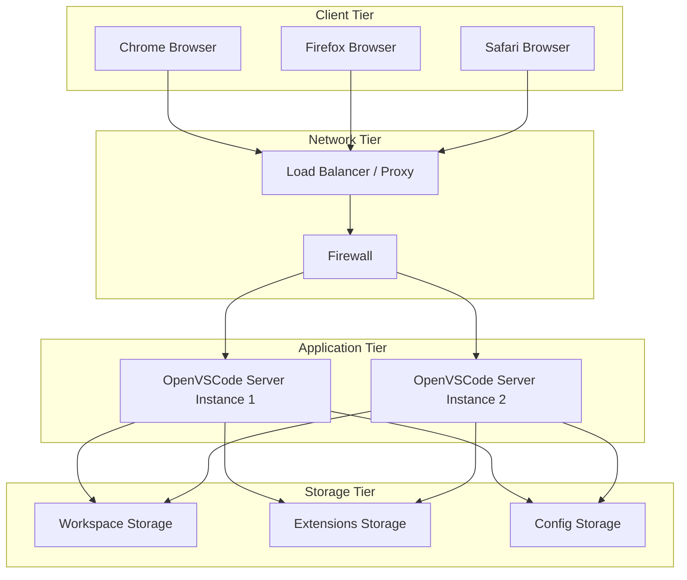

# 01 - Visão Geral da Arquitetura do OpenVSCode Server

## Objetivo

Este documento fornece uma visão completa e detalhada da arquitetura do OpenVSCode Server, explicando como os componentes se organizam, comunicam e operam para fornecer a experiência do VS Code através de um navegador web.

---

## Pré-requisitos

Para compreender este documento, é recomendável ter lido:
- `01-fundamentos/01-introducao.md`
- `01-fundamentos/02-o-que-e-openvscode-server.md`

Conhecimentos úteis:
- Conceitos básicos de arquitetura cliente-servidor
- Noções de HTTP/WebSocket
- Familiaridade com Node.js e TypeScript

---

## Arquitetura de Alto Nível

### Modelo Cliente-Servidor

O OpenVSCode Server segue uma arquitetura **cliente-servidor** com separação clara entre frontend e backend:

```
┌─────────────────────────────────────────────────────────────────┐
│                         CLIENTE (Browser)                        │
│  ┌───────────────────────────────────────────────────────────┐  │
│  │              Frontend Web (Monaco Editor)                 │  │
│  │  • Interface do usuário (HTML/CSS/JS)                     │  │
│  │  • Editor Monaco (core do VS Code)                        │  │
│  │  • Workbench (layout, menus, painéis)                     │  │
│  │  • Comunicação via WebSocket + HTTP                       │  │
│  └───────────────────────────────────────────────────────────┘  │
└─────────────────────────────────────────────────────────────────┘
                              ↕ WebSocket / HTTP
┌─────────────────────────────────────────────────────────────────┐
│                      SERVIDOR (Node.js)                          │
│  ┌───────────────────────────────────────────────────────────┐  │
│  │              Backend Server (openvscode-server)           │  │
│  │  • Servidor HTTP/Express                                  │  │
│  │  • Gerenciamento de WebSocket                             │  │
│  │  • File System Access                                     │  │
│  │  • Extension Host                                         │  │
│  │  • Terminal Backend                                       │  │
│  │  • Autenticação e Segurança                               │  │
│  └───────────────────────────────────────────────────────────┘  │
│  ┌───────────────────────────────────────────────────────────┐  │
│  │              Sistema de Arquivos Local                    │  │
│  │  • Workspace do usuário                                   │  │
│  │  • Configurações                                          │  │
│  │  • Extensões instaladas                                   │  │
│  └───────────────────────────────────────────────────────────┘  │
└─────────────────────────────────────────────────────────────────┘
```

### Componentes Principais

| Componente | Localização | Responsabilidade |
|------------|-------------|------------------|
| **Frontend Web** | Browser | Renderizar UI, capturar input do usuário, comunicação com servidor |
| **Monaco Editor** | Browser | Engine de edição de código (syntax highlighting, IntelliSense visual) |
| **Workbench** | Browser | Shell da aplicação (layout, activity bar, sidebar, panels) |
| **HTTP Server** | Servidor | Servir assets estáticos, API REST, handshake WebSocket |
| **WebSocket Server** | Servidor | Comunicação bidirecional em tempo real |
| **Extension Host** | Servidor | Executar extensões em processo isolado |
| **File Service** | Servidor | Acesso ao sistema de arquivos local/remoto |
| **Terminal Backend** | Servidor | Gerenciar sessões de terminal (pty) |

---

## Camadas Arquiteturais

### Layer 1: Network Layer (Rede)

**Responsabilidade:** Gerenciar toda comunicação de rede entre cliente e servidor.

**Protocolos Utilizados:**

| Protocolo | Porta Padrão | Uso |
|-----------|--------------|-----|
| HTTP/HTTPS | 3000 | Assets estáticos, API REST, página inicial |
| WebSocket | 3000 (mesma porta) | Comunicação em tempo real, updates do editor |

**Fluxo de Conexão:**



### Layer 2: Application Layer (Aplicação)

**Responsabilidade:** Implementar a lógica de negócio do VS Code.

**Subcamadas:**

```
┌─────────────────────────────────────────────────────────┐
│                   Application Layer                      │
├─────────────────────────────────────────────────────────┤
│  ┌─────────────────┐  ┌─────────────────┐               │
│  │   Presentation  │  │     Business    │               │
│  │      Layer      │  │     Logic       │               │
│  │  (Workbench UI) │  │   (Services)    │               │
│  └─────────────────┘  └─────────────────┘               │
├─────────────────────────────────────────────────────────┤
│              Service Layer (IPC Bridge)                  │
├─────────────────────────────────────────────────────────┤
│           Core Layer (File System, Terminal)             │
└─────────────────────────────────────────────────────────┘
```

### Layer 3: Data Layer (Dados)

**Responsabilidade:** Persistir e gerenciar dados.

**Tipos de Dados:**

| Tipo | Localização | Exemplo |
|------|-------------|---------|
| **Workspace Files** | Sistema de arquivos | Código fonte do projeto |
| **User Settings** | `~/.openvscode-server/` | Preferências do usuário |
| **Extensions** | `~/.openvscode-server/extensions/` | Extensões instaladas |
| **Session Data** | Memória (RAM) | Estado atual do editor |
| **Logs** | Arquivos de log | Logs de operação e erros |

---

## Modelo de Processos

### Arquitetura Multi-Processo

O OpenVSCode Server utiliza múltiplos processos para isolamento e estabilidade:



### Descrição dos Processos

#### Main Process

**Função:** Coordenador principal do servidor.

**Responsabilidades:**
- Inicializar servidor HTTP/Express
- Gerenciar conexões WebSocket
- Spawnar e monitorar processos filhos
- Gerenciar autenticação e tokens
- Roteamento de mensagens

**Arquivo Principal:** `src/server-main.js`

#### Shared Process

**Função:** Serviços compartilhados entre instâncias.

**Responsabilidades:**
- File watching (mudanças no filesystem)
- Gerenciamento de downloads
- Serviços utilitários compartilhados
- Telemetria (se habilitado)

#### Extension Host

**Função:** Isolar execução de extensões.

**Responsabilidades:**
- Carregar e executar extensões
- Expor API do VS Code para extensões
- Gerenciar lifecycle (activate/deactivate)
- Isolar falhas de extensões (não crashar o servidor)

**Importante:** Extensões rodam em processo separado por segurança e estabilidade.

#### Terminal Backend

**Função:** Gerenciar terminais interativos.

**Responsabilidades:**
- Criar pseudo-terminals (pty)
- Executar shells (bash, zsh, etc.)
- Stream de output/input do terminal
- Gerenciar múltiplas sessões de terminal

---

## Fluxo de Comunicação

### Comunicação Frontend ↔ Backend

**Protocolo:** JSON-RPC sobre WebSocket

**Estrutura de Mensagem:**

```json
{
  "type": "request",
  "id": 1,
  "channel": "extHost",
  "data": {
    "method": "$initializeExtensionViewStates",
    "args": []
  }
}
```

**Canais de Comunicação:**

| Canal | Propósito | Exemplo de Uso |
|-------|-----------|----------------|
| `mainThread` | Operações do workbench | Abrir arquivo, mostrar notification |
| `extHost` | Comunicação com extensões | Ativar extensão, chamar comando |
| `terminal` | Sessões de terminal | Escrever no terminal, ler output |
| `search` | Pesquisa no workspace | Buscar texto em arquivos |
| `files` | Operações de arquivo | Ler, escrever, deletar arquivos |

### Sequência de Inicialização



---

## Arquitetura de Rede

### Topologia de Rede

```
                    Internet
                        │
                        ▼
            ┌───────────────────────┐
            │   Load Balancer       │ (opcional)
            │   (nginx/traefik)     │
            └───────────────────────┘
                        │
                        ▼
            ┌───────────────────────┐
            │   Firewall Rules      │
            │   Port 3000/TCP       │
            └───────────────────────┘
                        │
                        ▼
            ┌───────────────────────┐
            │  OpenVSCode Server    │
            │  Host: 0.0.0.0        │
            │  Port: 3000           │
            └───────────────────────┘
                        │
            ┌───────────┴───────────┐
            │                       │
            ▼                       ▼
    ┌───────────────┐       ┌───────────────┐
    │   Workspace   │       │  Extensions   │
    │   Directory   │       │   Directory   │
    └───────────────┘       └───────────────┘
```

### Configurações de Porta

| Porta | Protocolo | Configurável | Padrão |
|-------|-----------|--------------|--------|
| HTTP Server | TCP | `--port` | 3000 |
| Development | TCP | N/A | 9888 |
| HTTPS (proxy) | TCP | N/A | 443 |

### Host Binding

**Opções de Host:**

| Valor | Significado | Caso de Uso |
|-------|-------------|-------------|
| `localhost` | Apenas acesso local | Desenvolvimento, testes |
| `0.0.0.0` | Todas interfaces | Produção, acesso remoto |
| `127.0.0.1` | Loopback apenas | Isolamento total |

**Recomendação:** Use `--host 0.0.0.0` para acesso remoto, mas proteja com token e HTTPS.

---

## Segurança na Arquitetura

### Camadas de Segurança



### Pontos de Atenção

| Ponto de Risco | Mitigação | Status |
|----------------|-----------|--------|
| Token em URL | Usar `--connection-token-file` | ✅ Implementado |
| Tráfego não criptografado | HTTPS via proxy reverso | ⚠️ Requer configuração externa |
| Extensões maliciosas | Extension host isolado | ✅ Implementado |
| Acesso não autorizado | Token obrigatório (v1.64+) | ✅ Implementado |
| Vazamento de arquivos | File access control | ✅ Implementado |

---

## Escalabilidade

### Escalabilidade Vertical

**Aumentar recursos do servidor:**

| Recurso | Impacto | Recomendação |
|---------|---------|--------------|
| CPU | Mais instâncias simultâneas | 4+ cores para produção |
| RAM | Mais usuários/extensões | 4GB mínimo, 8GB recomendado |
| Disco | Mais workspaces | SSD para performance |

### Escalabilidade Horizontal

**Múltiplas instâncias:**

```
┌─────────────────────────────────────────────────────────┐
│                  Load Balancer                           │
│              (nginx, HAProxy, traefik)                   │
└─────────────────────────────────────────────────────────┘
         │              │              │
         ▼              ▼              ▼
┌─────────────┐ ┌─────────────┐ ┌─────────────┐
│ Instance 1  │ │ Instance 2  │ │ Instance 3  │
│ VS Code     │ │ VS Code     │ │ VS Code     │
└─────────────┘ └─────────────┘ └─────────────┘
         │              │              │
         └──────────────┴──────────────┘
                        │
                        ▼
            ┌─────────────────────┐
            │  Shared Storage     │
            │  (NFS, S3, etc.)    │
            └─────────────────────┘
```

**Desafios da escalabilidade horizontal:**
- Session affinity necessária (sticky sessions)
- Shared storage para workspaces
- Sincronização de estado complexa

**Recomendação:** Para maioria dos casos, escalabilidade vertical é suficiente.

---

## Monitoramento e Observabilidade

### Métricas Importantes

| Métrica | O Que Monitorar | Threshold |
|---------|-----------------|-----------|
| CPU Usage | Utilização por instância | < 80% sustentado |
| Memory Usage | RAM usada por processo | < 90% disponível |
| WebSocket Connections | Número de clients ativos | Baseado na capacidade |
| Response Time | Latência de requisições HTTP | < 500ms p95 |
| File Operations | Ops de I/O por segundo | Monitorar picos |

### Logs

**Localização:** `~/.openvscode-server/logs/`

**Tipos de Log:**

| Log | Propósito | Rotação |
|-----|-----------|---------|
| `server.log` | Logs do servidor HTTP | Diária |
| `extension-host.log` | Logs de extensões | Diária |
| `stderr.log` | Erros não tratados | Diária |
| `tty.log` | Logs de terminal | Por sessão |

---

## Diagrama de Implantação Típico



---

## Referências Técnicas

### Repositórios Oficiais

- **OpenVSCode Server:** https://github.com/gitpod-io/openvscode-server
- **VS Code OSS:** https://github.com/microsoft/vscode
- **Monaco Editor:** https://github.com/microsoft/monaco-editor

### Documentação Relacionada

- [Guia de Desenvolvimento](https://github.com/gitpod-io/openvscode-server/blob/docs/development.md)
- [Arquitetura do VS Code](https://github.com/microsoft/vscode/wiki/Architecture-Overview)

---

*Documento criado para documentação completa do BSC Code - VS Code Web no Google Estúdio IA*
