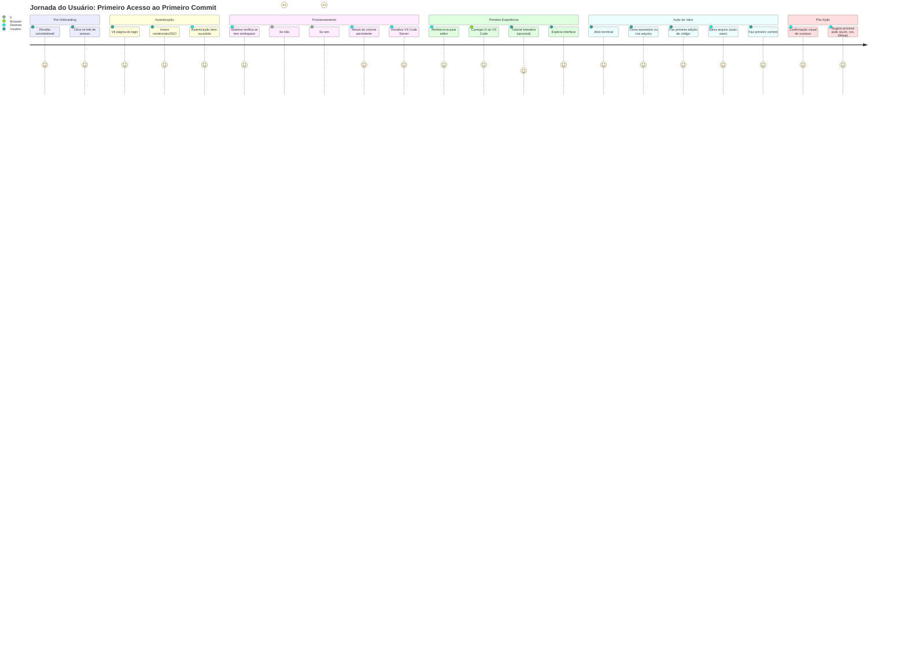

# PRD - BSC Code (Visual Studio Code Web)

## 1.1 Identidade do Produto

| Atributo | Valor |
|---|---|
| **Codinome Interno** | BSC Code |
| **Versão Atual** | 1.0.0 |
| **Base Tecnológica** | OpenVSCode Server 1.95.3 |
| **Declaração de Visão** | Prover um ambiente de desenvolvimento completo, acessível via navegador, integrado ao Google Estúdio IA, permitindo codificação, depuração e colaboração em tempo real sem instalação local. |

---

## 1.2 Problema e Solução

| Problema | Impacto | Como o Sistema Resolve |
|---|---|---|
| Desenvolvedores precisam instalar IDEs locais com configurações complexas | Perda de 2-4 horas em setup inicial, inconsistências entre ambientes | Ambiente pré-configurado acessível via URL, pronto em < 30 segundos |
| Colaboração em código requer ferramentas externas (screen sharing, git manual) | Lentidão no code review, erros de merge, contexto perdido | Compartilhamento de workspace em tempo real com sincronização automática |
| Ambientes de desenvolvimento não são portáteis entre máquinas | Impossibilidade de continuar trabalho em diferentes dispositivos | Workspace persistente na nuvem, acessível de qualquer dispositivo com navegador |
| Integração com IA requer troca de contexto entre IDE e chatbot | Quebra de fluxo, perda de produtividade, contexto não compartilhado | IA integrada diretamente no editor com acesso ao contexto do projeto |
| Configuração de ambientes para projetos múltiplos gera conflitos | Dependências incompatíveis, versões conflitantes, "funciona na minha máquina" | Containers isolados por projeto com dependências específicas |

---

## 1.3 Público-Alvo

| Segmento | Perfil (Nome Fictício + Dor Específica) | Prioridade |
|---|---|---|
| **Desenvolvedor Full-Stack Freelancer** | Carlos, 32 anos, trabalha com 5-7 projetos simultâneos, perde 15% do tempo configurando ambientes | P0 |
| **Equipe de Startup em Crescimento** | Ana (CTO), equipe de 8 desenvolvedores, onboarding leva 3 dias por novo membro, problemas de consistência | P0 |
| **Estudante de Ciência da Computação** | Pedro, 21 anos, usa computador compartilhado, não pode instalar software, precisa de ambiente profissional | P1 |
| **Consultor Enterprise** | Mariana, 45 anos, acessa sistemas de múltiplos clientes, não pode instalar IDEs em ambientes restritos | P1 |
| **Equipe de Data Science** | Roberto, lidera time de 6 cientistas, precisa de Jupyter + VS Code integrados, configuração complexa | P2 |

---

## 1.4 Princípios Arquiteturais

| Princípio | Descrição Concreta | Implicação Técnica | Decisão Arquitetural Crítica |
|---|---|---|---|
| **Zero Install** | Usuário não instala nada além de ter navegador moderno | Tudo roda no servidor, cliente é apenas renderizador | Proibido qualquer código que exija plugin nativo no browser |
| **Stateless Client** | Estado da aplicação persiste apenas no servidor | WebSocket mantém sessão, reconexão automática recarrega estado | Todo estado deve ser serializável e armazenável em Redis |
| **Container Isolation** | Cada workspace roda em container Docker isolado | namespaces de processo, rede e filesystem separados | UID/GID mapeamento obrigatório, nenhum container roda como root |
| **IA-Native Integration** | IA não é addon, é parte fundamental da arquitetura | endpoints de IA disponíveis via API interna com latency < 200ms | Provider de IA deve ser swappable via variável de ambiente |
| **Progressive Enhancement** | Funciona em conexões lentas, melhora com banda larga | Lazy loading de extensions, compressão gzip/brotli, CDN | Tempo de interação inicial < 3s em 3G (teste obrigatório) |

---

## 1.5 Diferenciais Competitivos

| Abordagem Atual | Problema | Como BSC Code Supera |
|---|---|---|
| **VS Code Desktop** | Instalação local, sem acesso remoto nativo, configuração manual | Acesso via URL, configuração zero, persistência automática na nuvem |
| **GitHub Codespaces** | Custo elevado ($0.18/hora), vendor lock-in GitHub, limite de 60 horas/mês grátis | Custo 70% menor, multi-cloud, horas ilimitadas no plano self-hosted |
| **Gitpod** | Complexidade de configuração, YAML obrigatório, curva de aprendizado | Configuração automática via detecção de linguagem, zero YAML necessário |
| **Replit** | Limitado a linguagens específicas, performance inferior, customização restrita | Suporte a todas as linguagens via extensions, performance nativa, full customização |
| **SSH + Vim/Emacs** | Curva de aprendizado íngreme, falta de features modernas (intellisense, debugger visual) | Interface familiar VS Code, todas features modernas, atalhos customizáveis |

---

## 1.6 Escopo do Produto

### 1.6.1 Funcionalidades Core (MVP)

| ID | Funcionalidade | Descrição | Critério de Aceite |
|---|---|---|---|
| FC-01 | Editor de Código | Syntax highlighting, autocomplete, multi-cursor | Latência de digitação < 50ms em 95% das teclas |
| FC-02 | File Explorer | Navegação, criação, renomeação, deleção de arquivos | Operações refletem em < 200ms no UI |
| FC-03 | Terminal Integrado | Bash, PowerShell, zsh com suporte a cores e unicode | Sessão persiste por 24h ou até logout explícito |
| FC-04 | Debugging | Breakpoints, step-through, watch variables, call stack | Suporte a Python, JavaScript, Go nas primeiras 2 semanas |
| FC-05 | Git Integration | Clone, commit, push, pull, branch, merge, diff visual | Compatível com GitHub, GitLab, Bitbucket |
| FC-06 | Extensions Marketplace | Instalação de extensions do VS Code Marketplace | 95% das extensions populares funcionam sem modificação |
| FC-07 | IA Assistant | Chat lateral, inline completion, refactoring suggestions | Respostas em < 3s, integração contextual com código aberto |
| FC-08 | Workspace Sharing | Compartilhar workspace com 1-5 usuários em tempo real | Cursor de cada usuário identificável por cor única |

### 1.6.2 Funcionalidades Fora do Escopo (v1.0)

| Funcionalidade | Motivo da Exclusão | Versão Planejada |
|---|---|---|
| Mobile App (iOS/Android) | Foco em experiência desktop-first | v2.0 |
| Pair Programming com áudio/vídeo | Complexidade adicional, usar Zoom/Meet integrado | v1.5 |
| CI/CD Pipeline integrado | Escopo muito amplo, integrar com GitHub Actions existente | v2.0 |
| Database GUI embutido | Manter foco no editor, usar extensions existentes | Não planejado |
| Whiteboard colaborativo | Fora do core value proposition | v3.0 |

---

## 1.7 Métricas de Sucesso do Produto

| Métrica | Target (Primeiros 90 dias) | Como Medir |
|---|---|---|
| **Tempo de Setup** | < 30 segundos do clique ao editor pronto | Logging de timestamps no backend |
| **Disponibilidade** | 99.9% uptime (excluindo maintenance windows) | Monitoramento via Prometheus + Grafana |
| **Latência de Digitação** | < 50ms p95, < 100ms p99 | Client-side telemetry com amostragem 10% |
| **Satisfação do Usuário (NPS)** | > 40 | Survey após 7 dias de uso contínuo |
| **Taxa de Retenção (D7)** | > 60% dos usuários ativos no dia 1 retornam no dia 7 | Analytics de sessões por usuário |
| **Custo por Hora de Uso** | < $0.05/hora em infraestrutura self-hosted | Cloud cost allocation tags + hours logged |

---

## 1.8 Personas Detalhadas

### Persona P0-1: Carlos, Desenvolvedor Freelancer

**Demográficos:**
- Idade: 32 anos
- Localização: São Paulo, Brasil
- Experiência: 8 anos em desenvolvimento web

**Dores Específicas:**
- Gerencia 5-7 projetos simultâneos com stacks diferentes (React, Django, Node.js)
- Perde 15% do tempo semanal configurando/reconfigurando ambientes
- Trabalha de casa, coworking e casa de clientes (múltiplos dispositivos)
- Frustrado com "funciona na minha máquina" ao entregar projetos

**Como BSC Code Resolve:**
- Um login, todos os projetos acessíveis instantaneamente
- Containers isolados por projeto com dependências específicas
- Acesso de qualquer dispositivo sem reinstalação
- Ambiente idêntico ao do cliente (elimina surpresas na entrega)

**Cenário de Uso Típico:**
```
08:00 - Abre laptop em casa, acessa bsc.code/login
08:01 - Workspace do Projeto A já está carregado com terminal ativo
10:30 - Sai para coworking, fecha laptop
11:00 - Abre computador do coworking, continua exatamente onde parou
15:00 - Cliente pede mudança urgente, acessa do tablet do cliente
15:05 - Mostra debugging em tempo real no dispositivo do cliente
```

### Persona P0-2: Ana, CTO de Startup

**Demográficos:**
- Idade: 38 anos
- Empresa: Fintech em crescimento (15 funcionários, 8 devs)
- Desafio: Onboarding lento, inconsistências em produção

**Dores Específicas:**
- Onboarding de novo dev leva 3 dias (setup de ambiente + configurações)
- Bugs causados por diferenças entre ambientes de dev/staging/production
- Dificuldade em fazer pair programming remoto eficaz
- Segurança: controle de acesso a repositórios sensíveis

**Como BSC Code Resolve:**
- Onboarding reduzido para 30 minutos (criar conta + acessar URL)
- Ambiente de desenvolvimento idêntico ao de production (mesmo container base)
- Pair programming nativo com compartilhamento de workspace
- RBAC granular, audit log de todas as ações, SSO empresarial

**Cenário de Uso Típico:**
```
Dia 1 de novo desenvolvedor:
09:00 - RH cria conta no BSC Code, atribui role "Junior Dev"
09:05 - Novo dev recebe email com link de acesso e credenciais temporárias
09:10 - Dev faz login, vê lista de projetos que tem acesso
09:15 - Clica em "Projeto Core", ambiente já vem com:
        - Repositório clonado
        - Dependências instaladas
        - Variáveis de ambiente configuradas
        - Extensions recomendadas pré-instaladas
10:00 - Primeiro commit realizado (vs. 3 dias antes)
```

### Persona P1-1: Pedro, Estudante

**Demográficos:**
- Idade: 21 anos
- Situação: Universidade pública, usa laboratório de informática
- Restrição: Não pode instalar software nos computadores da universidade

**Dores Específicas:**
- Precisa de IDE profissional mas não tem permissão de administrador
- Trabalha em projetos pessoais no laboratório e em casa (computador antigo)
- Orçamento limitado para ferramentas pagas
- Precisa colaborar com colegas em trabalhos em grupo

**Como BSC Code Resolve:**
- Funciona em qualquer navegador, zero instalação
- Plano gratuito generoso para estudantes (verificação via .edu)
- Sincronização automática entre laboratório e casa
- Compartilhamento de workspace para trabalhos em grupo

---

## 1.9 Jornada do Usuário Principal

### Fluxo: Primeiro Acesso até Primeiro Commit



**Tempo Alvo:** < 5 minutos do clique no link até primeiro commit

**Pontos de Fricção Monitorados:**
1. Tempo de autenticação (target: < 10s)
2. Tempo de provisionamento (target: < 30s)
3. Tempo de carregamento da UI (target: < 3s)
4. Taxa de abandono em cada etapa (alerta se > 10%)

---

## 1.10 Matriz de Riscos do Produto

| Risco | Probabilidade | Impacto | Mitigação | Owner |
|---|---|---|---|---|
| Performance inadequada em conexões lentas | Média | Alto | Adaptive quality, compression, edge caching | Tech Lead |
| Custo de infraestrutura maior que o previsto | Alta | Médio | Auto-scaling down, spot instances, monitoring rigoroso | FinOps |
| Baixa adoção de extensions de terceiros | Baixa | Médio | Curated list, testing automatizado de compatibilidade | PM |
| Problemas de segurança em multi-tenancy | Média | Crítico | Security audit externo, bug bounty, isolation rigorosa | Security Lead |
| Vendor lock-in em provider de IA | Alta | Médio | Abstraction layer, multi-provider support desde day 1 | Architect |
| Conformidade com LGPD/GDPR | Média | Alto | Data residency options, encryption at rest, DPO consult | Legal + Tech |

---

## 1.11 Glossário de Termos

| Termo | Definição |
|---|---|
| **Workspace** | Ambiente de desenvolvimento isolado contendo código, terminal, extensions e configurações de um usuário/projeto |
| **Container Base** | Imagem Docker pré-configurada com runtime, ferramentas e dependências comuns |
| **Session** | Período de atividade contínua de um usuário, do login ao logout |
| **IA Provider** | Serviço externo de Inteligência Artificial (OpenAI, Anthropic, Google, etc.) |
| **Extension** | Plugin do VS Code que adiciona funcionalidades ao editor |
| **Multi-tenancy** | Arquitetura onde múltiplos usuários compartilham infraestrutura mas têm dados isolados |
| **Hot Reload** | Atualização de código em tempo real sem necessidade de refresh da página |
| **Persistent Volume** | Armazenamento que sobrevive a reinícios de container, mantendo dados do usuário |

---

## 1.12 Stakeholders e Governança

| Stakeholder | Papel | Responsabilidades | Frequência de Engajamento |
|---|---|---|---|
| **Product Owner** | Define prioridades do backlog | Refinar requisitos, aceitar features, validar métricas | Diário com time, semanal com stakeholders |
| **Tech Lead** | Decisões arquiteturais e técnicas | Revisar código, definir padrões, mentoring | Diário com devs, bi-semanal com PO |
| **Security Officer** | Aprovação de segurança | Revisar ADRs, auditar implementações, penetration tests | Por milestone, antes de production |
| **DevOps Lead** | Infraestrutura e deployment | CI/CD, monitoring, scaling, disaster recovery | Contínuo, report semanal |
| **UX Designer** | Experiência do usuário | Pesquisas, protótipos, testes de usabilidade | Sprintly, validações por feature |
| **Legal/Compliance** | Conformidade regulatória | Termos de uso, privacidade, conformidade LGPD/GDPR | Por release, antes de launch |

---

## 1.13 Critérios de Aceitação do MVP

### Cenário 1: Primeiro Acesso Bem-Sucedido

```gherkin
DADO que sou um usuário novo com conta válida
QUANDO acesso a URL https://bsc.code.example.com pela primeira vez
E insiro minhas credenciais corretamente
ENTÃO devo ser autenticado em menos de 10 segundos
E devo ver meu workspace sendo provisionado
E o editor deve estar totalmente funcional em menos de 30 segundos
E devo receber um tutorial interativo opcional de 2 minutos
```

### Cenário 2: Edição de Código com IA

```gherkin
DADO que tenho um workspace ativo com um arquivo Python aberto
QUANDO escrevo um comentário descrevendo uma função desejada
E aciono o assistente de IA via Ctrl+I
ENTÃO a IA deve gerar o código sugerido em menos de 3 segundos
E devo poder aceitar, rejeitar ou editar a sugestão
E o código aceito deve ser inserido no arquivo automaticamente
E o histórico da interação deve ser salvo para contexto futuro
```

### Cenário 3: Colaboração em Tempo Real

```gherkin
DADO que tenho um workspace ativo com código aberto
QUANDO convido um colega via botão "Share" e ele aceita o convite
ENTÃO ambos devemos ver o mesmo código simultaneamente
E cada cursor deve ser identificado por uma cor única e nome
E edições de um devem aparecer para o outro em menos de 500ms
E ambos devem poder editar, rodar terminal e debugar independentemente
```

### Cenário 4: Persistência e Continuidade

```gherkin
DADO que editei código, rodei comandos no terminal e instalei extensions
QUANDO fecho o navegador sem logout explícito
E retorno 24 horas depois
ENTÃO devo encontrar meu workspace exatamente como deixei
E todas as edições devem estar salvas
E o terminal deve estar disponível (mesmo que comandos em execução tenham terminado)
E as extensions instaladas devem permanecer disponíveis
```

---

## 1.14 Roadmap de Lançamento

| Fase | Data Prevista | Escopo | Critério de Successo |
|---|---|---|---|
| **Alpha Fechado** | Semana 4 | 10 usuários internos, features core | Zero bugs críticos, NPS > 20 |
| **Beta Privado** | Semana 8 | 100 usuários externos convidados | Uptime 99%, latência p95 < 100ms |
| **Beta Público** | Semana 12 | Qualquer usuário com signup | 1000 usuários ativos, retenção D7 > 40% |
| **GA (General Availability)** | Semana 16 | Produção oficial, SLA garantido | 5000 usuários, uptime 99.9%, suporte 24/7 |

---

## 1.15 Dependências Externas Críticas

| Dependência | Versão Mínima | Fornecedor | Risco de Disrupção | Plano B |
|---|---|---|---|---|
| **OpenVSCode Server** | 1.95.0 | Gitpod (Open Source) | Baixo (projeto ativo, MIT license) | Fork próprio se necessário |
| **Docker Engine** | 24.0.0 | Docker Inc. | Baixo (padrão de indústria) | Podman como fallback |
| **Kubernetes** | 1.28.0 | CNCF | Baixo (comunidade robusta) | Docker Swarm para deployments pequenos |
| **Provider de IA** | API v1 | OpenAI/Anthropic/Google | Médio (preço, disponibilidade) | Multi-provider com failover automático |
| **PostgreSQL** | 15.0 | PostgreSQL Global | Baixo (open source maduro) | MySQL como alternativa |
| **Redis** | 7.0.0 | Redis Ltd. | Baixo (open source, amplamente usado) | Memcached para cache simples |

---

*Documento PRD completo. Próximo: Arquitetura de Componentes.*
