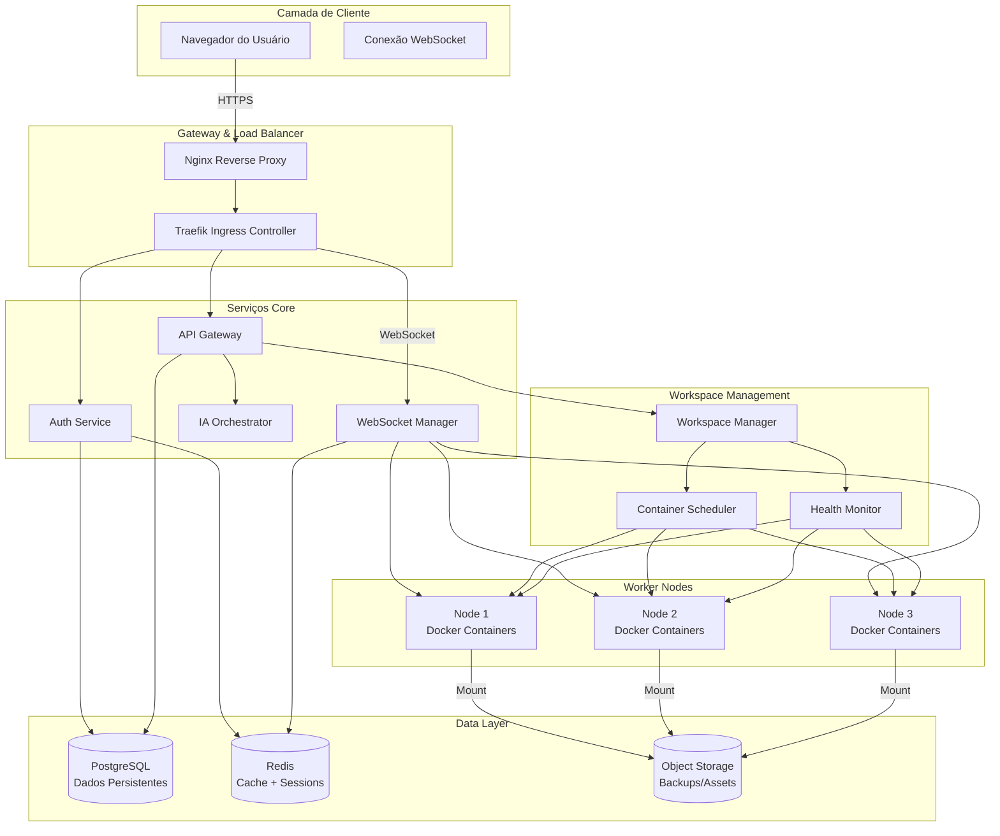
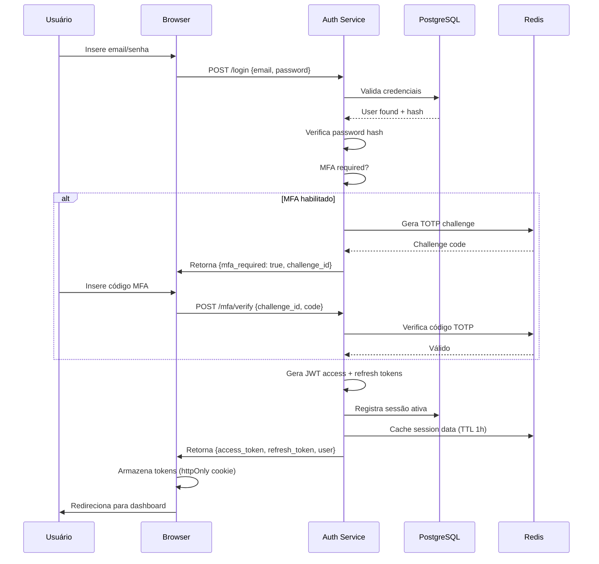
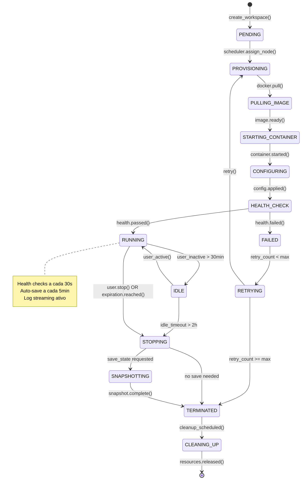
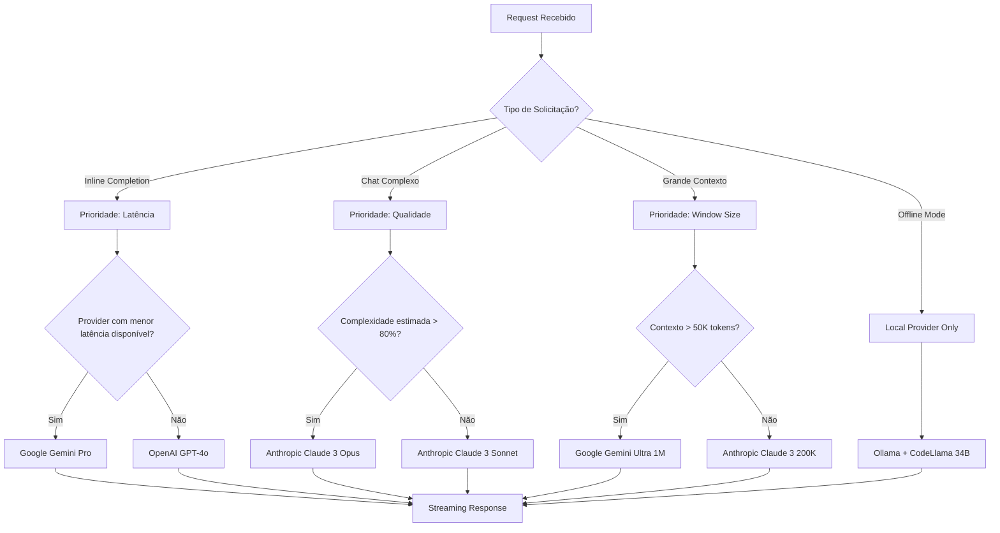
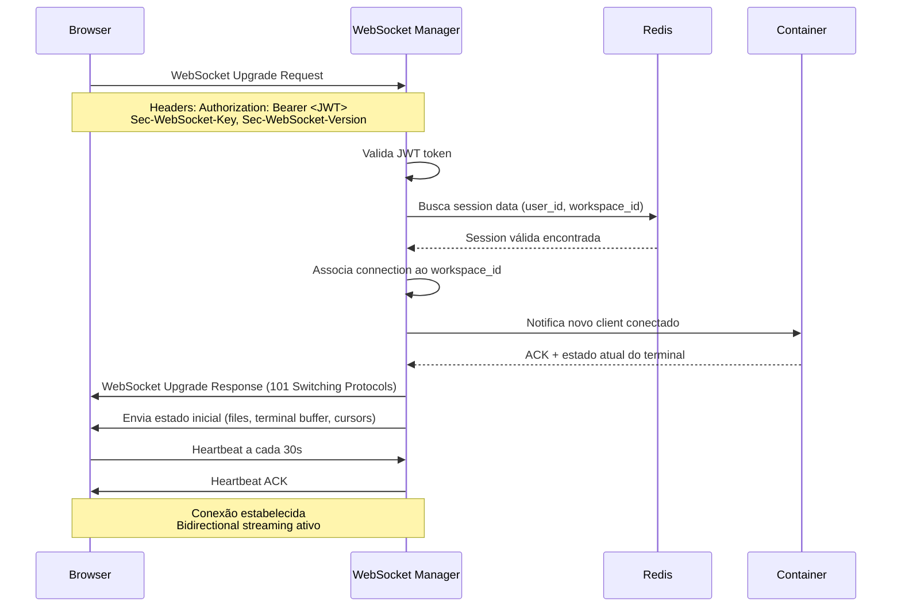
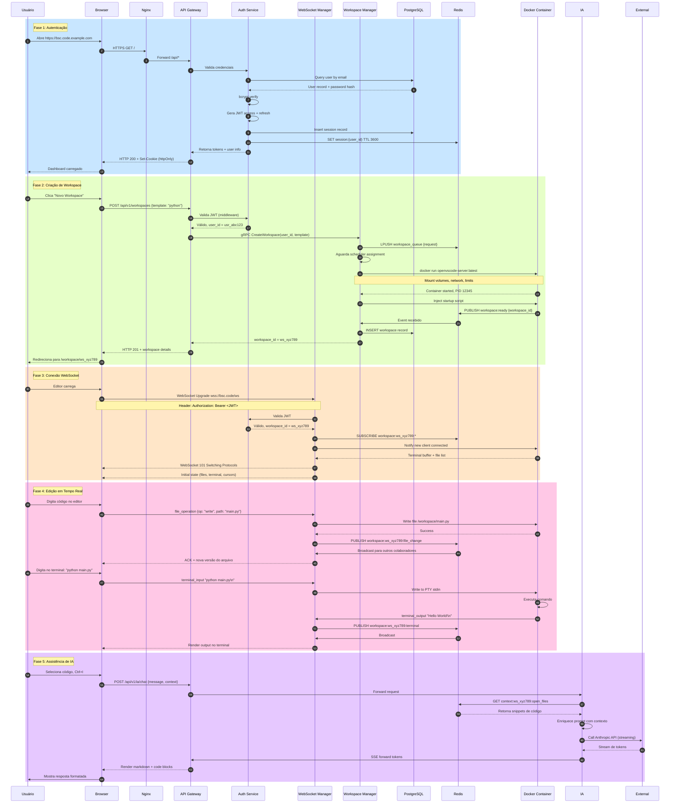

# Arquitetura de Componentes - BSC Code

## 2.1 Visão Geral da Arquitetura



---

## 2.2 Componente: API Gateway

### Ficha Técnica

| Atributo | Valor |
|---|---|
| **ID Interno** | COMP-001 |
| **Classe Base** | HTTP REST API (FastAPI) |
| **Dependências** | Auth Service, Workspace Manager, PostgreSQL, Redis |
| **Modo de Operação** | Assíncrono, stateless |
| **Permissões** | Leitura/escrita em banco, leitura em Redis, execução em workspace manager |
| **Porta** | 8000 |
| **Protocolo** | HTTPS/REST + OpenAPI 3.0 |

### Responsabilidade

Receber requisições HTTP dos clientes, validar autenticação via JWT, rotear para serviços apropriados, orquestrar operações complexas envolvendo múltiplos componentes, produzir respostas JSON padronizadas.

### Inputs Detalhados

| Input | Tipo | Descrição | Origem |
|---|---|---|---|
| `Authorization` | Header HTTP | Token JWT no formato `Bearer <token>` | Browser Client |
| `RequestBody` | JSON | Payload da requisição conforme schema específico | Browser Client |
| `QueryParams` | String | Parâmetros de filtro, paginação, ordenação | Browser Client |
| `PathParams` | String | Identificadores de recursos (workspace_id, user_id) | Browser Client |

### Output

Exemplo de resposta de sucesso:

```json
{
  "success": true,
  "data": {
    "workspace_id": "ws_7f8a9b2c3d4e5f6g",
    "status": "running",
    "url": "https://bsc.code.example.com/workspace/ws_7f8a9b2c3d4e5f6g",
    "created_at": "2025-01-15T10:30:00Z",
    "resources": {
      "cpu_limit": "2.0",
      "memory_limit": "4Gi",
      "storage_limit": "20Gi"
    }
  },
  "meta": {
    "request_id": "req_abc123def456",
    "timestamp": "2025-01-15T10:30:05Z",
    "latency_ms": 245
  }
}
```

Exemplo de resposta de erro:

```json
{
  "success": false,
  "error": {
    "code": "WORKSPACE_LIMIT_EXCEEDED",
    "message": "Usuário atingiu limite de 3 workspaces simultâneos",
    "details": {
      "current_count": 3,
      "max_allowed": 3,
      "action_required": "Encerre um workspace existente ou solicite upgrade"
    }
  },
  "meta": {
    "request_id": "req_xyz789ghi012",
    "timestamp": "2025-01-15T10:31:00Z"
  }
}
```

### Endpoints Principais

| Método | Endpoint | Descrição | Auth Required | Rate Limit |
|---|---|---|---|---|
| POST | `/api/v1/auth/login` | Autenticação inicial | Não | 10/min |
| POST | `/api/v1/auth/refresh` | Refresh de token JWT | Sim (refresh token) | 30/min |
| GET | `/api/v1/workspaces` | Lista workspaces do usuário | Sim | 60/min |
| POST | `/api/v1/workspaces` | Cria novo workspace | Sim | 5/min |
| GET | `/api/v1/workspaces/{id}` | Detalhes de um workspace | Sim | 60/min |
| DELETE | `/api/v1/workspaces/{id}` | Remove workspace | Sim | 10/min |
| POST | `/api/v1/workspaces/{id}/share` | Compartilha workspace | Sim | 20/min |
| GET | `/api/v1/ia/providers` | Lista providers de IA disponíveis | Sim | 30/min |
| POST | `/api/v1/ia/chat` | Envia mensagem para IA | Sim | 30/min |
| GET | `/api/v1/users/me` | Perfil do usuário autenticado | Sim | 60/min |
| PUT | `/api/v1/users/me` | Atualiza perfil do usuário | Sim | 10/min |

### Budget de Recursos

| Componente | Alocação | % do Total |
|---|---|---|
| CPU | 2 cores | 15% |
| Memória RAM | 2 GiB | 10% |
| Network I/O | 1 Gbps | 20% |
| Database Connections | 20 conexões máx | 25% |

---

## 2.3 Componente: Auth Service

### Ficha Técnica

| Atributo | Valor |
|---|---|
| **ID Interno** | COMP-002 |
| **Classe Base** | OAuth2 + JWT Provider |
| **Dependências** | PostgreSQL, Redis, SMTP Server |
| **Modo de Operação** | Síncrono para auth, assíncrono para email |
| **Permissões** | Escrita em users table, leitura/escrita em sessions, envio de email |
| **Porta** | 8001 |
| **Protocolo** | gRPC interno + HTTPS externo |

### Responsabilidade

Gerenciar ciclo de vida completo de autenticação e autorização: registro de usuários, login, refresh de tokens, logout, recuperação de senha, MFA, RBAC, auditoria de acessos.

### Inputs Detalhados

| Input | Tipo | Descrição | Origem |
|---|---|---|---|
| `credentials` | JSON | `{email, password}` ou `{provider, oauth_token}` | API Gateway / Browser |
| `refresh_token` | String | Token de refresh válido | API Gateway |
| `user_id` | UUID | Identificador do usuário para operações admin | Admin Panel |
| `mfa_code` | String | Código de 6 dígitos para MFA | Browser |

### Output

Token JWT estruturado:

```json
{
  "header": {
    "alg": "RS256",
    "typ": "JWT"
  },
  "payload": {
    "sub": "usr_a1b2c3d4e5f6",
    "email": "usuario@exemplo.com",
    "roles": ["developer", "workspace_owner"],
    "permissions": ["workspace:create", "workspace:delete", "ia:use"],
    "iat": 1705312200,
    "exp": 1705315800,
    "iss": "bsc-code-auth",
    "aud": "bsc-code-api"
  },
  "signature": "<assinatura RSA>"
}
```

### Configuração de Segurança

```yaml
# auth_config.yaml
jwt:
  access_token_ttl: 3600  # 1 hora
  refresh_token_ttl: 604800  # 7 dias
  algorithm: RS256
  private_key_path: /secrets/jwt_private.pem
  public_key_path: /secrets/jwt_public.pem

password_policy:
  min_length: 12
  require_uppercase: true
  require_lowercase: true
  require_numbers: true
  require_special_chars: true
  max_age_days: 90

mfa:
  enabled: true
  methods: ["totp", "sms", "email"]
  backup_codes_count: 10

session:
  max_concurrent_sessions: 5
  idle_timeout_minutes: 30
  absolute_timeout_hours: 12

rate_limiting:
  login_attempts_per_minute: 5
  password_reset_per_hour: 3
  mfa_failures_before_lockout: 5
  lockout_duration_minutes: 30
```

### Fluxo de Autenticação



### Budget de Recursos

| Componente | Alocação | % do Total |
|---|---|---|
| CPU | 1 core | 7% |
| Memória RAM | 1 GiB | 5% |
| Database Connections | 10 conexões máx | 12% |

---

## 2.4 Componente: Workspace Manager

### Ficha Técnica

| Atributo | Valor |
|---|---|
| **ID Interno** | COMP-003 |
| **Classe Base** | Container Orchestrator |
| **Dependências** | Docker Engine, Redis, S3, Scheduler |
| **Modo de Operação** | Assíncrono, stateful (tracking de estado) |
| **Permissões** | Execução Docker, mount volumes, network management |
| **Porta** | 8002 (gRPC interno) |
| **Protocolo** | gRPC + eventos via Redis Pub/Sub |

### Responsabilidade

Gerenciar ciclo de vida completo de workspaces: criação de containers, mount de volumes persistentes, configuração de rede, health checking, scaling, cleanup de recursos órfãos.

### Inputs Detalhados

| Input | Tipo | Descrição | Origem |
|---|---|---|---|
| `create_workspace_request` | gRPC | `{user_id, template, resources, extensions}` | API Gateway |
| `stop_workspace_request` | gRPC | `{workspace_id, save_state}` | API Gateway |
| `health_check_event` | Redis Pub/Sub | `{workspace_id, status, metrics}` | Health Monitor |
| `resource_alert` | Redis Pub/Sub | `{workspace_id, resource_type, threshold_exceeded}` | Monitor |

### Output

Evento de workspace criado:

```json
{
  "event_type": "workspace.created",
  "workspace_id": "ws_7f8a9b2c3d4e5f6g",
  "user_id": "usr_a1b2c3d4e5f6",
  "container_id": "cnt_x9y8z7w6v5u4",
  "network": {
    "internal_ip": "10.0.5.42",
    "external_url": "https://bsc.code.example.com/workspace/ws_7f8a9b2c3d4e5f6g",
    "ports_exposed": [8080, 8443]
  },
  "resources": {
    "cpu_limit": "2.0",
    "memory_limit": "4Gi",
    "storage_mount": "/data/workspaces/usr_a1b2c3d4e5f6/ws_7f8a9b2c3d4e5f6g"
  },
  "state": "running",
  "created_at": "2025-01-15T10:30:00Z",
  "expires_at": "2025-01-15T22:30:00Z"
}
```

### Máquina de Estados do Workspace



### Tabela de Transições de Estado

| Estado Atual | Evento | Estado Novo | Condição | Ação |
|---|---|---|---|---|
| PENDING | scheduler.assign_node() | PROVISIONING | Node disponível | Alocar IP, reservar recursos |
| PROVISIONING | docker.pull() | PULLING_IMAGE | Image não existe local | Pull da imagem do registry |
| PULLING_IMAGE | image.ready() | STARTING_CONTAINER | Download completo | Criar container com config |
| STARTING_CONTAINER | container.started() | CONFIGURING | Container PID ativo | Inject secrets, mount volumes |
| CONFIGURING | config.applied() | HEALTH_CHECK | Configuração aplicada | Iniciar health check loop |
| HEALTH_CHECK | health.passed() | RUNNING | Todos checks OK | Notificar usuário, liberar acesso |
| HEALTH_CHECK | health.failed() | FAILED | Check falhou | Incrementar retry counter |
| FAILED | retry_count < max | RETRYING | retries < 3 | Agendar nova tentativa |
| FAILED | retry_count >= max | TERMINATED | retries esgotados | Notificar erro, liberar recursos |
| RUNNING | user_inactive > 30min | IDLE | Sem atividade detectada | Reduzir alocação de CPU |
| IDLE | user_active() | RUNNING | Atividade detectada | Restaurar alocação full |
| IDLE | idle_timeout > 2h | STOPPING | Timeout absoluto | Iniciar shutdown graceful |
| RUNNING | user.stop() | STOPPING | Request explícito | Salvar estado se solicitado |
| RUNNING | expiration.reached() | STOPPING | Workspace expirou | Forçar shutdown |
| STOPPING | save_state requested | SNAPSHOTTING | User tem persistência | Criar snapshot no S3 |
| STOPPING | no save needed | TERMINATED | Stateless workspace | Remover container imediatamente |
| SNAPSHOTTING | snapshot.complete() | TERMINATED | Upload S3 confirmado | Remover container, manter volume |
| TERMINATED | cleanup_scheduled() | CLEANING_UP | Delay de 24h | Agendar remoção de volumes |
| CLEANING_UP | resources.released() | [*] | Tudo removido | Registro audit, fim do ciclo |

### Budget de Recursos

| Componente | Alocação | % do Total |
|---|---|---|
| CPU | 4 cores | 30% |
| Memória RAM | 8 GiB | 40% |
| Network I/O | 5 Gbps | 50% |
| Disk I/O | 500 MB/s | 60% |

---

## 2.5 Componente: IA Orchestrator

### Ficha Técnica

| Atributo | Valor |
|---|---|
| **ID Interno** | COMP-004 |
| **Classe Base** | Multi-Provider AI Router |
| **Dependências** | Redis (context cache), External AI APIs, PostgreSQL (usage logs) |
| **Modo de Operação** | Assíncrono, streaming responses |
| **Permissões** | Chamadas externas a APIs de IA, leitura de contexto do workspace |
| **Porta** | 8003 |
| **Protocolo** | gRPC interno + Server-Sent Events (SSE) para streaming |

### Responsabilidade

Receber solicitações de assistência de IA, enriquecer com contexto do código aberto, rotear para provider ótimo (custo/latência/qualidade), streamar resposta para cliente, registrar usage para billing e analytics.

### Inputs Detalhados

| Input | Tipo | Descrição | Origem |
|---|---|---|---|
| `chat_request` | gRPC | `{message, conversation_id, context_snippets, language}` | API Gateway |
| `inline_completion_request` | gRPC | `{file_content, cursor_position, language, recent_edits}` | VS Code Extension |
| `stream_chunk` | SSE | `{token, finish_reason, metadata}` | IA Provider |
| `feedback_event` | Redis Pub/Sub | `{response_id, thumbs_up/down, correction}` | Browser Client |

### Output

Resposta de chat completa:

```json
{
  "response_id": "resp_m1n2o3p4q5r6",
  "conversation_id": "conv_s7t8u9v0w1x2",
  "choices": [
    {
      "index": 0,
      "message": {
        "role": "assistant",
        "content": "Aqui está uma implementação otimizada usando async/await:\n\n```python\nasync def fetch_data(url):\n    async with aiohttp.ClientSession() as session:\n        async with session.get(url) as response:\n            return await response.json()\n```",
        "function_call": null
      },
      "finish_reason": "stop"
    }
  ],
  "usage": {
    "prompt_tokens": 145,
    "completion_tokens": 87,
    "total_tokens": 232
  },
  "metadata": {
    "provider": "anthropic",
    "model": "claude-3-sonnet",
    "latency_ms": 1847,
    "cost_usd": 0.000412,
    "context_used": {
      "open_files": 3,
      "total_lines": 342,
      "language_detected": "python"
    }
  }
}
```

### System Prompt Base

```
Você é o BSC Code Assistant, um assistente de programação integrado ao ambiente BSC Code.

REGRAS INVIOLÁVEIS:

1. CONTEXTO: Você tem acesso ao código que o usuário está editando. Use esse contexto
   para dar respostas específicas e relevantes. Nunca ignore o contexto fornecido.

2. SEGURANÇA: Nunca gere código que:
   - Execute comandos shell arbitrários sem validação
   - Acesse credenciais ou secrets hardcoded
   - Ignore tratamentos de erro ou validações de input
   - Contorne medidas de segurança do sistema

3. QUALIDADE: Todo código gerado deve:
   - Seguir convenções da linguagem detectada
   - Incluir comentários explicativos para lógica complexa
   - Ter tratamento de erro apropriado
   - Ser testável (evitar acoplamento excessivo)

4. CONCISÃO: Seja direto. Evite preâmbulos longos. Vá direto à solução.
   Se a explicação for necessária, seja claro e use exemplos.

5. FORMATO: Use markdown para formatação. Código sempre em code blocks
   com syntax highlighting especificado.

6. LIMITES: Se uma solicitação exigir mais de 500 tokens de resposta,
   ofereça-se para continuar em partes.

7. HONESTIDADE: Se não souber algo, admita. Não invente APIs, funções
   ou comportamentos que não existem.

8. ATUALIZAÇÃO: Se o usuário corrigir seu código, aprenda com o feedback
   e ajuste respostas futuras no mesmo contexto.

PLACEHOLDERS DINÂMICOS:
- {{USER_LANGUAGE_PREF}}: Preferência de idioma do usuário (pt-BR, en, etc.)
- {{PROJECT_NAME}}: Nome do projeto atual
- {{OPEN_FILES}}: Lista de arquivos abertos no momento
- {{RECENT_ERRORS}}: Últimos erros de compilation/execution detectados
```

### Providers Suportados

| Provider | Modelos Disponíveis | Caso de Uso Ideal | Custo/1K tokens | Latência Média |
|---|---|---|---|---|
| **Anthropic** | Claude 3 Sonnet, Claude 3 Opus | Code generation complexo, refactoring | $0.003 - $0.015 | 1.5 - 3s |
| **OpenAI** | GPT-4 Turbo, GPT-4o | Chat geral, debugging, explicações | $0.01 - $0.03 | 1 - 2s |
| **Google** | Gemini Pro, Gemini Ultra | Análise de grandes contextos | $0.0005 - $0.007 | 0.8 - 2s |
| **Local (Ollama)** | Llama 3, CodeLlama | Desenvolvimento offline, privacidade | $0 (self-hosted) | 2 - 5s |

### Estratégia de Roteamento



### Budget de Recursos

| Componente | Alocação | % do Total |
|---|---|---|
| CPU | 2 cores | 15% |
| Memória RAM | 4 GiB | 20% |
| Network I/O | 2 Gbps (external API calls) | 40% |
| Cache Redis | 512 MiB | 5% |

---

## 2.6 Componente: WebSocket Manager

### Ficha Técnica

| Atributo | Valor |
|---|---|
| **ID Interno** | COMP-005 |
| **Classe Base** | WebSocket Server + Pub/Sub Client |
| **Dependências** | Redis Pub/Sub, Workspace Containers |
| **Modo de Operação** | Assíncrono, bidirecional, stateful per connection |
| **Permissões** | Forward de mensagens para containers, broadcast em channels |
| **Porta** | 8443 (WSS) |
| **Protocolo** | WebSocket (RFC 6455) + Binary frames para eficiência |

### Responsabilidade

Manter conexões WebSocket persistentes entre browser e workspace, forward de eventos de terminal, file system changes, collaborative cursors, heartbeat para detecção de conexões mortas.

### Inputs Detalhados

| Input | Tipo | Descrição | Origem |
|---|---|---|---|
| `terminal_input` | WebSocket Binary | Dados digitados no terminal do browser | Browser |
| `file_operation` | WebSocket JSON | `{op: "write", path: "/app/main.py", content: "..."}` | Browser |
| `cursor_update` | WebSocket JSON | `{user_id, position: {line, col}, color}` | Browser |
| `container_output` | Redis Pub/Sub | `{workspace_id, stream: "stdout/stderr", data}` | Workspace Container |
| `heartbeat` | WebSocket Ping | Frame de keepalive | Browser / Server |

### Output

Evento de output de terminal:

```json
{
  "type": "terminal.output",
  "workspace_id": "ws_7f8a9b2c3d4e5f6g",
  "stream": "stdout",
  "data": "SGVsbG8gV29ybGQhCg==",
  "timestamp": "2025-01-15T10:35:42Z"
}
```

Evento de colaboração:

```json
{
  "type": "collaboration.cursor_update",
  "workspace_id": "ws_7f8a9b2c3d4e5f6g",
  "users": [
    {
      "user_id": "usr_a1b2c3d4e5f6",
      "name": "Carlos",
      "color": "#FF6B6B",
      "position": {"line": 42, "column": 15},
      "selection": {"start": {"line": 40, "col": 0}, "end": {"line": 45, "col": 80}}
    },
    {
      "user_id": "usr_g7h8i9j0k1l2",
      "name": "Ana",
      "color": "#4ECDC4",
      "position": {"line": 10, "column": 5},
      "selection": null
    }
  ]
}
```

### Protocolo de Handshake



### Tratamento de Reconexão

| Cenário | Estratégia | Backoff | Max Tentativas |
|---|---|---|---|
| Queda de rede momentânea (< 5s) | Reconexão imediata | Nenhum | Ilimitado |
| Queda prolongada (5s - 2min) | Exponential backoff | 1s, 2s, 4s, 8s, 16s, 32s | 10 tentativas |
| Queda estendida (> 2min) | Full re-handshake | 30s fixo | 5 tentativas |
| Token expirado | Redirect para login | N/A | 1 tentativa |
| Workspace terminado | Notificação + redirect home | N/A | N/A |

### Budget de Recursos

| Componente | Alocação | % do Total |
|---|---|---|
| CPU | 2 cores | 15% |
| Memória RAM | 2 GiB | 10% |
| Network I/O | 3 Gbps | 60% |
| File Descriptors | 10,000 conexões simultâneas | 100% do OS limit |

---

## 2.7 Diagrama de Comunicação Completo



---

## 2.8 Matriz de Dependências entre Componentes

| Componente | Depende de | Tipo de Dependência | Criticalidade | Fallback |
|---|---|---|---|---|
| API Gateway | Auth Service | Síncrona (middleware) | Crítica | Reject requests |
| API Gateway | Workspace Manager | Síncrona (gRPC) | Crítica | Queue + retry |
| API Gateway | PostgreSQL | Síncrona (queries) | Crítica | Read replicas |
| Auth Service | PostgreSQL | Síncrona (CRUD) | Crítica | Connection pool |
| Auth Service | Redis | Síncrona (cache) | Alta | Fallback to DB |
| Workspace Manager | Docker Engine | Síncrona (syscalls) | Crítica | Retry + alert |
| Workspace Manager | Redis | Assíncrona (events) | Alta | Buffer em memória |
| IA Orchestrator | External AI APIs | Assíncrona (HTTP) | Média | Multi-provider failover |
| IA Orchestrator | Redis | Síncrona (context cache) | Média | Rebuild from workspace |
| WebSocket Manager | Redis Pub/Sub | Assíncrona (events) | Crítica | Reconectar + replay |
| WebSocket Manager | Workspace Container | Bidirecional (streams) | Crítica | Buffer + reconnect |

---

*Documento de Arquitetura de Componentes completo. Próximo: Especificação de Infraestrutura.*
