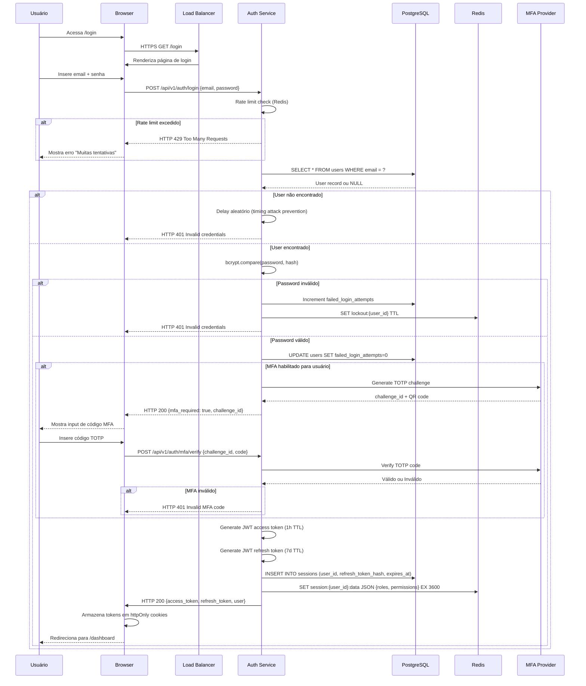
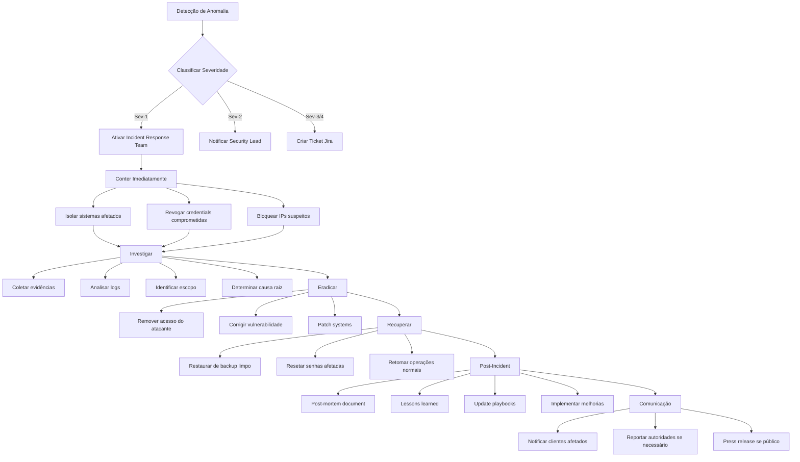

# Segurança - BSC Code

## 7.1 Política de Segurança Geral

### Princípios Fundamentais

| Princípio | Implementação Concreta | Verificação |
|---|---|---|
| **Defesa em Profundidade** | Múltiplas camadas de segurança (rede, aplicação, dados) | Penetration test trimestral |
| **Menor Privilégio** | Containers rodam como non-root, RBAC granular | Audit automático de permissões |
| **Zero Trust** | Nenhuma confiança implícita, verificação contínua | Logs de todas as autenticações |
| **Segurança por Padrão** | Configurações seguras out-of-the-box | Checklist de hardening pré-deploy |
| **Privacy by Design** | Dados criptografados em repouso e trânsito | Revisão de privacidade por feature |

---

## 7.2 Autenticação e Autorização

### Fluxo Completo de Autenticação



### Sistema de Roles e Permissões (RBAC)

#### Roles Predefinidas

| Role | Descrição | Permissões |
|---|---|---|
| `super_admin` | Acesso total ao sistema | Todas as permissões (*) |
| `org_admin` | Admin de organização | Gerenciar usuários da org, billing, settings |
| `team_lead` | Líder de equipe | Criar/deletar workspaces da equipe, revisar código |
| `developer` | Desenvolvedor padrão | Criar workspaces próprios, usar IA, git ops |
| `viewer` | Apenas leitura | Ver workspaces compartilhados, sem edição |
| `service_account` | Integrações automatizadas | Permissões escopadas específicas |

#### Matriz de Permissões

| Permissão | super_admin | org_admin | team_lead | developer | viewer |
|---|:---:|:---:|:---:|:---:|:---:|
| `workspace:create` | ✅ | ✅ | ✅ | ✅ | ❌ |
| `workspace:delete:own` | ✅ | ✅ | ✅ | ✅ | ❌ |
| `workspace:delete:any` | ✅ | ✅ | ✅ | ❌ | ❌ |
| `workspace:share` | ✅ | ✅ | ✅ | ✅ | ❌ |
| `workspace:view:shared` | ✅ | ✅ | ✅ | ✅ | ✅ |
| `terminal:execute` | ✅ | ✅ | ✅ | ✅ | ❌ |
| `git:push` | ✅ | ✅ | ✅ | ✅ | ❌ |
| `git:force_push` | ✅ | ✅ | ❌ | ❌ | ❌ |
| `ia:use` | ✅ | ✅ | ✅ | ✅ | ❌ |
| `ia:admin` | ✅ | ❌ | ❌ | ❌ | ❌ |
| `billing:view` | ✅ | ✅ | ❌ | ❌ | ❌ |
| `billing:update` | ✅ | ✅ | ❌ | ❌ | ❌ |
| `users:invite` | ✅ | ✅ | ✅ | ❌ | ❌ |
| `users:remove` | ✅ | ✅ | ✅ | ❌ | ❌ |
| `audit_logs:view` | ✅ | ✅ | ❌ | ❌ | ❌ |
| `system:config` | ✅ | ❌ | ❌ | ❌ | ❌ |

### Implementação de Middleware de Autorização

```python
# middleware/auth.py
from fastapi import Request, HTTPException, status
from fastapi.security import HTTPBearer, HTTPAuthorizationCredentials
import jwt
from redis import asyncio as aioredis

security = HTTPBearer(auto_error=False)

async def get_current_user(
    request: Request,
    credentials: HTTPAuthorizationCredentials = Depends(security)
) -> dict:
    """
    Extrai e valida token JWT, retorna contexto do usuário.
    Levanta HTTPException se autenticação falhar.
    """
    if not credentials:
        raise HTTPException(
            status_code=status.HTTP_401_UNAUTHORIZED,
            detail="Authentication required",
            headers={"WWW-Authenticate": "Bearer"},
        )
    
    token = credentials.credentials
    
    try:
        # Valida assinatura e expiração
        payload = jwt.decode(
            token,
            public_key,
            algorithms=["RS256"],
            audience="bsc-code-api",
            issuer="bsc-code-auth"
        )
        
        user_id = payload["sub"]
        
        # Verifica se token não está na blacklist (logout)
        redis = await get_redis()
        blacklisted = await redis.get(f"token_blacklist:{token}")
        if blacklisted:
            raise HTTPException(
                status_code=status.HTTP_401_UNAUTHORIZED,
                detail="Token has been revoked"
            )
        
        # Busca permissions cache
        permissions_data = await redis.get(f"session:{user_id}:permissions")
        if not permissions_data:
            # Recupera do banco e cached
            permissions_data = await fetch_permissions_from_db(user_id)
            await redis.setex(
                f"session:{user_id}:permissions",
                3600,
                json.dumps(permissions_data)
            )
        
        return {
            "user_id": user_id,
            "email": payload["email"],
            "roles": payload["roles"],
            "permissions": json.loads(permissions_data),
            "token_payload": payload
        }
        
    except jwt.ExpiredSignatureError:
        raise HTTPException(
            status_code=status.HTTP_401_UNAUTHORIZED,
            detail="Token has expired"
        )
    except jwt.InvalidTokenError:
        raise HTTPException(
            status_code=status.HTTP_401_UNAUTHORIZED,
            detail="Invalid token"
        )


def require_permission(required_permission: str):
    """
    Decorator para exigir permissão específica em endpoints.
    """
    async def permission_checker(request: Request, current_user: dict = Depends(get_current_user)):
        user_permissions = current_user["permissions"]
        
        # Super admin tem todas as permissões
        if "super_admin" in current_user["roles"]:
            return current_user
        
        if required_permission not in user_permissions:
            raise HTTPException(
                status_code=status.HTTP_403_FORBIDDEN,
                detail=f"Permission denied: {required_permission}"
            )
        
        return current_user
    
    return permission_checker


# Uso em endpoints:
# @app.post("/api/v1/workspaces")
# @require_permission("workspace:create")
# async def create_workspace(..., current_user: dict = Depends(require_permission("workspace:create"))):
```

---

## 7.3 Proteções de Segurança

### Ameaças e Mitigações

| Ameaça | Impacto | Mitigação Implementada | Verificação |
|---|---|---|---|
| **SQL Injection** | Crítico | Prepared statements obrigatórios, ORM com parameter binding | SAST no CI, DAST trimestral |
| **XSS (Cross-Site Scripting)** | Alto | CSP strict, escape automático de outputs, httpOnly cookies | ZAP scan semanal |
| **CSRF (Cross-Site Request Forgery)** | Alto | SameSite cookies, CSRF tokens em forms, verificar Origin header | Testes automatizados |
| **Brute Force Login** | Médio | Rate limiting (5 tentativas/min), account lockout progressivo, CAPTCHA após 3 falhas | Monitoramento de alertas |
| **Session Hijacking** | Crítico | Tokens JWT curtos (1h), refresh tokens rotativos, fingerprinting de dispositivo | Audit logs |
| **Privilege Escalation** | Crítico | RBAC enforced em todos endpoints, validação de ownership | Code review obrigatório, testes de integração |
| **Data Leakage** | Alto | Encryption at rest (AES-256), TLS 1.3 em trânsito, data masking em logs | Pentest externo anual |
| **DDoS** | Alto | Cloudflare WAF, rate limiting global, auto-scaling, circuit breakers | Simulação trimestral |
| **Container Escape** | Crítico | AppArmor profiles, seccomp-bpf, read-only root filesystem, non-root user | CIS Docker benchmark |
| **Supply Chain Attack** | Alto | Imagens Docker assinadas, SBOM gerado, dependências escaneadas | Snyk/Dependabot diário |

### Configuração de Security Headers

```yaml
# config/security_headers.yaml
headers:
  # Prevenir clickjacking
  X-Frame-Options: "DENY"
  
  # Prevenir MIME sniffing
  X-Content-Type-Options: "nosniff"
  
  # Referrer policy
  Referrer-Policy: "strict-origin-when-cross-origin"
  
  # Content Security Policy
  Content-Security-Policy: >
    default-src 'self';
    script-src 'self' 'wasm-unsafe-eval';
    style-src 'self' 'unsafe-inline';
    connect-src 'self' wss: https://api.openai.com https://api.anthropic.com;
    img-src 'self' data: blob: https:;
    font-src 'self' data:;
    frame-ancestors 'none';
    base-uri 'self';
    form-action 'self'
  
  # Permissions Policy (antigo Feature-Policy)
  Permissions-Policy: >
    camera=(),
    microphone=(),
    geolocation=(),
    payment=(),
    usb=(),
    accelerometer=(),
    gyroscope=()
  
  # Cross-Origin policies
  Cross-Origin-Opener-Policy: "same-origin"
  Cross-Origin-Embedder-Policy: "require-corp"
  Cross-Origin-Resource-Policy: "same-site"
  
  # HSTS (HTTP Strict Transport Security)
  Strict-Transport-Security: "max-age=31536000; includeSubDomains; preload"
```

---

## 7.4 Sandbox e Isolamento de Workspaces

### Regras de Isolamento

| O que é Permitido | O que é Bloqueado | Como é Implementado |
|---|---|---|
| Executar comandos dentro do container | Acessar host Docker socket | Volume `/var/run/docker.sock` não montado |
| Acessar internet via proxy corporativo | Conexões diretas a IPs privados | Network policies, egress filtering |
| Ler/escrever arquivos do workspace | Acessar volumes de outros containers | UID/GID isolation, mount namespaces |
| Usar portas 8080+ dentro do container | Expor portas privilegiadas (<1024) | Capabilities drop: NET_BIND_SERVICE |
| Variáveis de ambiente injetadas | Secrets hardcoded em imagens | Secrets via Docker secrets / Vault |
| CPU/memory até limits definidos | Exceder resource quotas | cgroups v2, Kubernetes limits |

### Docker Compose com Hardening

```yaml
# docker-compose.workspace.yml
version: '3.8'

services:
  workspace:
    image: gitpod/openvscode-server:1.95.3
    
    # Security context
    user: "1000:1000"  # Non-root user
    read_only: true  # Root filesystem read-only
    
    # Temporary directories writable
    tmpfs:
      - /tmp:size=1G,mode=1777
      - /home/coder/.cache:size=512M
    
    # Drop all capabilities and add only needed
    cap_drop:
      - ALL
    cap_add:
      - CHOWN
      - SETUID
      - SETGID
      - NET_BIND_SERVICE
    
    # Seccomp profile restritivo
    security_opt:
      - seccomp:./seccomp-profile.json
      - apparmor:./apparmor-profile
    
    # Resource limits
    deploy:
      resources:
        limits:
          cpus: '2.0'
          memory: 4G
        reservations:
          cpus: '0.5'
          memory: 1G
    
    # Network isolation
    networks:
      - workspace_network
    
    # No privileged mode
    privileged: false
    
    # Disable inter-container communication
    network_mode: "bridge"
    
    # Mount apenas volumes necessários
    volumes:
      - workspace_data:/home/coder/project:rw
      - ./extensions:/home/coder/.vscode-server/extensions:ro
      - type: tmpfs
        target: /home/coder/.vscode-server/data
        tmpfs:
          size: 512000000  # 512MB
    
    # Environment from secrets only
    env_file:
      - .env.workspace
    environment:
      - TZ=America/Sao_Paulo
    
    # Health check
    healthcheck:
      test: ["CMD", "curl", "-f", "http://localhost:8080/health"]
      interval: 30s
      timeout: 10s
      retries: 3
      start_period: 40s

networks:
  workspace_network:
    driver: bridge
    ipam:
      config:
        - subnet: 10.0.{workspace_id}.0/24

volumes:
  workspace_data:
    driver: local
    driver_opts:
      type: none
      o: bind
      device: /mnt/efs/workspaces/{user_id}/{workspace_id}
```

### Seccomp Profile

```json
{
  "defaultAction": "SCMP_ACT_ERRNO",
  "architectures": [
    "SCMP_ARCH_X86_64",
    "SCMP_ARCH_AARCH64"
  ],
  "syscalls": [
    {
      "name": "accept",
      "action": "SCMP_ACT_ALLOW"
    },
    {
      "name": "bind",
      "action": "SCMP_ACT_ALLOW"
    },
    {
      "name": "connect",
      "action": "SCMP_ACT_ALLOW"
    },
    {
      "name": "getsockname",
      "action": "SCMP_ACT_ALLOW"
    },
    {
      "name": "listen",
      "action": "SCMP_ACT_ALLOW"
    },
    {
      "name": "recvfrom",
      "action": "SCMP_ACT_ALLOW"
    },
    {
      "name": "sendto",
      "action": "SCMP_ACT_ALLOW"
    },
    {
      "name": "socket",
      "action": "SCMP_ACT_ALLOW"
    },
    {
      "name": "read",
      "action": "SCMP_ACT_ALLOW"
    },
    {
      "name": "write",
      "action": "SCMP_ACT_ALLOW"
    },
    {
      "name": "open",
      "action": "SCMP_ACT_ALLOW"
    },
    {
      "name": "close",
      "action": "SCMP_ACT_ALLOW"
    },
    {
      "name": "stat",
      "action": "SCMP_ACT_ALLOW"
    },
    {
      "name": "fstat",
      "action": "SCMP_ACT_ALLOW"
    },
    {
      "name": "lstat",
      "action": "SCMP_ACT_ALLOW"
    },
    {
      "name": "poll",
      "action": "SCMP_ACT_ALLOW"
    },
    {
      "name": "mmap",
      "action": "SCMP_ACT_ALLOW"
    },
    {
      "name": "mprotect",
      "action": "SCMP_ACT_ALLOW"
    },
    {
      "name": "munmap",
      "action": "SCMP_ACT_ALLOW"
    },
    {
      "name": "brk",
      "action": "SCMP_ACT_ALLOW"
    },
    {
      "name": "rt_sigaction",
      "action": "SCMP_ACT_ALLOW"
    },
    {
      "name": "rt_sigprocmask",
      "action": "SCMP_ACT_ALLOW"
    },
    {
      "name": "access",
      "action": "SCMP_ACT_ALLOW"
    },
    {
      "name": "pipe",
      "action": "SCMP_ACT_ALLOW"
    },
    {
      "name": "select",
      "action": "SCMP_ACT_ALLOW"
    },
    {
      "name": "sched_yield",
      "action": "SCMP_ACT_ALLOW"
    },
    {
      "name": "clone",
      "action": "SCMP_ACT_ALLOW",
      "args": [
        {
          "index": 0,
          "value": 2080505856,
          "op": "SCMP_CMP_MASKED_EQ"
        }
      ]
    },
    {
      "name": "execve",
      "action": "SCMP_ACT_ALLOW"
    },
    {
      "name": "exit",
      "action": "SCMP_ACT_ALLOW"
    },
    {
      "name": "wait4",
      "action": "SCMP_ACT_ALLOW"
    },
    {
      "name": "kill",
      "action": "SCMP_ACT_ALLOW"
    },
    {
      "name": "uname",
      "action": "SCMP_ACT_ALLOW"
    },
    {
      "name": "fcntl",
      "action": "SCMP_ACT_ALLOW"
    },
    {
      "name": "dup",
      "action": "SCMP_ACT_ALLOW"
    },
    {
      "name": "dup2",
      "action": "SCMP_ACT_ALLOW"
    },
    {
      "name": "getpid",
      "action": "SCMP_ACT_ALLOW"
    },
    {
      "name": "getppid",
      "action": "SCMP_ACT_ALLOW"
    },
    {
      "name": "getuid",
      "action": "SCMP_ACT_ALLOW"
    },
    {
      "name": "getgid",
      "action": "SCMP_ACT_ALLOW"
    },
    {
      "name": "geteuid",
      "action": "SCMP_ACT_ALLOW"
    },
    {
      "name": "getegid",
      "action": "SCMP_ACT_ALLOW"
    },
    {
      "name": "getcwd",
      "action": "SCMP_ACT_ALLOW"
    },
    {
      "name": "chdir",
      "action": "SCMP_ACT_ALLOW"
    },
    {
      "name": "rename",
      "action": "SCMP_ACT_ALLOW"
    },
    {
      "name": "mkdir",
      "action": "SCMP_ACT_ALLOW"
    },
    {
      "name": "rmdir",
      "action": "SCMP_ACT_ALLOW"
    },
    {
      "name": "unlink",
      "action": "SCMP_ACT_ALLOW"
    },
    {
      "name": "readlink",
      "action": "SCMP_ACT_ALLOW"
    },
    {
      "name": "gettimeofday",
      "action": "SCMP_ACT_ALLOW"
    },
    {
      "name": "getrlimit",
      "action": "SCMP_ACT_ALLOW"
    },
    {
      "name": "sysinfo",
      "action": "SCMP_ACT_ALLOW"
    },
    {
      "name": "times",
      "action": "SCMP_ACT_ALLOW"
    },
    {
      "name": "getrandom",
      "action": "SCMP_ACT_ALLOW"
    },
    {
      "name": "prctl",
      "action": "SCMP_ACT_ALLOW",
      "args": [
        {
          "index": 0,
          "value": 1,
          "op": "SCMP_CMP_EQ"
        }
      ]
    },
    {
      "name": "nanosleep",
      "action": "SCMP_ACT_ALLOW"
    },
    {
      "name": "set_robust_list",
      "action": "SCMP_ACT_ALLOW"
    },
    {
      "name": "get_robust_list",
      "action": "SCMP_ACT_ALLOW"
    },
    {
      "name": "futex",
      "action": "SCMP_ACT_ALLOW"
    },
    {
      "name": "epoll_create",
      "action": "SCMP_ACT_ALLOW"
    },
    {
      "name": "epoll_create1",
      "action": "SCMP_ACT_ALLOW"
    },
    {
      "name": "epoll_ctl",
      "action": "SCMP_ACT_ALLOW"
    },
    {
      "name": "epoll_wait",
      "action": "SCMP_ACT_ALLOW"
    },
    {
      "name": "epoll_pwait",
      "action": "SCMP_ACT_ALLOW"
    },
    {
      "name": "rt_sigreturn",
      "action": "SCMP_ACT_ALLOW"
    }
  ]
}
```

---

## 7.5 Tratamento de Dados Sensíveis

### Classificação de Dados

| Categoria | Exemplos | Nível de Proteção | Retenção Máxima |
|---|---|---|---|
| **Crítico** | Senhas, chaves API, tokens, private keys | Criptografia AES-256, acesso restrito, logging proibido | Nunca persistir em claro |
| **Confidencial** | Email, nome, workspace code do usuário | Criptografia em repouso, acesso autenticado | Enquanto conta ativa + 90 dias |
| **Interno** | Logs de sistema, métricas de performance | Acesso interno apenas, anonymização | 12 meses |
| **Público** | README de projetos open source | Sem restrições | Indefinida |

### Máscara de Dados em Logs

```python
# utils/logging.py
import re
from typing import Any, Dict

SENSITIVE_PATTERNS = {
    'password': re.compile(r'(?i)(password|passwd|pwd)["\']?\s*[:=]\s*["\']?([^"\',\s]+)'),
    'api_key': re.compile(r'(?i)(api[_-]?key|apikey)["\']?\s*[:=]\s*["\']?([^"\',\s]+)'),
    'token': re.compile(r'(?i)(token|auth_token|access_token)["\']?\s*[:=]\s*["\']?([^"\',\s]+)'),
    'secret': re.compile(r'(?i)(secret|secret_key)["\']?\s*[:=]\s*["\']?([^"\',\s]+)'),
    'credit_card': re.compile(r'\b(?:\d{4}[- ]?){3}\d{4}\b'),
    'cpf': re.compile(r'\b\d{3}\.\d{3}\.\d{3}-\d{2}\b'),
    'email': re.compile(r'\b[A-Za-z0-9._%+-]+@[A-Za-z0-9.-]+\.[A-Z|a-z]{2,}\b'),
}

REDACTED_VALUE = "[REDACTED]"

def redact_sensitive_data(data: Any, max_depth: int = 5) -> Any:
    """
    Recursively redacts sensitive data from logs.
    """
    if max_depth <= 0:
        return "<max depth reached>"
    
    if isinstance(data, dict):
        return {
            key: redact_sensitive_data(value, max_depth - 1) 
            if not is_sensitive_key(key) 
            else REDACTED_VALUE
            for key, value in data.items()
        }
    elif isinstance(data, (list, tuple)):
        return type(data)(redact_sensitive_data(item, max_depth - 1) for item in data)
    elif isinstance(data, str):
        return redact_string(data)
    else:
        return data

def is_sensitive_key(key: str) -> bool:
    """Check if key name suggests sensitive data."""
    sensitive_keywords = ['password', 'secret', 'token', 'key', 'credential', 'auth']
    return any(keyword in key.lower() for keyword in sensitive_keywords)

def redact_string(text: str) -> str:
    """Redact sensitive patterns from string."""
    for pattern in SENSITIVE_PATTERNS.values():
        text = pattern.sub(lambda m: f"{m.group(1)}={REDACTED_VALUE}", text)
    return text

# Uso no logger:
import logging
import json

class RedactingFormatter(logging.Formatter):
    def format(self, record):
        # Redact message
        if isinstance(record.msg, dict):
            record.msg = redact_sensitive_data(record.msg)
        elif isinstance(record.msg, str):
            record.msg = redact_string(record.msg)
        
        # Redact args
        if record.args:
            record.args = redact_sensitive_data(record.args)
        
        return super().format(record)

# Configuração:
handler = logging.StreamHandler()
handler.setFormatter(RedactingFormatter(
    '{"timestamp": "%(asctime)s", "level": "%(levelname)s", "message": %(message)s}'
))
logger.addHandler(handler)
```

### Criptografia de Dados em Repouso

```python
# utils/encryption.py
from cryptography.fernet import Fernet
from cryptography.hazmat.primitives import hashes
from cryptography.hazmat.primitives.kdf.pbkdf2 import PBKDF2HMAC
import base64
import os

class DataEncryption:
    def __init__(self, master_key: bytes):
        """
        Initialize with master key (should come from Vault or env var).
        """
        self.master_key = master_key
    
    def _derive_key(self, salt: bytes) -> bytes:
        """Derive encryption key from master key using PBKDF2."""
        kdf = PBKDF2HMAC(
            algorithm=hashes.SHA256(),
            length=32,
            salt=salt,
            iterations=100000,
        )
        return base64.urlsafe_b64encode(kdf.derive(self.master_key))
    
    def encrypt(self, plaintext: str) -> str:
        """Encrypt plaintext string."""
        salt = os.urandom(16)
        derived_key = self._derive_key(salt)
        f = Fernet(derived_key)
        
        encrypted = f.encrypt(plaintext.encode())
        
        # Return salt + encrypted data, base64 encoded
        return base64.b64encode(salt + encrypted).decode()
    
    def decrypt(self, ciphertext: str) -> str:
        """Decrypt ciphertext string."""
        data = base64.b64decode(ciphertext)
        salt = data[:16]
        encrypted = data[16:]
        
        derived_key = self._derive_key(salt)
        f = Fernet(derived_key)
        
        return f.decrypt(encrypted).decode()

# Uso para dados sensíveis no banco:
from sqlalchemy import Column, String, TypeDecorator

class EncryptedString(TypeDecorator):
    impl = String
    cache_ok = True
    
    def __init__(self, encryption_service: DataEncryption, length: int):
        super().__init__(length)
        self.encryption_service = encryption_service
    
    def process_bind_param(self, value, dialect):
        if value is None:
            return None
        return self.encryption_service.encrypt(value)
    
    def process_result_value(self, value, dialect):
        if value is None:
            return None
        return self.encryption_service.decrypt(value)

# Model example:
class User(BaseModel):
    __tablename__ = "users"
    
    id = Column(UUID, primary_key=True)
    email = Column(EncryptedString(encryption_service, 255))  # Email criptografado
    api_key = Column(EncryptedString(encryption_service, 255))  # API key criptografada
```

---

## 7.6 Auditoria e Compliance

### Eventos Auditáveis

| Categoria | Eventos | Retenção |
|---|---|---|
| **Autenticação** | Login success/failure, logout, MFA enable/disable, password change | 2 anos |
| **Autorização** | Permission grant/revoke, role changes, access denied events | 2 anos |
| **Workspace** | Create, delete, share, stop, start, snapshot | 1 ano |
| **Dados** | Export requests, bulk delete, PII access | 3 anos |
| **Admin** | Config changes, user management, billing changes | 5 anos |
| **Segurança** | Failed auth attempts, rate limit hits, WAF blocks | 2 anos |

### Schema de Log de Auditoria

```json
{
  "audit_log_entry": {
    "type": "object",
    "required": [
      "event_id",
      "timestamp",
      "event_type",
      "actor",
      "action",
      "resource",
      "outcome"
    ],
    "properties": {
      "event_id": {
        "type": "string",
        "format": "uuid",
        "description": "Unique identifier for this event"
      },
      "timestamp": {
        "type": "string",
        "format": "date-time",
        "description": "ISO 8601 timestamp of event"
      },
      "event_type": {
        "type": "string",
        "enum": ["auth", "authorization", "workspace", "data", "admin", "security"]
      },
      "actor": {
        "type": "object",
        "required": ["id", "type"],
        "properties": {
          "id": {"type": "string"},
          "type": {"type": "string", "enum": ["user", "service_account", "system"]},
          "email": {"type": "string"},
          "ip_address": {"type": "string"},
          "user_agent": {"type": "string"}
        }
      },
      "action": {
        "type": "string",
        "description": "What action was performed"
      },
      "resource": {
        "type": "object",
        "properties": {
          "type": {"type": "string"},
          "id": {"type": "string"},
          "name": {"type": "string"}
        }
      },
      "outcome": {
        "type": "string",
        "enum": ["success", "failure", "denied"]
      },
      "reason": {
        "type": "string",
        "description": "Reason for failure/denial if applicable"
      },
      "metadata": {
        "type": "object",
        "description": "Additional context-specific data"
      }
    }
  }
}
```

### Exemplo de Entry de Audit Log

```json
{
  "event_id": "aud_7f8a9b2c-3d4e-5f6g-7h8i-9j0k1l2m3n4o",
  "timestamp": "2025-01-15T14:32:18.456Z",
  "event_type": "workspace",
  "actor": {
    "id": "usr_a1b2c3d4e5f6",
    "type": "user",
    "email": "carlos@exemplo.com",
    "ip_address": "203.0.113.42",
    "user_agent": "Mozilla/5.0 (Windows NT 10.0; Win64; x64) AppleWebKit/537.36"
  },
  "action": "workspace.share",
  "resource": {
    "type": "workspace",
    "id": "ws_xyz789abc123",
    "name": "projeto-fintech"
  },
  "outcome": "success",
  "metadata": {
    "shared_with": [
      {
        "user_id": "usr_g7h8i9j0k1l2",
        "email": "ana@exemplo.com",
        "permission": "editor"
      }
    ],
    "expiration": "2025-02-15T14:32:18.456Z"
  }
}
```

---

## 7.7 Resposta a Incidentes

### Classificação de Severidade

| Nível | Critérios | Tempo de Resposta | Escalação |
|---|---|---|---|
| **Sev-1 (Crítico)** | Data breach ativo, downtime total, comprometimento de credentials | < 15 minutos | CEO, CTO, Legal imediato |
| **Sev-2 (Alto)** | Vulnerabilidade explorável, degradação severa, acesso não autorizado | < 1 hora | CTO, Security Lead |
| **Sev-3 (Médio)** | Bug de segurança não crítico, tentativa de ataque bloqueada | < 4 horas | Security Lead |
| **Sev-4 (Baixo)** | Finding de scan, best practice violation | < 24 horas | Engineering Lead |

### Playbook: Suspeita de Data Breach



---

*Documento de Segurança completo. Próximo: Requisitos Funcionais e Não-Funcionais.*
