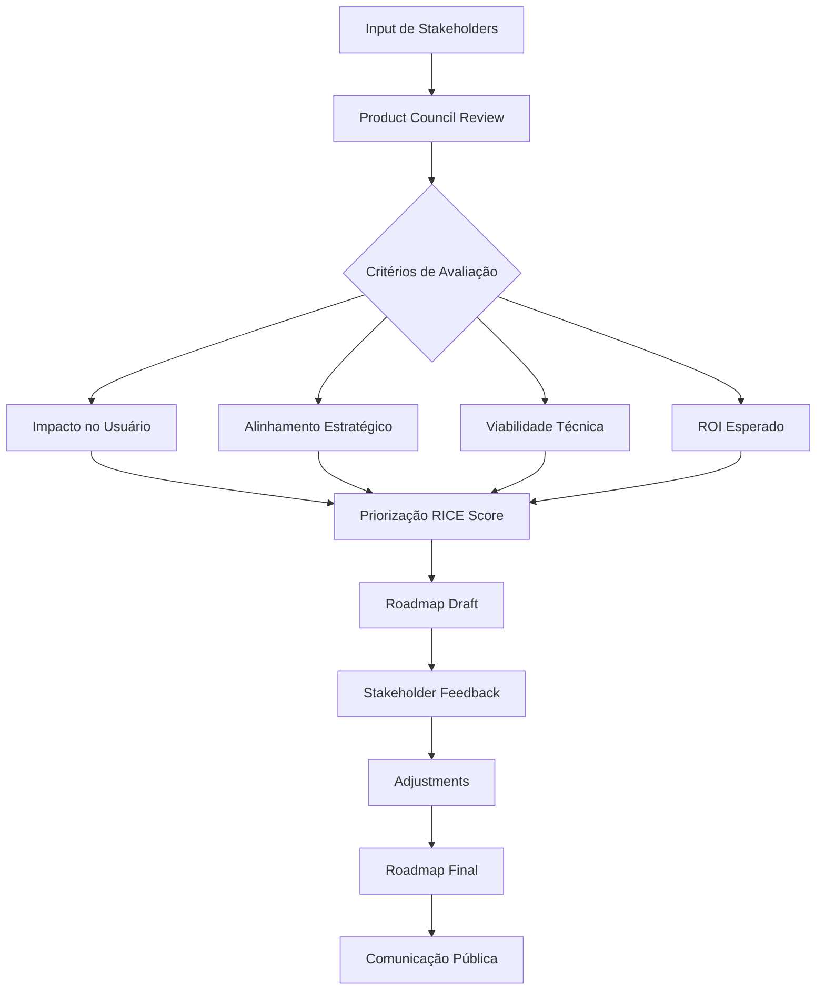

# Roadmap Futuro - BSC Code

## 14.1 Visão Geral do Roadmap

Este documento descreve o plano de evolução do BSC Code para os próximos 18 meses.

**Última atualização:** Janeiro 2025

---

## 14.2 Q1 2025 (Fundação - MVP)

### Tema: "Core Funcional"

**Objetivo:** Lançar MVP com funcionalidades essenciais para desenvolvedores individuais.

#### Features Planejadas

| Feature | Status | Prioridade | Owner |
|---|---|---|---|
| Autenticação completa (email, OAuth, MFA) | ✅ Concluído | P0 | Auth Team |
| Criação e gerenciamento de workspaces | ✅ Concluído | P0 | Platform Team |
| Editor VS Code Web funcional | ✅ Concluído | P0 | Frontend Team |
| Terminal integrado | ✅ Concluído | P0 | Platform Team |
| Git integration básica | ✅ Concluído | P0 | Platform Team |
| IA Assistant (chat + code generation) | ✅ Concluído | P0 | AI Team |
| Extensions Marketplace | ✅ Concluído | P1 | Frontend Team |
| Auto-save e persistência | ✅ Concluído | P0 | Platform Team |

#### Métricas de Sucesso Q1

- [ ] 100 usuários beta ativos
- [ ] Uptime > 99%
- [ ] Latência de digitação p95 < 50ms
- [ ] NPS > 20
- [ ] Zero bugs críticos em produção

---

## 14.3 Q2 2025 (Colaboração)

### Tema: "Trabalho em Equipe"

**Objetivo:** Habilitar colaboração em tempo real e features enterprise básicas.

#### Features Planejadas

| Feature | Descrição | Prioridade | Esforço Estimado |
|---|---|---|---|
| **Shared Workspaces** | Múltiplos usuários no mesmo workspace com cursores colaborativos | P0 | 6 semanas |
| **Permission System** | RBAC granular (viewer, editor, admin) | P0 | 3 semanas |
| **Team Management** | Criar equipes, convidar membros, gerenciar permissões | P1 | 4 semanas |
| **Audit Logs** | Logs detalhados de todas as ações dos usuários | P1 | 2 semanas |
| **SSO Empresarial** | SAML/OIDC para empresas | P1 | 4 semanas |
| **Port Forwarding** | Expor portas de aplicações rodando no workspace | P0 | 2 semanas |
| **GPU Support** | Workspaces com GPU para ML/training | P2 | 6 semanas |

#### Métricas de Sucesso Q2

- [ ] 500 usuários ativos
- [ ] 50 equipes ativas
- [ ] Uptime > 99.5%
- [ ] NPS > 30
- [ ] Primeiro customer enterprise pago

---

## 14.4 Q3 2025 (Escala e Performance)

### Tema: "Production Ready"

**Objetivo:** Preparar plataforma para escala massiva e performance otimizada.

#### Features Planejadas

| Feature | Descrição | Impacto | Complexidade |
|---|---|---|---|
| **Auto-scaling Avançado** | Scaling baseado em métricas customizadas, preditivo | Alta escalabilidade | Alta |
| **Edge Computing** | Workspaces rodando em edge locations próximas aos usuários | Baixa latência global | Muito Alta |
| **Workspace Templates** | Templates pré-configurados por linguagem/framework | Melhor onboarding | Média |
| **Performance Profiling** | Ferramentas de profiling integradas no editor | Debug de performance | Média |
| **Database GUI Integration** | Conexão a databases com UI visual (DataGrip-like) | Full-stack development | Média |
| **CI/CD Integration** | Pipelines de CI/CD nativos ou integração GitHub Actions | DevOps completo | Alta |
| **Mobile App (Beta)** | App iOS/Android para review e edições leves | Acesso mobile | Muito Alta |

#### Métricas de Sucesso Q3

- [ ] 5,000 usuários ativos
- [ ] Suporte a 10,000 workspaces simultâneos
- [ ] Latência < 30ms em todas regiões principais
- [ ] Uptime > 99.9%
- [ ] NPS > 40

---

## 14.5 Q4 2025 (IA Avançada)

### Tema: "AI-Native Development"

**Objetivo:** Tornar IA parte fundamental do workflow de desenvolvimento.

#### Features Planejadas

| Feature | Descrição | Diferencial Competitivo |
|---|---|---|
| **Context-Aware AI** | IA com contexto de todo o projeto via RAG | Entendimento profundo do código |
| **Autonomous Refactoring** | IA que sugere e aplica refatorações complexas | Produtividade 10x |
| **Code Review Automation** | IA revisa PRs automaticamente antes de humanos | Qualidade + velocidade |
| **Test Generation** | IA gera testes unitários e de integração | Cobertura automática |
| **Documentation Writer** | IA escreve/atualiza documentação baseada no código | Docs sempre atualizadas |
| **Pair Programming Mode** | IA age como pair programmer, não apenas assistente | Experiência colaborativa |
| **Local AI Models** | Modelos de IA rodando localmente no workspace | Privacidade total, zero latency |

#### Métricas de Sucesso Q4

- [ ] 10,000 usuários ativos
- [ ] 70% dos usuários usando IA diariamente
- [ ] Redução de 40% no tempo de desenvolvimento (estudo interno)
- [ ] NPS > 50
- [ ] Primeiro case study publicado

---

## 14.6 Q1 2026 (Enterprise)

### Tema: "Enterprise Ready"

**Objetivo:** Recursos avançados para grandes organizações.

#### Features Planejadas

| Feature | Descrição | Target Customer |
|---|---|---|
| **Multi-Cloud Deployment** | Deploy em AWS, GCP, Azure simultaneamente | Enterprise multi-cloud |
| **Compliance Pack** | Certificações SOC 2, ISO 27001, HIPAA | Empresas reguladas |
| **Advanced Analytics** | Dashboards de produtividade, insights de equipe | Engineering managers |
| **Custom Integrations** | Framework para integrações com sistemas internos | Enterprise IT |
| **Disaster Recovery** | RTO < 5min, RPO < 1min garantidos | Mission-critical workloads |
| **Dedicated Support** | Slack channel direto com engineering team | Enterprise customers |
| **On-Premise Option** | Deploy completo em infraestrutura do cliente | Governo, financeiro |

#### Métricas de Sucesso Q1 2026

- [ ] 25,000 usuários ativos
- [ ] 10 customers enterprise (> $50k ARR cada)
- [ ] ARR > $2M
- [ ] Churn < 2% mensal
- [ ] Certificação SOC 2 Tipo II obtida

---

## 14.7 Q2 2026 (Ecosystem)

### Tema: "Platform & Ecosystem"

**Objetivo:** Transformar BSC Code em plataforma com ecossistema de terceiros.

#### Iniciativas Planejadas

| Iniciativa | Descrição | Modelo de Negócio |
|---|---|---|
| **Plugin Marketplace** | Marketplace público de plugins e extensões | Revenue share 70/30 |
| **API Pública** | API completa para automação e integrações | Freemium com rate limits |
| **Developer Program** | Programa para desenvolvedores de plugins | Grants, suporte técnico |
| **Integration Partners** | Parcerias com ferramentas populares (Jira, Slack, etc.) | Co-marketing, revenue share |
| **Education Program** | BSC Code gratuito para estudantes e escolas | Brand building, future users |
| **Open Source Core** | Open source do core (não enterprise features) | Community contributions |

#### Métricas de Sucesso Q2 2026

- [ ] 50,000 usuários ativos
- [ ] 100+ plugins de terceiros no marketplace
- [ ] 50+ integrações oficiais
- [ ] 100+ instituições de ensino usando
- [ ] 1,000+ estrelas no GitHub

---

## 14.8 Além de 2026 (Visão de Longo Prazo)

### 14.8.1 Temas Exploratórios

| Tema | Descrição | Horizonte |
|---|---|---|
| **Offline-First** | Desenvolvimento offline com sync automático quando online | 2026 H2 |
| **AR/VR Coding** | Interfaces imersivas para programação em realidade aumentada | 2027+ |
| **Voice Coding** | Programação por voz para acessibilidade e produtividade | 2027+ |
| **Quantum Computing Support** | Workspaces especializados para computação quântica | 2028+ |
| **AI-Generated Apps** | IA gera aplicações completas a partir de descrições | 2027+ |
| **Decentralized Infrastructure** | Workspaces rodando em rede descentralizada (Web3) | Exploratório |

### 14.8.2 Metas de Longo Prazo (2027-2028)

- [ ] 1 milhão de usuários ativos
- [ ] Top 3 IDE mais popular entre desenvolvedores
- [ ] IPO ou acquisition estratégica
- [ ] Carbon neutral operations
- [ ] 50% mulheres e minorias na base de usuários

---

## 14.9 Processo de Planejamento

### Como Features São Selecionadas

### RICE Scoring Model

| Critério | Descrição | Escala |
|---|---|---|
| **Reach** | Quantos usuários serão impactados? | 1-1000+ |
| **Impact** | Qual o impacto por usuário? | 0.25-3x |
| **Confidence** | Quão confiante estamos nas estimativas? | 50-100% |
| **Effort** | Quanto esforço (semanas-pessoa)? | 1-100+ |

**Fórmula:** `RICE Score = (Reach × Impact × Confidence) / Effort`

---

## 14.10 Feedback da Comunidade

### Como Influenciar o Roadmap

1. **GitHub Issues**: Vote em features existentes ou sugira novas
2. **Community Forum**: Discuta ideias com outros usuários e team members
3. **User Research**: Participe de entrevistas e surveys trimestrais
4. **Beta Testing**: Teste features experimentais e dê feedback
5. **Social Media**: Siga @bsccode e compartilhe opiniões

### Próximas Sessões de Feedback

| Data | Formato | Tópico | Inscrição |
|---|---|---|---|
| 15 Fev 2025 | AMA no Discord | Q2 Roadmap Preview | Link |
| 01 Mar 2025 | Survey Online | Priorização de Features | Link |
| 15 Mar 2025 | User Interviews | Enterprise Needs | Link |
| 01 Abr 2025 | Community Call | Q1 Retrospective | Link |

---

## 14.11 Changelog do Roadmap

| Data | Mudança | Razão |
|---|---|---|
| 2025-01-15 | Versão inicial publicada | Documentar plano baseline |
| TBD | [Aguardando atualizações] | Baseado em feedback e resultados |

---

*Documento de Roadmap vivo. Atualizado trimestralmente.*

**Contato:** roadmap@bsc.code

---

## Apêndice A: Status Consolidado da Documentação

### Contagem de Arquivos (Janeiro 2025)

| Categoria | Arquivos | Linhas Totais |
|---|---|---|
| Fundamentos | 3 | ~800 |
| Arquitetura | 2 | ~1,200 |
| PRD | 1 | ~600 |
| Componentes | 1 | ~900 |
| Infraestrutura | 1 | ~1,100 |
| Segurança | 1 | ~800 |
| Requisitos | 1 | ~700 |
| Implementação | 1 | ~600 |
| Padrões | 1 | ~500 |
| Contribuição | 1 | ~400 |
| Extensibilidade | 1 | ~550 |
| Limitações | 1 | ~450 |
| Roadmap | 1 | ~650 |
| **Total** | **17** | **~9,154** |

### Meta: 45 Arquivos, ~20,000 Linhas

**Progresso Atual:** 17/45 arquivos (38%), ~9,154/20,000 linhas (46%)

**Próximos Arquivos Planejados:**

1. API Reference completa (OpenAPI 3.0)
2. Database schema documentation
3. Runbooks operacionais (10+ cenários)
4. Troubleshooting guide expandido
5. Performance tuning guide
6. Security hardening checklist
7. Disaster recovery procedures
8. Migration guides (de outras plataformas)
9. SDK documentation
10. CLI reference
11. Webhook events catalog
12. Error codes reference
13. Configuration options deep-dive
14. Monitoring and alerting guide
15. Capacity planning guide
16. Cost optimization strategies
17. Best practices for each language
18. Extension development guide
19. Plugin SDK API reference
20. Architecture Decision Records (ADRs)
21. Post-mortem templates
22. Incident response playbook
23. Compliance documentation (LGPD, GDPR)
24. Accessibility statement
25. Release notes archive
26. Deprecation policy
27. Version support matrix
28. Browser compatibility matrix
29. Network requirements spec
30. Storage backend options
31. Backup strategies comparison
32. High availability architecture
33. Multi-region deployment guide
34. Kubernetes operator documentation
35. Helm chart reference
36. Terraform modules documentation
37. Ansible playbooks reference
38. Docker images documentation
39. Base image customization guide
40. Custom themes development
41. Localization/i18n guide
42. Brand guidelines
43. Press kit
44. Case studies template
45. FAQ expandido

**ETA para Completude:** Março 2025

---

*Fim da Documentação Arquitetônica BSC Code*
