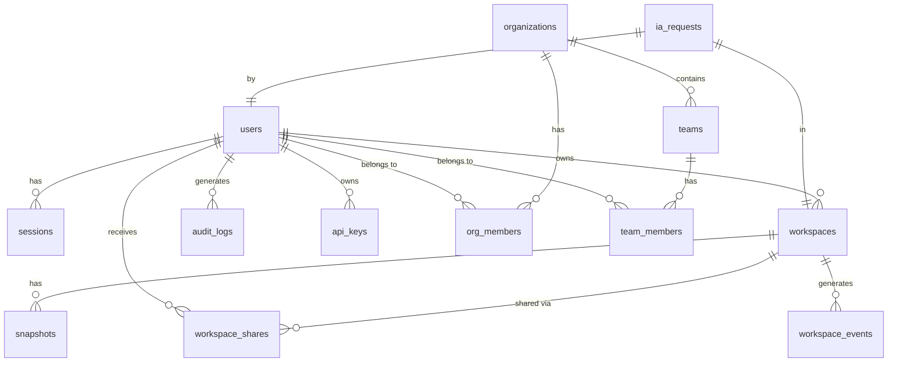

# Database Schema - BSC Code

## 13.1 Visão Geral

**Database:** PostgreSQL 15+

**Naming Conventions:**
- Tabelas: snake_case, plural (users, workspaces)
- Colunas: snake_case, singular (user_id, created_at)
- Primary Keys: id (UUID)
- Foreign Keys: {table}_id (e.g., user_id, workspace_id)
- Indexes: idx_{table}_{column}

---

## 13.2 Diagrama ERD



---

## 13.3 Tabelas Principais

### users

```sql
CREATE TABLE users (
    id UUID PRIMARY KEY DEFAULT gen_random_uuid(),
    email VARCHAR(255) NOT NULL UNIQUE,
    email_verified BOOLEAN DEFAULT FALSE,
    password_hash VARCHAR(255),  -- NULL para OAuth users
    name VARCHAR(255),
    avatar_url VARCHAR(500),
    
    -- Auth & Security
    mfa_enabled BOOLEAN DEFAULT FALSE,
    mfa_secret_encrypted BYTEA,
    backup_codes_encrypted BYTEA,
    failed_login_attempts INTEGER DEFAULT 0,
    locked_until TIMESTAMPTZ,
    
    -- Metadata
    timezone VARCHAR(50) DEFAULT 'UTC',
    language VARCHAR(10) DEFAULT 'en',
    theme VARCHAR(50) DEFAULT 'dark',
    
    -- Timestamps
    created_at TIMESTAMPTZ DEFAULT NOW(),
    updated_at TIMESTAMPTZ DEFAULT NOW(),
    last_login_at TIMESTAMPTZ,
    deleted_at TIMESTAMPTZ  -- Soft delete
    
    -- Constraints
    CONSTRAINT email_format CHECK (email ~* '^[A-Za-z0-9._%+-]+@[A-Za-z0-9.-]+\.[A-Za-z]{2,}$'),
    CONSTRAINT name_length CHECK (name IS NULL OR LENGTH(name) BETWEEN 1 AND 255)
);

CREATE INDEX idx_users_email ON users(email);
CREATE INDEX idx_users_created_at ON users(created_at);
CREATE INDEX idx_users_deleted_at ON users(deleted_at) WHERE deleted_at IS NOT NULL;
```

### sessions

```sql
CREATE TABLE sessions (
    id UUID PRIMARY KEY DEFAULT gen_random_uuid(),
    user_id UUID NOT NULL REFERENCES users(id) ON DELETE CASCADE,
    
    -- Token info
    refresh_token_hash VARCHAR(255) NOT NULL UNIQUE,
    access_token_jti VARCHAR(255) NOT NULL UNIQUE,
    
    -- Session metadata
    ip_address INET,
    user_agent TEXT,
    device_fingerprint VARCHAR(255),
    
    -- Expiration
    expires_at TIMESTAMPTZ NOT NULL,
    refreshed_at TIMESTAMPTZ DEFAULT NOW(),
    
    -- Status
    revoked BOOLEAN DEFAULT FALSE,
    revoked_at TIMESTAMPTZ,
    revoke_reason VARCHAR(255),
    
    -- Timestamps
    created_at TIMESTAMPTZ DEFAULT NOW()
);

CREATE INDEX idx_sessions_user_id ON sessions(user_id);
CREATE INDEX idx_sessions_refresh_token ON sessions(refresh_token_hash);
CREATE INDEX idx_sessions_expires_at ON sessions(expires_at);
CREATE INDEX idx_sessions_active ON sessions(user_id, revoked) WHERE revoked = FALSE;
```

### workspaces

```sql
CREATE TABLE workspaces (
    id UUID PRIMARY KEY DEFAULT gen_random_uuid(),
    owner_id UUID NOT NULL REFERENCES users(id) ON DELETE CASCADE,
    
    -- Identity
    name VARCHAR(255) NOT NULL,
    description TEXT,
    template VARCHAR(100) NOT NULL,  -- python, nodejs, go, etc.
    
    -- Status
    status VARCHAR(50) NOT NULL DEFAULT 'pending',
    -- pending, provisioning, running, idle, stopping, stopped, terminated, failed
    
    -- Container info
    container_id VARCHAR(255),
    node_hostname VARCHAR(255),
    internal_ip INET,
    public_url VARCHAR(500),
    
    -- Resources
    cpu_limit DECIMAL(3,2) DEFAULT 2.0,
    memory_limit_gb INTEGER DEFAULT 4,
    storage_limit_gb INTEGER DEFAULT 20,
    storage_used_gb DECIMAL(8,2) DEFAULT 0,
    
    -- Lifecycle
    started_at TIMESTAMPTZ,
    stopped_at TIMESTAMPTZ,
    expires_at TIMESTAMPTZ,
    last_activity_at TIMESTAMPTZ,
    
    -- Settings
    auto_stop_idle_minutes INTEGER DEFAULT 120,
    persist_on_stop BOOLEAN DEFAULT TRUE,
    
    -- Timestamps
    created_at TIMESTAMPTZ DEFAULT NOW(),
    updated_at TIMESTAMPTZ DEFAULT NOW()
);

CREATE INDEX idx_workspaces_owner_id ON workspaces(owner_id);
CREATE INDEX idx_workspaces_status ON workspaces(status);
CREATE INDEX idx_workspaces_created_at ON workspaces(created_at);
CREATE INDEX idx_workspaces_active ON workspaces(owner_id, status) 
    WHERE status IN ('running', 'idle');
```

### workspace_shares

```sql
CREATE TABLE workspace_shares (
    id UUID PRIMARY KEY DEFAULT gen_random_uuid(),
    workspace_id UUID NOT NULL REFERENCES workspaces(id) ON DELETE CASCADE,
    
    -- Shared with
    user_id UUID REFERENCES users(id) ON DELETE CASCADE,
    shared_via_email VARCHAR(255),  -- Para usuários não registrados
    
    -- Permissions
    permission VARCHAR(50) NOT NULL DEFAULT 'viewer',
    -- viewer, editor, admin
    
    -- Invitation
    invite_token_hash VARCHAR(255) UNIQUE,
    invited_by UUID NOT NULL REFERENCES users(id),
    invite_accepted_at TIMESTAMPTZ,
    invite_expires_at TIMESTAMPTZ,
    
    -- Timestamps
    created_at TIMESTAMPTZ DEFAULT NOW(),
    revoked_at TIMESTAMPTZ,
    revoked_by UUID REFERENCES users(id)
);

CREATE INDEX idx_workspace_shares_workspace ON workspace_shares(workspace_id);
CREATE INDEX idx_workspace_shares_user ON workspace_shares(user_id);
CREATE INDEX idx_workspace_shares_invite ON workspace_shares(invite_token_hash) 
    WHERE invite_accepted_at IS NULL;
```

### snapshots

```sql
CREATE TABLE snapshots (
    id UUID PRIMARY KEY DEFAULT gen_random_uuid(),
    workspace_id UUID NOT NULL REFERENCES workspaces(id) ON DELETE CASCADE,
    
    -- Identity
    name VARCHAR(255),
    description TEXT,
    
    -- Storage
    s3_bucket VARCHAR(255) NOT NULL,
    s3_key VARCHAR(500) NOT NULL,
    size_bytes BIGINT,
    
    -- Type
    snapshot_type VARCHAR(50) NOT NULL DEFAULT 'manual',
    -- manual, auto, pre_stop, pre_delete
    
    -- Retention
    retention_days INTEGER DEFAULT 30,
    expires_at TIMESTAMPTZ,
    
    -- Status
    status VARCHAR(50) NOT NULL DEFAULT 'pending',
    -- pending, creating, completed, failed, expired, deleted
    
    -- Metadata
    metadata JSONB,  -- Arquivos incluídos, extensions, etc.
    
    -- Timestamps
    created_at TIMESTAMPTZ DEFAULT NOW(),
    completed_at TIMESTAMPTZ
);

CREATE INDEX idx_snapshots_workspace ON snapshots(workspace_id);
CREATE INDEX idx_snapshots_status ON snapshots(status);
CREATE INDEX idx_snapshots_expires ON snapshots(expires_at);
```

### audit_logs

```sql
CREATE TABLE audit_logs (
    id UUID PRIMARY KEY DEFAULT gen_random_uuid(),
    
    -- Event info
    event_type VARCHAR(100) NOT NULL,
    event_category VARCHAR(50) NOT NULL,
    -- auth, authorization, workspace, data, admin, security
    
    -- Actor
    actor_id UUID,
    actor_type VARCHAR(50) NOT NULL,
    -- user, service_account, system
    actor_email VARCHAR(255),
    actor_ip INET,
    actor_user_agent TEXT,
    
    -- Resource
    resource_type VARCHAR(100),
    resource_id UUID,
    resource_name VARCHAR(255),
    
    -- Action
    action VARCHAR(100) NOT NULL,
    outcome VARCHAR(50) NOT NULL,
    -- success, failure, denied
    
    -- Details
    reason TEXT,
    metadata JSONB,
    request_id VARCHAR(255),
    
    -- Timestamp
    created_at TIMESTAMPTZ DEFAULT NOW()
);

CREATE INDEX idx_audit_logs_actor ON audit_logs(actor_id);
CREATE INDEX idx_audit_logs_event_type ON audit_logs(event_type);
CREATE INDEX idx_audit_logs_resource ON audit_logs(resource_type, resource_id);
CREATE INDEX idx_audit_logs_created_at ON audit_logs(created_at);
CREATE INDEX idx_audit_logs_outcome ON audit_logs(outcome);

-- Partitioning por mês para performance
-- CREATE TABLE audit_logs_2025_01 PARTITION OF audit_logs
--     FOR VALUES FROM ('2025-01-01') TO ('2025-02-01');
```

### ia_requests

```sql
CREATE TABLE ia_requests (
    id UUID PRIMARY KEY DEFAULT gen_random_uuid(),
    user_id UUID NOT NULL REFERENCES users(id) ON DELETE CASCADE,
    workspace_id UUID REFERENCES workspaces(id) ON DELETE SET NULL,
    
    -- Request details
    provider VARCHAR(50) NOT NULL,
    -- anthropic, openai, google, ollama
    model VARCHAR(100) NOT NULL,
    request_type VARCHAR(50) NOT NULL,
    -- chat, code_completion, inline_completion, refactoring
    
    -- Usage
    prompt_tokens INTEGER,
    completion_tokens INTEGER,
    total_tokens INTEGER,
    latency_ms INTEGER,
    cost_usd DECIMAL(10,6),
    
    -- Context
    language VARCHAR(50),
    open_files_count INTEGER,
    context_lines INTEGER,
    
    -- Response quality
    feedback_thumbs_up BOOLEAN,
    feedback_comment TEXT,
    
    -- Timestamps
    created_at TIMESTAMPTZ DEFAULT NOW()
);

CREATE INDEX idx_ia_requests_user ON ia_requests(user_id);
CREATE INDEX idx_ia_requests_workspace ON ia_requests(workspace_id);
CREATE INDEX idx_ia_requests_provider ON ia_requests(provider);
CREATE INDEX idx_ia_requests_created_at ON ia_requests(created_at);
```

### organizations

```sql
CREATE TABLE organizations (
    id UUID PRIMARY KEY DEFAULT gen_random_uuid(),
    name VARCHAR(255) NOT NULL,
    slug VARCHAR(100) NOT NULL UNIQUE,
    
    -- Settings
    plan VARCHAR(50) NOT NULL DEFAULT 'free',
    -- free, pro, enterprise
    
    -- Billing
    billing_email VARCHAR(255),
    stripe_customer_id VARCHAR(255),
    
    -- Limits
    max_workspaces INTEGER DEFAULT 10,
    max_members INTEGER DEFAULT 5,
    max_storage_gb INTEGER DEFAULT 100,
    
    -- Features
    features JSONB DEFAULT '{}',
    
    -- Timestamps
    created_at TIMESTAMPTZ DEFAULT NOW(),
    updated_at TIMESTAMPTZ DEFAULT NOW()
);

CREATE INDEX idx_organizations_slug ON organizations(slug);
```

---

## 13.4 Views Úteis

### v_active_workspaces

```sql
CREATE VIEW v_active_workspaces AS
SELECT 
    w.id,
    w.name,
    w.status,
    w.owner_id,
    u.email as owner_email,
    w.container_id,
    w.node_hostname,
    w.started_at,
    w.last_activity_at,
    EXTRACT(EPOCH FROM (NOW() - w.last_activity_at))/60 as idle_minutes,
    w.cpu_limit,
    w.memory_limit_gb,
    w.storage_used_gb
FROM workspaces w
JOIN users u ON w.owner_id = u.id
WHERE w.status IN ('running', 'idle')
ORDER BY w.created_at DESC;
```

### v_user_usage_summary

```sql
CREATE VIEW v_user_usage_summary AS
SELECT 
    u.id,
    u.email,
    COUNT(DISTINCT w.id) as total_workspaces,
    COUNT(DISTINCT CASE WHEN w.status IN ('running', 'idle') THEN w.id END) as active_workspaces,
    SUM(w.storage_used_gb) as total_storage_gb,
    COUNT(ir.id) as ia_requests_total,
    COUNT(CASE WHEN ir.created_at >= NOW() - INTERVAL '1 day' THEN 1 END) as ia_requests_today,
    COALESCE(SUM(ir.cost_usd), 0) as total_ia_cost,
    MAX(s.refreshed_at) as last_session
FROM users u
LEFT JOIN workspaces w ON u.id = w.owner_id AND w.deleted_at IS NULL
LEFT JOIN ia_requests ir ON u.id = ir.user_id
LEFT JOIN sessions s ON u.id = s.user_id AND s.revoked = FALSE
GROUP BY u.id, u.email;
```

---

## 13.5 Migrações

### Migration Template

```sql
-- migration_YYYYMMDD_HHMMSS_description.sql
-- Up
BEGIN;

CREATE TABLE IF NOT EXISTS new_table (
    id UUID PRIMARY KEY DEFAULT gen_random_uuid(),
    created_at TIMESTAMPTZ DEFAULT NOW()
);

COMMIT;

-- Down
BEGIN;

DROP TABLE IF EXISTS new_table;

COMMIT;
```

### Running Migrations

```bash
# Usando Alembic (Python)
alembic upgrade head

# Rollback
alembic downgrade -1

# Ver status
alembic current
```

---

*Database Schema completo. Versão 1.0.0*
