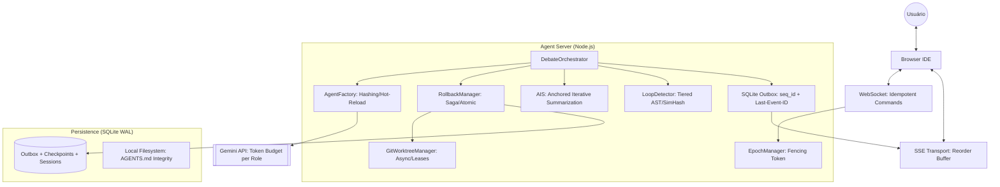
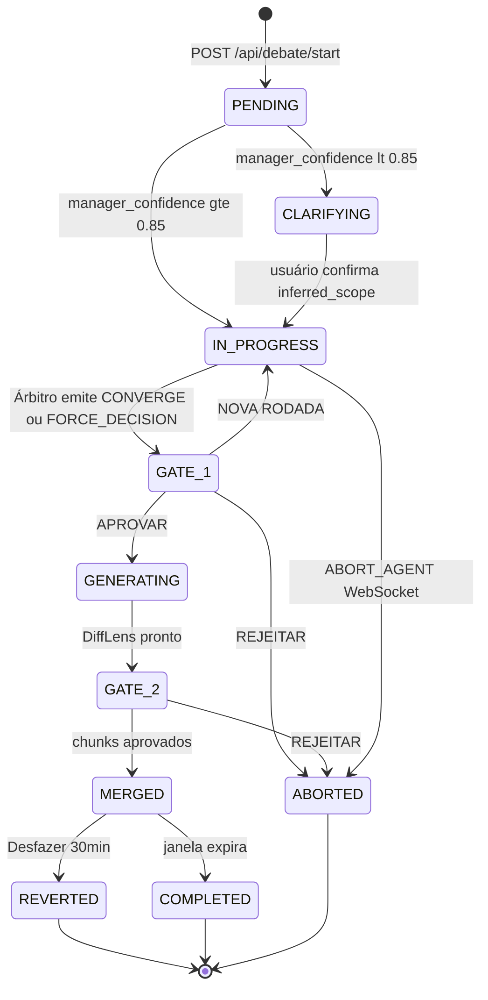

# GreenForge Agent — 01: Visão e Arquitetura

> **Status:** ✅ | **Versão:** 2.3 | **Data:** 2026-05-15  
> **Referências:** Verdant AI Discovery Report, SRE Handbook, Martin Kleppmann (Distributed Systems, WAL, Fencing Tokens), OpenHands V1, Bolt.diy, Code Property Graph (IBM)

### 📋 Changelog v2.2 → v2.3 — Hardening Crítico de Resiliência e Segurança

| Categoria | Vulns Resolvidas | Status |
|---|---|---|
| Sincronização | #1 Gate Hydration, #2 Reorder Buffer, #3 HITL Idempotência | ✅ |
| Integridade de Dados | #4 SQLite busy_timeout, #5 Rollback Atômico, #6 Merge Squash | ✅ |
| Gestão de Recursos | #7 Memory Leak SSE, #15 GC vs Rollback Window | ✅ |
| Custo | #8 Estimativa Especulativa, #9 Budget por Papel | ✅ |
| Segurança | #10 Path Traversal Terminal, #11 Shell Allowlist, #12 AGENTS.md Integridade | ✅ |
| Protocolo | #13 Confidence Gating Dual, #14 LoopDetector v2, #17 STEER_AGENT | ✅ |
| Performance | #16 execSync → async simple-git | ✅ |

---

## 1. Visão do Produto

O GreenForge Agent v2.0 é uma **IDE Web de Múltiplos Agentes** que substitui o modelo "um agente escreve código" por um protocolo de **debate adversarial**: antes de qualquer linha de código ser gerada, um Propositor e um Crítico debatem a solução técnica por até 3 rounds, com um Árbitro sintetizando o veredicto. O usuário aprova o resultado em um gate estruturado antes da execução.

**Princípio central:** Nenhum código é escrito sem debate. Nenhum debate termina sem aprovação humana.

### 1.1 Comparativo com a v1.0

| Dimensão | v1.0 (CLI-first) | v2.0 (Web IDE) |
|---|---|---|
| Ponto de entrada | Terminal: `greenforge run plan.json` | IDE Web: input de objetivo em linguagem natural |
| Orquestração | Manager → Implementer → Verifier (serial) | - **Orquestração:** Debate Adversarial (Proposer-Critic-Judge).<br>- **Sincronização:** Dual-Transport (SSE + WebSocket) com **Sequence Numbers (SQLite Outbox) + Epoch ID (Fencing)** e **Reorder Buffer** no cliente.<br>- **Resiliência:** Detecção de Loops Multinível (AST Fingerprinting + SimHash) e Rollback Atômico (Saga Pattern) com diagnóstico estruturado.<br>- **Gestão de Contexto:** RepoMap incremental e AIS (Anchored Iterative Summarization). |
| Isolamento | 1 worktree por workspace | 1 worktree por agente de debate (Juiz em Read-Only/Efêmero) |
| Comunicação | SSE experimental via A2A server | Dual-Transport: SSE + WebSocket (Socket.IO) |
| Aprovação | `Inquirer` (prompt CLI) | Approval Card chunk-based em 3 níveis na UI |
| Contexto | 30k tokens fixo | 128k padrão; gate de aprovação para 1M |
| Agentes | 3 hardcoded (Manager, Implementer, Verifier) | N agentes declarados em `AGENTS.md` |
| Histórico | Sem persistência de chat | `ChatSession` + `ChatMessage` no Prisma |
| Rollback | `git revert` manual no terminal | Botão "↩ Desfazer" na UI (janela de 30 min) |

---

## 2. Arquitetura Geral



### Ciclo de Vida da DebateSession



---

## 3. Arquitetura Dual-Transport

### 3.1 Motivação

A comunicação de uma IDE agêntica exige dois padrões distintos:
- **Unidirecional de alto volume:** streaming de tokens LLM, logs de debate, status de rounds
- **Bidirecional de baixa latência:** input do terminal (stdin/stdout PTY), aprovações HITL, sinais de abort

Nenhum protocolo único otimiza ambos. A decisão é usar cada um onde é superior.

### 3.2 Mapeamento de Fluxos

```
FLUXO SSE (Servidor → Browser, unidirecional):
  - AGENT_TOKEN      → token de texto gerado por agente (streaming)
  - DEBATE_STATUS    → rodada atual, agente ativo, status geral
  - ISSUE_FOUND      → issue detectado pelo Crítico (severity, category)
  - HITL_GATE        → sinal de pausa para aprovação (payload do Approval Card)
  - CONVERGENCE      → debate encerrado com veredito do Juiz
  - DEBATE_COMPLETE  → sessão encerrada, código aplicado
  - MERGE_REVERTED   → rollback pós-merge executado
  - KEEP_ALIVE       → heartbeat a cada 15s (previne timeout de proxies)

FLUXO WebSocket (Bidirecional via Socket.IO):
  Cliente → Servidor:
    TERMINAL_INIT    → inicializa PTY no worktreePath do agente
    TERMINAL_INPUT   → stdin do usuário para o PTY
    TERMINAL_RESIZE  → redimensiona o terminal (cols, rows)
    HITL_DECISION    → aprovação/rejeição de gate (APPROVE|REJECT|NEW_ROUND|EDIT)
    ABORT_AGENT      → interrupção imediata de agente em execução
    STEER_AGENT      → instrução mid-task sem abortar

  Servidor → Cliente:
    TERMINAL_OUTPUT  → stdout/stderr do PTY (dados binários)
    TERMINAL_EXIT    → processo PTY encerrado (exitCode)
    AGENT_ABORTED    → confirmação de abort com timestamp
```

### 3.3 Decisão HTTP/2

Para evitar o limite de 6 conexões SSE simultâneas do HTTP/1.1 (crítico com múltiplos agentes em paralelo), o servidor deve operar em **HTTP/2**. Isso eleva o limite para ~100 streams multiplexados sobre uma única conexão TCP.

```typescript
// src/server/index.ts
import http2 from 'http2';
import fs from 'fs';

const server = http2.createSecureServer({
  key: fs.readFileSync('./certs/localhost-key.pem'),
  cert: fs.readFileSync('./certs/localhost.pem'),
});
```

Para desenvolvimento local, usar `mkcert localhost` para gerar certificados auto-assinados.

---

## 4. Protocolo de Debate Adversarial

### 4.1 Papéis

| Papel | ID no AGENTS.md | Modelo recomendado | Função |
|---|---|---|---|
| **Propositor** | `technical_proposer` | `gemini-2.5-flash` | Gera a proposta técnica inicial |
| **Crítico** | `quality_critic` | `gemini-2.5-flash-lite` | Inspeciona adversarialmente a proposta |
| **Árbitro** | `debate_judge` | `gemini-2.5-pro` | Sintetiza o veredicto final (1x/ciclo) |

### 4.2 Fluxo por Round

```
ROUND 1 (Paralelo — Anti-Herding):
  Propositor e Crítico recebem a task simultaneamente.
  NÃO têm acesso à resposta um do outro.
  Propositor → code_proposal { confidence_score, code, rationale, tradeoffs }
  Crítico    → critique_report { verdict, issues[{ severity, category, fix }] }

ÁRBITRO verifica:
  issues com severity == "high" → ESCALATE → Round 2
  zero issues high + verdict APPROVE → CONVERGE (saída antecipada)
  confidence_gating >= 0.95 → CONVERGE (saída antecipada)

ROUND 2 e 3 (Confronto — Agentes veem contexto do round anterior):
  Propositor refatora com base nas issues do Crítico
  Crítico reavalia a proposta revisada
  Árbitro verifica novamente

APÓS MAX_ROUNDS (3):
  Árbitro → FORCE_DECISION { synthesis, explicit_tradeoffs, final_code_delta }
  Sistema escala para HITL Gate com "Caminho A vs. Caminho B"
```

### 4.3 HITL Gates

| Gate | Momento | Ação do usuário |
|---|---|---|
| **Gate 0** | Após clarificação socrática (se confidence < 0.85) | Responde perguntas do ManagerAgent |
| **Gate 1** | Após síntese do Árbitro, ANTES de gerar código | Aprova/Rejeita/Pede nova rodada |
| **Gate 2** | Após geração de código (Approval Card com diffs) | Aprova chunks, reverte ou aceita tudo |

---

## 5. Estratégia de Contexto

### 5.1 Budget em Dois Níveis

```
MODO TRABALHO (padrão):
  CONTEXT_TOKEN_BUDGET = 128.000 tokens
  Latência: baixa (Gemini Flash: ~2s)
  Cobertura: suficiente para 95% dos projetos

MODO ANÁLISE GLOBAL (sob aprovação):
  CONTEXT_TOKEN_BUDGET = 1.000.000 tokens
  Acionado quando: ManagerAgent detecta necessidade de análise de impacto global
  Gate exibido: "Esta análise requer ~850k tokens (~$0.42). Aprovar?"
  Latência: maior (~10-30s dependendo do modelo)
```

### 5.2 Selective File Indexing (RAG leve)

Para repositórios que excedem 128k tokens, o `LazyContextLoader` aplica seleção semântica:

```typescript
interface FileScore {
  path: string;
  score: number; // 0.0–1.0
  tokens: number;
}

// Critérios de score (sem embedding no MVP — heurísticas):
// 1. Nome do arquivo contém termos do objetivo → +0.4
// 2. Extensão relevante (.ts, .js, .py, etc.) → +0.2
// 3. Modificado recentemente (últimas 24h) → +0.2
// 4. Importado por arquivos de alta pontuação → +0.2
// Seleciona top-N arquivos até atingir CONTEXT_TOKEN_BUDGET
```

---

## 5.3 Resiliência Arquitetural — Fundamentos Teóricos (v2.3)

> **Fonte:** Pesquisa Técnica Profunda v2.3. Esta seção documenta o *porquê* das decisões de resiliência, complementando os ADRs (que documentam o *o quê* e o *como*). Após lê-la, a equipe não precisa consultar os dossiês externos.

### O Problema Raiz: Dois Sistemas Sem Commit Atômico Compartilhado

O GreenForge opera sobre dois sistemas de estado heterogêneos:
- **Git filesystem** — operações como `git stash push` são duráveis mas não têm transação SQL
- **SQLite DB** — transações ACID mas limitadas ao banco; sem coordenação com o Git

A limitação crítica: transações que envolvem mudanças contra múltiplos databases `ATTACH`ed no SQLite são atômicas para cada database individual, **mas não são atômicas através de todos os databases como conjunto**. Logo, **nenhum mecanismo nativo resolve a atomicidade cross-system** — Git + SQLite precisam de um coordenador externo.

### Solução: Write-Ahead Log como Fonte de Verdade

O princípio WAL (Write-Ahead Logging) é a resposta formal da ciência de banco de dados para esse problema: as mudanças são **primeiro registradas em um log append-only e durável** antes de serem aplicadas ao estado principal. Se o sistema crashar, o log é replayed no restart — garantindo que a operação seja eventualmente aplicada ou desfeita de forma consistente.

No GreenForge, o Intent Log em `.greenforge/wal/{txId}.json` é esse coordenador: ele registra a **intenção** e a **fase** de cada operação cross-system antes de qualquer side-effect. O `bootReconciler()` é o mecanismo de replay no startup.

### Mecanismo de Sobrevivência ao SIGKILL — Rename Atômico POSIX

A técnica de escrita atômica no filesystem:

```
1. Serializar intent → escrever em {txId}.json.tmp
2. fsync({txId}.json.tmp)    ← força flush para disco antes de continuar
3. rename(.tmp → .json)      ← operação POSIX atômica e indivisível
```

O `rename(2)` é **indivisível mesmo sob SIGKILL**: ou o arquivo antigo existe, ou o novo — nunca um estado intermediário. Arquivos `.tmp` residuais são evidência de crash *durante* o próprio `writeIntent()` e são limpos pelo `cleanOrphanedTempFiles()` no próximo boot.

**Trade-off documentado:** O `fsync()` adiciona ~5-10ms por checkpoint. Esta latência é o preço explícito pelo contrato "zero stashes órfãos".

### Imunidade Semântica a Loops — Code Property Graph (CPG)

O LoopDetector v2.2 (Tiers AST/SimHash/SHA-256) falha em **reformulações arquiteturais**: um agente que transforma recursão em iteração com `while`, depois com `for`, depois com `reduce()` produz AST, shingles e hashes completamente distintos — evadindo todos os Tiers.

A solução v2.3 baseia-se na teoria do **Code Property Graph (CPG)**: uma estrutura de dados que captura estrutura sintática, fluxo de controle e dependências de dados em um único grafo, obtida pela fusão de:
- **AST** (Abstract Syntax Tree) — estrutura sintática
- **CFG** (Control Flow Graph) — fluxo de execução
- **DFG** (Data Flow Graph) — dependências entre valores

O `CPGLoopDetector` extrai um vetor CPG de cada round e calcula similaridade semântica com pesos:
- **60% — Execution Oracle** (hash normalizado do output dos testes): se os testes passam igual, o código é funcionalmente equivalente — independente de paradigma
- **30% — Node type frequency** (AST layer): mesmos constructs linguísticos
- **10% — Control depth** (CFG layer): proxy de complexidade de fluxo

**Paradigm-shift proof:** `if → switch` muda o `nodeTypeFreq` mas **não** o `sideEffectHash`. Se o oracle registra invariância por `MIN_ROUNDS=3` rounds, é `INVARIANT_SIDE_EFFECTS`. Se os vetores CPG formam um ciclo de comprimento N com similaridade > 0.85, é `CPG_CYCLE`.

### Mapa de Resiliência por Componente

| Componente | Falha Coberta | Mecanismo | Arquivo de Spec |
|---|---|---|---|
| `bootReconciler()` | SIGKILL entre Git e DB | WAL Intent Log (3 fases) + rename POSIX | `03-technical-spec-and-data.md §1.3` |
| `CPGLoopDetector` | Loop semântico por paradigm shift | CPG vector + Execution Oracle | `03-technical-spec-and-data.md §2.8` |
| `PreExecutionGuard` | Stale Approval / Worktree divergido | OCC version token + HMAC + Worktree Hash | `03-technical-spec-and-data.md §2.10` |
| `secureGit()` | Argument injection / Path traversal | Allowlist + `realpath()` + env sanitization | `05-governance-and-security.md §4.3` |
| `OutboxEvent` + `epoch_id` | Gate Zumbi pós-restart | Fencing Token monotônico persistido | `03-technical-spec-and-data.md §5.1` |

---

## 6. ADRs — Decisões Arquiteturais (com Alternativas Rejeitadas)

> **Regra NEXUS:** Toda escolha tecnológica deve ter alternativa rejeitada documentada com motivo. Decisão sem contexto é dogma.

### ADR-01: Backend Local (não WebContainers)

| Campo | Valor |
|---|---|
| **Status** | ACEITA |
| **Contexto** | A v1.0 usava WebContainers (execução no browser). Precisamos de git worktrees, SQLite e acesso ao Ollama. |
| **Decisão** | Agent Runner em Node.js local (porta 5174) |
| **Alternativas Rejeitadas** | WebContainers: não suportam symlinks (bloqueia `git worktree`), SQLite é read-only no OPFS, bloqueado pelo Chrome PNA para Ollama em localhost |
| **Consequências** | (+) Acesso total ao FS, git, rede local. (-) Requer `Node.js ≥ 20.11` instalado pelo usuário |
| **Mitigação** | `npm run preflight` verifica versão do Node antes de iniciar |

### ADR-02: Dual-Transport (SSE + WebSocket)

| Campo | Valor |
|---|---|
| **Status** | ACEITA |
| **Contexto** | IDE agêntica precisa de streaming unidirecional de alta vazão (tokens) E controle bidirecional de baixa latência (PTY, HITL). |
| **Decisão** | SSE para tokens/logs (servidor→cliente); WebSocket (Socket.IO) para terminal PTY e controles HITL |
| **Alternativas Rejeitadas** | WebSocket puro: SSE tem reconexão nativa via `Last-Event-ID`, zero código extra. HTTP polling: latência inaceitável para streaming de tokens |
| **Consequências** | (+) Cada protocolo otimizado para seu caso. (-) Dois endpoints a manter; Socket.IO +70KB no bundle do servidor |
| **Mitigação** | `AgentEventBridge` abstrai ambos os transportes para o `DebateOrchestrator` |

### ADR-03: AGENTS.md como fonte de verdade

| Campo | Valor |
|---|---|
| **Status** | ACEITA |
| **Contexto** | Agentes hardcoded em TypeScript exigem recompilação para qualquer ajuste de prompt ou modelo. |
| **Decisão** | YAML frontmatter + Markdown body em `AGENTS.md`; `AgentFactory` faz parse com hot reload |
| **Alternativas Rejeitadas** | JSON config: menos legível para system prompts longos. DB-driven: overhead de CRUD para algo editado como código |
| **Consequências** | (+) Novos agentes sem recompilação. (-) Erro de YAML quebra o boot (N5 no nível de classificação de erros) |
| **Mitigação** | `AgentFactory.validateFrontmatter()` lança erro descritivo com campo faltante identificado |

### ADR-04: SQLite + Prisma (não PostgreSQL)

| Campo | Valor |
|---|---|
| **Status** | ACEITA |
| **Contexto** | MVP single-user local; sem infra de servidor de banco de dados. |
| **Decisão** | SQLite em WAL mode via Prisma ORM; arquivo em `.greenforge/db.sqlite` |
| **Alternativas Rejeitadas** | PostgreSQL: requer servidor separado, conflito com premissa "zero infra". MongoDB: schema-less inadequado para dados relacionais de debate com foreign keys |
| **Consequências** | (+) Zero infra, portabilidade total, WAL mode suporta leitura concorrente. (-) Não escala para multi-usuário sem migração |
| **Mitigação** | Prisma abstrai o provider; migração para PostgreSQL em v3.0 sem reescrever queries |

### ADR-05: git revert (não reset --hard) para rollback

| Campo | Valor |
|---|---|
| **Status** | ACEITA |
| **Contexto** | Usuário precisa desfazer um merge após aprovação. Dois mecanismos possíveis: destrutivo e não-destrutivo. |
| **Decisão** | `git revert HEAD` (cria commit de reversão, preserva histórico) |
| **Alternativas Rejeitadas** | `git reset --hard HEAD~1`: destrutivo, reescreve histórico, incompível com fluxos colaborativos e auditoria |
| **Consequências** | (+) Histórico intacto, auditável, safe para repos compartilhados. (-) Em conflito de revert, requer intervenção manual (ver INC-006) |
| **Mitigação** | Terminal integrado acessível no worktree para resolução manual |

### ADR-06: Árbitro com Síntese Dialética (não voto majoritário)

| Campo | Valor |
|---|---|
| **Status** | ACEITA |
| **Contexto** | Em sistemas multi-agente, a decisão após impasse pode ser um voto (maioria), um randomizador, ou uma síntese. |
| **Decisão** | Árbitro executa protocolo de 3 etapas: (1) identifica `underlying_question`, (2) testa contra princípios, (3) sintetiza posição |
| **Alternativas Rejeitadas** | Voto majoritário: com 2 agentes debateáveis, voto é trivial (1x1 sempre). Randomizador: não produz raciocínio auditável. LLM de desempate sem protocolo: propenso a "soluções de compromisso" sem substância |
| **Consequências** | (+) FORCE_DECISION é uma ferramenta de decisão, não uma falha. (-) Árbitro Pro tem custo mais alto por chamada |
| **Mitigação** | Árbitro só é chamado 1x por ciclo de rounds (não a cada mensagem) |

### ADR-07: Sincronização via SQLite Outbox e Fencing Tokens
| Campo | Valor |
|---|---|
| **Status** | ACEITA |
| **Contexto** | Eventos SSE podem ser perdidos em crashes. Reinicializações zeram contadores em memória. |
| **Decisão** | Persistir `seq_id` e payloads completos em tabela `OutboxEvent` (SQLite) ANTES do envio. Usar `epoch_id` como **Fencing Token** monotônico persistido para invalidar gates de ciclos de vida anteriores. |
| **Alternativas** | Estados em memória (rejeitado por perda de dados). Redis (rejeitado por infra extra). |
| **Consequências** | (+) Resiliência total a crashes; zero "Gates Zumbis". (-) Latência de escrita (1-2ms) por evento. |

### ADR-08: Gestão de Contexto via AIS (Anchored Iterative Summarization)
| Campo | Valor |
|---|---|
| **Status** | ACEITA |
| **Contexto** | Compressão de contexto em sessões longas causa perda de decisões críticas (Context Drift). |
| **Decisão** | Implementar o protocolo AIS: o resumo é estendido incrementalmente, mantendo a "Âncora Dialética" (votos, trade-offs e underlying questions) imutável no prompt. |

### ADR-09: Rollback Atômico via Padrão Saga
| Campo | Valor |
|---|---|
| **Status** | ACEITA |
| **Contexto** | Falhas entre a escrita no Git (stash) e a persistência no DB deixam o sistema em estado inconsistente. |
| **Decisão** | Orquestração `PENDING -> GIT_STASHED -> COMMITTED`. O servidor reconcilia estados `PENDING` no boot para garantir que o filesystem e o banco de dados nunca divirjam. |

### ADR-10: Segurança de Terminal e Shell (Fail-Closed)
| Campo | Valor |
|---|---|
| **Status** | ACEITA |
| **Contexto** | `TERMINAL_INIT` e `execute_shell` são vetores críticos de CSRF e Command Injection. |
| **Decisão** | (1) Validação de Origin no handshake WS. (2) `path.resolve` + containment check para PTY. (3) Allowlist hierárquica de subcomandos Git/NPM via AST parser. |

### ADR-11: Editor — CodeMirror 6 (não Monaco)
| Campo | Valor |
|---|---|
| **Status** | ACEITA (v2.2) |
| **Contexto** | Monaco Editor é o padrão do VS Code, mas usa um modelo de DOM virtual próprio que conflita com o sistema de gerenciamento de estado React/Zustand ao tentar injetar Inline Agent Tags como ContentWidgets. Os widgets ficam desincronizados após re-renders do React. |
| **Decisão** | Adotar **CodeMirror 6** com a API de `Decorations` (extensiível, baseada em `StateField` e `ViewPlugin`) para renderizar as Inline Agent Tags diretamente no modelo de estado imutável do CM6, sem conflito com o ciclo de vida do React. |
| **Alternativas Rejeitadas** | Monaco: ContentWidgets não são React-managed, causam desincronização de estado em re-renders. CodeMirror 5: API legada, sem suporte a TypeScript nativo. |
| **Consequências** | (+) Inline Agent Tags totalmente integradas ao ciclo de estado React/Zustand. (-) Bundle ligeiramente diferente; usuários familiarizados com Monaco não perceberão diferença funcional. |
| **Migração** | A API do editor é abstraida por `EditorAdapter` — mudanca transparente para o `DebateOrchestrator`. |

### ADR-12: BootReconciler com WAL Intent Log (v2.3 — Resolutor de Estado Zumbi)
| Campo | Valor |
|---|---|
| **Status** | ACEITA (v2.3) |
| **Contexto** | SIGKILL entre `git stash push` e `prisma.checkpoint.update()` deixa stashes órfãos no filesystem sem referência no DB. Próximas operações podem aplicar esses stashes acidentalmente, corrompendo o estado. |
| **Decisão** | Implementar Write-Ahead Log (WAL) Intent com 3 fases obrigatórias: (1) INTENT_WRITTEN, (2) GIT_STASH_DONE, (3) DB_COMMITTED. BootReconciler executa no startup e recupera de forma determinística: INTENT_WRITTEN → rollback limpo; GIT_STASH_DONE → re-drive DB (idempotente); fases terminais → limpeza de arquivo WAL. |
| **Alternativas Rejeitadas** | Saga simples sem log persistido: vulnerável a crashes. Redis para WAL: adiciona infra. Simples retry: não garante idempotência. |
| **Consequências** | (+) Zero stashes órfãos; Git e SQLite sempre sincronizados. (-) fsync antes de rename adiciona ~5-10ms de latência por checkpoint. |
| **Mitigação** | WAL persistido em `.greenforge/wal/{txId}.json`; cleanup automático de arquivos `.tmp` orphaned; validação de idempotência de DB updates via WHERE clause. |

### ADR-13: CPGLoopDetector com Execution Oracle (v2.3 — Defesa Contra Transformações de Paradigma)
| Campo | Valor |
|---|---|
| **Status** | ACEITA (v2.3) |
| **Contexto** | Agentes podem evadir LoopDetector v2.2 (Tiers AST/SimHash/SHA-256) transformando código de forma semanticamente equivalente: recursão → iteração com while → iteração com for. Cada transformação produz AST/shingles/hash distintos, evadindo todos os Tiers. |
| **Decisão** | Integrar Code Property Graph (CPG) unindo AST + CFG + DFG para detecção de similaridade semântica com threshold 0.75 (mais sensível que SimHash 0.92). Validar com Execution Oracle: rodar testes do projeto com ambas as versões do código e comparar outputs. Se outputs idênticos + CPG similar → LOOP_SEMÂNTICO confirmado. |
| **Alternativas Rejeitadas** | Tier 1+2+3 mantidos: insuficientes para reformulações arquiteturais. Limitar rounds a N: penaliza progresso legítimo. Apenas Execution Oracle: sem CPG, falsos positivos (códigos legítimos diferentes). |
| **Consequências** | (+) Detecção de loops mesmo com paradigm shifts. (-) CPG extraction ~50-100ms por round; test execution adiciona ~500ms (amortizado 1x por debate). |
| **Mitigação** | CPG extraction amortizada entre agentes; Execution Oracle acionado apenas após segundo hit de CPG similarity. |

---

## 7. Modelo de Deployment (MVP)

```
DESENVOLVEDOR (usuário único, localhost)
  npx greenforge serve
  │
  ├── Abre Agent Server em localhost:5174
  ├── Abre Browser em localhost:5174 (Bolt.diy UI)
  ├── Lê AGENTS.md do repositório atual
  └── Conecta ao Gemini API via GEMINI_API_KEY no .env

VARIÁVEIS DE AMBIENTE (.env):
  GEMINI_API_KEY=         # Obrigatório
  APPROVAL_MODE=manual    # manual | auto_edit | yolo
  SANDBOX_MODE=local      # local | docker
  CONTEXT_TOKEN_BUDGET=128000
  MAX_DEBATE_ROUNDS=3
  CLARITY_THRESHOLD=0.85
  LOG_LEVEL=info
```

---

### 5.4 Justificativa de Design de Imunidade (Mapeamento CVE)

> **Fonte:** Dossiê de Implementação v2.3 — GreenForge NEXUS, Blueprints de Engenharia de Infraestrutura, §3.1 "Base de CVEs Relevantes para o GreenForge".
> **Propósito:** Justificar cada decisão de design de segurança com base em vulnerabilidades reais documentadas em Git e ferramentas de CI/CD. A coluna "Defesa no GreenForge" mapeia cada CVE à implementação canônica presente no `secureGit` wrapper (§4 do `05-governance-and-security.md`).

| CVE | Vetor de Ataque | Gap Coberto | Defesa no GreenForge v2.3 |
|---|---|---|---|
| **CVE-2026-3854** | Push option injection → env override → RCE em servidores CI/CD | GAP 3 (secureGit) | `FORBIDDEN_ENV_VARS` (Set com 18 entradas) + `execa` com `spawn({shell: false})` implícito |
| **CVE-2026-25763** | `git log --output=<path>` → escrita arbitrária de arquivo no filesystem | GAP 3 (secureGit) | `forbiddenFlags: new Set(['--output', '--exec'])` na política `log` do `GIT_POLICY` |
| **CVE-2025-68144** | `git diff --output=<path>` / `--no-index` → Local File Inclusion (LFI) | GAP 3 (secureGit) | `forbiddenFlags: new Set(['--no-index', '--output', '--ext-diff', '--textconv'])` na política `diff` |
| **CVE-2023-29007** | Injeção de config Git arbitrária via `core.pager`, `core.editor`, `core.sshCommand` | GAP 3 (secureGit) | Delete de `GIT_PAGER`, `PAGER`, `GIT_CONFIG_COUNT`, `GIT_CONFIG_KEY_0`, `GIT_CONFIG_VALUE_0`, `GIT_EDITOR`, `EDITOR` do env antes de cada exec |
| **CVE-2017-8386** | Escalada de privilégios via `git-shell` pager bypass usando `less --help` | GAP 3 (secureGit) | Delete de `PAGER`, `LESS`, `MANPAGER`; forçar `TERM=dumb` + `GIT_TERMINAL_PROMPT=0` |
| **N/A** | `SharedArrayBuffer` bloqueado por ausência de Cross-Origin-Isolation | GAP 1 (Vite/Nginx) | Headers COOP `same-origin` + COEP `require-corp` no plugin Vite e no nginx.conf |
| **N/A** | `WidgetType` re-render a cada keystroke → loop de DOM no CodeMirror 6 | GAP 2 (CodeMirror) | Método `eq()` comparando todos os campos visuais + `updateDOM()` para mutação cirúrgica |
| **N/A** | SQLite WAL não checkpointed no shutdown → writes perdidos em crash de processo | GAP 4 (Shutdown) | `db.pragma('wal_checkpoint(FULL)')` obrigatório no Estágio 8 do `gracefulShutdown()` |

**Princípio de Defesa em Profundidade:** Cada CVE da tabela acima é mitigado em pelo menos **2 camadas independentes**:

1. **Camada de Schema (Zod):** Rejeita inputs malformados antes de qualquer lógica de negócio
2. **Camada de Allowlist (GIT_POLICY):** Rejeita subcomandos/flags não-listados explicitamente
3. **Camada de Ambiente (buildSanitizedEnv):** Remove variáveis perigosas do `process.env` antes de cada `execa`
4. **Camada de Path (realpath):** Resolve symlinks e confina operações ao `worktreePath`

Qualquer operação Git que passe por todas as 4 camadas sem ser rejeitada é considerada **provably safe** para o modelo de ameaça do GreenForge (single-user, localhost, sem exposição de rede).

---

## 8. Roadmap

| Versão | Foco |
|---|---|
| **MVP 2.0** | Web IDE + Debate Protocol + Dual-Transport + AGENTS.md + Approval Card |
| **v2.1** | Agentes especializados por domínio (CSS, DB, Backend) via AGENTS.md |
| **v2.2 (atual)** | Hardening de 17 vulnerabilidades auditadas: LoopDetector v2, AIS, Saga Atômico, CodeMirror 6, Shell Allowlist hierárquica, idempotência HITL |
| **v2.3** | Suporte multi-repositório; Agente Decompositor e Grounding |
| **v3.0** | Multi-usuário com auth; RBAC; deployment em VPS |
