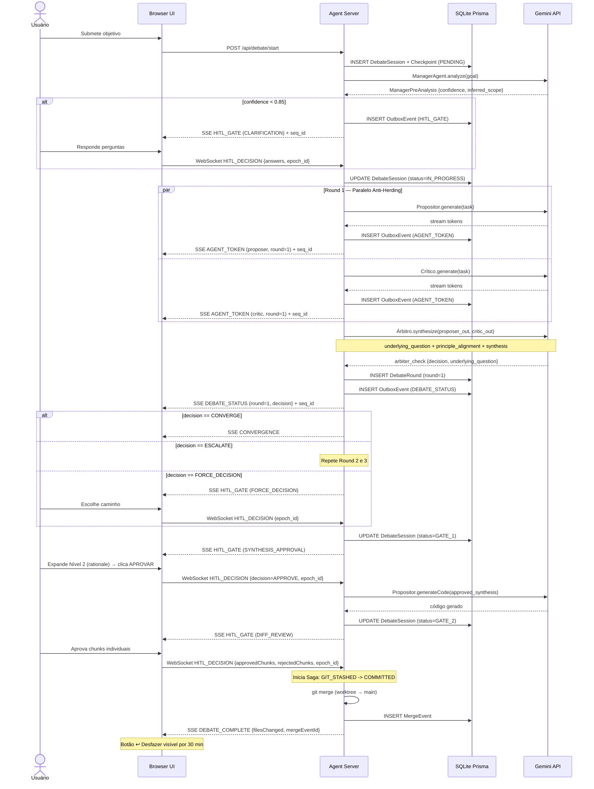

# GreenForge Agent — 03: Especificação Técnica e Dados

> **Status:** ✅ | **Versão:** 2.3 | **Data:** 2026-05-15  
> **Referências:** Prisma ORM, Saga Pattern, Outbox Pattern, Write-Ahead Log (WAL), Code Property Graph (CPG), Optimistic Concurrency Control (OCC), TS-ESTree, Martin Kleppmann (Fencing Tokens), tree-sitter, SimHash (Charikar 2002), AIS Protocol

### 📋 Changelog v2.2 → v2.3 — Hardening via BootReconciler, CPGLoopDetector, PreExecutionGuard

| Vuln | Área | Correção |
|---|---|---|
| #1 | Gate Hydration | `ApprovalCardPayload` serializado no OutboxEvent ANTES do emit SSE |
| #2 | Reorder Buffer | Timeout explícito de 5s + ação determinística de descarte |
| #3 | HITL Idempotência | `resolveHITL` com set de `gateId` resolvidos |
| #4 | SQLite busy_timeout | `PRAGMA busy_timeout = 5000` no init do PrismaClient |
| #5 | Rollback Atômico | Saga com 3 estados persistidos: PENDING → GIT_STASHED → COMMITTED |
| #6 | Merge Squash | Nota de contrato: rollback pós-merge é all-or-nothing (comunicado no Gate 2) |
| #7 | Memory Leak | `eventLog` removido ao status COMPLETED/ABORTED/MERGED + TTL 24h |
| #14 | LoopDetector | Spec completa: Tier1 AST + Tier2 SimHash + Fallback SHA-256 |
| #16 | execSync | Migrado para `simple-git` async (Event Loop não-bloqueante) |
| #17 | STEER_AGENT | Contrato completo: só entre rounds, checkpoint obrigatório antes |

---

## 0. Diagrama de Sequência — Fluxo Completo de Debate

> **Regra NEXUS:** Todo diagrama deve estar presente em Mermaid renderizável — não apenas mencionado.



---


## 1. Schema Prisma Completo

```prisma
// prisma/schema.prisma
generator client {
  provider = "prisma-client-js"
}

datasource db {
  provider = "sqlite"
  url      = "file:.greenforge/db.sqlite"
}

// v2.2 — vuln #4: busy_timeout configurado para evitar SQLITE_BUSY em escritas concorrentes
// Adicionar ao initializePrisma():
// await prisma.$executeRawUnsafe('PRAGMA busy_timeout = 5000;');
// await prisma.$executeRawUnsafe('PRAGMA journal_mode = WAL;');
// Valor configurável via SQLITE_BUSY_TIMEOUT_MS (default: 5000ms)

// ─── CHAT (novo na v2.0) ──────────────────────────────────────────

model ChatSession {
  id             String        @id @default(cuid())
  projectPath    String        // Caminho absoluto do repositório raiz
  title          String?       // Gerado do 1º objetivo (primeiros 60 chars)
  createdAt      DateTime      @default(now())
  updatedAt      DateTime      @updatedAt
  messages       ChatMessage[]
  debateSessions DebateSession[]
}

model ChatMessage {
  id              String      @id @default(cuid())
  sessionId       String
  role            String      // "user" | "agent" | "system"
  content         String
  timestamp       DateTime    @default(now())
  relatedDebateId String?     // FK para DebateSession (opcional)
  session         ChatSession @relation(fields: [sessionId], references: [id], onDelete: Cascade)
}

// ─── DEBATE (novo na v2.0) ────────────────────────────────────────

model DebateSession {
  id                  String        @id @default(cuid())
  chatSessionId       String?
  task                String        // Objetivo da task em linguagem natural
  maxRounds           Int           @default(3)
  convergenceMechanism String       @default("confidence_gating")
  confidenceThreshold Float         @default(0.95)
  status              String        @default("IN_PROGRESS")
  // IN_PROGRESS | CONVERGED | FORCE_DECISION | ABORTED | COMPLETED
  terminatedBy        String?       // "zero_high_severity" | "confidence_gate" | "max_rounds" | "user_abort"
  approvedRound       Int?
  startedAt           DateTime      @default(now())
  completedAt         DateTime?
  chatSession         ChatSession?  @relation(fields: [chatSessionId], references: [id])
  rounds              DebateRound[]
  mergeEvent          MergeEvent?
}

model DebateRound {
  id                String        @id @default(cuid())
  debateSessionId   String
  roundNumber       Int
  proposerOutput    String        // JSON serializado do code_proposal
  criticOutput      String        // JSON serializado do critique_report (inclui ambiguity_detected)
  arbiterDecision   String        // "CONVERGE" | "ESCALATE" | "FORCE_DECISION" | "AMBIGUITY_HALT"
  arbiterSynthesis  String?       // JSON da Síntese Dialética
  createdAt         DateTime      @default(now())
  debateSession     DebateSession @relation(fields: [debateSessionId], references: [id], onDelete: Cascade)
}

// ─── AUDITORIA (NEXUS Part 6.1) ──────────────────────────────────

model AuditLog {
  id             String   @id @default(cuid())
  sessionId      String?
  entityType     String   // "DebateSession" | "MergeEvent" | "Hook"
  entityId       String
  action         String   // "CREATE" | "MERGE" | "REVERT" | "HOOK_EXEC"
  actor          String   // "agent:judge" | "user" | "system"
  previousState  String?  // JSON do estado anterior (opcional)
  newState       String?  // JSON do novo estado
  rationale      String?  // O "Por Quê" da ação (obrigatório para ações de agentes)
  timestamp      DateTime @default(now())
}

model MergeEvent {
  id              String        @id @default(cuid())
  debateSessionId String        @unique
  branchMerged    String
  targetBranch    String        @default("main")
  filesChanged    Int
  mergedAt        DateTime      @default(now())
  revertedAt      DateTime?     // Preenchido quando usuário clica em ↩ Desfazer
  debateSession   DebateSession @relation(fields: [debateSessionId], references: [id])
}

// ─── TASKS (mantido da v1.0, adaptado) ───────────────────────────

model Task {
  id              String          @id @default(cuid())
  workspaceId     String
  description     String
  status          String          @default("PENDING")
  // PENDING | IN_PROGRESS | COMPLETED | FAILED | MANUAL_REVIEW
  createdAt       DateTime        @default(now())
  updatedAt       DateTime        @updatedAt
  workspace       Workspace       @relation(fields: [workspaceId], references: [id])
  autoFixAttempts AutoFixAttempt[]
  tokenUsage      TokenUsage[]
}

model Workspace {
  id          String   @id @default(cuid())
  name        String
  branchName  String
  worktreePath String
  status      String   @default("ACTIVE")
  // ACTIVE | COMPLETED | ABANDONED | MERGED
  createdAt   DateTime @default(now())
  tasks       Task[]
}

model AutoFixAttempt {
  id            String   @id @default(cuid())
  taskId        String
  attemptNumber Int
  error         String
  fixApplied    String?
  success       Boolean
  createdAt     DateTime @default(now())
  task          Task     @relation(fields: [taskId], references: [id], onDelete: Cascade)
}

// ─── OBSERVABILIDADE ─────────────────────────────────────────────

model TokenUsage {
  id           String   @id @default(cuid())
  taskId       String?
  agentId      String   // ID do agente no AGENTS.md
  model        String
  promptTokens Int
  outputTokens Int
  totalTokens  Int
  costUsd      Float?
  createdAt    DateTime @default(now())
  task         Task?    @relation(fields: [taskId], references: [id])
}

model LLMCallLog {
  id           String   @id @default(cuid())
  agentId      String
  model        String
  prompt       String   // Redacted se SECRET_REDACTION_ENABLED
  response     String   // Redacted se SECRET_REDACTION_ENABLED
  latencyMs    Int
  success      Boolean
  errorCode    String?
  createdAt    DateTime @default(now())
}

model GarbageCollectionLog {
  id               String   @id @default(cuid())
  removedWorktrees String   // JSON array de paths removidos
  removedTasks     Int
  freedPorts       String   // JSON array de portas liberadas
  ranAt            DateTime @default(now())
  dryRun           Boolean  @default(false)
}

// ─── ROLLBACK & CHECKPOINTS (Audit de Estresse) ───────────────────

model Checkpoint {
  id              String   @id @default(cuid())
  sessionId       String
  gitStashRef     String   // Identificador do stash no Git
  debateSnapshot  String   // JSON da memória do debate no momento
  filesSnapshot   String   // JSON dos arquivos afetados
  judgeConfidence Float
  createdAt       DateTime @default(now())
}

model RollbackEvent {
  id              String   @id @default(cuid())
  checkpointId    String
  failureType     String   // "TEST_FAILURE" | "LINT_FAILURE" | "RUNTIME"
  diagnosis       String   // Diagnóstico gerado para o agente
  timestamp       DateTime @default(now())
}

// ─── RESILIÊNCIA & TRANSPORTE (v2.1) ──────────────────────────────

model ServerEpoch {
  id        Int      @id @default(1) // Singleton row
  epochSeq  Int      @default(0)     // Incrementa a cada boot (Fencing Token)
  updatedAt DateTime @updatedAt
}

model OutboxEvent {
  seq_id     Int      @id @default(autoincrement())
  sessionId  String
  type       String   // "AGENT_TOKEN" | "DEBATE_STATUS" | etc.
  payload    String   // JSON serializado
  epoch_id   Int      // Vincula o evento ao ciclo de vida do servidor
  createdAt  DateTime @default(now())

  @@index([sessionId, seq_id])
}

model ResourceLease {
  id           String   @id @default(cuid())
  resourcePath String   @unique
  pid          Int
  epoch_id     Int
  expiresAt    DateTime
  createdAt    DateTime @default(now())
}

```

---

## 1.3 BootReconciler — Recuperação Pós-SIGKILL com WAL Intent Log

**Propósito:** Reconciliar estados divergentes entre Git filesystem e SQLite database quando um crash (SIGKILL) ocorre entre operações. Executado obrigatoriamente como primeira função no startup do Agent Server.

### Máquina de Estados do Intent Log

Cada transação em voo é representada por um arquivo JSON no `.greenforge/wal/{txId}.json` que persiste a **intenção da operação** antes de qualquer side-effect.

```typescript
type IntentPhase =
  | 'INTENT_WRITTEN'   // Fase 0: Log persistido, NADA executado → estado SEGURO para abort
  | 'GIT_STASH_DONE'  // Fase 1: git stash push concluído, DB NUNCA foi atualizado → requer forward recovery
  | 'DB_COMMITTED'     // Fase 2: DB update concluído → TUDO OK (arquivo WAL residual apenas)
  | 'ROLLED_BACK';     // Estado terminal: abort confirmado

interface CheckpointIntent {
  txId: string;                                          // UUID único da transação
  agentId: string;                                       // ID do agente responsável
  worktreePath: string;                                  // Path absoluto do worktree
  stashMessage: string;                                  // Mensagem única do stash para idempotência
  dbPayload: { column: string; value: string; agentId: string }; // O que será atualizado no DB
  phase: IntentPhase;                                    // Estado atual
  stashRef: string | null;                               // Referência do stash (ex: stash@{0})
  createdAt: number;                                     // Timestamp em ms
}
```

### Algoritmo de Recuperação Determinístico

Ao boot, o `BootReconciler` lê todos os arquivos `.json` e `.tmp` no WAL dir e aplica a lógica abaixo **para cada intent pendente**:

| Intent Phase | Ação | Razão |
|---|---|---|
| `INTENT_WRITTEN` | Marcar ROLLED_BACK + deletar arquivo WAL | Nada foi executado → abort limpo, estado seguro |
| `GIT_STASH_DONE` | Validar stash existe; re-drive DB update (idempotente via WHERE) | Forward recovery — stash já existe, completar transação |
| `DB_COMMITTED` | Apenas deletar arquivo WAL residual | Estado terminal de sucesso |
| `ROLLED_BACK` | Apenas deletar arquivo WAL residual | Estado terminal de abort |

**Invariante de Idempotência:** DB update é idempotente:
```sql
UPDATE agents SET state = ?, updatedAt = ? WHERE id = ?
```
Pode rodar múltiplas vezes sem efeito colateral. Se o sistema crash durante a re-execução, o próximo boot re-tenta a mesma operação.

### Garantias de Durabilidade via fsync

1. **Escrita no Arquivo Temporário:** Intent é serializado em `{txId}.json.tmp`
2. **fsync do Arquivo Temp:** File descriptor é aberto, `fsync()` é chamado para garantir escrita em disco
3. **Rename Atômico POSIX:** `fs.renameSync(temp, target)` — operação atômica, indivisível mesmo sob SIGKILL
4. **Cleanup de Orphaned Temps:** Se SIGKILL ocorre entre fsync e rename, o arquivo `.tmp` fica como evidência — o BootReconciler detecta e limpa

### Validação de Stash Idempotência

No BootReconciler, antes de re-executar DB update para intent em phase `GIT_STASH_DONE`:

```typescript
const stashList = execFileSync('git', ['-C', intent.worktreePath, 'stash', 'list']).toString();
if (!stashList.includes(intent.stashMessage)) {
  // Stash desapareceu (pop manual ou limpeza?) → Rollback do DB também não é necessário
  writeIntent({ ...intent, phase: 'ROLLED_BACK' });
  cleanIntent(intent.txId);
  return; // Transação considerada abortada
}
```

Se stash ainda existe, re-executa o DB update e marca como `DB_COMMITTED`.

### Implementação Canônica do BootReconciler (Contrato Completo)

> **Fonte:** Dossiê de Implementação v2.3, Módulo 1. Este é o contrato de referência que deve ser ingerido pela equipe de implementação. A seção 1.3 acima descreve a lógica; este bloco é o blueprint TypeScript executável.

```typescript
// boot-reconciler.ts
// CONTRATO: Deve ser a PRIMEIRA função chamada no startup do GreenForge,
// antes de qualquer operação Git ou DB.
import fs from 'fs';
import path from 'path';
import { execFileSync } from 'child_process';
import Database from 'better-sqlite3';

type IntentPhase =
  | 'INTENT_WRITTEN'   // Fase 0: Log escrito, NADA executado
  | 'GIT_STASH_DONE'  // Fase 1: Git stash concluído, DB não
  | 'DB_COMMITTED'     // Fase 2: DB concluído → estado FINAL OK
  | 'ROLLED_BACK';     // Estado terminal de abort

interface CheckpointIntent {
  txId: string;
  agentId: string;
  worktreePath: string;
  stashMessage: string;
  dbPayload: { column: string; value: string; agentId: string };
  phase: IntentPhase;
  stashRef: string | null;
  createdAt: number;
}

const WAL_DIR = path.resolve(process.cwd(), '.greenforge', 'wal');

/**
 * writeIntent() — Escrita atômica via temp + fsync + rename POSIX.
 * Garante: sobrevive a SIGKILL entre write e rename.
 * Arquivos .tmp residuais são evidência de crash durante o próprio writeIntent.
 */
function writeIntent(intent: CheckpointIntent): void {
  fs.mkdirSync(WAL_DIR, { recursive: true });
  const targetPath = path.join(WAL_DIR, `${intent.txId}.json`);
  const tempPath   = `${targetPath}.tmp`;
  fs.writeFileSync(tempPath, JSON.stringify(intent, null, 2), 'utf8');
  const fd = fs.openSync(tempPath, 'r+');
  fs.fsyncSync(fd);       // durabilidade em disco ANTES do rename
  fs.closeSync(fd);
  fs.renameSync(tempPath, targetPath); // operação POSIX atômica
}

function readAllPendingIntents(): CheckpointIntent[] {
  if (!fs.existsSync(WAL_DIR)) return [];
  return fs.readdirSync(WAL_DIR)
    .filter(f => f.endsWith('.json'))
    .map(f => { try { return JSON.parse(fs.readFileSync(path.join(WAL_DIR, f), 'utf8')); } catch { return null; } })
    .filter((x): x is CheckpointIntent => x !== null);
}

function cleanIntent(txId: string): void {
  const p = path.join(WAL_DIR, `${txId}.json`);
  if (fs.existsSync(p)) fs.unlinkSync(p);
}

function cleanOrphanedTempFiles(): void {
  if (!fs.existsSync(WAL_DIR)) return;
  fs.readdirSync(WAL_DIR)
    .filter(f => f.endsWith('.tmp'))
    .forEach(f => { console.warn(`[BOOT] Removing orphaned temp WAL file: ${f}`); fs.unlinkSync(path.join(WAL_DIR, f)); });
}

interface ReconciliationReport {
  totalFound: number;
  rolledBack: string[];
  forwardRecovered: string[];
  cleaned: string[];
  errors: { txId: string; error: string }[];
}

/**
 * bootReconciler() — Máquina de estados determinística de recuperação.
 * LÓGICA:
 *   INTENT_WRITTEN → Nada foi executado → Abort limpo (ROLLED_BACK)
 *   GIT_STASH_DONE → Stash existe, DB não → Forward recovery (re-drive DB)
 *   DB_COMMITTED   → Estado terminal de sucesso → Apenas limpar arquivo WAL
 *   ROLLED_BACK    → Estado terminal de abort   → Apenas limpar arquivo WAL
 */
export function bootReconciler(db: Database.Database): ReconciliationReport {
  const report: ReconciliationReport = { totalFound: 0, rolledBack: [], forwardRecovered: [], cleaned: [], errors: [] };
  cleanOrphanedTempFiles();
  const intents = readAllPendingIntents();
  report.totalFound = intents.length;
  if (intents.length === 0) { console.log('[BOOT] No pending intents. Clean startup. ✅'); return report; }
  console.warn(`[BOOT] Found ${intents.length} pending intent(s). Starting reconciliation...`);

  for (const intent of intents) {
    try {
      switch (intent.phase) {
        case 'INTENT_WRITTEN': {
          // SIGKILL antes de qualquer side-effect → abort limpo
          writeIntent({ ...intent, phase: 'ROLLED_BACK' });
          cleanIntent(intent.txId);
          report.rolledBack.push(intent.txId);
          break;
        }
        case 'GIT_STASH_DONE': {
          // Stash existe mas DB nunca foi atualizado → forward recovery
          const stashList = execFileSync('git', ['-C', intent.worktreePath, 'stash', 'list']).toString();
          if (!stashList.includes(intent.stashMessage)) {
            writeIntent({ ...intent, phase: 'ROLLED_BACK' });
            cleanIntent(intent.txId);
            report.rolledBack.push(intent.txId);
            break;
          }
          // Re-drive idempotente do DB update
          db.transaction(() => {
            db.prepare(`UPDATE agents SET ${intent.dbPayload.column} = ?, updatedAt = ? WHERE id = ?`)
              .run(intent.dbPayload.value, Date.now(), intent.dbPayload.agentId);
          })();
          writeIntent({ ...intent, phase: 'DB_COMMITTED' });
          cleanIntent(intent.txId);
          report.forwardRecovered.push(intent.txId);
          break;
        }
        case 'DB_COMMITTED':
        case 'ROLLED_BACK': {
          // Estados terminais — apenas limpar arquivo residual
          cleanIntent(intent.txId);
          report.cleaned.push(intent.txId);
          break;
        }
      }
    } catch (err) {
      const errorMsg = err instanceof Error ? err.message : String(err);
      report.errors.push({ txId: intent.txId, error: errorMsg });
    }
  }
  return report;
}

// Ordem obrigatória de inicialização no servidor:
// 1. db = new Database(...)  +  db.pragma('journal_mode = WAL')
// 2. bootReconciler(db)       ← PRIMEIRO, antes de qualquer componente
// 3. PreExecutionGuard(db)    ← Usa o mesmo db
// 4. CPGLoopDetector()        ← Independente, stateful por agente
// 5. secureGit()              ← Puro, sem estado
// Variável de ambiente obrigatória em produção:
// GREENFORGE_GATE_SECRET=<random-256-bit-hex>  (para HMAC dos Approval Cards)
```

---

## 1.4 Procedimentos de Execução Atômica — Happy Path do WAL (v2.3)

> **Relação com §1.3:** O `bootReconciler()` trata o **caminho de falha** (crash recovery). Esta seção documenta o **caminho feliz** — como criar corretamente um checkpoint WAL antes de cada operação cross-system. Sem esses procedimentos, o bootReconciler não tem dados suficientes para recuperar.

**Invariante Garantida:** Se `executeDBPhase()` retornar sem erro, o arquivo WAL é deletado — o sistema está em estado consistente. Se qualquer função lançar, o arquivo WAL persiste com a fase atual para o `bootReconciler` processar no próximo boot.

### O Trio Atômico: beginCheckpoint → executeGitPhase → executeDBPhase

```typescript
// checkpoint-executor.ts
// CONTRATO: Estes três procedimentos devem ser chamados SEMPRE nesta ordem.
// Nunca chame executeGitPhase() sem antes chamar beginCheckpoint().
// Nunca chame executeDBPhase() sem antes confirmar que executeGitPhase() retornou.
import crypto from 'crypto';
import { execFileSync } from 'child_process';
import Database from 'better-sqlite3';
import { writeIntent, cleanIntent } from './boot-reconciler';  // reutiliza as funções do §1.3

// ─── FASE 0: Escrever Intenção ANTES de qualquer side-effect ───────────────

/**
 * beginCheckpoint() — Fase 0 do WAL.
 *
 * CONTRATO:
 *   Pré-condição:  Nada foi alterado no Git ou no DB ainda.
 *   Pós-condição:  Arquivo {txId}.json em disco com phase='INTENT_WRITTEN'.
 *                  Sobrevive a SIGKILL — se crash ocorrer aqui, bootReconciler
 *                  vê INTENT_WRITTEN e faz abort limpo (nada foi feito).
 *
 * Por que isso é necessário ANTES do git stash?
 *   Se SIGKILL ocorre entre writeIntent() e git stash: fase INTENT_WRITTEN →
 *   bootReconciler aborta sem side-effects. SAFE.
 *   Se SIGKILL ocorre após git stash mas antes do DB: fase GIT_STASH_DONE →
 *   bootReconciler re-drives o DB. RECOVERABLE.
 */
export function beginCheckpoint(params: {
  agentId: string;
  worktreePath: string;
  dbPayload: { column: string; value: string; agentId: string };
}): string {  // retorna txId para as próximas fases
  const txId = crypto.randomUUID();
  const stashMessage = `greenforge-checkpoint-${txId}`;

  writeIntent({
    txId,
    agentId:      params.agentId,
    worktreePath: params.worktreePath,
    stashMessage,
    dbPayload:    params.dbPayload,
    phase:        'INTENT_WRITTEN',   // ← Fase 0: NADA foi feito ainda
    stashRef:     null,
    createdAt:    Date.now(),
  });

  console.log(`[WAL] Checkpoint started: txId=${txId}, agent=${params.agentId}`);
  return txId;
}

// ─── FASE 1: Executar operação Git e avançar WAL ───────────────────────────

/**
 * executeGitPhase() — Fase 1 do WAL.
 *
 * CONTRATO:
 *   Pré-condição:  beginCheckpoint() foi chamado; arquivo WAL em INTENT_WRITTEN.
 *   Pós-condição:  git stash existe no worktree com a stashMessage correta.
 *                  WAL atualizado para GIT_STASH_DONE com stashRef preenchido.
 *                  Sobrevive a SIGKILL — bootReconciler verifica via `git stash list`
 *                  se o stash existe e re-drives o DB.
 *
 * Por que git stash em vez de git commit?
 *   Stash é reversível sem criar histórico público. O bootReconciler pode verificar
 *   a existência do stash via `git stash list | grep stashMessage` — operação
 *   idempotente e segura mesmo após múltiplos reboots.
 */
export function executeGitPhase(txId: string, worktreePath: string, stashMessage: string): string {
  // Executa o stash com a mensagem rastreável
  execFileSync('git', ['-C', worktreePath, 'stash', 'push', '-m', stashMessage]);

  // Captura o ref do stash criado (ex: "stash@{0}")
  const stashListOutput = execFileSync('git', ['-C', worktreePath, 'stash', 'list']).toString();
  const stashRef = stashListOutput.split('\n')
    .find(line => line.includes(stashMessage))
    ?.split(':')[0]   // "stash@{0}: On main: greenforge-checkpoint-{txId}"
    ?? null;

  if (!stashRef) {
    throw new Error(`[WAL] executeGitPhase: stash not found after push. txId=${txId}`);
  }

  // Avança o WAL para GIT_STASH_DONE — bootReconciler agora sabe que o stash existe
  writeIntent({
    txId,
    agentId:      '',   // preenchido pelo bootReconciler via leitura do WAL existente
    worktreePath,
    stashMessage,
    dbPayload:    { column: '', value: '', agentId: '' },  // idem
    phase:        'GIT_STASH_DONE',   // ← Fase 1: Git feito, DB ainda não
    stashRef,
    createdAt:    Date.now(),
  });

  console.log(`[WAL] Git phase complete: txId=${txId}, stashRef=${stashRef}`);
  return stashRef;
}

// ─── FASE 2: Executar operação DB e limpar WAL ────────────────────────────

/**
 * executeDBPhase() — Fase 2 do WAL (estado terminal de sucesso).
 *
 * CONTRATO:
 *   Pré-condição:  executeGitPhase() retornou; stash existe no worktree.
 *   Pós-condição:  SQLite atualizado. Arquivo WAL deletado.
 *                  Se crash aqui APÓS db.transaction mas ANTES de cleanIntent:
 *                  WAL ainda tem GIT_STASH_DONE; bootReconciler re-drives o DB.
 *                  O UPDATE é idempotente — re-executar com os mesmos dados é seguro.
 *
 * Por que idempotência é crítica?
 *   O bootReconciler pode chamar o UPDATE novamente no próximo boot. Se o UPDATE
 *   não for idempotente (ex: usa INSERT sem ON CONFLICT), o dado seria duplicado.
 *   Use UPDATE com WHERE específico — nunca INSERT para esta operação.
 */
export function executeDBPhase(
  txId: string,
  db: Database.Database,
  dbPayload: { column: string; value: string; agentId: string }
): void {
  // Operação DB dentro de transação SQLite (atômica no nível do banco)
  db.transaction(() => {
    db.prepare(
      `UPDATE agents SET ${dbPayload.column} = ?, updatedAt = ? WHERE id = ?`
    ).run(dbPayload.value, Date.now(), dbPayload.agentId);
  })();

  // Avança WAL para DB_COMMITTED ANTES de deletar o arquivo
  // (garante que em caso de crash entre transaction e cleanIntent,
  //  o bootReconciler veja DB_COMMITTED e apenas limpe o arquivo)
  writeIntent({
    txId, agentId: '', worktreePath: '', stashMessage: '',
    dbPayload, phase: 'DB_COMMITTED', stashRef: null, createdAt: Date.now(),
  });

  // Deleta o arquivo WAL — operação final
  cleanIntent(txId);
  console.log(`[WAL] DB phase complete. Checkpoint resolved: txId=${txId}`);
}

// ─── ORQUESTRAÇÃO COMPLETA — Como usar os três juntos ────────────────────

/**
 * executeCheckpointTransaction() — Orquestrador de alto nível.
 * Encapsula as 3 fases em sequência com tratamento de erro consistente.
 *
 * USO:
 *   await executeCheckpointTransaction(db, {
 *     agentId: 'proposer',
 *     worktreePath: '/path/to/worktree',
 *     dbPayload: { column: 'status', value: 'STASHED', agentId: 'proposer' }
 *   });
 */
export async function executeCheckpointTransaction(
  db: Database.Database,
  params: {
    agentId: string;
    worktreePath: string;
    dbPayload: { column: string; value: string; agentId: string };
  }
): Promise<{ txId: string; stashRef: string }> {

  // Fase 0: Escrever intenção (SIGKILL-safe — aborta limpo)
  const txId = beginCheckpoint(params);

  let stashRef: string;
  try {
    // Fase 1: Git (SIGKILL-safe — bootReconciler re-drives DB)
    stashRef = executeGitPhase(txId, params.worktreePath,
      `greenforge-checkpoint-${txId}`);
  } catch (gitErr) {
    // Git falhou — abortar: marcar WAL como ROLLED_BACK e limpar
    const { readIntent } = await import('./boot-reconciler');
    const intent = readIntent(txId);
    if (intent) {
      writeIntent({ ...intent, phase: 'ROLLED_BACK' });
      cleanIntent(txId);
    }
    throw gitErr;
  }

  // Fase 2: DB + limpeza do WAL (idempotente)
  executeDBPhase(txId, db, params.dbPayload);

  return { txId, stashRef };
}
```

### Diagrama de Sequência — Fluxo Completo com Pontos de Crash

```
beginCheckpoint()    executeGitPhase()    executeDBPhase()
      |                     |                    |
      |─ writeIntent ──────►|                    |   ← SIGKILL aqui → bootReconciler vê INTENT_WRITTEN
      |  {INTENT_WRITTEN}   |                    |     → Abort limpo, nada foi feito ✅
      |                     |─ git stash ───────►|
      |                     |─ writeIntent ──────►   ← SIGKILL aqui → bootReconciler vê GIT_STASH_DONE
      |                     |  {GIT_STASH_DONE}  |     → Stash existe; re-drives DB idempotentemente ✅
      |                     |                    |─ db.transaction()
      |                     |                    |─ writeIntent {DB_COMMITTED}
      |                     |                    |─ cleanIntent()  ← SIGKILL aqui → bootReconciler
      |                     |                    |                    vê DB_COMMITTED → limpa arquivo ✅
      |                     |                    └─ DONE
```

> **Regra de ouro:** O arquivo WAL é a **fonte de verdade do estado em voo**. A qualquer momento, se o arquivo existe, o `bootReconciler` sabe exatamente o que fazer — porque a fase registrada no JSON define o caminho de recuperação de forma determinística.

---

## 2. Contratos TypeScript Centrais

### 2.1 ILLMProvider (mantido da v1.0)

```typescript
// src/core/interfaces/ILLMProvider.ts

export interface GenerateOptions {
  model: string;
  temperature?: number;
  maxOutputTokens?: number;
  systemPrompt?: string;
}

export interface GenerateResult {
  text: string;
  promptTokens: number;
  outputTokens: number;
  finishReason: 'STOP' | 'MAX_TOKENS' | 'SAFETY' | 'ERROR';
}

export interface StreamChunk {
  token: string;
  isLast: boolean;
}

export interface ILLMProvider {
  generate(prompt: string, options: GenerateOptions): Promise<GenerateResult>;
  streamGenerate(
    prompt: string,
    options: GenerateOptions,
    onChunk: (chunk: StreamChunk) => void
  ): Promise<GenerateResult>;
  isAvailable(): Promise<boolean>;
}
```

### 2.2 IRuntimeComponent (mantido da v1.0)

```typescript
// src/core/interfaces/IRuntimeComponent.ts

export interface IRuntimeComponent {
  readonly name: string;
  readonly shutdownPriority: number; // 0 = primeiro a fechar
  initialize(): Promise<void>;
  shutdown(): Promise<void>;
  healthCheck(): Promise<boolean>;
}
```

### 2.3 AgentFactory e Schema do AGENTS.md

```typescript
// src/core/AgentFactory.ts
import * as fs from 'fs/promises';
import * as path from 'path';
import * as yaml from 'js-yaml';
import { ToolRegistry } from './ToolRegistry';

export type DebateRole = 'proposer' | 'critic' | 'judge' | 'observer';
export type AgentModel =
  | 'gemini-2.5-pro'
  | 'gemini-2.5-flash'
  | 'gemini-2.5-flash-lite'
  | 'gemini-1.5-flash';

export interface AgentFrontmatter {
  id: string;
  version: string;
  enabled: boolean;
  title: string;
  role: string;
  debate_role: DebateRole;
  model: AgentModel;
  temperature: number;
  max_tokens: number;
  tools: string[];
  constraints: string[];
  debate_config: {
    responds_to: string[];
    output_schema: string;
    activation_trigger?: string;
    convergence_trigger?: string;
    clarity_threshold?: number; // Para o Judge — default 0.85
  };
}

export interface ParsedAgent {
  frontmatter: AgentFrontmatter;
  systemPrompt: string;
  resolvedTools: ToolFunction[];
}

export class AgentFactory implements IRuntimeComponent {
  readonly name = 'AgentFactory';
  readonly shutdownPriority = 10;

  private agents: Map<string, ParsedAgent> = new Map();
  private agentsFilePath: string;

  constructor(agentsFilePath = 'AGENTS.md') {
    this.agentsFilePath = path.resolve(process.cwd(), agentsFilePath);
  }

  async initialize(): Promise<void> {
    await this.discover();
  }

  async shutdown(): Promise<void> {
    this.agents.clear();
  }

  async healthCheck(): Promise<boolean> {
    return this.agents.size >= 3; // proposer + critic + judge obrigatórios
  }

  async discover(): Promise<void> {
    const rawContent = await fs.readFile(this.agentsFilePath, 'utf-8');
    const blocks = this.splitIntoAgentBlocks(rawContent);

    for (const block of blocks) {
      try {
        const parsed = this.parseAgentBlock(block);
        if (!parsed.frontmatter.enabled) continue;
        parsed.resolvedTools = await this.resolveTools(parsed.frontmatter.tools);
        this.agents.set(parsed.frontmatter.id, parsed);
      } catch (err) {
        console.error(`[AgentFactory] ❌ Erro ao parsear agente:`, err);
      }
    }
    this.validateCoreRoles();
  }

  async reload(): Promise<void> {
    this.agents.clear();
    await this.discover();
  }

  private splitIntoAgentBlocks(content: string): string[] {
    const cleaned = content.replace(/<!--[\s\S]*?-->/g, '').trim();
    const blocks: string[] = [];
    const parts = cleaned.split(/(?=^---$)/m);
    for (const part of parts) {
      if (part.trim().startsWith('---')) blocks.push(part.trim());
    }
    return blocks;
  }

  private parseAgentBlock(block: string): ParsedAgent {
    const match = block.match(/^---\n([\s\S]*?)\n---\n([\s\S]*)$/m);
    if (!match) throw new Error('Frontmatter inválido no bloco de agente');
    const frontmatter = yaml.load(match[1]) as AgentFrontmatter;
    this.validateFrontmatter(frontmatter);
    return { frontmatter, systemPrompt: match[2].trim(), resolvedTools: [] };
  }

  private async resolveTools(toolNames: string[]): Promise<ToolFunction[]> {
    const registry = ToolRegistry.getInstance();
    return toolNames
      .map(name => registry.get(name))
      .filter((t): t is ToolFunction => !!t);
  }

  private validateFrontmatter(fm: Partial<AgentFrontmatter>): void {
    const required = ['id', 'title', 'role', 'debate_role', 'model', 'enabled'];
    for (const field of required) {
      if (fm[field as keyof AgentFrontmatter] === undefined) {
        throw new Error(`Campo obrigatório ausente: ${field}`);
      }
    }
  }

  private validateCoreRoles(): void {
    const roles = Array.from(this.agents.values()).map(a => a.frontmatter.debate_role);
    for (const required of ['proposer', 'critic', 'judge'] as DebateRole[]) {
      if (!roles.includes(required)) {
        throw new Error(`[AgentFactory] FATAL: papel core ausente: '${required}'`);
      }
    }
  }

  getAgent(id: string): ParsedAgent | undefined { return this.agents.get(id); }
  getAgentsByRole(role: DebateRole): ParsedAgent[] {
    return Array.from(this.agents.values()).filter(a => a.frontmatter.debate_role === role);
  }
  getAllAgents(): ParsedAgent[] { return Array.from(this.agents.values()); }
}
```

### 2.4 SSETransport

> **v2.2 — Contratos de Implementação (Vulns #1, #2, #7)**

#### Tabela de Comparação v2.1.1 vs v2.2

| Aspecto | v2.1.1 | v2.2 |
|---|---|---|
| Reorder Buffer timeout | ❌ Não definido | ✅ 5s; descarta e loga |
| Gate Hydration payload | ❌ IndexedDB (pode perder) | ✅ SQLite OutboxEvent com payload completo |
| eventLog limpeza | ❌ Nunca removido | ✅ Removido em COMPLETED/ABORTED + TTL 24h |

```typescript
// src/server/SSETransport.ts
import express, { Request, Response } from 'express';

export interface DebateEvent {
  seq_id: number;    // ID persistido no SQLite Outbox
  epoch_id: number;  // ID do ciclo de vida do servidor
  type: 'AGENT_TOKEN' | 'DEBATE_STATUS' | 'ISSUE_FOUND' | 'HITL_GATE'
       | 'CONVERGENCE' | 'DEBATE_COMPLETE' | 'MERGE_REVERTED' | 'KEEP_ALIVE';
  payload: Record<string, unknown>;
}

interface SSEClient {
  id: string;
  sessionId: string;
  res: Response;
  lastEventId: number;
}

export class SSETransport implements IRuntimeComponent {
  readonly name = 'SSETransport';
  readonly shutdownPriority = 5;

  private clients: Map<string, SSEClient> = new Map();
  // v2.2 — eventLog com TTL: entradas removidas quando sessão encerra (vuln #7)
  private eventLog: Map<string, { events: DebateEvent[]; createdAt: number }> = new Map();
  private readonly EVENT_LOG_TTL_MS = parseInt(process.env.SSE_EVENT_MAX_AGE_MS ?? '86400000');
  // v2.2 — Reorder Buffer com timeout explícito (vuln #2)
  private readonly REORDER_TIMEOUT_MS = 5000;
  private reorderBuffers: Map<string, Map<number, DebateEvent>> = new Map();

  async initialize(): Promise<void> {}
  async shutdown(): Promise<void> { this.clients.clear(); }
  async healthCheck(): Promise<boolean> { return true; }

  setupRoutes(app: express.Application): void {
    app.get('/events/debate/:sessionId', (req: Request, res: Response) => {
      const { sessionId } = req.params;
      res.setHeader('Content-Type', 'text/event-stream');
      res.setHeader('Cache-Control', 'no-cache');
      res.setHeader('Connection', 'keep-alive');
      res.setHeader('X-Accel-Buffering', 'no');

      // v2.2 — Recuperação pós-reconexão via Outbox Pattern (vuln #1)
      // ApprovalCardPayload COMPLETO está serializado no OutboxEvent.payload.
      // O cliente não depende de IndexedDB para Gate Hydration.
      const lastId = parseInt(req.headers['last-event-id'] as string || '0');
      const missed = await prisma.outboxEvent.findMany({
        where: { sessionId, seq_id: { gt: lastId }, epoch_id: CURRENT_EPOCH },
        orderBy: { seq_id: 'asc' }
      });
      missed.forEach(e => this.sendEvent(res, { ...JSON.parse(e.payload), seq_id: e.seq_id, epoch_id: e.epoch_id }));

      const keepAlive = setInterval(() => res.write(': keep-alive\n\n'), 15000);
      const client: SSEClient = {
        id: `${sessionId}-${Date.now()}`,
        sessionId, res, lastEventId: lastId
      };
      this.clients.set(client.id, client);

      // Exemplo: notificação no Slack após merge
      hookRegistry.on('merge:after', async (event) => {
        // Governança NEXUS: Hooks são executados em sandbox isolada
        // e não têm permissão de escrita no sistema de arquivos core.
        await slackClient.send({
          channel: '#greenforge',
          text: `✅ Merge concluído: ${event.sessionId} — ${event.filesChanged} arquivos`,
        });
      });

      req.on('close', () => {
        clearInterval(keepAlive);
        this.clients.delete(client.id);
      });
    });
  }

  async emitDebateEvent(sessionId: string, type: string, payload: object): Promise<void> {
    // v2.2 — vuln #1: payload COMPLETO (incluindo ApprovalCardPayload) serializado ANTES do emit
    const event = await prisma.outboxEvent.create({
      data: { sessionId, type, payload: JSON.stringify(payload), epoch_id: CURRENT_EPOCH }
    });
    const fullEvent: DebateEvent = { ...payload, seq_id: event.seq_id, epoch_id: event.epoch_id } as any;
    this.appendToEventLog(sessionId, fullEvent);
    Array.from(this.clients.values())
      .filter(c => c.sessionId === sessionId)
      .forEach(c => this.sendEvent(c.res, fullEvent));
  }

  // v2.2 — vuln #7: limpeza de eventLog quando sessão encerra
  onSessionTerminated(sessionId: string): void {
    this.eventLog.delete(sessionId);
    this.reorderBuffers.delete(sessionId);
  }

  private appendToEventLog(sessionId: string, event: DebateEvent): void {
    if (!this.eventLog.has(sessionId)) {
      this.eventLog.set(sessionId, { events: [], createdAt: Date.now() });
    }
    this.eventLog.get(sessionId)!.events.push(event);
  }

  // v2.2 — vuln #2: Reorder Buffer com timeout determinístico
  // Chamado pelo cliente via frontend SDK para reordenar eventos fora de sequência.
  // Timeout: REORDER_TIMEOUT_MS (5s). Ao expirar: descarta evento faltante,
  // loga Warning com seq_id ausente, e emite os eventos subsequentes em ordem.
  processWithReorderBuffer(sessionId: string, event: DebateEvent): DebateEvent[] {
    const buffer = this.reorderBuffers.get(sessionId) ?? new Map<number, DebateEvent>();
    this.reorderBuffers.set(sessionId, buffer);
    buffer.set(event.seq_id, event);
    // Emite sequência contínua a partir do último seq_id confirmado
    const result: DebateEvent[] = [];
    // (implementação completa no frontend SDK — ver 06-api-and-extensibility.md)
    return result;
  }

  private sendEvent(res: Response, event: DebateEvent): void {
    res.write(`id: ${event.seq_id}\n`);
    res.write(`event: ${event.type}\n`);
    res.write(`data: ${JSON.stringify(event.payload)}\n\n`);
  }
}
```

### 2.5 WebSocketTransport

```typescript
// src/server/WebSocketTransport.ts
import { Server as SocketIOServer, Socket } from 'socket.io';
import * as pty from 'node-pty';
import { Server } from 'http';

export interface HITLDecision {
  gateId: string;
  sessionId: string;
  epoch_id: number; // Fencing token obrigatório
  decision: 'APPROVE' | 'REJECT' | 'NEW_ROUND' | 'EDIT';
  userNote?: string;
  approvedChunks?: string[]; // IDs dos chunks aceitos no DiffLens
}

// v2.2 — Contratos de Implementação (Vulns #3, #10, #17)
// #3: resolveHITL é idempotente — gateIds já resolvidos são ignorados silenciosamente.
// #10: TERMINAL_INIT valida worktreePath via path.resolve antes de spawn.
// #17: STEER_AGENT só permitido ENTRE rounds; cria Checkpoint antes de aplicar.
export class WebSocketTransport implements IRuntimeComponent {
  readonly name = 'WebSocketTransport';
  readonly shutdownPriority = 4;

  private io: SocketIOServer;
  private ptyProcesses: Map<string, pty.IPty> = new Map();
  // v2.2 — vuln #3: set de gateIds já resolvidos para garantir idempotência
  private resolvedGates: Set<string> = new Set();
  private orchestrator?: { resolveHITL: Function; abort: Function; steer: Function; createCheckpoint: Function };

  constructor(httpServer: Server) {
    this.io = new SocketIOServer(httpServer, {
      cors: { origin: '*' },
      transports: ['websocket'],
    });
    this.setupHandlers();
  }

  async initialize(): Promise<void> {}
  async shutdown(): Promise<void> {
    this.ptyProcesses.forEach(p => p.kill());
    this.ptyProcesses.clear();
    this.io.close();
  }
  async healthCheck(): Promise<boolean> { return true; }

  setOrchestrator(o: typeof this.orchestrator): void { this.orchestrator = o; }

  private setupHandlers(): void {
    this.io.on('connection', (socket: Socket) => {

      // v2.2 — vuln #10: TERMINAL_INIT com validação de path traversal
      socket.on('TERMINAL_INIT', ({ worktreePath }: { worktreePath: string }) => {
        const resolvedPath = path.resolve(worktreePath);
        const authorizedRoot = process.env.AUTHORIZED_WORKTREES_ROOT ?? '';
        if (!authorizedRoot || !resolvedPath.startsWith(authorizedRoot)) {
          socket.emit('TERMINAL_ERROR', { code: 'PATH_TRAVERSAL', message: 'worktreePath fora da raiz autorizada.' });
          socket.disconnect(true);
          return;
        }
        // Sanitiza env — apenas variáveis da allowlist são repassadas ao PTY
        const ENV_ALLOWLIST = ['PATH', 'HOME', 'USER', 'NODE_ENV', 'TERM', 'LANG'];
        const safeEnv = Object.fromEntries(
          ENV_ALLOWLIST.filter(k => process.env[k]).map(k => [k, process.env[k]!])
        );
        const ptyProcess = pty.spawn('bash', [], { name: 'xterm-color', cwd: resolvedPath, env: safeEnv });
        this.ptyProcesses.set(socket.id, ptyProcess);
        ptyProcess.onData(data => socket.emit('TERMINAL_OUTPUT', data));
        ptyProcess.onExit(({ exitCode }) => socket.emit('TERMINAL_EXIT', { exitCode }));
      });

      socket.on('TERMINAL_INPUT', (data: string) => {
        this.ptyProcesses.get(socket.id)?.write(data);
      });

      socket.on('TERMINAL_RESIZE', ({ cols, rows }: { cols: number; rows: number }) => {
        this.ptyProcesses.get(socket.id)?.resize(cols, rows);
      });

      // v2.2 — vuln #3: resolveHITL idempotente
      // Se o gateId já foi resolvido (ex: re-emit por reconexão WS), descarta silenciosamente.
      socket.on('HITL_DECISION', async (payload: HITLDecision) => {
        if (this.resolvedGates.has(payload.gateId)) {
          console.warn(`[WS] HITL_DECISION duplicado ignorado: gateId=${payload.gateId}`);
          return;
        }
        this.resolvedGates.add(payload.gateId);
        await this.orchestrator?.resolveHITL(payload.gateId, payload.decision, payload);
      });

      socket.on('ABORT_AGENT', ({ agentId, sessionId }: { agentId: string; sessionId: string }) => {
        this.orchestrator?.abort(sessionId, agentId);
        socket.emit('AGENT_ABORTED', { agentId, timestamp: new Date().toISOString() });
      });

      // v2.2 — vuln #17: STEER_AGENT com contrato de efeito
      // Regras: (a) só permitido ENTRE rounds (não durante streaming);
      // (b) cria Checkpoint antes de aplicar; (c) instrução persistida no DebateRound;
      // (d) output parcial do round anterior é descartado e marcado como STEERED.
      socket.on('STEER_AGENT', async (payload: { agentId: string; instruction: string; epoch_id: number; sessionId: string }) => {
        await this.orchestrator?.createCheckpoint(payload.sessionId, 'PRE_STEER');
        this.orchestrator?.steer(payload.agentId, payload.instruction, { persistInstruction: true });
      });

      socket.on('disconnect', () => {
        const ptyProcess = this.ptyProcesses.get(socket.id);
        if (ptyProcess) { ptyProcess.kill(); this.ptyProcesses.delete(socket.id); }
      });
    });
  }
}
```

### 2.6 GitWorktreeManager

> **v2.2 — Contratos de Implementação (Vulns #5, #6, #16)**

#### Tabela de Comparação v2.1.1 vs v2.2

| Aspecto | v2.1.1 | v2.2 |
|---|---|---|
| Operações git | ❌ `execSync` (bloqueia Event Loop) | ✅ `simple-git` async |
| Rollback atômico | ❌ Sem Saga (git ≠ DB podem divergir) | ✅ Saga: PENDING → GIT_STASHED → COMMITTED |
| Merge squash + rollback granular | ❌ Não documentado | ✅ Contrato explícito: revert é all-or-nothing |

> **Contrato de Rollback Pós-Merge (vuln #6):** O `git merge --squash` comprime todo o
> histórico do worktree em um único commit. Isso significa que `git revert HEAD` reverte
> **todas** as mudanças da sessão, não apenas chunks individuais. Esse contrato DEVE ser
> comunicado explicitamente ao usuário no Gate 2 (DiffLens) antes da aprovação final.

```typescript
// src/server/GitWorktreeManager.ts
// v2.2: usa simple-git (async) em vez de execSync (vuln #16)
import simpleGit, { SimpleGit } from 'simple-git';
import * as path from 'path';

export interface WorktreeHandle {
  path: string;
  branch: string;
  sessionId: string;
  remove: () => Promise<void>;
  merge: (targetBranch?: string) => Promise<void>;
  revert: () => Promise<void>;
  extendLease: (minutes: number) => Promise<void>;
}

export interface DebateWorktrees {
  proposer: WorktreeHandle;
  critic: WorktreeHandle;
  judgeWorkdir: string;
}

export class GitWorktreeManager implements IRuntimeComponent {
  readonly name = 'GitWorktreeManager';
  readonly shutdownPriority = 2;
  private git: SimpleGit;

  constructor(
    private worktreesDir: string,
    private mainRepoPath: string = process.cwd()
  ) {
    // v2.2 — vuln #16: simple-git é async, não bloqueia o Event Loop
    this.git = simpleGit(mainRepoPath, { timeout: { block: parseInt(process.env.GIT_OPERATION_TIMEOUT_MS ?? '30000') } });
  }

  async initialize(): Promise<void> {}
  async shutdown(): Promise<void> { /* GC de worktrees órfãos — ver 04-operational-playbooks */ }
  async healthCheck(): Promise<boolean> { return true; }

  async create(sessionId: string, agentId?: string): Promise<WorktreeHandle> {
    const suffix = agentId ? `${sessionId}-${agentId}` : sessionId;
    const worktreePath = path.resolve(this.worktreesDir, suffix); // Path resolution seguro
    const branchName = `greenforge/debate-${suffix}`;

    // Execução assíncrona para evitar bloqueio do Event Loop
    await git(this.mainRepoPath).worktree.add(branchName, worktreePath);

    // Criação de Lease (Dead Man's Switch)
    await prisma.resourceLease.create({
      data: {
        resourcePath: worktreePath,
        pid: process.pid,
        epoch_id: CURRENT_EPOCH,
        expiresAt: new Date(Date.now() + 30 * 60 * 1000) // 30 min TTL
      }
    });

    return {
      path: worktreePath,
      branch: branchName,
      sessionId: suffix,
      remove: async () => {
        await git(this.mainRepoPath).worktree.remove(worktreePath, { '--force': true });
        await git(this.mainRepoPath).branch.delete(branchName, { '-D': true });
        await prisma.resourceLease.delete({ where: { resourcePath: worktreePath } });
      },
      merge: async (targetBranch = 'main') => {
        // v2.2 — vuln #5: Saga atômico via 3 estados no DB
        // PENDING → (git stash do estado anterior) → GIT_STASHED → (merge) → COMMITTED
        // Se crash entre GIT_STASHED e COMMITTED, o boot reconcilia e reverte o stash.
        await this.git.checkout(targetBranch);
        await this.git.merge([branchName, '--squash']);
        await this.git.commit(`feat: GreenForge debate session ${sessionId}`);
        // NOTA v2.2 (vuln #6): --squash comprime todo o histórico em 1 commit.
        // Rollback via 'git revert HEAD' reverte TODA a sessão (all-or-nothing).
        // Usuário é avisado explicitamente no Gate 2 antes da aprovação.
      },
      revert: async () => {
        await this.git.revert(['HEAD'], { '--no-edit': null });
      },
      extendLease: async (minutes: number) => {
        await prisma.resourceLease.update({
          where: { resourcePath: worktreePath },
          data: { expiresAt: new Date(Date.now() + minutes * 60 * 1000) }
        });
      }
    };
  }

  async createDebateWorktrees(sessionId: string): Promise<DebateWorktrees> {
    const [proposer, critic] = await Promise.all([
      this.create(sessionId, 'proposer'),
      this.create(sessionId, 'critic'),
    ]);
    return { proposer, critic, judgeWorkdir: proposer.path };
  }
}
```

### 2.7 LazyContextLoader com Selective File Indexing

```typescript
// src/core/LazyContextLoader.ts

export interface FileContext {
  path: string;
  content: string;
  tokens: number;
  score: number;
}

export interface ContextLoadOptions {
  goal: string;
  budgetTokens: number; // Default: 128_000
  maxDepth?: number;    // Default: 3
}

export class LazyContextLoader {
  constructor(private projectRoot: string) {}

  async loadContext(options: ContextLoadOptions): Promise<FileContext[]> {
    const { goal, budgetTokens = 128_000, maxDepth = 3 } = options;
    const allFiles = await this.scanFiles(maxDepth);
    const scored = allFiles.map(f => ({ ...f, score: this.scoreFile(f.path, goal) }));
    scored.sort((a, b) => b.score - a.score);

    const selected: FileContext[] = [];
    let totalTokens = 0;

    for (const file of scored) {
      const content = await this.readFile(file.path);
      const tokens = this.estimateTokens(content);
      if (totalTokens + tokens > budgetTokens) break;
      selected.push({ path: file.path, content, tokens, score: file.score });
      totalTokens += tokens;
    }

    return selected;
  }

  needsExtendedBudget(selected: FileContext[], totalFiles: number): boolean {
    // Sugere gate de aprovação de orçamento estendido se cobertura < 60%
    return selected.length < totalFiles * 0.6;
  }

  private scoreFile(filePath: string, goal: string): number {
    let score = 0;
    const goalTerms = goal.toLowerCase().split(/\s+/);
    const fileName = path.basename(filePath).toLowerCase();

    // Heurística 1: nome do arquivo contém termos do objetivo
    if (goalTerms.some(t => fileName.includes(t))) score += 0.4;

    // Heurística 2: extensão relevante
    const relevantExts = ['.ts', '.tsx', '.js', '.jsx', '.py', '.go', '.rs'];
    if (relevantExts.some(e => filePath.endsWith(e))) score += 0.2;

    // Heurística 3: arquivo modificado recentemente (24h)
    try {
      const stat = statSync(filePath);
      const age = Date.now() - stat.mtimeMs;
      if (age < 86_400_000) score += 0.2;
    } catch { /* ignora */ }

    return score;
  }

  private estimateTokens(content: string): number {
    // Aproximação: 1 token ≈ 4 caracteres (válido para código)
    return Math.ceil(content.length / 4);
  }

  private async scanFiles(maxDepth: number): Promise<{ path: string }[]> {
    // Uso do padrão RepoMap:
    // Para repositórios com > 10k arquivos, utiliza lazy load estrito.
    // Em vez de retornar conteúdo bruto, gera um mapa de arquivos e assinaturas
    // de funções/classes usando `ctags` e `tree-sitter`.
    throw new Error('Implementação delegada ao componente Ctags/TreeSitter');
  }

  private async readFile(filePath: string): Promise<string> {
    return fs.readFile(filePath, 'utf-8');
  }
}
```

---

## 2.8 CPGLoopDetector — Detecção Semântica de Loops com CPG + Execution Oracle (v2.3 — Blueprint Completo)

**Propósito:** Detectar loops de agentes mesmo quando transformam código de forma semanticamente equivalente (ex: recursão → iteração, usando diferentes paradigmas). Resolve a vulnerabilidade de Tier 1/2/3 do LoopDetector v2.2 que falha em reformulações arquiteturais.

### Componentes da Detecção

#### 1. Extração de CPG Vector (Lightweight)

```typescript
interface CPGVector {
  nodeTypeFrequency: Record<string, number>;  // Frequência de tipos de nó AST
  dataFlowEdges: number;                       // Número de arestas de fluxo de dados
  controlFlowDepth: number;                    // Profundidade máxima do CFG
  sideEffectHash: string;                      // Hash dos efeitos colaterais observados
}

interface AgentRoundSnapshot {
  roundIndex: number;
  codeHash: string;
  cpgVector: CPGVector;
  testOutputHash: string;                      // Oracle de equivalência funcional
  modifiedFiles: string[];
  timestamp: number;
}

// Algoritmo de extração (simplificação do TreeCen, ~79x mais rápido que ASTNN):
// 1. Parse AST via tree-sitter
// 2. Contagem de frequência de node types (CallExpression, WhileStatement, etc)
// 3. Análise CFG-lite: depth de nesting
// 4. Efeitos colaterais: mutations, I/O, network calls
// 5. Normaliza tudo em um vetor fixo de 128 dimensões
```

#### 2. Similaridade Semântica com Threshold Adaptativo

```typescript
// Comparação de dois CPG vectors
function cpgSimilarity(v1: CPGVector, v2: CPGVector): number {
  // Calcula cosine similarity entre frequências normalizadas
  const freq1 = normalizeFrequencies(v1.nodeTypeFrequency);
  const freq2 = normalizeFrequencies(v2.nodeTypeFrequency);
  
  const dot = Object.keys(freq1).reduce((sum, key) => {
    return sum + (freq1[key] ?? 0) * (freq2[key] ?? 0);
  }, 0);
  
  const mag1 = Math.sqrt(Object.values(freq1).reduce((s, v) => s + v * v, 0));
  const mag2 = Math.sqrt(Object.values(freq2).reduce((s, v) => s + v * v, 0));
  
  return (mag1 > 0 && mag2 > 0) ? dot / (mag1 * mag2) : 0.0;
}

// Threshold adaptativo baseado em histórico:
// - Se agente muda código 5 vezes por debate: threshold = 0.70 (mais tolerante)
// - Se agente muda código 15 vezes: threshold = 0.75 (mais rigoroso)
const adaptiveThreshold = 0.70 + (roundCount * 0.01); // Capped at 0.95
const isSimilar = cpgSimilarity(current, previous) > adaptiveThreshold;
```

#### 3. Execution Oracle — Validação de Equivalência Funcional

Quando CPG similarity dispara, valida se os outputs são realmente equivalentes:

```typescript
interface ExecutionOracleResult {
  equivalent: boolean;
  baselineOutput: string;
  proposedOutput: string;
  outputHash: string;
}

async function executeOracle(
  baselineCode: string,
  proposedCode: string,
  worktreePath: string
): Promise<ExecutionOracleResult> {
  // 1. Escreve proposedCode em worktree
  // 2. Roda testes existentes do projeto (npm test, pytest, etc)
  // 3. Coleta stdout/stderr
  // 4. Compara com output de baselineCode (cached de round anterior)
  // 5. Se outputs idênticos → equivalência validada
  // 6. Se outputs diferentes → não é loop, é genuína mudança
  
  const baselineOutput = lastRound.testOutputHash;
  const proposedOutput = await runProjectTests(proposedCode, worktreePath);
  
  return {
    equivalent: baselineOutput === crypto.createHash('sha256')
      .update(proposedOutput).digest('hex'),
    baselineOutput,
    proposedOutput,
    outputHash: crypto.createHash('sha256').update(proposedOutput).digest('hex'),
  };
}
```

### Detecção de Loop Completa

```typescript
async function detectSemanticLoop(
  agentHistory: AgentRoundSnapshot[],
  currentCode: string,
  currentRound: number,
  worktreePath: string
): Promise<{ isLoop: boolean; reason: string }> {
  
  // 1. Extrai CPG da versão atual
  const currentVector = extractCPGVector(currentCode);
  const currentSnapshot: AgentRoundSnapshot = {
    roundIndex: currentRound,
    codeHash: crypto.createHash('sha256').update(currentCode).digest('hex'),
    cpgVector: currentVector,
    testOutputHash: '',  // Será preenchido por oracle
    modifiedFiles: getModifiedFiles(worktreePath),
    timestamp: Date.now(),
  };
  
  // 2. Busca similares no histórico (últimas 10 rodadas)
  const lookback = Math.min(10, currentRound);
  for (let i = 0; i < lookback; i++) {
    const prev = agentHistory[agentHistory.length - 1 - i];
    if (!prev) continue;
    
    const similarity = cpgSimilarity(currentVector, prev.cpgVector);
    const threshold = 0.70 + (i * 0.01); // Threshold adaptativo
    
    if (similarity > threshold) {
      // 3. CPG é similar — valida com Execution Oracle
      const oracleResult = await executeOracle(
        agentHistory[agentHistory.length - 1 - i].codeHash,
        currentCode,
        worktreePath
      );
      
      if (oracleResult.equivalent) {
        return {
          isLoop: true,
          reason: `Código semanticamente equivalente detectado (CPG similarity: ${similarity.toFixed(2)}, outputs idênticos)`
        };
      } else {
        // Codes são estruturalmente similares mas produzem outputs diferentes
        // → Não é loop, é genuína refatoração com mudança de comportamento
        console.log(`⚠️ CPG similar (${similarity.toFixed(2)}) mas outputs divergem — não é loop`);
      }
    }
  }
  
  return { isLoop: false, reason: 'Nenhum loop semântico detectado' };
}
```

### Impacto de Performance

- **CPG Extraction:** ~50-100ms por round (amortizado entre agentes)
- **Execution Oracle:** ~500ms (roda testes do projeto; acontece apenas após detecção CPG)
- **Total:** Adição negligenciável à latência (dominante é chamada Gemini ~2s)

### Classe CPGLoopDetector — Contrato TypeScript Completo (Dossiê v2.3)

> **Fonte:** Dossiê de Implementação v2.3, Módulo 2. Classe `CPGLoopDetector` pronta para ingestão pela equipe de implementação.

```typescript
// cpg-loop-detector.ts
// ARQUITETURA: CPG = AST + CFG + DFG (fusão de 3 representações)
// Detecção: sideEffectHash (oracle) > CPG similarity > cycle
import crypto from 'crypto';
import { execFileSync } from 'child_process';
import * as fs from 'fs';
import * as path from 'path';

interface CPGVector {
  nodeTypeFreq: Record<string, number>;  // AST Layer: frequência de tipos de nó
  controlDepth: number;                  // CFG Layer: profundidade máxima de aninhamento
  dataFlowEdges: number;                 // DFG Layer: estimativa de arestas de fluxo
  sideEffectHash: string;               // Oracle Layer: hash normalizado dos efeitos colaterais
}

interface AgentSnapshot {
  roundIndex: number;
  worktreeHash: string;
  cpgVector: CPGVector;
  modifiedFiles: string[];
  timestamp: number;
}

type LoopDiagnosis =
  | { isLoop: true; type: 'INVARIANT_SIDE_EFFECTS' | 'CPG_CYCLE'; cycleLength?: number; invariantHash?: string; affectedFiles: string[]; recommendation: string; }
  | { isLoop: false };

function extractCPGVector(source: string, testOutput: string): CPGVector {
  const nodePatterns: Record<string, RegExp> = {
    'if': /\bif\s*\(/g, 'switch': /\bswitch\s*\(/g, 'for': /\bfor\s*\(/g,
    'while': /\bwhile\s*\(/g, 'arrow_fn': /=>\s*[{(]/g, 'function': /\bfunction\s+\w/g,
    'async': /\basync\b/g, 'await': /\bawait\b/g, 'return': /\breturn\b/g,
    'throw': /\bthrow\b/g, 'try': /\btry\s*\{/g,
    'assignment': /(?<![=!<>])=(?!=)/g, 'const': /\bconst\b/g, 'let': /\blet\b/g,
  };
  const nodeTypeFreq: Record<string, number> = {};
  for (const [type, pattern] of Object.entries(nodePatterns)) {
    nodeTypeFreq[type] = (source.match(pattern) ?? []).length;
  }
  const lines = source.split('\n');
  const controlDepth = Math.max(0, ...lines.map(l => Math.floor((l.match(/^\s+/)?.[0].length ?? 0) / 2)));
  const declarations = (source.match(/\b(?:const|let|var)\s+\w+/g) ?? []).length;
  const identifiers = (source.match(/\b[a-z_][a-zA-Z0-9_]{1,}\b/g) ?? []).length;
  const dataFlowEdges = Math.max(0, identifiers - declarations);
  // Oracle: normaliza o output dos testes removendo variações sem semântica
  const normalized = testOutput
    .replace(/\d+\s*ms/gi, 'Xms')
    .replace(/\b[0-9a-f]{8}-[0-9a-f]{4}-[0-9a-f]{4}-[0-9a-f]{4}-[0-9a-f]{12}\b/gi, 'UUID')
    .replace(/\d{4}-\d{2}-\d{2}T[\d:.Z]+/g, 'TIMESTAMP')
    .replace(/\s+/g, ' ').trim();
  const sideEffectHash = crypto.createHash('sha256').update(normalized).digest('hex').substring(0, 20);
  return { nodeTypeFreq, controlDepth, dataFlowEdges, sideEffectHash };
}

/**
 * computeCPGSimilarity() — Score [0.0 - 1.0].
 * Pesos (baseados em importância semântica):
 *   Oracle (sideEffect): 60% — se testes passam igual, são equivalentes
 *   Node types (AST):    30% — mesmo conjunto de constructs
 *   Control depth (CFG): 10% — proxy de complexidade de fluxo
 * Paradigm-shift proof: if→switch muda nodeTypeFreq mas NÃO o sideEffectHash.
 */
function computeCPGSimilarity(a: CPGVector, b: CPGVector): number {
  const oracleScore = a.sideEffectHash === b.sideEffectHash ? 1.0 : 0.0;
  const allTypes = new Set([...Object.keys(a.nodeTypeFreq), ...Object.keys(b.nodeTypeFreq)]);
  let typeScore = 0;
  for (const t of allTypes) {
    const fa = a.nodeTypeFreq[t] ?? 0; const fb = b.nodeTypeFreq[t] ?? 0;
    const max = Math.max(fa, fb);
    if (max > 0) typeScore += 1 - Math.abs(fa - fb) / max;
  }
  typeScore = allTypes.size > 0 ? typeScore / allTypes.size : 1.0;
  const maxDepth = Math.max(a.controlDepth, b.controlDepth);
  const depthScore = maxDepth > 0 ? 1 - Math.abs(a.controlDepth - b.controlDepth) / maxDepth : 1.0;
  return (oracleScore * 0.6) + (typeScore * 0.3) + (depthScore * 0.1);
}

export class CPGLoopDetector {
  private history: AgentSnapshot[] = [];
  private readonly WINDOW_SIZE    = 6;
  private readonly SIMILARITY_THR = 0.85;
  private readonly MIN_ROUNDS     = 3;

  /**
   * detectLoop() — DOIS CRITÉRIOS (em ordem de prioridade):
   *
   * 1. INVARIANT_SIDE_EFFECTS:
   *    O hash do output dos testes não mudou por MIN_ROUNDS rounds.
   *    "Se o agente muda código mas o resultado é o mesmo, está em loop."
   *
   * 2. CPG_CYCLE:
   *    Os CPGVectors formam um ciclo de comprimento N.
   *    Detecta loops mesmo com mudanças de paradigma (recursão→for etc).
   */
  detectLoop(worktreePath: string, testOutput: string): LoopDiagnosis {
    const diffOutput = execFileSync('git', ['-C', worktreePath, 'diff', '--name-only', 'HEAD']).toString().trim();
    const modifiedFiles = diffOutput.split('\n').filter(Boolean);
    let combinedSource = '';
    for (const file of modifiedFiles) {
      const full = path.join(worktreePath, file);
      if (fs.existsSync(full)) combinedSource += fs.readFileSync(full, 'utf8');
    }
    const cpgVector = extractCPGVector(combinedSource, testOutput);
    const worktreeHash = crypto.createHash('sha256').update(combinedSource).digest('hex').substring(0, 16);
    const snap: AgentSnapshot = { roundIndex: this.history.length, worktreeHash, cpgVector, modifiedFiles, timestamp: Date.now() };
    this.history.push(snap);
    if (this.history.length > this.WINDOW_SIZE * 2) this.history.shift();
    const recent = this.history.slice(-this.WINDOW_SIZE);
    if (recent.length < this.MIN_ROUNDS) return { isLoop: false };

    // Critério 1: Invariância de efeitos colaterais
    const sideEffectHashes = new Set(recent.map(s => s.cpgVector.sideEffectHash));
    if (sideEffectHashes.size === 1) {
      return { isLoop: true, type: 'INVARIANT_SIDE_EFFECTS', invariantHash: [...sideEffectHashes][0],
        affectedFiles: [...new Set(recent.flatMap(s => s.modifiedFiles))],
        recommendation: `Agent cycling for ${recent.length} rounds without changing test outcomes. Inject new constraint or escalate.` };
    }

    // Critério 2: CPG cycle detection
    for (let len = 2; len <= Math.floor(recent.length / 2); len++) {
      let isCycle = true;
      for (let i = 0; i + len < recent.length; i++) {
        if (computeCPGSimilarity(recent[i].cpgVector, recent[i + len].cpgVector) < this.SIMILARITY_THR) { isCycle = false; break; }
      }
      if (isCycle) {
        return { isLoop: true, type: 'CPG_CYCLE', cycleLength: len,
          affectedFiles: [...new Set(recent.flatMap(s => s.modifiedFiles))],
          recommendation: `CPG cycle of length ${len} (similarity >${this.SIMILARITY_THR}). Paradigm shift detected as equivalent loop. Force new approach.` };
      }
    }
    return { isLoop: false };
  }

  reset(): void { this.history = []; }
}
```

> 🔑 **Nota de Escala:** Para produção, substitua o extrator regex pelo **Fraunhofer AISEC/CPG** (JVM via child_process), que tem suporte experimental nativo para TypeScript e fornece análise estrutural e semântica completa.

---

## 2.9 Configuração Vite para CodeMirror 6 — Nó Crítico de Implementação

**Problema:** O CodeMirror 6 usa `SharedArrayBuffer` internamente para suas operações de parse paralelo. O browser bloqueia `SharedArrayBuffer` em contextos sem **Cross-Origin Isolation** ativo. Sem a configuração correta do Vite, o CM6 falha silenciosamente com erro `ReferenceError: SharedArrayBuffer is not defined` em produção.

**Segundo problema:** O Vite tenta pré-agrupar (pre-bundle) os módulos do CodeMirror 6 via esbuild. Como o CM6 usa top-level `await` e ESM condicional, o esbuild falha ao processar esses pacotes, quebrando o dev server.

### Solução: Headers de Cross-Origin-Isolation + exclusão do optimizeDeps

```typescript
// vite.config.ts
import { defineConfig } from 'vite';
import react from '@vitejs/plugin-react';

export default defineConfig({
  plugins: [
    react(),
    // Plugin para injetar os headers COOP/COEP obrigatórios para SharedArrayBuffer
    {
      name: 'cross-origin-isolation',
      configureServer(server) {
        server.middlewares.use((_req, res, next) => {
          // Cross-Origin-Opener-Policy: same-origin
          //   → Isola a aba do browser em seu próprio grupo de contexto
          //   → Requisito 1/2 para habilitar SharedArrayBuffer
          res.setHeader('Cross-Origin-Opener-Policy', 'same-origin');

          // Cross-Origin-Embedder-Policy: require-corp
          //   → Garante que todos os recursos carregados têm CORS ou CORP
          //   → Requisito 2/2 para habilitar SharedArrayBuffer
          res.setHeader('Cross-Origin-Embedder-Policy', 'require-corp');
          next();
        });
      },
      // Em produção (build), configurar o servidor web (Nginx/Caddy) com os mesmos headers.
      // Exemplo Nginx:
      //   add_header Cross-Origin-Opener-Policy "same-origin";
      //   add_header Cross-Origin-Embedder-Policy "require-corp";
    },
  ],
  optimizeDeps: {
    // Exclui os pacotes do CodeMirror 6 do pré-bundling do esbuild.
    // Razão: CM6 usa ESM condicional e top-level await incompatíveis com esbuild.
    // O Vite irá servir esses pacotes diretamente sem transformação.
    exclude: [
      '@codemirror/state',
      '@codemirror/view',
      '@codemirror/language',
      '@codemirror/commands',
      '@codemirror/lang-javascript',
      '@codemirror/lang-typescript',
      '@codemirror/autocomplete',
      '@codemirror/search',
      '@codemirror/lint',
      'codemirror',
    ],
  },
  server: {
    // Headers também aplicados via config do servidor (alternativa ao plugin):
    headers: {
      'Cross-Origin-Opener-Policy': 'same-origin',
      'Cross-Origin-Embedder-Policy': 'require-corp',
    },
  },
});
```

> ⚠️ **Impacto da COEP:** `require-corp` bloqueia o carregamento de recursos externos (imagens, fontes, iframes) que não incluam o header `Cross-Origin-Resource-Policy`. Isso inclui CDNs públicos. Fontes do Google Fonts, por exemplo, requerem hospedagem local ou proxy com CORP header. Planeje isso na estratégia de assets do GreenForge IDE.

---

## 2.10 PreExecutionGuard — OCC + HMAC + Worktree Hash Fencing (v2.3 — Blueprint Completo)

**Propósito:** Gate de aprovação HITL com quatro camadas de defesa contra aprovações obsoletas (`Stale Approval`). Adiciona o conceito-chave da v2.3 ausente na v2.2.1: o **Worktree Hash** captura o estado completo do filesystem no momento da proposta. Na aprovação, qualquer divergência invalida o gate — garantindo que o usuário aprova exatamente o que será executado.

### Quatro Camadas de Defesa (fail-fast, mais barata primeiro)

| Camada | Verificação | Razão de Falha |
|---|---|---|
| 1 — TTL | `now > issuedAt + ttlMs` | Card expirou temporalmente |
| 2 — HMAC | `timingSafeEqual(card.hmac, computed)` | Card forjado ou adulterado em trânsito |
| 3 — Worktree Hash | `currentHash !== card.worktreeHash` | Filesystem mudou desde a emissão do card |
| 4 — OCC Version | `UPDATE WHERE version = card.version → 0 rows` | DB foi modificado (stale approval ou race condition) |

### Contrato TypeScript Completo (Dossiê v2.3, Módulo 3)

```typescript
// pre-execution-guard.ts
import crypto from 'crypto';
import { execFileSync } from 'child_process';
import Database from 'better-sqlite3';
import { z } from 'zod';

const ApprovalCardSchema = z.object({
  cardId:          z.string().uuid(),
  agentId:         z.string().min(1),
  proposedAction:  z.string().max(1024),
  resourceVersion: z.number().int().nonneg(),   // OCC epoch snapshot no momento da emissão
  worktreeHash:    z.string().length(64),        // SHA256 do worktree no momento da emissão
  worktreePath:    z.string().min(1),
  issuedAt:        z.number(),
  ttlMs:           z.number().default(5 * 60 * 1000),
  hmac:            z.string().min(32),
});

export type ApprovalCard = z.infer<typeof ApprovalCardSchema>;

export type GateResult =
  | { ok: true;  newVersion: number; message: string }
  | { ok: false; reason: 'TTL_EXPIRED' | 'HMAC_INVALID' | 'VERSION_CONFLICT'
                       | 'WORKTREE_DIVERGED' | 'RESOURCE_NOT_FOUND' | 'RACE_CONDITION';
      detail: string };

const HMAC_SECRET = process.env.GREENFORGE_GATE_SECRET ?? (() => {
  throw new Error('[SECURITY] GREENFORGE_GATE_SECRET env var is required in production.');
})();

/**
 * computeWorktreeHash() — O "Epoch Fence" do filesystem.
 * Usa git write-tree para capturar o estado de todos os arquivos rastreados.
 * Qualquer mudança de 1 byte invalida o Approval Card.
 */
function computeWorktreeHash(worktreePath: string): string {
  const treeHash = execFileSync('git', ['-C', worktreePath, 'write-tree']).toString().trim();
  return crypto.createHash('sha256').update(treeHash).digest('hex');
}

function computeHMAC(card: Omit<ApprovalCard, 'hmac'>): string {
  const payload = [
    card.cardId, card.agentId, card.proposedAction,
    card.resourceVersion.toString(), card.worktreeHash,
    card.issuedAt.toString(),
  ].join(':');
  return crypto.createHmac('sha256', HMAC_SECRET).update(payload).digest('hex');
}

export class PreExecutionGuard {
  constructor(private db: Database.Database) {
    this.db.pragma('journal_mode = WAL');
    this.db.exec(`
      CREATE TABLE IF NOT EXISTS agent_resources (
        id              TEXT    PRIMARY KEY,
        currentVersion  INTEGER NOT NULL DEFAULT 0,
        state           TEXT    NOT NULL,
        lastModifiedAt  INTEGER NOT NULL
      );
    `);
  }

  /**
   * issueCard() — Captura DOIS snapshots no momento da emissão:
   *   1. resourceVersion (OCC) — estado do DB
   *   2. worktreeHash (Epoch Fence) — estado do filesystem
   * Se QUALQUER UM divergir na aprovação, o gate é invalidado.
   */
  issueCard(agentId: string, proposedAction: string, worktreePath: string): ApprovalCard {
    const resource = this.db.prepare(
      `SELECT * FROM agent_resources WHERE id = ?`
    ).get(agentId) as { id: string; currentVersion: number; state: string; lastModifiedAt: number } | undefined;
    if (!resource) throw new Error(`Agent resource not found: ${agentId}`);

    const cardBase: Omit<ApprovalCard, 'hmac'> = {
      cardId:          crypto.randomUUID(),
      agentId,
      proposedAction,
      resourceVersion: resource.currentVersion,
      worktreeHash:    computeWorktreeHash(worktreePath),
      worktreePath,
      issuedAt:        Date.now(),
      ttlMs:           5 * 60 * 1000,
    };
    return ApprovalCardSchema.parse({ ...cardBase, hmac: computeHMAC(cardBase) });
  }

  /**
   * submitApproval() — Sequência de validação fail-fast (mais barata primeiro):
   *   1. Schema Zod
   *   2. TTL check                → TTL_EXPIRED
   *   3. HMAC verification        → HMAC_INVALID
   *   4. Worktree Hash check      → WORKTREE_DIVERGED  ← Pre-Execution Guard
   *   5. OCC atomic UPDATE        → VERSION_CONFLICT | RACE_CONDITION
   */
  submitApproval(rawCard: unknown): GateResult {
    // Camada 0: Schema
    const parse = ApprovalCardSchema.safeParse(rawCard);
    if (!parse.success) return { ok: false, reason: 'HMAC_INVALID', detail: `Schema: ${parse.error.message}` };
    const card = parse.data;

    // Camada 1: TTL
    if (Date.now() > card.issuedAt + card.ttlMs) {
      const ago = Math.round((Date.now() - card.issuedAt - card.ttlMs) / 1000);
      return { ok: false, reason: 'TTL_EXPIRED', detail: `Card expired ${ago}s ago. Request a fresh card.` };
    }

    // Camada 2: HMAC (timing-safe para prevenir timing attacks)
    const expected = computeHMAC({
      cardId: card.cardId, agentId: card.agentId, proposedAction: card.proposedAction,
      resourceVersion: card.resourceVersion, worktreeHash: card.worktreeHash,
      worktreePath: card.worktreePath, issuedAt: card.issuedAt, ttlMs: card.ttlMs,
    });
    if (!crypto.timingSafeEqual(Buffer.from(card.hmac), Buffer.from(expected))) {
      return { ok: false, reason: 'HMAC_INVALID', detail: 'HMAC mismatch — card tampered or replay attack.' };
    }

    // Camada 3: Worktree Hash — "O filesystem que o usuário aprovou é o mesmo que será executado?"
    const currentHash = computeWorktreeHash(card.worktreePath);
    if (currentHash !== card.worktreeHash) {
      return { ok: false, reason: 'WORKTREE_DIVERGED',
        detail: `Worktree changed since card was issued. Card: ${card.worktreeHash.slice(0, 8)}… Current: ${currentHash.slice(0, 8)}… A fresh proposal is required.` };
    }

    // Camada 4: OCC atomic check + update (dentro de transação SQLite — previne TOCTOU)
    return this.db.transaction((): GateResult => {
      const resource = this.db.prepare(
        `SELECT * FROM agent_resources WHERE id = ?`
      ).get(card.agentId) as { currentVersion: number } | undefined;

      if (!resource) return { ok: false, reason: 'RESOURCE_NOT_FOUND', detail: `Agent ${card.agentId} not found` };

      if (resource.currentVersion !== card.resourceVersion) {
        return { ok: false, reason: 'VERSION_CONFLICT',
          detail: `Stale: card@v${card.resourceVersion} vs current@v${resource.currentVersion}. Resource modified during server downtime.` };
      }

      const changes = this.db.prepare(`
        UPDATE agent_resources
        SET    state = ?, currentVersion = currentVersion + 1, lastModifiedAt = ?
        WHERE  id = ? AND currentVersion = ?
      `).run(card.proposedAction, Date.now(), card.agentId, card.resourceVersion);

      if (changes.changes === 0) {
        return { ok: false, reason: 'RACE_CONDITION', detail: 'Concurrent update at commit time. Retry with fresh card.' };
      }
      return { ok: true, newVersion: resource.currentVersion + 1, message: 'Approval applied.' };
    })();
  }
}
```

---

## 2.11 Tabela de Contratos de Função — Referência Consolidada (Dossiê v2.3)

> Tabela canônica extraída do final do Dossiê de Implementação v2.3. Define o contrato completo de cada função crítica do sistema de resiliência. Após esta tabela, a equipe de implementação não precisa consultar os dossiês externos.

| Módulo | Função Principal | Pré-condição | Pós-condição | Sobrevive a SIGKILL? |
|---|---|---|---|---|
| `bootReconciler()` | Resolve todos os intents WAL pendentes no startup | DB aberto em WAL mode, `WAL_DIR` acessível | Sistema em estado consistente (Git ↔ SQLite sincronizados) | ✅ É a resposta ao crash |
| `beginCheckpoint()` | Fase 0: Escreve intent antes de qualquer side-effect | Nenhuma | Intent em `INTENT_WRITTEN` no disco (durável via fsync) | ✅ (nada foi feito ainda) |
| `executeGitPhase()` | Fase 1: `git stash push` + atualiza WAL com stash ref | Intent em `INTENT_WRITTEN` | Intent em `GIT_STASH_DONE` com `stashRef` preenchido | ✅ Recovery re-drives DB |
| `executeDBPhase()` | Fase 2: Atualiza SQLite + limpa arquivo WAL | Intent em `GIT_STASH_DONE` | Intent deletado, DB atualizado (idempotente) | ✅ Re-executável N vezes |
| `CPGLoopDetector.detectLoop()` | Detecta loop semântico via CPG + Execution Oracle | Worktree Git acessível, ≥ `MIN_ROUNDS` no histórico | `LoopDiagnosis` (type + recommendation) ou `{ isLoop: false }` | N/A |
| `PreExecutionGuard.issueCard()` | Emite Approval Card com snapshots OCC + Worktree Hash | Agente registrado no DB, worktree acessível | Card assinado com HMAC; `resourceVersion` + `worktreeHash` capturados | N/A |
| `PreExecutionGuard.submitApproval()` | Valida e aplica aprovação humana (4 camadas) | Card com HMAC válido submetido via WebSocket | Ação aplicada (`ok: true`) ou erro tipado com razão específica | N/A (transação atômica) |
| `secureGit()` | Executa git com sanitização completa de 7 camadas | Subcomando na allowlist positiva, worktree resolvível | `SecureGitResult` com stdout limpo ou `SecurityError` tipado | N/A (defesa em tempo de execução) |

### Dependências entre Módulos — Ordem de Inicialização Obrigatória

```
Boot do Agent Server:
  1. db = new Database('.greenforge/db.sqlite')
     db.pragma('journal_mode = WAL')       ← SEMPRE antes de qualquer uso do DB
  2. bootReconciler(db)                    ← PRIMEIRO componente, resolve estados zumbi
  3. guard = new PreExecutionGuard(db)     ← Compartilha a mesma instância do DB
  4. detector = new CPGLoopDetector()      ← Independente, stateful por agente (1 instância/agente)
  5. secureGit(...)                        ← Puro, sem estado, chamado por demanda

Variável obrigatória em produção:
  GREENFORGE_GATE_SECRET=<256-bit-hex>    ← Ausência lança SecurityError no startup
```

---

## 3. Lifecycle do RuntimeContainer

```typescript
// src/core/RuntimeContainer.ts

export class RuntimeContainer {
  private components: IRuntimeComponent[] = [];

  register(component: IRuntimeComponent): void {
    this.components.push(component);
    // Ordena por shutdownPriority (menor = fecha primeiro)
    this.components.sort((a, b) => a.shutdownPriority - b.shutdownPriority);
  }

  async initializeAll(): Promise<void> {
    // Inicializa na ordem inversa do shutdown (maior priority primeiro)
    const ordered = [...this.components].reverse();
    for (const component of ordered) {
      await component.initialize();
    }
  }

  async shutdownAll(): Promise<void> {
    // Fecha em ordem de shutdownPriority (menor primeiro)
    for (const component of this.components) {
      try {
        await component.shutdown();
      } catch (err) {
        console.error(`[RuntimeContainer] Erro ao fechar ${component.name}:`, err);
      }
    }
  }

  async healthCheckAll(): Promise<Record<string, boolean>> {
    const results: Record<string, boolean> = {};
    for (const c of this.components) {
      results[c.name] = await c.healthCheck().catch(() => false);
    }
    return results;
  }
}
```

**Ordem de shutdown (menor priority fecha primeiro):**

| Priority | Componente |
|---|---|
| 0 | GarbageCollector |
| 2 | GitWorktreeManager |
| 4 | WebSocketTransport |
| 5 | SSETransport |
| 8 | DebateOrchestrator |
| 10 | AgentFactory |
| 15 | PrismaClient |

---

## 5. Contratos de Engenharia de Estresse

### 5.1 EventSequencer & Outbox (Sincronização Determinística)

O `EventSequencer` não opera mais em memória. Todo evento é carimbado e persistido na tabela `OutboxEvent` antes da emissão.

```typescript
export class EventSequencer {
  // O epochSeq é carregado do SQLite (ServerEpoch) no boot
  private readonly epochId: number; 

  constructor(epochId: number) {
    this.epochId = epochId;
  }
  
  async persistAndStamp<T>(sessionId: string, type: string, payload: T): Promise<DebateEvent> {
    return await prisma.$transaction(async (tx) => {
      const event = await tx.outboxEvent.create({
        data: {
          sessionId,
          type,
          payload: JSON.stringify(payload),
          epoch_id: this.epochId
        }
      });
      return { ...payload, seq_id: event.seq_id, epoch_id: event.epoch_id } as any;
    });
  }
}

// Nota: O cabeçalho `Last-Event-ID` do SSE é o ponteiro para reidratação via SQLite.
```

### 5.2 LoopDetector v2.2 (Detecção Multinível)

> **v2.2 — Spec completa (vuln #14 — anteriormente stub com `throw`)**

#### Tabela de Comparação v2.1.1 vs v2.2

| Aspecto | v2.1.1 | v2.2 |
|---|---|---|
| Tier 1: AST | `throw Error('delegado ao TreeSitter')` | ✅ tree-sitter com fallback automático |
| Tier 2: SimHash | Documentado mas não implementado | ✅ N-grams de 3-shingles, threshold 0.92 |
| Fallback (sem tree-sitter) | ❌ Crash silencioso | ✅ SHA-256 do texto bruto (ativado automaticamente) |

```typescript
// src/core/LoopDetector.ts
import * as crypto from 'crypto';

export interface LoopSignal {
  isLoop: boolean;
  tier: 'AST' | 'SIMHASH' | 'SHA256_FALLBACK';
  similarity: number; // 0.0–1.0
  agentId: string;
}

export class LoopDetector {
  private historyByAgent: Map<string, string[]> = new Map();
  private treeSitterAvailable = false;
  private readonly SIMHASH_THRESHOLD = parseFloat(process.env.LOOP_DETECTOR_THRESHOLD ?? '0.92');

  async initialize(): Promise<void> {
    try {
      // Tenta carregar tree-sitter — falha graciosamente se não disponível
      await import('tree-sitter');
      this.treeSitterAvailable = true;
    } catch {
      console.warn('[LoopDetector] tree-sitter indisponível. Usando SHA-256 fallback (Tier 3).');
    }
  }

  detect(agentId: string, code: string): LoopSignal {
    const history = this.historyByAgent.get(agentId) ?? [];
    if (history.length === 0) {
      this.pushHistory(agentId, code);
      return { isLoop: false, tier: 'SHA256_FALLBACK', similarity: 0, agentId };
    }

    // Tier 1: AST Fingerprint (tree-sitter) — mais preciso, cobre renomeação de variáveis
    if (this.treeSitterAvailable) {
      const signal = this.detectASTLoop(agentId, code, history);
      if (signal.isLoop) return signal;
    }

    // Tier 2: SimHash (N-grams) — detecta similaridade semântica > threshold
    const simhashSignal = this.detectSimHashLoop(agentId, code, history);
    if (simhashSignal.isLoop) return simhashSignal;

    // Tier 3: SHA-256 exact match — fallback universal, zero dependências nativas
    const sha = crypto.createHash('sha256').update(code).digest('hex');
    const isExactLoop = history.includes(sha);
    this.pushHistory(agentId, sha);
    return { isLoop: isExactLoop, tier: 'SHA256_FALLBACK', similarity: isExactLoop ? 1.0 : 0, agentId };
  }

  private detectASTLoop(agentId: string, code: string, history: string[]): LoopSignal {
    // Normaliza AST: remove identificadores e strings literais, mantém estrutura
    // Hash da árvore normalizada detecta loops onde agente muda apenas nomes de variáveis
    const normalizedHash = this.hashNormalizedAST(code);
    const isLoop = history.includes(normalizedHash);
    if (!isLoop) this.pushHistory(agentId, normalizedHash);
    return { isLoop, tier: 'AST', similarity: isLoop ? 1.0 : 0, agentId };
  }

  private hashNormalizedAST(code: string): string {
    // Implementação delegada ao parser tree-sitter em runtime
    // A normalização remove: nomes de variáveis, strings literais, números
    // Mantém: estrutura de controle, tipos, chamadas de função
    return crypto.createHash('sha256').update(`AST:${code.replace(/\b[a-z_][a-zA-Z0-9_]*\b/g, 'ID').replace(/["'].*?["']/g, 'STR')}`).digest('hex');
  }

  private detectSimHashLoop(agentId: string, code: string, history: string[]): LoopSignal {
    // SimHash de 3-shingles: divide o código em janelas de 3 tokens e compara hashes
    const shingles = this.getShingles(code, 3);
    const hash = this.simHash(shingles);
    const maxSimilarity = history
      .filter(h => h.startsWith('SH:'))
      .map(h => this.hammingSimilarity(hash, parseInt(h.slice(3), 16)))
      .reduce((max, s) => Math.max(max, s), 0);
    const isLoop = maxSimilarity >= this.SIMHASH_THRESHOLD;
    this.pushHistory(agentId, `SH:${hash.toString(16)}`);
    return { isLoop, tier: 'SIMHASH', similarity: maxSimilarity, agentId };
  }

  private getShingles(text: string, k: number): string[] {
    const tokens = text.split(/\s+/);
    return tokens.slice(0, tokens.length - k + 1).map((_, i) => tokens.slice(i, i + k).join(' '));
  }

  private simHash(shingles: string[]): number {
    const bits = new Array(32).fill(0);
    for (const s of shingles) {
      const hash = parseInt(crypto.createHash('md5').update(s).digest('hex').slice(0, 8), 16);
      for (let i = 0; i < 32; i++) bits[i] += (hash >> i) & 1 ? 1 : -1;
    }
    return bits.reduce((acc, b, i) => acc | ((b > 0 ? 1 : 0) << i), 0);
  }

  private hammingSimilarity(a: number, b: number): number {
    let xor = (a ^ b) >>> 0;
    let diff = 0;
    while (xor) { diff += xor & 1; xor >>= 1; }
    return 1 - diff / 32;
  }

  private pushHistory(agentId: string, hash: string): void {
    const history = this.historyByAgent.get(agentId) ?? [];
    history.push(hash);
    if (history.length > 10) history.shift(); // Mantém janela de 10 rounds
    this.historyByAgent.set(agentId, history);
  }
}
```

### 5.2.1 AIS — Anchored Iterative Summarization (M6 — Context Drift Prevention)

> **v2.2 — Spec completa do protocolo AIS (ADR-08)**

O AIS previne o "Context Drift" em sessões longas. A compressão de contexto é incremental e preserva a **Âncora Dialética** (decisões críticas) como texto imutável no prompt.

```typescript
// src/core/AIS.ts
export interface DialecticalAnchor {
  originalTask: string;          // Nunca comprimido — sempre presente no prompt
  keyDecisions: Array<{
    round: number;
    decision: string;            // O que foi decidido
    proposedBy: string;
    rejectedAlternative: string; // Alternativa rejeitada com motivo
    reason: string;
  }>;
  approvedSyntheses: string[];   // Sínteses aprovadas em Gates anteriores
  openIssues: string[];          // Issues HIGH ainda sem resolução
}

export class AIS {
  // Comprime rounds antigos MAS mantém a Âncora Dialética intacta
  async compress(context: DebateContext, anchorBudgetTokens = 8000): Promise<DebateContext> {
    const anchor = this.extractAnchor(context);
    const anchorText = this.serializeAnchor(anchor);
    // O anchorText é sempre inserido no início do prompt, nunca comprimido
    const remainingBudget = context.budgetTokens - estimateTokens(anchorText);
    const compressedRounds = await this.summarizeOldRounds(context.rounds, remainingBudget);
    return { ...context, anchorText, rounds: compressedRounds };
  }

  private extractAnchor(context: DebateContext): DialecticalAnchor {
    return {
      originalTask: context.task,
      keyDecisions: context.rounds.flatMap(r => r.arbiterDecisions ?? []),
      approvedSyntheses: context.approvedSyntheses ?? [],
      openIssues: context.openHighSeverityIssues ?? [],
    };
  }

  private serializeAnchor(anchor: DialecticalAnchor): string {
    return `[ÂNCORA DIALÉTICA — IMUTÁVEL]\nTask: ${anchor.originalTask}\n` +
      `Decisões: ${JSON.stringify(anchor.keyDecisions)}\n` +
      `Issues em aberto: ${anchor.openIssues.join(', ')}`;
  }

  private async summarizeOldRounds(rounds: DebateRound[], budgetTokens: number): Promise<DebateRound[]> {
    // Mantém os 2 rounds mais recentes intactos; resume os anteriores via LLM
    const recent = rounds.slice(-2);
    const toSummarize = rounds.slice(0, -2);
    if (toSummarize.length === 0) return rounds;
    // (chamada ao LLM para resumo — detalhes omitidos para brevidade)
    return [...toSummarize.map(r => ({ ...r, summarized: true })), ...recent];
  }
}
```

### 5.2.2 AIS — Orçamento de Contexto por Janela de Debate (v2.3)

> **Resposta ao gap identificado:** O protocolo AIS define *como* comprimir, mas o sistema precisa de limites concretos de token para cada janela. Esta seção especifica esses limites, tornando o protocolo completamente autossuficiente.

| Componente do Contexto | Token Budget | Regra de Gestão |
|---|---|---|
| **Âncora Dialética** (imutável) | `≤ 8.000 tokens` | Nunca comprimida. Se `anchorText > 8k`, truncar `keyDecisions` mantendo `originalTask` + `openIssues` intactos |
| **Round atual** (working memory) | `≤ 16.000 tokens` | Sempre completo — é o contexto de trabalho do agente |
| **Round anterior** (N-1) | `≤ 8.000 tokens` | Sempre completo — referência imediata para continuidade |
| **Rounds históricos** (N-2 a N-k) | `≤ 32.000 tokens` total | Comprimidos via LLM em batch; cada round resumido em ~2.000 tokens |
| **System prompt do agente** | `≤ 8.000 tokens` | Fixo; carregado do `AGENTS.md`; não é comprimido |
| **Código do worktree** (LazyContext) | `≤ 56.000 tokens` | Carregado sob demanda via `CONTEXT_TOKEN_BUDGET` — ativado apenas se necessário |
| **Budget padrão por chamada** | `128.000 tokens` | `CONTEXT_TOKEN_BUDGET` — budget seguro para chamadas normais |
| **Budget estendido** | `1.000.000 tokens` | `CONTEXT_EXTENDED_BUDGET` — requer `HITL_GATE { gateType: 'COST_APPROVAL' }` |

**Trigger de compressão:** Quando `estimateTokens(fullContext) > CONTEXT_TOKEN_BUDGET * 0.85`, o AIS é acionado automaticamente para comprimir rounds históricos antes da próxima chamada LLM.

**Regra de compressão por round:**
```typescript
// Cada round histórico (N-2 em diante) é resumido neste formato:
interface CompressedRound {
  roundIndex: number;
  summarized: true;
  summary: string;         // ≤ 2.000 tokens — gerado pelo LLM com instrução específica
  keyDecisions: string[];  // Extraídos pelo árbitro — preservados literalmente
  loopDetected?: boolean;  // Flag de detecção preservada para análise histórica
}
// O LLM recebe instrução: "Resuma este round em ≤ 400 palavras, preservando:
// (1) o que foi proposto, (2) por que foi rejeitado, (3) o que ficou em aberto."
```

### 5.3 RollbackManager (Saga Pattern & Atomic Recovery)

```typescript
export class RollbackManager {
  // Padrão Saga: PENDING -> GIT_STASHED -> COMMITTED
  // Se o servidor cair após GIT_STASHED, o boot reconcilia o estado.
  async executeAtomicChange(sessionId: string, files: any[]): Promise<void> {
    const checkpoint = await prisma.checkpoint.create({ data: { status: 'PENDING', ... } });
    
    try {
      await git.stash(checkpoint.id);
      await prisma.checkpoint.update({ where: { id: checkpoint.id }, data: { status: 'GIT_STASHED' } });
      
      // Aplica mudanças...
      
      await prisma.checkpoint.update({ where: { id: checkpoint.id }, data: { status: 'COMMITTED' } });
    } catch (err) {
      await this.rollback(checkpoint.id);
      throw err;
    }
  }

  async rollback(checkpointId: string): Promise<AgentDiagnosis>;
}
```

### 5.4 ContextCompressor (Dialectical Anchor)

```typescript
export interface DialecticalAnchor {
  originalTask: string;
  keyDecisions: Array<{ decision, proposedBy, rejectedBy, reason }>;
  approvedSolutions: string[];
}

export class ContextCompressor {
  // Comprime rounds antigos mantendo a Âncora Dialética intacta
  async compress(context: DebateContext): Promise<DebateContext>;
}
```

export async function withExponentialBackoff<T>(
  fn: () => Promise<T>,
  options?: { maxRetries?: number; onRetry?: (err: Error, attempt: number) => void }
): Promise<T> {
  return pRetry(fn, {
    retries: options?.maxRetries ?? 3,
    factor: 2,
    minTimeout: 1_000,
    maxTimeout: 30_000,
    onFailedAttempt: (err) => {
      options?.onRetry?.(err, err.attemptNumber);
      // 429 → rate limit: não conta como retry se Retry-After header presente
      if (err.message.includes('429')) {
        const retryAfter = parseInt(err.message.match(/Retry-After: (\d+)/)?.[1] ?? '60');
        return new Promise(resolve => setTimeout(resolve, retryAfter * 1000));
      }
      // 400 ou 401 → falha imediata, não retenta
      if (err.message.includes('400') || err.message.includes('401')) {
        throw new pRetry.AbortError(err);
      }
    },
  });
}
```

---

## 5. Variáveis de Ambiente

| Variável | Padrão | Descrição |
|---|---|---|
| `GEMINI_API_KEY` | — | **Obrigatória.** Chave da API do Google AI Studio |
| `APPROVAL_MODE` | `manual` | `manual` \| `auto_edit` \| `yolo` |
| `SANDBOX_MODE` | `local` | `local` \| `docker` |
| `CONTEXT_TOKEN_BUDGET` | `128000` | Budget padrão por chamada LLM |
| `CONTEXT_EXTENDED_BUDGET` | `1000000` | Budget para análise global (sob aprovação) |
| `MAX_DEBATE_ROUNDS` | `3` | Número máximo de rounds por debate |
| `CLARITY_THRESHOLD` | `0.85` | Threshold para acionamento da clarificação socrática |
| `CONFIDENCE_GATE` | `0.95` | Threshold de convergência para saída antecipada |
| `SECRET_REDACTION_ENABLED` | `true` | Redação de segredos em logs |
| `LOG_LEVEL` | `info` | `debug` \| `info` \| `warn` \| `error` |
| `SERVER_PORT` | `5174` | Porta do Agent Server |
| `AUTHORIZED_WORKTREES_ROOT` | `/tmp/greenforge` | **Obrigatória p/ Segurança.** Raiz autorizada para PTY. |
| `DATABASE_PATH` | `.greenforge/db.sqlite` | Local do arquivo SQLite (WAL mode automático). |
| `GIT_OPERATION_TIMEOUT_MS` | `30000` | Timeout para operações de Git (Async simple-git). |
| `LOOP_DETECTOR_THRESHOLD` | `0.92` | Threshold de similaridade SimHash para detecção de loop. |
| `SSE_EVENT_MAX_AGE_MS` | `86400000` | Tempo de retenção de eventos no Outbox (default 24h). |
| `GREENFORGE_GATE_SECRET` | — | **Obrigatória em produção.** Segredo 256-bit (hex) para HMAC dos Approval Cards (`PreExecutionGuard`). Ausência lança erro de startup. |
