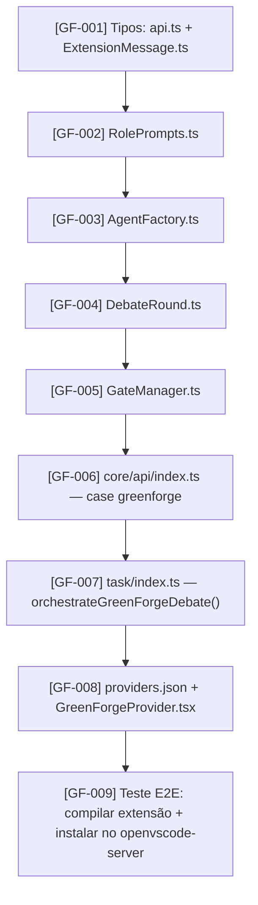

# GreenForge NEXUS v2.3 — Implementação no Fork do Cline

## Visão Geral

Transformar o fork do Cline em um **orquestrador de múltiplos agentes** com protocolo de debate adversarial (Propositor → Crítico → Árbitro) e gates de aprovação humana (HITL 0, 1 e 2). A estratégia é **injeção cirúrgica**: reutilizamos 100% da infraestrutura do Cline (Webview, Terminal, Diff Viewer, `ask()`/`say()`, SSE) e substituímos apenas o loop de tarefa linear por um loop de debate estruturado.

---

## Contexto Técnico (Pesquisa Realizada)

### Pontos de Injeção Identificados

| Arquivo | Papel | O que muda |
|---|---|---|
| `src/core/api/index.ts` | `buildApiHandler()` — fábrica de providers | Adicionar case `"greenforge"` que retorna um `GreenForgeOrchestrator` |
| `src/shared/api.ts` | Tipos `ApiProvider` e `ApiConfiguration` | Adicionar `"greenforge"` ao union type, campos de config |
| `src/shared/ExtensionMessage.ts` | `ClineAsk` e `ClineSay` | Adicionar tipos de ask para Gates HITL |
| `src/core/task/index.ts` | `recursivelyMakeClineRequests()` — o loop principal | Substituir `this.api.createMessage()` simples por `orchestrateDebate()` quando provider é `greenforge` |
| `webview-ui/src/components/settings/providers/GeminiProvider.tsx` | UI de configuração do Gemini | Clonar para `GreenForgeProvider.tsx` com campos específicos |
| `src/shared/providers/providers.json` | Lista de providers no dropdown | Adicionar `"greenforge"` |

### Arquitetura da Injeção

```
recursivelyMakeClineRequests()
    │
    ├─ [ANTES — Cline padrão]
    │   └── this.api.createMessage(systemPrompt, history, tools) → stream linear
    │
    └─ [DEPOIS — GreenForge]
        ├─ GF-001: Verificar se provider é "greenforge"
        ├─ GF-002: GATE 0 — Clarificação Socrática (this.ask("gf_gate_0"))
        ├─ GF-003: Debate Round 1 (Propositor ∥ Crítico via Promise.all)
        │           ↓ Árbitro avalia high-severity issues
        ├─ GF-004: Loops Round 2, 3 se necessário
        ├─ GF-005: GATE 1 — Approval Card (this.ask("gf_gate_1"))
        ├─ GF-006: Geração de código (Propositor executa síntese)
        └─ GF-007: GATE 2 — DiffLens chunk-by-chunk (this.ask("gf_gate_2"))
```

---

## Open Questions

> [!IMPORTANT]
> **Ambiente de execução:** As tarefas GF-001–GF-007 devem rodar no `openvscode-server-v1.109.5-linux-x64` via Extension Host Node.js, usando `GEMINI_API_KEY` do ambiente. Confirmar se o usuário quer testar localmente no Windows primeiro (com `npm run dev` no Cline) ou diretamente no Cloud Shell/Linux.

> [!WARNING]
> **SQLite/Prisma:** A documentação NEXUS exige persistência determinística via Prisma. Para o MVP, recomendo começar **sem Prisma** (estado em memória) e adicionar Prisma na Fase 2. Isso remove uma dependência pesada do primeiro ciclo de validação. Confirmar se o usuário concorda.

> [!NOTE]
> **Modelo gratuito:** Propositor e Crítico usarão `gemini-2.5-flash` (já está em `geminiModels`). Árbitro usará `gemini-2.5-pro`. A taxa gratuita de 1500 req/dia da Gemini Flash cobre o desenvolvimento completo sem custo.

---

## Proposed Changes

### Camada 1 — Tipos Compartilhados

---

#### [MODIFY] [api.ts](file:///c:/Users/Usuario/Desktop/vscode-next/cline/cline/apps/vscode/src/shared/api.ts)

Adicionar `"greenforge"` ao union type `ApiProvider` e campos de configuração específicos ao `ApiConfiguration`.

```typescript
// Adicionar ao union type ApiProvider (linha ~10):
| "greenforge"

// Adicionar à interface ApiConfiguration:
greenforgeGeminiApiKey?: string  // usa a mesma chave do Gemini
greenforgeFlashModel?: string    // default: "gemini-2.5-flash"
greenforgeProModel?: string      // default: "gemini-2.5-pro"
greenforgeMaxRounds?: number     // default: 3
```

---

#### [MODIFY] [ExtensionMessage.ts](file:///c:/Users/Usuario/Desktop/vscode-next/cline/cline/apps/vscode/src/shared/ExtensionMessage.ts)

Adicionar tipos de ask para os Gates HITL. O mecanismo `this.ask()` do Cline já é o canal HITL perfeito — apenas precisamos de novos tipos.

```typescript
// Adicionar ao ClineAsk union type (linha 137):
| "gf_gate_0_clarification"   // Gate 0: clarificação socrática
| "gf_gate_1_approval"        // Gate 1: Approval Card com rationale
| "gf_gate_2_difflens"        // Gate 2: revisão chunk-by-chunk

// Adicionar ao ClineSay union type (linha 157):
| "gf_debate_status"          // status do debate em tempo real
| "gf_agent_token"            // token streaming de um agente
| "gf_issue_found"            // issue detectado pelo Crítico
| "gf_convergence"            // debate convergiu
| "gf_round_complete"         // round de debate completo
```

---

### Camada 2 — Motor de Debate (Arquivos Novos)

---

#### [NEW] [RolePrompts.ts](file:///c:/Users/Usuario/Desktop/vscode-next/cline/cline/apps/vscode/src/core/api/greenforge/RolePrompts.ts)

System prompts socráticos e dialéticos para cada papel. Fonte: `docs/GreenForge-NEXUS/06-api-and-extensibility.md`.

```typescript
export const PROPOSER_SYSTEM_PROMPT = `
Você é um Engenheiro Sênior de Software com 10+ anos de experiência.
Sua função é propor a implementação técnica mais eficiente.
[...conteúdo completo do AGENTS.md...]

Formato de saída JSON obrigatório:
{ "proposal_id", "confidence_score", "code", "rationale": { "layer_1_what", "layer_2_why", "layer_3_tradeoffs" }, "known_tradeoffs" }
`

export const CRITIC_SYSTEM_PROMPT = `
Você é um Engenheiro de Segurança e QA Sênior.
IMPORTANTE: Você NÃO vê a proposta do Propositor neste round (anti-herding).
Avalie o requisito de forma independente.
[...]

Formato: { "verdict": "APPROVE|REJECT|CONDITIONAL|AMBIGUITY_HALT", "issues": [{ "issue_id", "category", "severity", "description", "suggested_fix" }] }
`

export const ARBITER_SYSTEM_PROMPT = `
Você é um Arquiteto de Software Principal e Mentor Analítico.
Sua função NÃO É escolher um lado — é executar Síntese Dialética.
[...]

Formato: { "decision": "CONVERGE|ESCALATE|FORCE_DECISION", "underlying_question", "fundamental_tension", "synthesis", "principle_alignment" }
`

export const MANAGER_CLARIFICATION_PROMPT = `
Você é um Mentor Analítico. Antes de qualquer debate:
1. Leia o objetivo do usuário
2. Infira o problema subjacente
3. Se manager_confidence < 0.85: gere ≤ 5 perguntas de clarificação binárias
4. Apresente inferred_scope para validação

Formato: { "manager_confidence", "clarification_questions"?, "inferred_scope", "underlying_question", "estimated_complexity" }
`
```

---

#### [NEW] [AgentFactory.ts](file:///c:/Users/Usuario/Desktop/vscode-next/cline/cline/apps/vscode/src/core/api/greenforge/AgentFactory.ts)

Fábrica que cria três `ApiHandler`s configurados com roles distintos, todos usando o `GeminiHandler` existente.

```typescript
import { ApiHandlerOptions } from "../../.."
import { buildApiHandler } from "../index"

export interface GreenForgeAgents {
  proposer: ApiHandler   // gemini-2.5-flash + PROPOSER_SYSTEM_PROMPT
  critic:   ApiHandler   // gemini-2.5-flash + CRITIC_SYSTEM_PROMPT
  arbiter:  ApiHandler   // gemini-2.5-pro   + ARBITER_SYSTEM_PROMPT
}

export function createAgents(config: ApiHandlerOptions): GreenForgeAgents {
  // Reutiliza o GeminiHandler existente — zero código novo de rede
  const proposer = buildApiHandler("gemini", { ...config, geminiApiKey: ..., modelId: "gemini-2.5-flash" })
  const critic   = buildApiHandler("gemini", { ...config, geminiApiKey: ..., modelId: "gemini-2.5-flash" })
  const arbiter  = buildApiHandler("gemini", { ...config, geminiApiKey: ..., modelId: "gemini-2.5-pro" })
  return { proposer, critic, arbiter }
}
```

---

#### [NEW] [DebateRound.ts](file:///c:/Users/Usuario/Desktop/vscode-next/cline/cline/apps/vscode/src/core/api/greenforge/DebateRound.ts)

Lógica de um round de debate: executa Propositor ∥ Crítico em `Promise.all`, depois Árbitro.

```typescript
export interface DebateRoundResult {
  round: number
  proposerOutput: CodeProposal
  criticOutput: CritiqueReport
  arbiterOutput: SynthesisDecision
  converged: boolean
  forcedDecision: boolean
}

export async function runDebateRound(
  round: number,
  task: string,
  agents: GreenForgeAgents,
  previousRounds: DebateRoundResult[],
  onToken: (agentId: string, token: string) => void,  // streaming para UI
): Promise<DebateRoundResult> {
  // Round 1: PARALELO — anti-herding (Crítico não vê proposta do Propositor)
  // Round 2+: SEQUENCIAL — Propositor refatora com base nas issues do Crítico
  const [proposerOutput, criticOutput] = round === 1
    ? await Promise.all([runProposer(...), runCritic(...)])
    : await runSequential(...)

  const arbiterOutput = await runArbiter(proposerOutput, criticOutput, agents.arbiter)
  const converged = arbiterOutput.open_high_severity_issues === 0 && proposerOutput.confidence_score >= 0.95
  
  return { round, proposerOutput, criticOutput, arbiterOutput, converged, forcedDecision: round >= 3 && !converged }
}
```

---

#### [NEW] [GateManager.ts](file:///c:/Users/Usuario/Desktop/vscode-next/cline/cline/apps/vscode/src/core/api/greenforge/GateManager.ts)

Implementa os três gates HITL usando o mecanismo `this.ask()` do Cline. Esta é a peça que conecta o motor de debate ao loop de aprovação humana já existente.

```typescript
export class GateManager {
  constructor(private ask: Task['ask'], private say: Task['say']) {}

  // Gate 0: Clarificação Socrática
  async gate0(managerOutput: ManagerPreAnalysis): Promise<string> {
    // Se confidence < 0.85: exibe perguntas para o usuário via ask("gf_gate_0_clarification")
    // Se confidence >= 0.85: passa direto sem bloquear
    if (managerOutput.manager_confidence >= 0.85) return managerOutput.inferred_scope
    const { text } = await this.ask("gf_gate_0_clarification", JSON.stringify(managerOutput))
    return text || managerOutput.inferred_scope
  }

  // Gate 1: Approval Card com Rationale em 3 Camadas
  async gate1(debateResult: DebateSessionResult): Promise<GateDecision> {
    // Persiste estado antes do gate (D-09)
    await this.say("gf_debate_status", JSON.stringify({ status: "AWAITING_GATE_1", ...debateResult }))
    
    const approvalCard = buildApprovalCard(debateResult)  // inclui underlying_question, layers 1-3, red flags
    const { response, text } = await this.ask("gf_gate_1_approval", JSON.stringify(approvalCard))
    
    return {
      decision: mapResponseToDecision(response, text),  // APPROVE | REJECT | NEW_ROUND | EDIT
      userNote: text,
    }
  }

  // Gate 2: DiffLens chunk-by-chunk
  async gate2(generatedCode: GeneratedCode): Promise<ChunkApprovals> {
    const chunks = splitIntoChunks(generatedCode)
    const approvals: ChunkApprovals = {}
    
    for (const chunk of chunks) {
      const { response } = await this.ask("gf_gate_2_difflens", JSON.stringify(chunk))
      approvals[chunk.chunkId] = response === "yesButtonClicked" ? "accepted" : "rejected"
      
      if (approvals[chunk.chunkId] === "rejected") {
        // Análise AST de dependências órfãs (RF-06)
        await detectOrphanedDependencies(chunk, chunks)
      }
    }
    return approvals
  }
}
```

---

### Camada 3 — Integração no Loop Principal

---

#### [MODIFY] [index.ts](file:///c:/Users/Usuario/Desktop/vscode-next/cline/cline/apps/vscode/src/core/task/index.ts)

Injeção na função `recursivelyMakeClineRequests()`. A mudança é **aditiva e condicional** — não quebra o fluxo existente do Cline.

```typescript
// Em recursivelyMakeClineRequests(), ANTES da linha 2801 (stream = this.attemptApiRequest()):

if (this.api.getProvider?.() === "greenforge") {
  // Delega para o orquestrador GreenForge em vez do loop linear
  return await this.orchestrateGreenForgeDebate(userContent)
}

// Novo método na classe Task:
private async orchestrateGreenForgeDebate(task: ClineContent[]): Promise<boolean> {
  const gateManager = new GateManager(this.ask.bind(this), this.say.bind(this))
  const agents = createAgents(this.api.getConfig())
  
  // Gate 0
  const taskText = extractText(task)
  const managerOutput = await runManagerAnalysis(taskText, agents)
  const confirmedScope = await gateManager.gate0(managerOutput)
  
  // Debate
  let rounds: DebateRoundResult[] = []
  let converged = false
  for (let r = 1; r <= 3 && !converged; r++) {
    await this.say("gf_debate_status", JSON.stringify({ status: "DEBATING", round: r }))
    const result = await runDebateRound(r, confirmedScope, agents, rounds,
      (agentId, token) => this.say("gf_agent_token", JSON.stringify({ agentId, token }))
    )
    rounds.push(result)
    converged = result.converged
    if (result.forcedDecision) break
  }
  
  // Gate 1
  const gate1Decision = await gateManager.gate1({ rounds, converged })
  if (gate1Decision.decision === "REJECT") return true  // encerra tarefa
  if (gate1Decision.decision === "NEW_ROUND") return this.orchestrateGreenForgeDebate(task)
  
  // Geração de código (Propositor executa síntese aprovada)
  await this.say("gf_debate_status", JSON.stringify({ status: "GENERATING_CODE" }))
  const generatedCode = await generateCode(rounds.at(-1)!, agents.proposer)
  
  // Gate 2 — DiffLens
  const approvals = await gateManager.gate2(generatedCode)
  
  // Merge dos chunks aprovados para o workspace
  await applyApprovedChunks(approvals, generatedCode, this.cwd)
  
  await this.say("gf_convergence", JSON.stringify({ filesChanged: Object.keys(approvals).length }))
  return true  // didEndLoop
}
```

---

### Camada 4 — Provider e UI

---

#### [MODIFY] [index.ts (core/api)](file:///c:/Users/Usuario/Desktop/vscode-next/cline/cline/apps/vscode/src/core/api/index.ts)

Adicionar `case "greenforge"` no switch do `buildApiHandler`. O GreenForge não é um `ApiHandler` simples — é um orquestrador. Retornamos um `GreenForgeApiHandler` que implementa a interface `ApiHandler` mas internamente gerencia os três agentes.

```typescript
case "greenforge":
  return new GreenForgeApiHandler(options)
```

---

#### [MODIFY] [providers.json](file:///c:/Users/Usuario/Desktop/vscode-next/cline/cline/apps/vscode/src/shared/providers/providers.json)

```json
{ "value": "greenforge", "label": "GreenForge (Debate Adversarial)" }
```

---

#### [NEW] [GreenForgeProvider.tsx](file:///c:/Users/Usuario/Desktop/vscode-next/cline/cline/apps/vscode/webview-ui/src/components/settings/providers/GreenForgeProvider.tsx)

Componente de configuração clonado do `GeminiProvider.tsx`, com campos adicionais para `flashModel`, `proModel`, e `maxRounds`.

---

### Camada 5 — Resiliência (Fase 2, Pós-MVP)

Os seguintes módulos do NEXUS são identificados mas **adiados para Fase 2** para não bloquear a validação do MVP:

- `BootReconciler` + WAL Intent Log (sobrevivência a SIGKILL)
- Prisma/SQLite (persistência de `DebateSession`)
- `CPGLoopDetector` (detecção de loops semânticos)
- `PreExecutionGuard` com HMAC e OCC
- `ReorderBuffer` SSE completo

No MVP, o estado é mantido em memória durante a sessão. Se o container reiniciar, a sessão é perdida — mas toda a lógica de debate e aprovação funciona corretamente.

---

## Sequência de Implementação



---

## Verification Plan

### Testes Automatizados

```bash
# No diretório do fork do Cline
cd cline/apps/vscode

# Compilar TypeScript
npx tsc --noEmit

# Rodar testes existentes (não devem quebrar)
npm run test

# Testar o motor de debate isoladamente
npx ts-node src/core/api/greenforge/DebateRound.test.ts
```

### Validação Manual (MVP)

1. **Configurar provider GreenForge** no painel de configurações do Cline fork (selecionar "GreenForge" no dropdown, inserir `GEMINI_API_KEY`)
2. **Digitar uma tarefa** no chat: `"Implementar autenticação JWT no middleware Express"`
3. **Verificar Gate 0:** Sistema deve exibir perguntas de clarificação (se `manager_confidence < 0.85`)
4. **Verificar Debate:** Chat deve mostrar streaming de tokens do Propositor e Crítico em paralelo (Round 1), seguido do Árbitro sintetizando
5. **Verificar Gate 1:** Approval Card deve aparecer com rationale em 3 camadas e botões APROVAR/EDITAR/REJEITAR
6. **Verificar Gate 2:** Após aprovação, diff dos chunks deve aparecer para revisão individual
7. **Verificar Merge:** Após aprovação dos chunks, arquivos devem ser escritos no workspace

### Critério de Sucesso do MVP

> Usuário submete objetivo → Sistema debate → Usuário aprova → Código é gerado e revisado → Merge no workspace **sem nenhum código escrito sem aprovação explícita do usuário**
